# DBMS 2 layer

Database management system

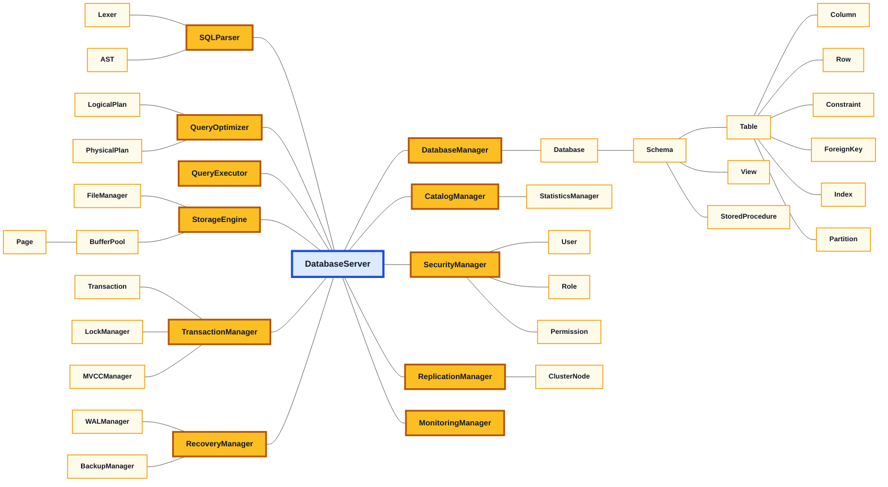
```mermaid
flowchart LR
    %% Left side
    QP_SP[SQLParser] --- DS[DatabaseServer]
    QP_Lex[Lexer] --- QP_SP
    QP_AST[AST] --- QP_SP

    QP_QO[QueryOptimizer] --- DS
    QP_LP[LogicalPlan] --- QP_QO
    QP_PP[PhysicalPlan] --- QP_QO

    QP_QE[QueryExecutor] --- DS

    SE[StorageEngine] --- DS
    SE_FM[FileManager] --- SE
    SE_BP[BufferPool] --- SE
    SE_Pg[Page] --- SE_BP

    TM[TransactionManager] --- DS
    TM_Tx[Transaction] --- TM
    TM_LM[LockManager] --- TM
    TM_MVCC[MVCCManager] --- TM

    RM[RecoveryManager] --- DS
    RM_WAL[WALManager] --- RM
    RM_BM[BackupManager] --- RM

    %% Right side
    DS --- DM[DatabaseManager]
    DM --- DB[Database]
    DB --- Sch[Schema]
    Sch --- Tbl[Table]
    Tbl --- Col[Column]
    Tbl --- Rw[Row]
    Tbl --- Cst[Constraint]
    Tbl --- FK[ForeignKey]
    Tbl --- Idx[Index]
    Tbl --- Ptn[Partition]
    Sch --- Vw[View]
    Sch --- SP[StoredProcedure]

    DS --- CM[CatalogManager]
    CM --- StatM[StatisticsManager]

    DS --- SecM[SecurityManager]
    SecM --- Usr[User]
    SecM --- Rl[Role]
    SecM --- Prm[Permission]

    DS --- RepM[ReplicationManager]
    RepM --- CN[ClusterNode]

    DS --- MonM[MonitoringManager]

    %% =========================
    %% STYLES
    %% =========================

    %% Root node
    classDef dbmsRoot fill:#dbeafe,stroke:#1d4ed8,stroke-width:5px,color:#111827,font-weight:bold,font-size:20px;

    %% Layer 1 subsystems
    classDef importantLayerOne fill:#fbbf24,stroke:#b45309,stroke-width:4px,color:#111827,font-weight:bold,font-size:18px;

    %% Layer 2 components
    classDef importantLayerTwo fill:#fffbeb,stroke:#f59e0b,stroke-width:2px,color:#111827,font-weight:bold;

    %% =========================
    %% APPLY STYLES
    %% =========================

    class DS dbmsRoot;
    class QP_SP,QP_QO,QP_QE,SE,TM,RM,DM,CM,SecM,RepM,MonM importantLayerOne;
    class QP_Lex,QP_AST,QP_LP,QP_PP,SE_FM,SE_BP,SE_Pg,TM_Tx,TM_LM,TM_MVCC,RM_WAL,RM_BM,DB,Sch,Tbl,Col,Rw,Cst,FK,Idx,Ptn,Vw,SP,StatM,Usr,Rl,Prm,CN importantLayerTwo;
```

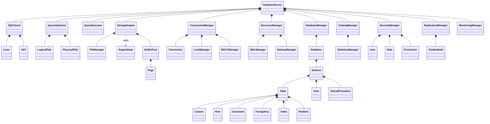
```mermaid
classDiagram
    direction TB
    class DatabaseServer

    %% Left side
    DatabaseServer *-- SQLParser
    SQLParser *-- Lexer
    SQLParser *-- AST

    DatabaseServer *-- QueryOptimizer
    QueryOptimizer *-- LogicalPlan
    QueryOptimizer *-- PhysicalPlan

    DatabaseServer *-- QueryExecutor

    DatabaseServer *-- StorageEngine
    StorageEngine *-- FileManager
    StorageEngine ..> EngineState : uses
    StorageEngine *-- BufferPool
    BufferPool *-- Page

    DatabaseServer *-- TransactionManager
    TransactionManager *-- Transaction
    TransactionManager *-- LockManager
    TransactionManager *-- MVCCManager

    DatabaseServer *-- RecoveryManager
    RecoveryManager *-- WALManager
    RecoveryManager *-- BackupManager

    %% Right side
    DatabaseServer *-- DatabaseManager
    DatabaseManager *-- Database
    Database *-- Schema
    Schema *-- Table
    Table *-- Column
    Table *-- Row
    Table *-- Constraint
    Table *-- ForeignKey
    Table *-- Index
    Table *-- Partition
    Schema *-- View
    Schema *-- StoredProcedure

    DatabaseServer *-- CatalogManager
    CatalogManager *-- StatisticsManager

    DatabaseServer *-- SecurityManager
    SecurityManager *-- User
    SecurityManager *-- Role
    SecurityManager *-- Permission

    DatabaseServer *-- ReplicationManager
    ReplicationManager *-- ClusterNode

    DatabaseServer *-- MonitoringManager
```
## Feature Class Diagrams

### 1. Storage Engine

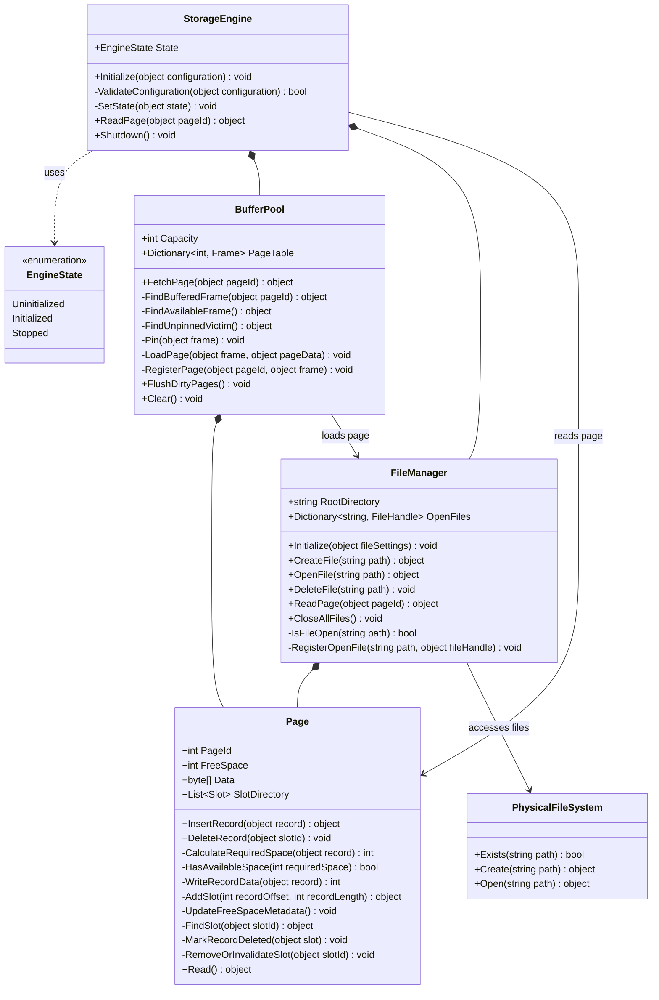
```mermaid
classDiagram
    direction TB

    class BufferPool {
        +int Capacity
        +Dictionary~int, Frame~ PageTable
        +FetchPage(object pageId) object
        -FindBufferedFrame(object pageId) object
        -FindAvailableFrame() object
        -FindUnpinnedVictim() object
        -Pin(object frame) void
        -LoadPage(object frame, object pageData) void
        -RegisterPage(object pageId, object frame) void
        +FlushDirtyPages() void
        +Clear() void
    }

    class Page {
        +int PageId
        +int FreeSpace
        +byte[] Data
        +List~Slot~ SlotDirectory
        +InsertRecord(object record) object
        +DeleteRecord(object slotId) void
        -CalculateRequiredSpace(object record) int
        -HasAvailableSpace(int requiredSpace) bool
        -WriteRecordData(object record) int
        -AddSlot(int recordOffset, int recordLength) object
        -UpdateFreeSpaceMetadata() void
        -FindSlot(object slotId) object
        -MarkRecordDeleted(object slot) void
        -RemoveOrInvalidateSlot(object slotId) void
        +Read() object
    }

    
    class EngineState {
        <<enumeration>>
        Uninitialized
        Initialized
        Stopped
    }

    class StorageEngine {
        +EngineState State
        +Initialize(object configuration) void
        -ValidateConfiguration(object configuration) bool
        -SetState(object state) void
        +ReadPage(object pageId) object
        +Shutdown() void
    }

    class FileManager {
        +string RootDirectory
        +Dictionary~string, FileHandle~ OpenFiles
        +Initialize(object fileSettings) void
        +CreateFile(string path) object
        +OpenFile(string path) object
        +DeleteFile(string path) void
        +ReadPage(object pageId) object
        +CloseAllFiles() void
        -IsFileOpen(string path) bool
        -RegisterOpenFile(string path, object fileHandle) void
    }

    class PhysicalFileSystem {
        +Exists(string path) bool
        +Create(string path) object
        +Open(string path) object
    }

    StorageEngine ..> EngineState : uses
    StorageEngine *-- BufferPool
    StorageEngine *-- FileManager
    BufferPool *-- Page
    FileManager *-- Page

    BufferPool --> FileManager : loads page
    StorageEngine --> Page : reads page
    FileManager --> PhysicalFileSystem : accesses files
```

### 2. Query Processor

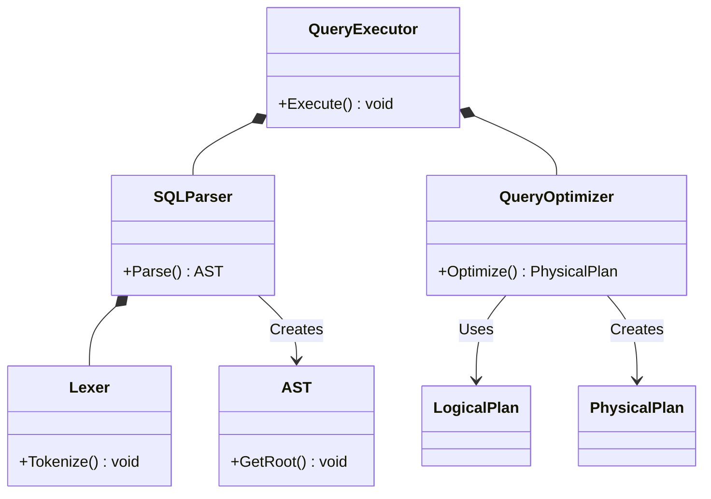
```mermaid
classDiagram
    direction TB
    class QueryExecutor {
        +Execute() void
    }
    class SQLParser {
        +Parse() AST
    }
    class Lexer {
        +Tokenize() void
    }
    class AST {
        +GetRoot() void
    }
    class QueryOptimizer {
        +Optimize() PhysicalPlan
    }
    class LogicalPlan {
    }
    class PhysicalPlan {
    }

    QueryExecutor *-- SQLParser
    QueryExecutor *-- QueryOptimizer
    SQLParser *-- Lexer
    SQLParser --> AST : Creates
    QueryOptimizer --> LogicalPlan : Uses
    QueryOptimizer --> PhysicalPlan : Creates
```

### 3. Transaction Management

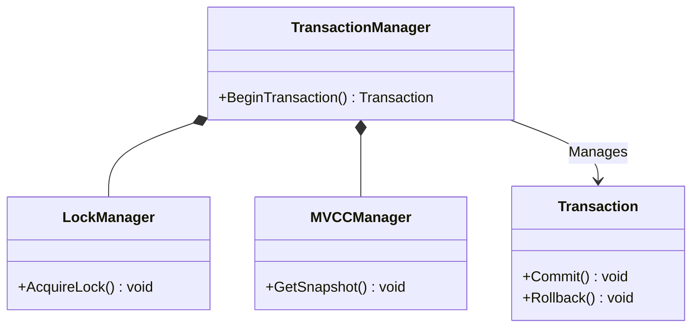
```mermaid
classDiagram
    direction TB
    class TransactionManager {
        +BeginTransaction() Transaction
    }
    class Transaction {
        +Commit() void
        +Rollback() void
    }
    class LockManager {
        +AcquireLock() void
    }
    class MVCCManager {
        +GetSnapshot() void
    }

    TransactionManager *-- LockManager
    TransactionManager *-- MVCCManager
    TransactionManager --> Transaction : Manages
```

### 4. Recovery Management

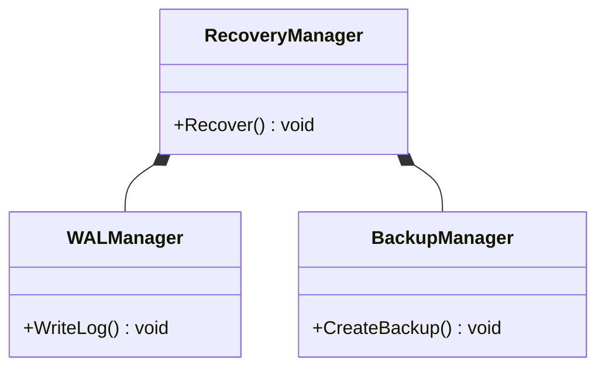
```mermaid
classDiagram
    direction TB
    class RecoveryManager {
        +Recover() void
    }
    class WALManager {
        +WriteLog() void
    }
    class BackupManager {
        +CreateBackup() void
    }

    RecoveryManager *-- WALManager
    RecoveryManager *-- BackupManager
```

### 5. Security Management

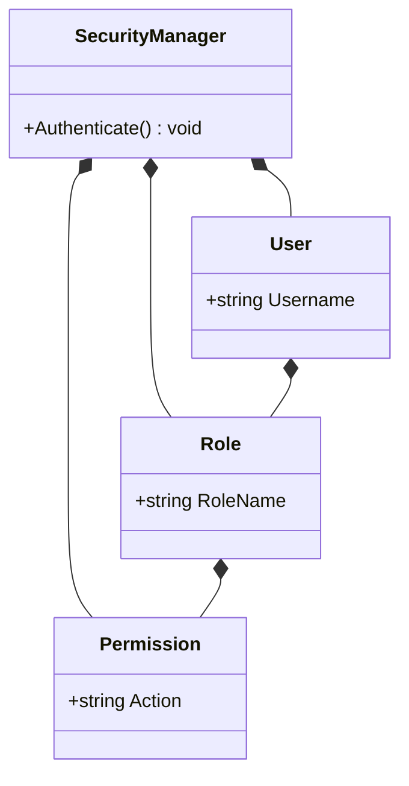
```mermaid
classDiagram
    direction TB
    class SecurityManager {
        +Authenticate() void
    }
    class User {
        +string Username
    }
    class Role {
        +string RoleName
    }
    class Permission {
        +string Action
    }

    SecurityManager *-- User
    SecurityManager *-- Role
    SecurityManager *-- Permission
    User *-- Role
    Role *-- Permission
```

### 6. Database Manager

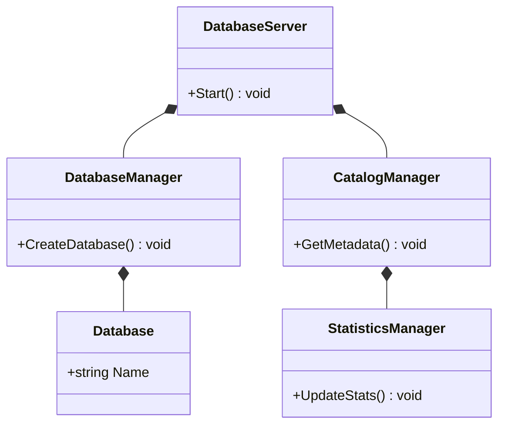
```mermaid
classDiagram
    direction TB
    class DatabaseServer {
        +Start() void
    }
    class DatabaseManager {
        +CreateDatabase() void
    }
    class Database {
        +string Name
    }
    class CatalogManager {
        +GetMetadata() void
    }
    class StatisticsManager {
        +UpdateStats() void
    }

    DatabaseServer *-- DatabaseManager
    DatabaseServer *-- CatalogManager
    DatabaseManager *-- Database
    CatalogManager *-- StatisticsManager
```

### 7. Database Objects

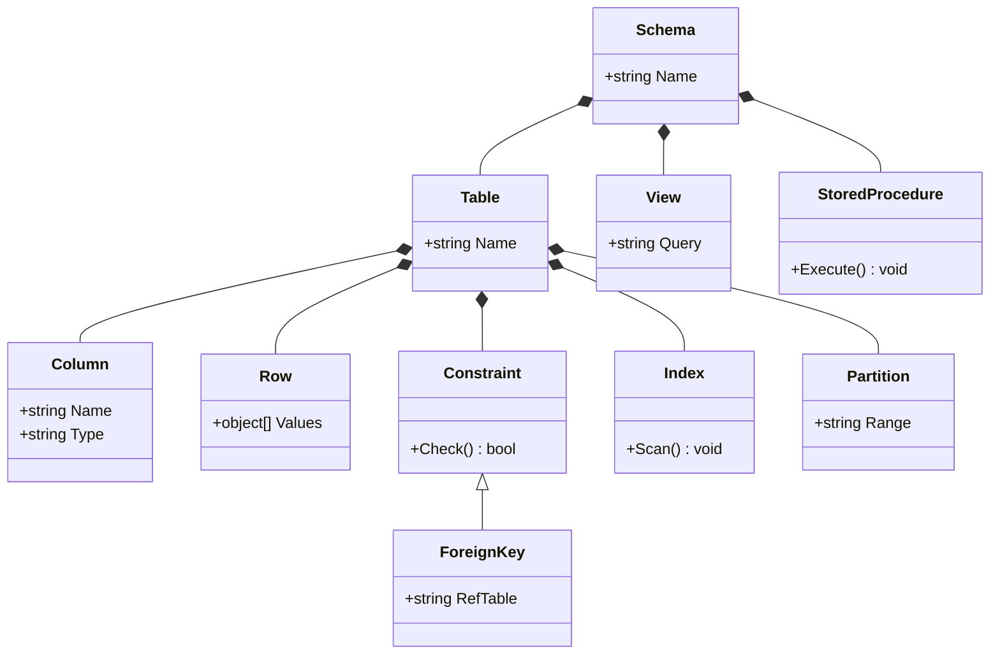
```mermaid
classDiagram
    direction TB
    class Schema {
        +string Name
    }
    class Table {
        +string Name
    }
    class Column {
        +string Name
        +string Type
    }
    class Row {
        +object[] Values
    }
    class Constraint {
        +Check() bool
    }
    class ForeignKey {
        +string RefTable
    }
    class Index {
        +Scan() void
    }
    class Partition {
        +string Range
    }
    class View {
        +string Query
    }
    class StoredProcedure {
        +Execute() void
    }

    Schema *-- Table
    Schema *-- View
    Schema *-- StoredProcedure
    Table *-- Column
    Table *-- Row
    Table *-- Constraint
    Constraint <|-- ForeignKey
    Table *-- Index
    Table *-- Partition
```

### 8. Replication and Cluster

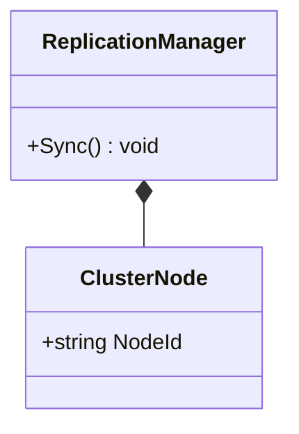
```mermaid
classDiagram
    direction TB
    class ReplicationManager {
        +Sync() void
    }
    class ClusterNode {
        +string NodeId
    }

    ReplicationManager *-- ClusterNode
```

### 9. Monitoring

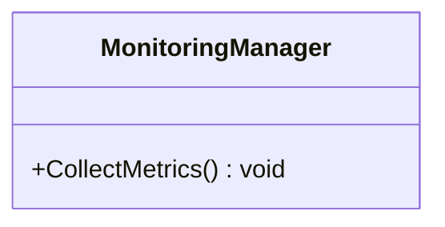
```mermaid
classDiagram
    direction TB
    class MonitoringManager {
        +CollectMetrics() void
    }
```

## Unit Tests Architecture

### 1. Database Manager Unit Tests

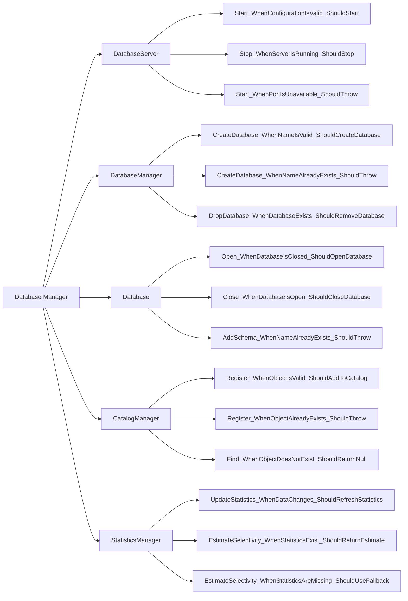
```mermaid
flowchart LR
    Subsystem[Database Manager] --> DatabaseServer
    DatabaseServer --> Start_WhenConfigurationIsValid_ShouldStart
    DatabaseServer --> Stop_WhenServerIsRunning_ShouldStop
    DatabaseServer --> Start_WhenPortIsUnavailable_ShouldThrow
    
    Subsystem --> DatabaseManagerClass[DatabaseManager]
    DatabaseManagerClass --> CreateDatabase_WhenNameIsValid_ShouldCreateDatabase
    DatabaseManagerClass --> CreateDatabase_WhenNameAlreadyExists_ShouldThrow
    DatabaseManagerClass --> DropDatabase_WhenDatabaseExists_ShouldRemoveDatabase
    
    Subsystem --> Database
    Database --> Open_WhenDatabaseIsClosed_ShouldOpenDatabase
    Database --> Close_WhenDatabaseIsOpen_ShouldCloseDatabase
    Database --> AddSchema_WhenNameAlreadyExists_ShouldThrow
    
    Subsystem --> CatalogManager
    CatalogManager --> Register_WhenObjectIsValid_ShouldAddToCatalog
    CatalogManager --> Register_WhenObjectAlreadyExists_ShouldThrow
    CatalogManager --> Find_WhenObjectDoesNotExist_ShouldReturnNull
    
    Subsystem --> StatisticsManager
    StatisticsManager --> UpdateStatistics_WhenDataChanges_ShouldRefreshStatistics
    StatisticsManager --> EstimateSelectivity_WhenStatisticsExist_ShouldReturnEstimate
    StatisticsManager --> EstimateSelectivity_WhenStatisticsAreMissing_ShouldUseFallback
```

### 2. Database Objects Unit Tests

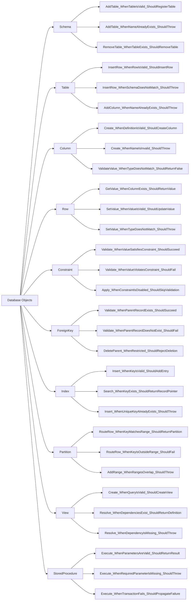
```mermaid
flowchart LR
    Subsystem[Database Objects] --> Schema
    Schema --> AddTable_WhenTableIsValid_ShouldRegisterTable
    Schema --> AddTable_WhenNameAlreadyExists_ShouldThrow
    Schema --> RemoveTable_WhenTableExists_ShouldRemoveTable
    
    Subsystem --> Table
    Table --> InsertRow_WhenRowIsValid_ShouldInsertRow
    Table --> InsertRow_WhenSchemaDoesNotMatch_ShouldThrow
    Table --> AddColumn_WhenNameAlreadyExists_ShouldThrow
    
    Subsystem --> Column
    Column --> Create_WhenDefinitionIsValid_ShouldCreateColumn
    Column --> Create_WhenNameIsInvalid_ShouldThrow
    Column --> ValidateValue_WhenTypeDoesNotMatch_ShouldReturnFalse
    
    Subsystem --> Row
    Row --> GetValue_WhenColumnExists_ShouldReturnValue
    Row --> SetValue_WhenValueIsValid_ShouldUpdateValue
    Row --> SetValue_WhenTypeDoesNotMatch_ShouldThrow
    
    Subsystem --> Constraint
    Constraint --> Validate_WhenValueSatisfiesConstraint_ShouldSucceed
    Constraint --> Validate_WhenValueViolatesConstraint_ShouldFail
    Constraint --> Apply_WhenConstraintIsDisabled_ShouldSkipValidation
    
    Subsystem --> ForeignKey
    ForeignKey --> Validate_WhenParentRecordExists_ShouldSucceed
    ForeignKey --> Validate_WhenParentRecordDoesNotExist_ShouldFail
    ForeignKey --> DeleteParent_WhenRestricted_ShouldRejectDeletion
    
    Subsystem --> Index
    Index --> Insert_WhenKeyIsValid_ShouldAddEntry
    Index --> Search_WhenKeyExists_ShouldReturnRecordPointer
    Index --> Insert_WhenUniqueKeyAlreadyExists_ShouldThrow
    
    Subsystem --> Partition
    Partition --> RouteRow_WhenKeyMatchesRange_ShouldReturnPartition
    Partition --> RouteRow_WhenKeyIsOutsideRange_ShouldFail
    Partition --> AddRange_WhenRangesOverlap_ShouldThrow
    
    Subsystem --> View
    View --> Create_WhenQueryIsValid_ShouldCreateView
    View --> Resolve_WhenDependenciesExist_ShouldReturnDefinition
    View --> Resolve_WhenDependencyIsMissing_ShouldThrow
    
    Subsystem --> StoredProcedure
    StoredProcedure --> Execute_WhenParametersAreValid_ShouldReturnResult
    StoredProcedure --> Execute_WhenRequiredParameterIsMissing_ShouldThrow
    StoredProcedure --> Execute_WhenTransactionFails_ShouldPropagateFailure
```

### 3. Transaction Management Unit Tests

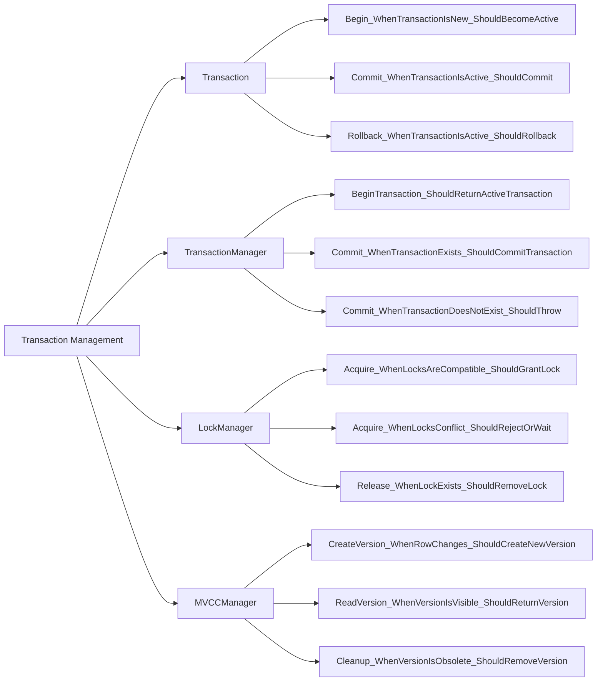
```mermaid
flowchart LR
    Subsystem[Transaction Management] --> Transaction
    Transaction --> Begin_WhenTransactionIsNew_ShouldBecomeActive
    Transaction --> Commit_WhenTransactionIsActive_ShouldCommit
    Transaction --> Rollback_WhenTransactionIsActive_ShouldRollback
    
    Subsystem --> TransactionManagerClass[TransactionManager]
    TransactionManagerClass --> BeginTransaction_ShouldReturnActiveTransaction
    TransactionManagerClass --> Commit_WhenTransactionExists_ShouldCommitTransaction
    TransactionManagerClass --> Commit_WhenTransactionDoesNotExist_ShouldThrow
    
    Subsystem --> LockManager
    LockManager --> Acquire_WhenLocksAreCompatible_ShouldGrantLock
    LockManager --> Acquire_WhenLocksConflict_ShouldRejectOrWait
    LockManager --> Release_WhenLockExists_ShouldRemoveLock
    
    Subsystem --> MVCCManager
    MVCCManager --> CreateVersion_WhenRowChanges_ShouldCreateNewVersion
    MVCCManager --> ReadVersion_WhenVersionIsVisible_ShouldReturnVersion
    MVCCManager --> Cleanup_WhenVersionIsObsolete_ShouldRemoveVersion
```

### 4. Storage Engine Unit Tests

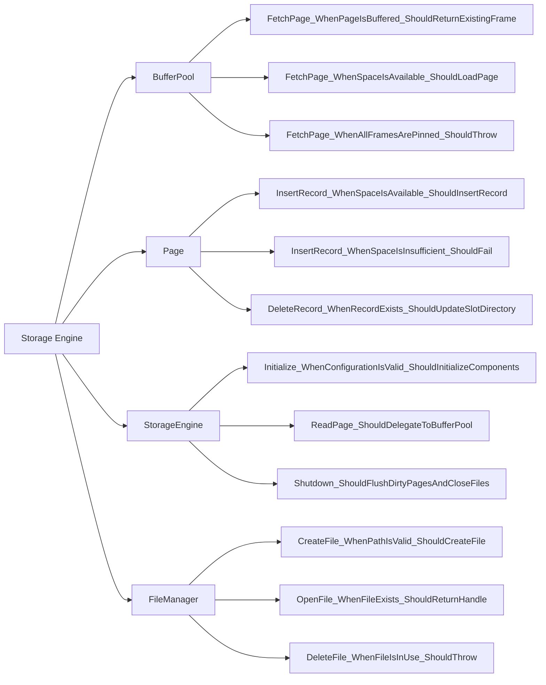
```mermaid
flowchart LR
    Subsystem[Storage Engine] --> BufferPool
    BufferPool --> FetchPage_WhenPageIsBuffered_ShouldReturnExistingFrame
    BufferPool --> FetchPage_WhenSpaceIsAvailable_ShouldLoadPage
    BufferPool --> FetchPage_WhenAllFramesArePinned_ShouldThrow
    
    Subsystem --> Page
    Page --> InsertRecord_WhenSpaceIsAvailable_ShouldInsertRecord
    Page --> InsertRecord_WhenSpaceIsInsufficient_ShouldFail
    Page --> DeleteRecord_WhenRecordExists_ShouldUpdateSlotDirectory
    
    Subsystem --> StorageEngineClass[StorageEngine]
    StorageEngineClass --> Initialize_WhenConfigurationIsValid_ShouldInitializeComponents
    StorageEngineClass --> ReadPage_ShouldDelegateToBufferPool
    StorageEngineClass --> Shutdown_ShouldFlushDirtyPagesAndCloseFiles
    
    Subsystem --> FileManager
    FileManager --> CreateFile_WhenPathIsValid_ShouldCreateFile
    FileManager --> OpenFile_WhenFileExists_ShouldReturnHandle
    FileManager --> DeleteFile_WhenFileIsInUse_ShouldThrow
```

### 5. Recovery Management Unit Tests

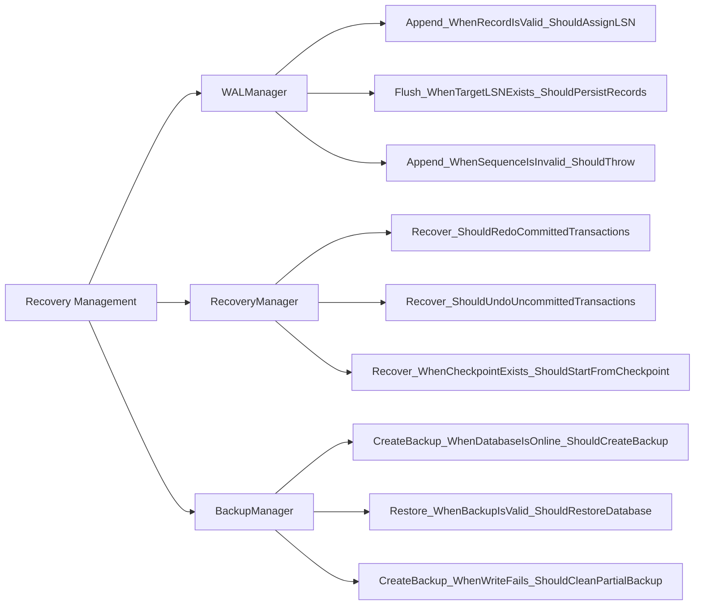
```mermaid
flowchart LR
    Subsystem[Recovery Management] --> WALManager
    WALManager --> Append_WhenRecordIsValid_ShouldAssignLSN
    WALManager --> Flush_WhenTargetLSNExists_ShouldPersistRecords
    WALManager --> Append_WhenSequenceIsInvalid_ShouldThrow
    
    Subsystem --> RecoveryManagerClass[RecoveryManager]
    RecoveryManagerClass --> Recover_ShouldRedoCommittedTransactions
    RecoveryManagerClass --> Recover_ShouldUndoUncommittedTransactions
    RecoveryManagerClass --> Recover_WhenCheckpointExists_ShouldStartFromCheckpoint
    
    Subsystem --> BackupManager
    BackupManager --> CreateBackup_WhenDatabaseIsOnline_ShouldCreateBackup
    BackupManager --> Restore_WhenBackupIsValid_ShouldRestoreDatabase
    BackupManager --> CreateBackup_WhenWriteFails_ShouldCleanPartialBackup
```

### 6. Query Processor Unit Tests

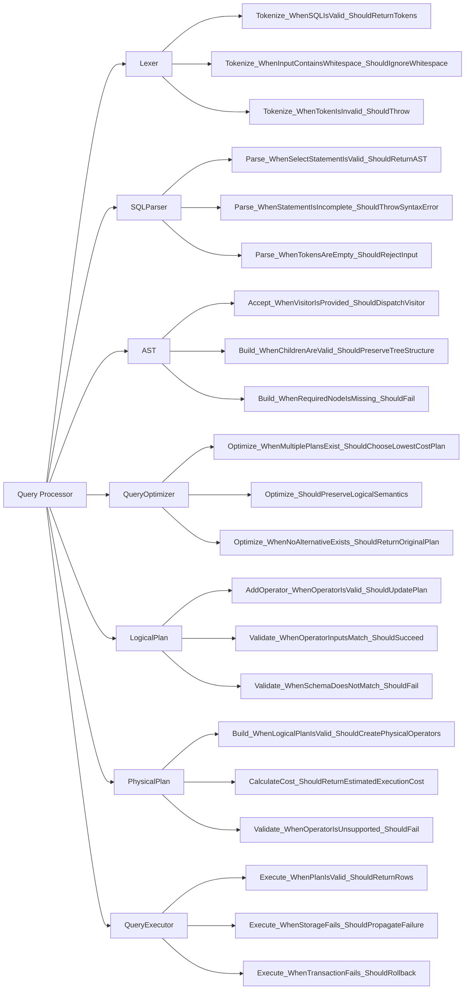
```mermaid
flowchart LR
    Subsystem[Query Processor] --> Lexer
    Lexer --> Tokenize_WhenSQLIsValid_ShouldReturnTokens
    Lexer --> Tokenize_WhenInputContainsWhitespace_ShouldIgnoreWhitespace
    Lexer --> Tokenize_WhenTokenIsInvalid_ShouldThrow
    
    Subsystem --> SQLParser
    SQLParser --> Parse_WhenSelectStatementIsValid_ShouldReturnAST
    SQLParser --> Parse_WhenStatementIsIncomplete_ShouldThrowSyntaxError
    SQLParser --> Parse_WhenTokensAreEmpty_ShouldRejectInput
    
    Subsystem --> AST
    AST --> Accept_WhenVisitorIsProvided_ShouldDispatchVisitor
    AST --> Build_WhenChildrenAreValid_ShouldPreserveTreeStructure
    AST --> Build_WhenRequiredNodeIsMissing_ShouldFail
    
    Subsystem --> QueryOptimizer
    QueryOptimizer --> Optimize_WhenMultiplePlansExist_ShouldChooseLowestCostPlan
    QueryOptimizer --> Optimize_ShouldPreserveLogicalSemantics
    QueryOptimizer --> Optimize_WhenNoAlternativeExists_ShouldReturnOriginalPlan
    
    Subsystem --> LogicalPlan
    LogicalPlan --> AddOperator_WhenOperatorIsValid_ShouldUpdatePlan
    LogicalPlan --> Validate_WhenOperatorInputsMatch_ShouldSucceed
    LogicalPlan --> Validate_WhenSchemaDoesNotMatch_ShouldFail
    
    Subsystem --> PhysicalPlan
    PhysicalPlan --> Build_WhenLogicalPlanIsValid_ShouldCreatePhysicalOperators
    PhysicalPlan --> CalculateCost_ShouldReturnEstimatedExecutionCost
    PhysicalPlan --> Validate_WhenOperatorIsUnsupported_ShouldFail
    
    Subsystem --> QueryExecutor
    QueryExecutor --> Execute_WhenPlanIsValid_ShouldReturnRows
    QueryExecutor --> Execute_WhenStorageFails_ShouldPropagateFailure
    QueryExecutor --> Execute_WhenTransactionFails_ShouldRollback
```

### 7. Security Management Unit Tests

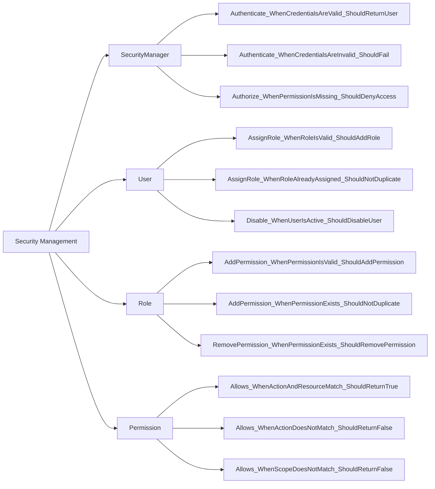
```mermaid
flowchart LR
    Subsystem[Security Management] --> SecurityManagerClass[SecurityManager]
    SecurityManagerClass --> Authenticate_WhenCredentialsAreValid_ShouldReturnUser
    SecurityManagerClass --> Authenticate_WhenCredentialsAreInvalid_ShouldFail
    SecurityManagerClass --> Authorize_WhenPermissionIsMissing_ShouldDenyAccess
    
    Subsystem --> User
    User --> AssignRole_WhenRoleIsValid_ShouldAddRole
    User --> AssignRole_WhenRoleAlreadyAssigned_ShouldNotDuplicate
    User --> Disable_WhenUserIsActive_ShouldDisableUser
    
    Subsystem --> Role
    Role --> AddPermission_WhenPermissionIsValid_ShouldAddPermission
    Role --> AddPermission_WhenPermissionExists_ShouldNotDuplicate
    Role --> RemovePermission_WhenPermissionExists_ShouldRemovePermission
    
    Subsystem --> Permission
    Permission --> Allows_WhenActionAndResourceMatch_ShouldReturnTrue
    Permission --> Allows_WhenActionDoesNotMatch_ShouldReturnFalse
    Permission --> Allows_WhenScopeDoesNotMatch_ShouldReturnFalse
```

### 8. Replication & Cluster Unit Tests

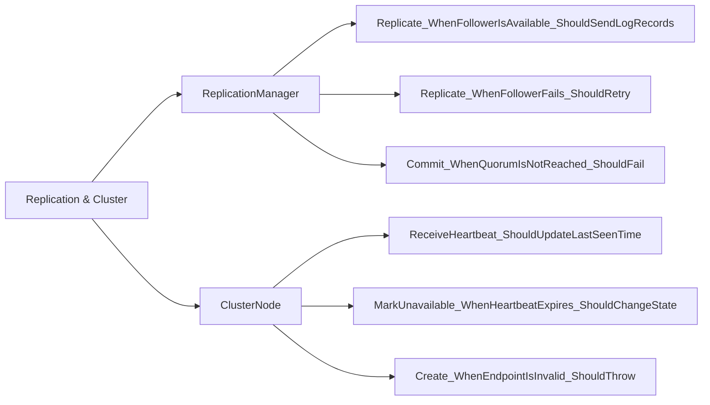
```mermaid
flowchart LR
    Subsystem[Replication & Cluster] --> ReplicationManagerClass[ReplicationManager]
    ReplicationManagerClass --> Replicate_WhenFollowerIsAvailable_ShouldSendLogRecords
    ReplicationManagerClass --> Replicate_WhenFollowerFails_ShouldRetry
    ReplicationManagerClass --> Commit_WhenQuorumIsNotReached_ShouldFail
    
    Subsystem --> ClusterNode
    ClusterNode --> ReceiveHeartbeat_ShouldUpdateLastSeenTime
    ClusterNode --> MarkUnavailable_WhenHeartbeatExpires_ShouldChangeState
    ClusterNode --> Create_WhenEndpointIsInvalid_ShouldThrow
```

### 9. Monitoring Unit Tests

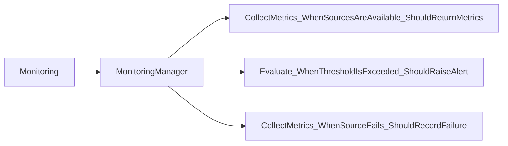
```mermaid
flowchart LR
    Subsystem[Monitoring] --> MonitoringManagerClass[MonitoringManager]
    MonitoringManagerClass --> CollectMetrics_WhenSourcesAreAvailable_ShouldReturnMetrics
    MonitoringManagerClass --> Evaluate_WhenThresholdIsExceeded_ShouldRaiseAlert
    MonitoringManagerClass --> CollectMetrics_WhenSourceFails_ShouldRecordFailure
```

