# DBMS 2 layer

Database management system

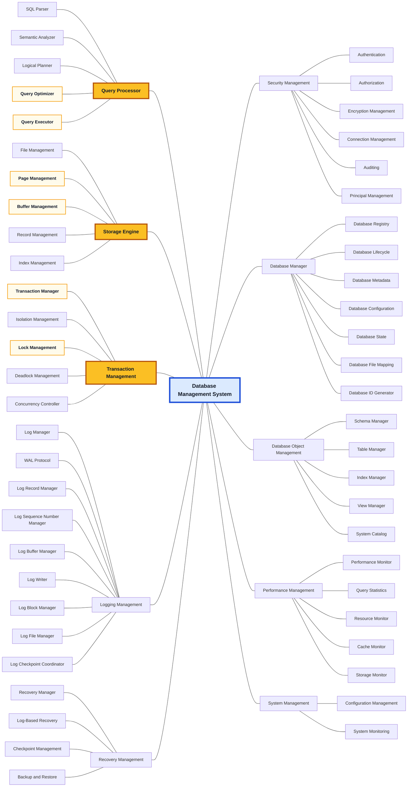
```mermaid
flowchart LR
    %% Left side
    QP_SP[SQL Parser] --- QP[Query Processor]
    QP_SA[Semantic Analyzer] --- QP
    QP_LP[Logical Planner] --- QP
    QP_QO[Query Optimizer] --- QP
    QP_QE[Query Executor] --- QP
    QP --- DBMS[Database Management System]

    SE_FM[File Management] --- SE[Storage Engine]
    SE_PM[Page Management] --- SE
    SE_BM[Buffer Management] --- SE
    SE_RM[Record Management] --- SE
    SE_IM[Index Management] --- SE
    SE --- DBMS

    TM_TM[Transaction Manager] --- TM[Transaction Management]
    TM_IM[Isolation Management] --- TM
    TM_LM[Lock Management] --- TM
    TM_DM[Deadlock Management] --- TM
    TM_CC[Concurrency Controller] --- TM
    TM --- DBMS

    LM_LM[Log Manager] --- LM[Logging Management]
    LM_WAL[WAL Protocol] --- LM
    LM_LRM[Log Record Manager] --- LM
    LM_LSNM[Log Sequence Number Manager] --- LM
    LM_LBM[Log Buffer Manager] --- LM
    LM_LW[Log Writer] --- LM
    LM_LBlkM[Log Block Manager] --- LM
    LM_LFM[Log File Manager] --- LM
    LM_LCC[Log Checkpoint Coordinator] --- LM
    LM --- DBMS

    RM_RM[Recovery Manager] --- RM[Recovery Management]
    RM_LBR[Log-Based Recovery] --- RM
    RM_CM[Checkpoint Management] --- RM
    RM_BR[Backup and Restore] --- RM
    RM --- DBMS

    %% =========================
    %% RIGHT SIDE
    %% =========================

    DBMS --- SecM[Security Management]
    SecM --- SecM_AuthN[Authentication]
    SecM --- SecM_AuthZ[Authorization]
    SecM --- SecM_EM[Encryption Management]
    SecM --- SecM_CM[Connection Management]
    SecM --- SecM_Aud[Auditing]
    SecM --- SecM_PM[Principal Management]

    DBMS --- DM[Database Manager]
    DM --- DM_DR[Database Registry]
    DM --- DM_DL[Database Lifecycle]
    DM --- DM_DM[Database Metadata]
    DM --- DM_DC[Database Configuration]
    DM --- DM_DS[Database State]
    DM --- DM_DFM[Database File Mapping]
    DM --- DM_DIG[Database ID Generator]

    DBMS --- DOM[Database Object Management]
    DOM --- DOM_SM[Schema Manager]
    DOM --- DOM_TM[Table Manager]
    DOM --- DOM_IM[Index Manager]
    DOM --- DOM_VM[View Manager]
    DOM --- DOM_SC[System Catalog]

    DBMS --- PM[Performance Management]
    PM --- PM_PM[Performance Monitor]
    PM --- PM_QS[Query Statistics]
    PM --- PM_RM[Resource Monitor]
    PM --- PM_CM[Cache Monitor]
    PM --- PM_SM[Storage Monitor]

    DBMS --- SysM[System Management]
    SysM --- SysM_CM[Configuration Management]
    SysM --- SysM_SM[System Monitoring]

    %% =========================
    %% STYLES
    %% =========================

    %% Root node
    classDef dbmsRoot fill:#dbeafe,stroke:#1d4ed8,stroke-width:5px,color:#111827,font-weight:bold,font-size:20px;

    %% Three important Layer 1 subsystems
    classDef importantLayerOne fill:#fbbf24,stroke:#b45309,stroke-width:4px,color:#111827,font-weight:bold,font-size:18px;

    %% Two selected Layer 2 components inside each important Layer 1
    classDef importantLayerTwo fill:#fffbeb,stroke:#f59e0b,stroke-width:2px,color:#111827,font-weight:bold;

    %% =========================
    %% APPLY STYLES
    %% =========================

    class DBMS dbmsRoot;

    %% Only three important Layer 1 nodes
    class QP,SE,TM importantLayerOne;

    %% Query Processor: two important Layer 2 components
    class QP_QO,QP_QE importantLayerTwo;

    %% Storage Engine: two important Layer 2 components
    class SE_PM,SE_BM importantLayerTwo;

    %% Transaction Management: two important Layer 2 components
    class TM_TM,TM_LM importantLayerTwo;
```

## Feature Class Diagrams

### 1. Storage Engine

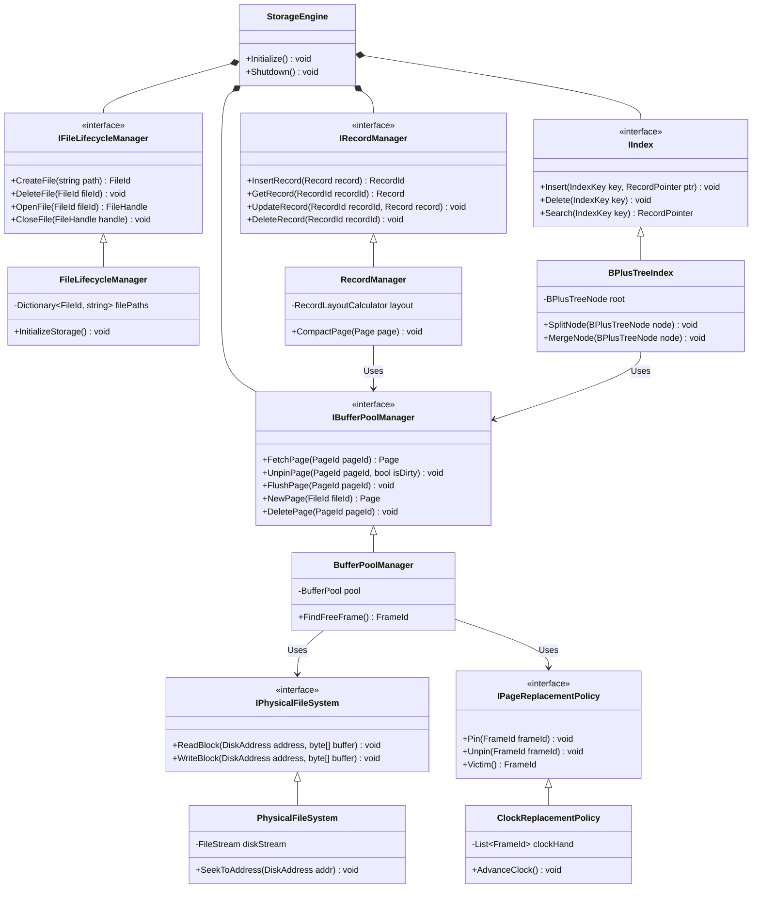
```mermaid
classDiagram
    direction TB

    class StorageEngine {
        +Initialize() void
        +Shutdown() void
    }

    class IFileLifecycleManager {
        <<interface>>
        +CreateFile(string path) FileId
        +DeleteFile(FileId fileId) void
        +OpenFile(FileId fileId) FileHandle
        +CloseFile(FileHandle handle) void
    }
    class FileLifecycleManager {
        -Dictionary~FileId, string~ filePaths
        +InitializeStorage() void
    }

    class IPhysicalFileSystem {
        <<interface>>
        +ReadBlock(DiskAddress address, byte[] buffer) void
        +WriteBlock(DiskAddress address, byte[] buffer) void
    }
    class PhysicalFileSystem {
        -FileStream diskStream
        +SeekToAddress(DiskAddress addr) void
    }

    class IBufferPoolManager {
        <<interface>>
        +FetchPage(PageId pageId) Page
        +UnpinPage(PageId pageId, bool isDirty) void
        +FlushPage(PageId pageId) void
        +NewPage(FileId fileId) Page
        +DeletePage(PageId pageId) void
    }
    class BufferPoolManager {
        -BufferPool pool
        +FindFreeFrame() FrameId
    }

    class IPageReplacementPolicy {
        <<interface>>
        +Pin(FrameId frameId) void
        +Unpin(FrameId frameId) void
        +Victim() FrameId
    }
    class ClockReplacementPolicy {
        -List~FrameId~ clockHand
        +AdvanceClock() void
    }

    class IRecordManager {
        <<interface>>
        +InsertRecord(Record record) RecordId
        +GetRecord(RecordId recordId) Record
        +UpdateRecord(RecordId recordId, Record record) void
        +DeleteRecord(RecordId recordId) void
    }
    class RecordManager {
        -RecordLayoutCalculator layout
        +CompactPage(Page page) void
    }

    class IIndex {
        <<interface>>
        +Insert(IndexKey key, RecordPointer ptr) void
        +Delete(IndexKey key) void
        +Search(IndexKey key) RecordPointer
    }
    class BPlusTreeIndex {
        -BPlusTreeNode root
        +SplitNode(BPlusTreeNode node) void
        +MergeNode(BPlusTreeNode node) void
    }

    IFileLifecycleManager <|-- FileLifecycleManager
    IPhysicalFileSystem <|-- PhysicalFileSystem
    IBufferPoolManager <|-- BufferPoolManager
    IPageReplacementPolicy <|-- ClockReplacementPolicy
    IRecordManager <|-- RecordManager
    IIndex <|-- BPlusTreeIndex

    %% Structural Relationships
    StorageEngine *-- IFileLifecycleManager
    StorageEngine *-- IBufferPoolManager
    StorageEngine *-- IRecordManager
    StorageEngine *-- IIndex

    BufferPoolManager --> IPhysicalFileSystem : Uses
    BufferPoolManager --> IPageReplacementPolicy : Uses
    RecordManager --> IBufferPoolManager : Uses
    BPlusTreeIndex --> IBufferPoolManager : Uses
```

### 2. Query Processor

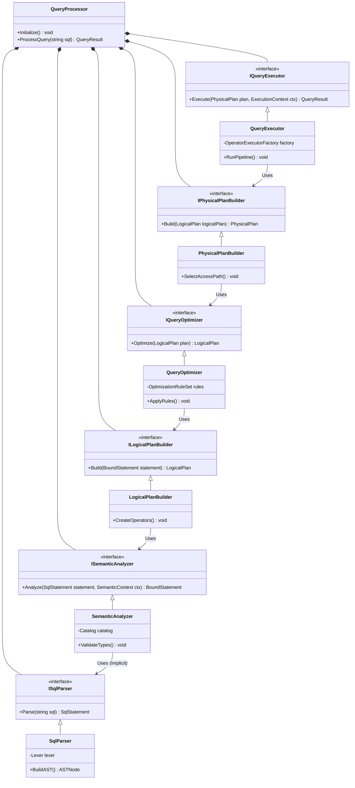
```mermaid
classDiagram
    direction TB

    class QueryProcessor {
        +Initialize() void
        +ProcessQuery(string sql) QueryResult
    }

    class ISqlParser {
        <<interface>>
        +Parse(string sql) SqlStatement
    }
    class SqlParser {
        -Lexer lexer
        +BuildAST() ASTNode
    }

    class ISemanticAnalyzer {
        <<interface>>
        +Analyze(SqlStatement statement, SemanticContext ctx) BoundStatement
    }
    class SemanticAnalyzer {
        -Catalog catalog
        +ValidateTypes() void
    }

    class ILogicalPlanBuilder {
        <<interface>>
        +Build(BoundStatement statement) LogicalPlan
    }
    class LogicalPlanBuilder {
        +CreateOperators() void
    }

    class IQueryOptimizer {
        <<interface>>
        +Optimize(LogicalPlan plan) LogicalPlan
    }
    class QueryOptimizer {
        -OptimizationRuleSet rules
        +ApplyRules() void
    }

    class IPhysicalPlanBuilder {
        <<interface>>
        +Build(LogicalPlan logicalPlan) PhysicalPlan
    }
    class PhysicalPlanBuilder {
        +SelectAccessPath() void
    }

    class IQueryExecutor {
        <<interface>>
        +Execute(PhysicalPlan plan, ExecutionContext ctx) QueryResult
    }
    class QueryExecutor {
        -OperatorExecutorFactory factory
        +RunPipeline() void
    }

    ISqlParser <|-- SqlParser
    ISemanticAnalyzer <|-- SemanticAnalyzer
    ILogicalPlanBuilder <|-- LogicalPlanBuilder
    IQueryOptimizer <|-- QueryOptimizer
    IPhysicalPlanBuilder <|-- PhysicalPlanBuilder
    IQueryExecutor <|-- QueryExecutor

    QueryProcessor *-- ISqlParser
    QueryProcessor *-- ISemanticAnalyzer
    QueryProcessor *-- ILogicalPlanBuilder
    QueryProcessor *-- IQueryOptimizer
    QueryProcessor *-- IPhysicalPlanBuilder
    QueryProcessor *-- IQueryExecutor

    SemanticAnalyzer --> ISqlParser : Uses (Implicit)
    LogicalPlanBuilder --> ISemanticAnalyzer : Uses
    QueryOptimizer --> ILogicalPlanBuilder : Uses
    PhysicalPlanBuilder --> IQueryOptimizer : Uses
    QueryExecutor --> IPhysicalPlanBuilder : Uses
```

### 3. Transaction Management

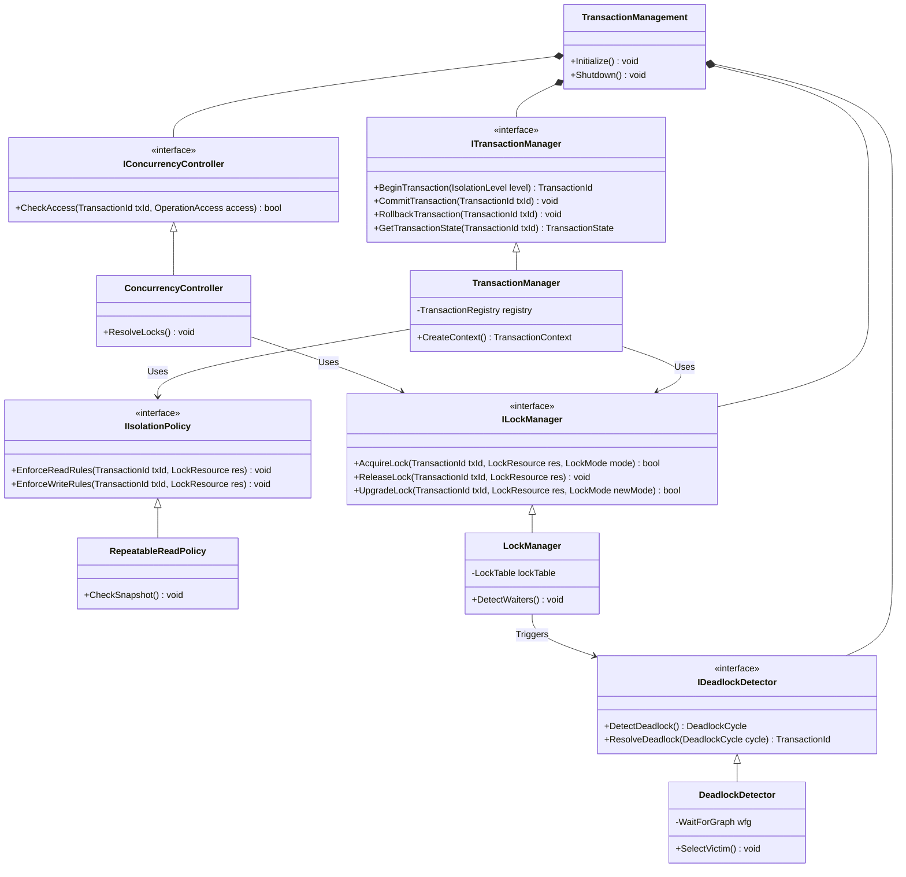
```mermaid
classDiagram
    direction TB

    class TransactionManagement {
        +Initialize() void
        +Shutdown() void
    }

    class ITransactionManager {
        <<interface>>
        +BeginTransaction(IsolationLevel level) TransactionId
        +CommitTransaction(TransactionId txId) void
        +RollbackTransaction(TransactionId txId) void
        +GetTransactionState(TransactionId txId) TransactionState
    }
    class TransactionManager {
        -TransactionRegistry registry
        +CreateContext() TransactionContext
    }

    class IIsolationPolicy {
        <<interface>>
        +EnforceReadRules(TransactionId txId, LockResource res) void
        +EnforceWriteRules(TransactionId txId, LockResource res) void
    }
    class RepeatableReadPolicy {
        +CheckSnapshot() void
    }

    class ILockManager {
        <<interface>>
        +AcquireLock(TransactionId txId, LockResource res, LockMode mode) bool
        +ReleaseLock(TransactionId txId, LockResource res) void
        +UpgradeLock(TransactionId txId, LockResource res, LockMode newMode) bool
    }
    class LockManager {
        -LockTable lockTable
        +DetectWaiters() void
    }

    class IDeadlockDetector {
        <<interface>>
        +DetectDeadlock() DeadlockCycle
        +ResolveDeadlock(DeadlockCycle cycle) TransactionId
    }
    class DeadlockDetector {
        -WaitForGraph wfg
        +SelectVictim() void
    }

    class IConcurrencyController {
        <<interface>>
        +CheckAccess(TransactionId txId, OperationAccess access) bool
    }
    class ConcurrencyController {
        +ResolveLocks() void
    }

    ITransactionManager <|-- TransactionManager
    IIsolationPolicy <|-- RepeatableReadPolicy
    ILockManager <|-- LockManager
    IDeadlockDetector <|-- DeadlockDetector
    IConcurrencyController <|-- ConcurrencyController

    TransactionManagement *-- ITransactionManager
    TransactionManagement *-- ILockManager
    TransactionManagement *-- IDeadlockDetector
    TransactionManagement *-- IConcurrencyController

    TransactionManager --> ILockManager : Uses
    TransactionManager --> IIsolationPolicy : Uses
    LockManager --> IDeadlockDetector : Triggers
    ConcurrencyController --> ILockManager : Uses
```

### 4. Logging Management

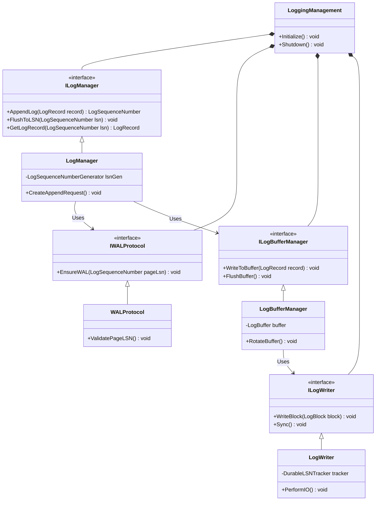
```mermaid
classDiagram
    direction TB

    class LoggingManagement {
        +Initialize() void
        +Shutdown() void
    }

    class ILogManager {
        <<interface>>
        +AppendLog(LogRecord record) LogSequenceNumber
        +FlushToLSN(LogSequenceNumber lsn) void
        +GetLogRecord(LogSequenceNumber lsn) LogRecord
    }
    class LogManager {
        -LogSequenceNumberGenerator lsnGen
        +CreateAppendRequest() void
    }

    class IWALProtocol {
        <<interface>>
        +EnsureWAL(LogSequenceNumber pageLsn) void
    }
    class WALProtocol {
        +ValidatePageLSN() void
    }

    class ILogBufferManager {
        <<interface>>
        +WriteToBuffer(LogRecord record) void
        +FlushBuffer() void
    }
    class LogBufferManager {
        -LogBuffer buffer
        +RotateBuffer() void
    }

    class ILogWriter {
        <<interface>>
        +WriteBlock(LogBlock block) void
        +Sync() void
    }
    class LogWriter {
        -DurableLSNTracker tracker
        +PerformIO() void
    }

    ILogManager <|-- LogManager
    IWALProtocol <|-- WALProtocol
    ILogBufferManager <|-- LogBufferManager
    ILogWriter <|-- LogWriter

    LoggingManagement *-- ILogManager
    LoggingManagement *-- IWALProtocol
    LoggingManagement *-- ILogBufferManager
    LoggingManagement *-- ILogWriter

    LogManager --> IWALProtocol : Uses
    LogManager --> ILogBufferManager : Uses
    LogBufferManager --> ILogWriter : Uses
```

### 5. Recovery Management

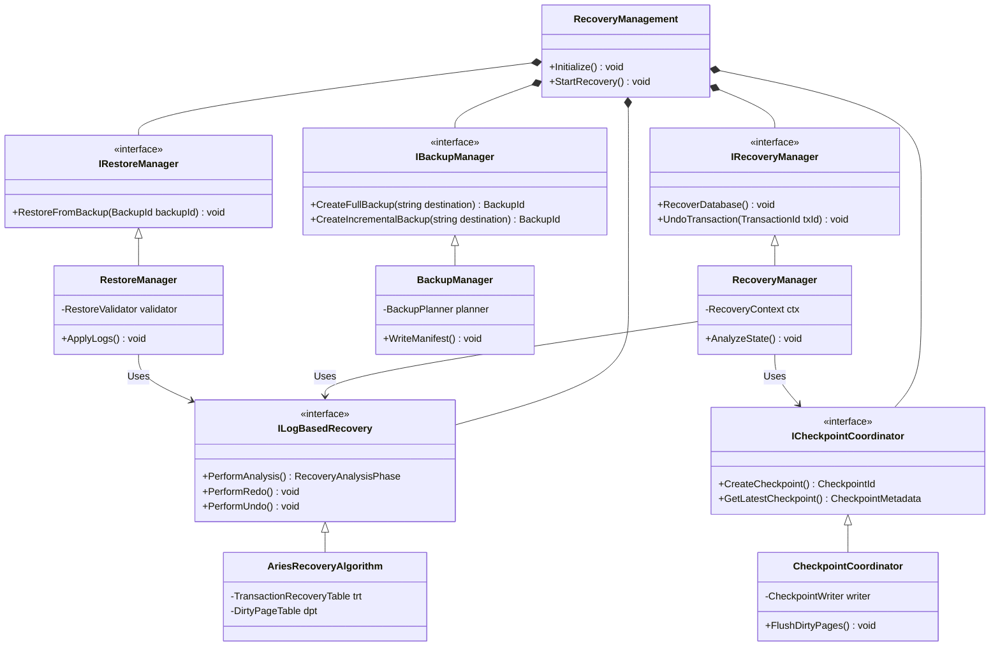
```mermaid
classDiagram
    direction TB

    class RecoveryManagement {
        +Initialize() void
        +StartRecovery() void
    }

    class IRecoveryManager {
        <<interface>>
        +RecoverDatabase() void
        +UndoTransaction(TransactionId txId) void
    }
    class RecoveryManager {
        -RecoveryContext ctx
        +AnalyzeState() void
    }

    class ILogBasedRecovery {
        <<interface>>
        +PerformAnalysis() RecoveryAnalysisPhase
        +PerformRedo() void
        +PerformUndo() void
    }
    class AriesRecoveryAlgorithm {
        -TransactionRecoveryTable trt
        -DirtyPageTable dpt
    }

    class ICheckpointCoordinator {
        <<interface>>
        +CreateCheckpoint() CheckpointId
        +GetLatestCheckpoint() CheckpointMetadata
    }
    class CheckpointCoordinator {
        -CheckpointWriter writer
        +FlushDirtyPages() void
    }

    class IBackupManager {
        <<interface>>
        +CreateFullBackup(string destination) BackupId
        +CreateIncrementalBackup(string destination) BackupId
    }
    class BackupManager {
        -BackupPlanner planner
        +WriteManifest() void
    }

    class IRestoreManager {
        <<interface>>
        +RestoreFromBackup(BackupId backupId) void
    }
    class RestoreManager {
        -RestoreValidator validator
        +ApplyLogs() void
    }

    IRecoveryManager <|-- RecoveryManager
    ILogBasedRecovery <|-- AriesRecoveryAlgorithm
    ICheckpointCoordinator <|-- CheckpointCoordinator
    IBackupManager <|-- BackupManager
    IRestoreManager <|-- RestoreManager

    RecoveryManagement *-- IRecoveryManager
    RecoveryManagement *-- ILogBasedRecovery
    RecoveryManagement *-- ICheckpointCoordinator
    RecoveryManagement *-- IBackupManager
    RecoveryManagement *-- IRestoreManager

    RecoveryManager --> ILogBasedRecovery : Uses
    RecoveryManager --> ICheckpointCoordinator : Uses
    RestoreManager --> ILogBasedRecovery : Uses
```

### 6. Security Management

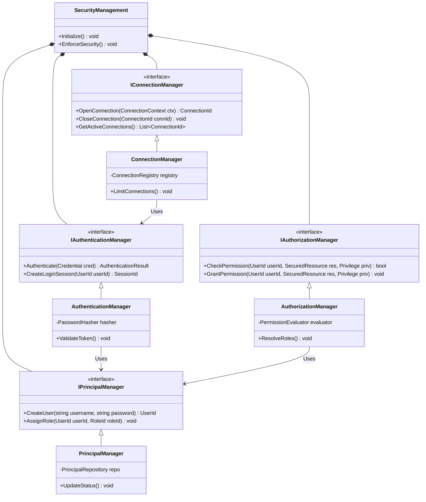
```mermaid
classDiagram
    direction TB

    class SecurityManagement {
        +Initialize() void
        +EnforceSecurity() void
    }

    class IAuthenticationManager {
        <<interface>>
        +Authenticate(Credential cred) AuthenticationResult
        +CreateLoginSession(UserId userId) SessionId
    }
    class AuthenticationManager {
        -PasswordHasher hasher
        +ValidateToken() void
    }

    class IAuthorizationManager {
        <<interface>>
        +CheckPermission(UserId userId, SecuredResource res, Privilege priv) bool
        +GrantPermission(UserId userId, SecuredResource res, Privilege priv) void
    }
    class AuthorizationManager {
        -PermissionEvaluator evaluator
        +ResolveRoles() void
    }

    class IPrincipalManager {
        <<interface>>
        +CreateUser(string username, string password) UserId
        +AssignRole(UserId userId, RoleId roleId) void
    }
    class PrincipalManager {
        -PrincipalRepository repo
        +UpdateStatus() void
    }

    class IConnectionManager {
        <<interface>>
        +OpenConnection(ConnectionContext ctx) ConnectionId
        +CloseConnection(ConnectionId connId) void
        +GetActiveConnections() List~ConnectionId~
    }
    class ConnectionManager {
        -ConnectionRegistry registry
        +LimitConnections() void
    }

    IAuthenticationManager <|-- AuthenticationManager
    IAuthorizationManager <|-- AuthorizationManager
    IPrincipalManager <|-- PrincipalManager
    IConnectionManager <|-- ConnectionManager

    SecurityManagement *-- IAuthenticationManager
    SecurityManagement *-- IAuthorizationManager
    SecurityManagement *-- IPrincipalManager
    SecurityManagement *-- IConnectionManager

    AuthenticationManager --> IPrincipalManager : Uses
    AuthorizationManager --> IPrincipalManager : Uses
    ConnectionManager --> IAuthenticationManager : Uses
```

### 7. Database Manager

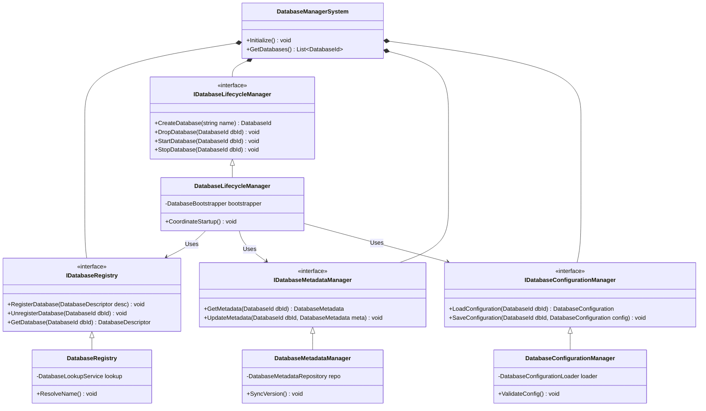
```mermaid
classDiagram
    direction TB

    class DatabaseManagerSystem {
        +Initialize() void
        +GetDatabases() List~DatabaseId~
    }

    class IDatabaseRegistry {
        <<interface>>
        +RegisterDatabase(DatabaseDescriptor desc) void
        +UnregisterDatabase(DatabaseId dbId) void
        +GetDatabase(DatabaseId dbId) DatabaseDescriptor
    }
    class DatabaseRegistry {
        -DatabaseLookupService lookup
        +ResolveName() void
    }

    class IDatabaseLifecycleManager {
        <<interface>>
        +CreateDatabase(string name) DatabaseId
        +DropDatabase(DatabaseId dbId) void
        +StartDatabase(DatabaseId dbId) void
        +StopDatabase(DatabaseId dbId) void
    }
    class DatabaseLifecycleManager {
        -DatabaseBootstrapper bootstrapper
        +CoordinateStartup() void
    }

    class IDatabaseMetadataManager {
        <<interface>>
        +GetMetadata(DatabaseId dbId) DatabaseMetadata
        +UpdateMetadata(DatabaseId dbId, DatabaseMetadata meta) void
    }
    class DatabaseMetadataManager {
        -DatabaseMetadataRepository repo
        +SyncVersion() void
    }

    class IDatabaseConfigurationManager {
        <<interface>>
        +LoadConfiguration(DatabaseId dbId) DatabaseConfiguration
        +SaveConfiguration(DatabaseId dbId, DatabaseConfiguration config) void
    }
    class DatabaseConfigurationManager {
        -DatabaseConfigurationLoader loader
        +ValidateConfig() void
    }

    IDatabaseRegistry <|-- DatabaseRegistry
    IDatabaseLifecycleManager <|-- DatabaseLifecycleManager
    IDatabaseMetadataManager <|-- DatabaseMetadataManager
    IDatabaseConfigurationManager <|-- DatabaseConfigurationManager

    DatabaseManagerSystem *-- IDatabaseRegistry
    DatabaseManagerSystem *-- IDatabaseLifecycleManager
    DatabaseManagerSystem *-- IDatabaseMetadataManager
    DatabaseManagerSystem *-- IDatabaseConfigurationManager

    DatabaseLifecycleManager --> IDatabaseRegistry : Uses
    DatabaseLifecycleManager --> IDatabaseMetadataManager : Uses
    DatabaseLifecycleManager --> IDatabaseConfigurationManager : Uses
```

### 8. Database Object Management

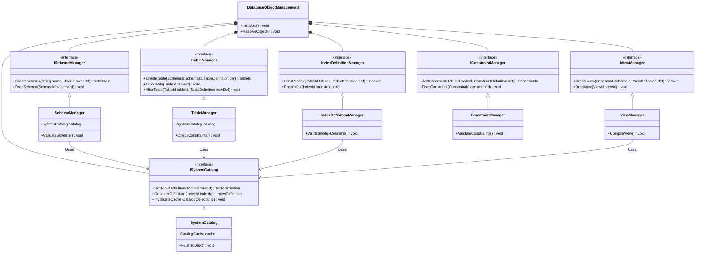
```mermaid
classDiagram
    direction TB

    class DatabaseObjectManagement {
        +Initialize() void
        +ResolveObject() void
    }

    class ISchemaManager {
        <<interface>>
        +CreateSchema(string name, UserId ownerId) SchemaId
        +DropSchema(SchemaId schemaId) void
    }
    class SchemaManager {
        -SystemCatalog catalog
        +ValidateSchema() void
    }

    class ITableManager {
        <<interface>>
        +CreateTable(SchemaId schemaId, TableDefinition def) TableId
        +DropTable(TableId tableId) void
        +AlterTable(TableId tableId, TableDefinition newDef) void
    }
    class TableManager {
        -SystemCatalog catalog
        +CheckConstraints() void
    }

    class IIndexDefinitionManager {
        <<interface>>
        +CreateIndex(TableId tableId, IndexDefinition def) IndexId
        +DropIndex(IndexId indexId) void
    }
    class IndexDefinitionManager {
        +ValidateIndexColumns() void
    }

    class IViewManager {
        <<interface>>
        +CreateView(SchemaId schemaId, ViewDefinition def) ViewId
        +DropView(ViewId viewId) void
    }
    class ViewManager {
        +CompileView() void
    }

    class IConstraintManager {
        <<interface>>
        +AddConstraint(TableId tableId, ConstraintDefinition def) ConstraintId
        +DropConstraint(ConstraintId constraintId) void
    }
    class ConstraintManager {
        +ValidateConstraints() void
    }


    class ISystemCatalog {
        <<interface>>
        +GetTableDefinition(TableId tableId) TableDefinition
        +GetIndexDefinition(IndexId indexId) IndexDefinition
        +InvalidateCache(CatalogObjectId id) void
    }
    class SystemCatalog {
        -CatalogCache cache
        +FlushToDisk() void
    }

    ISchemaManager <|-- SchemaManager
    ITableManager <|-- TableManager
    IIndexDefinitionManager <|-- IndexDefinitionManager
    IViewManager <|-- ViewManager
    IConstraintManager <|-- ConstraintManager
    ISystemCatalog <|-- SystemCatalog

    DatabaseObjectManagement *-- ISchemaManager
    DatabaseObjectManagement *-- ITableManager
    DatabaseObjectManagement *-- IIndexDefinitionManager
    DatabaseObjectManagement *-- IViewManager
    DatabaseObjectManagement *-- IConstraintManager
    DatabaseObjectManagement *-- ISystemCatalog

    SchemaManager --> ISystemCatalog : Uses
    TableManager --> ISystemCatalog : Uses
    IndexDefinitionManager --> ISystemCatalog : Uses
    ViewManager --> ISystemCatalog : Uses
```

### 9. Performance Management

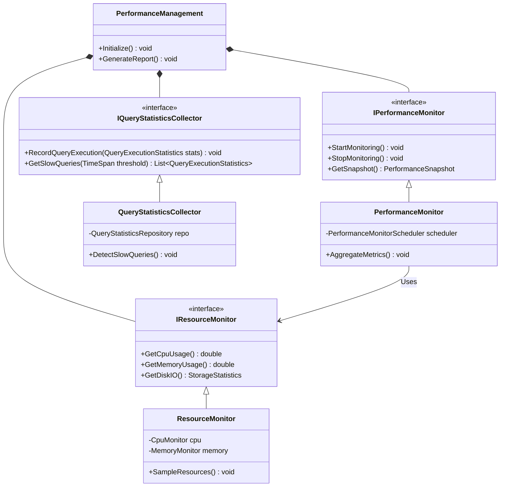
```mermaid
classDiagram
    direction TB

    class PerformanceManagement {
        +Initialize() void
        +GenerateReport() void
    }

    class IPerformanceMonitor {
        <<interface>>
        +StartMonitoring() void
        +StopMonitoring() void
        +GetSnapshot() PerformanceSnapshot
    }
    class PerformanceMonitor {
        -PerformanceMonitorScheduler scheduler
        +AggregateMetrics() void
    }

    class IQueryStatisticsCollector {
        <<interface>>
        +RecordQueryExecution(QueryExecutionStatistics stats) void
        +GetSlowQueries(TimeSpan threshold) List~QueryExecutionStatistics~
    }
    class QueryStatisticsCollector {
        -QueryStatisticsRepository repo
        +DetectSlowQueries() void
    }

    class IResourceMonitor {
        <<interface>>
        +GetCpuUsage() double
        +GetMemoryUsage() double
        +GetDiskIO() StorageStatistics
    }
    class ResourceMonitor {
        -CpuMonitor cpu
        -MemoryMonitor memory
        +SampleResources() void
    }


    IPerformanceMonitor <|-- PerformanceMonitor
    IQueryStatisticsCollector <|-- QueryStatisticsCollector
    IResourceMonitor <|-- ResourceMonitor

    PerformanceManagement *-- IPerformanceMonitor
    PerformanceManagement *-- IQueryStatisticsCollector
    PerformanceManagement *-- IResourceMonitor

    PerformanceMonitor --> IResourceMonitor : Uses
```

### 10. System Management

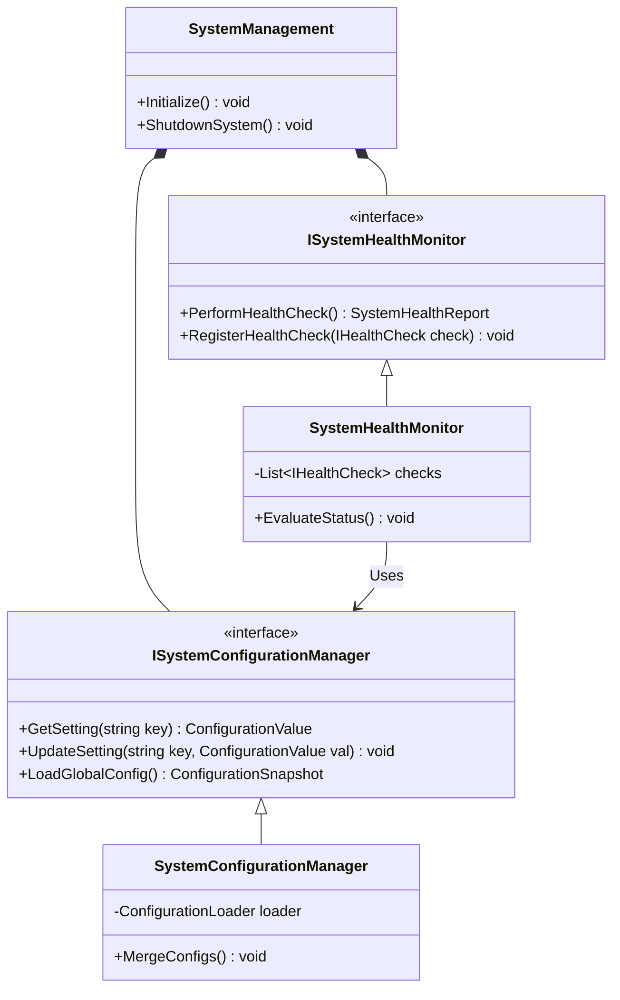
```mermaid
classDiagram
    direction TB

    class SystemManagement {
        +Initialize() void
        +ShutdownSystem() void
    }

    class ISystemConfigurationManager {
        <<interface>>
        +GetSetting(string key) ConfigurationValue
        +UpdateSetting(string key, ConfigurationValue val) void
        +LoadGlobalConfig() ConfigurationSnapshot
    }
    class SystemConfigurationManager {
        -ConfigurationLoader loader
        +MergeConfigs() void
    }

    class ISystemHealthMonitor {
        <<interface>>
        +PerformHealthCheck() SystemHealthReport
        +RegisterHealthCheck(IHealthCheck check) void
    }
    class SystemHealthMonitor {
        -List~IHealthCheck~ checks
        +EvaluateStatus() void
    }


    ISystemConfigurationManager <|-- SystemConfigurationManager
    ISystemHealthMonitor <|-- SystemHealthMonitor

    SystemManagement *-- ISystemConfigurationManager
    SystemManagement *-- ISystemHealthMonitor

    SystemHealthMonitor --> ISystemConfigurationManager : Uses
```

## Unit Tests Architecture

### 1. Storage Engine Unit Tests

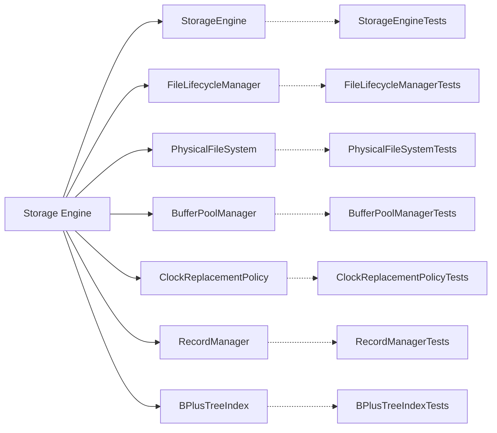
```mermaid
flowchart LR
    Subsystem1["Storage Engine"]

    Class_1_1["StorageEngine"]
    Test_1_1["StorageEngineTests"]
    Subsystem1 --> Class_1_1
    Class_1_1 -.-> Test_1_1

    Class_1_2["FileLifecycleManager"]
    Test_1_2["FileLifecycleManagerTests"]
    Subsystem1 --> Class_1_2
    Class_1_2 -.-> Test_1_2

    Class_1_3["PhysicalFileSystem"]
    Test_1_3["PhysicalFileSystemTests"]
    Subsystem1 --> Class_1_3
    Class_1_3 -.-> Test_1_3

    Class_1_4["BufferPoolManager"]
    Test_1_4["BufferPoolManagerTests"]
    Subsystem1 --> Class_1_4
    Class_1_4 -.-> Test_1_4

    Class_1_5["ClockReplacementPolicy"]
    Test_1_5["ClockReplacementPolicyTests"]
    Subsystem1 --> Class_1_5
    Class_1_5 -.-> Test_1_5

    Class_1_6["RecordManager"]
    Test_1_6["RecordManagerTests"]
    Subsystem1 --> Class_1_6
    Class_1_6 -.-> Test_1_6

    Class_1_7["BPlusTreeIndex"]
    Test_1_7["BPlusTreeIndexTests"]
    Subsystem1 --> Class_1_7
    Class_1_7 -.-> Test_1_7

```

### 2. Query Processor Unit Tests

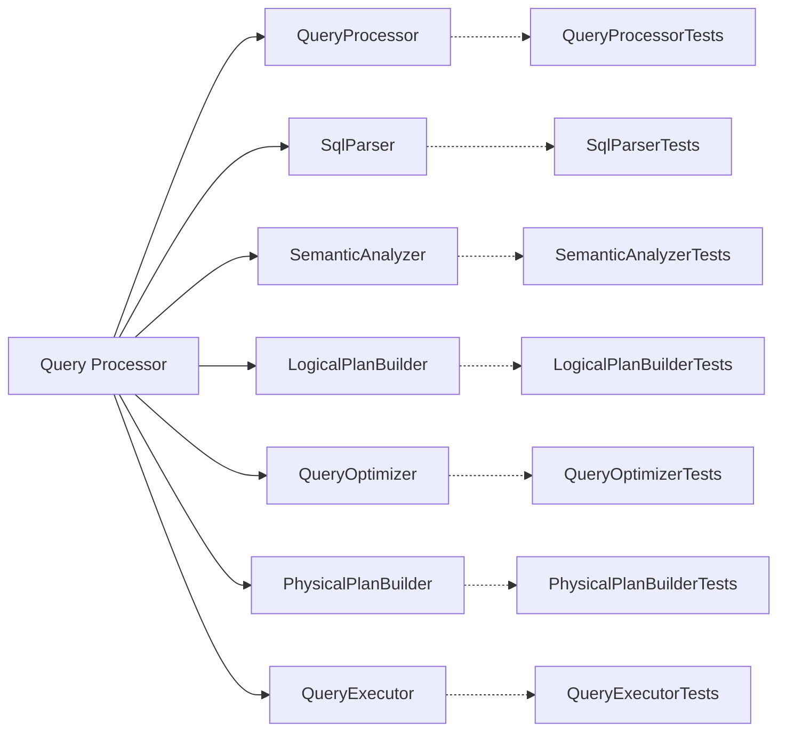
```mermaid
flowchart LR
    Subsystem2["Query Processor"]

    Class_2_1["QueryProcessor"]
    Test_2_1["QueryProcessorTests"]
    Subsystem2 --> Class_2_1
    Class_2_1 -.-> Test_2_1

    Class_2_2["SqlParser"]
    Test_2_2["SqlParserTests"]
    Subsystem2 --> Class_2_2
    Class_2_2 -.-> Test_2_2

    Class_2_3["SemanticAnalyzer"]
    Test_2_3["SemanticAnalyzerTests"]
    Subsystem2 --> Class_2_3
    Class_2_3 -.-> Test_2_3

    Class_2_4["LogicalPlanBuilder"]
    Test_2_4["LogicalPlanBuilderTests"]
    Subsystem2 --> Class_2_4
    Class_2_4 -.-> Test_2_4

    Class_2_5["QueryOptimizer"]
    Test_2_5["QueryOptimizerTests"]
    Subsystem2 --> Class_2_5
    Class_2_5 -.-> Test_2_5

    Class_2_6["PhysicalPlanBuilder"]
    Test_2_6["PhysicalPlanBuilderTests"]
    Subsystem2 --> Class_2_6
    Class_2_6 -.-> Test_2_6

    Class_2_7["QueryExecutor"]
    Test_2_7["QueryExecutorTests"]
    Subsystem2 --> Class_2_7
    Class_2_7 -.-> Test_2_7

```

### 3. Transaction Management Unit Tests

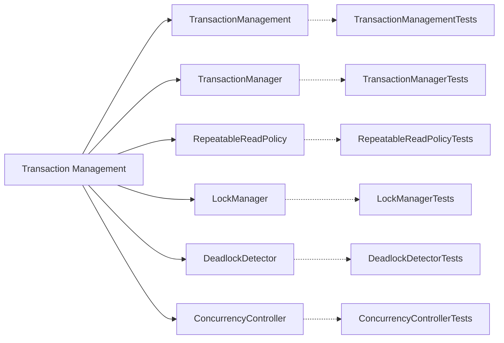
```mermaid
flowchart LR
    Subsystem3["Transaction Management"]

    Class_3_1["TransactionManagement"]
    Test_3_1["TransactionManagementTests"]
    Subsystem3 --> Class_3_1
    Class_3_1 -.-> Test_3_1

    Class_3_2["TransactionManager"]
    Test_3_2["TransactionManagerTests"]
    Subsystem3 --> Class_3_2
    Class_3_2 -.-> Test_3_2

    Class_3_3["RepeatableReadPolicy"]
    Test_3_3["RepeatableReadPolicyTests"]
    Subsystem3 --> Class_3_3
    Class_3_3 -.-> Test_3_3

    Class_3_4["LockManager"]
    Test_3_4["LockManagerTests"]
    Subsystem3 --> Class_3_4
    Class_3_4 -.-> Test_3_4

    Class_3_5["DeadlockDetector"]
    Test_3_5["DeadlockDetectorTests"]
    Subsystem3 --> Class_3_5
    Class_3_5 -.-> Test_3_5

    Class_3_6["ConcurrencyController"]
    Test_3_6["ConcurrencyControllerTests"]
    Subsystem3 --> Class_3_6
    Class_3_6 -.-> Test_3_6

```

### 4. Logging Management Unit Tests

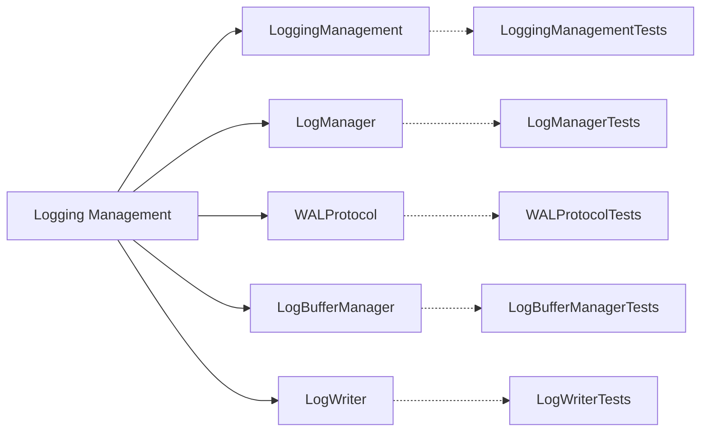
```mermaid
flowchart LR
    Subsystem4["Logging Management"]

    Class_4_1["LoggingManagement"]
    Test_4_1["LoggingManagementTests"]
    Subsystem4 --> Class_4_1
    Class_4_1 -.-> Test_4_1

    Class_4_2["LogManager"]
    Test_4_2["LogManagerTests"]
    Subsystem4 --> Class_4_2
    Class_4_2 -.-> Test_4_2

    Class_4_3["WALProtocol"]
    Test_4_3["WALProtocolTests"]
    Subsystem4 --> Class_4_3
    Class_4_3 -.-> Test_4_3

    Class_4_4["LogBufferManager"]
    Test_4_4["LogBufferManagerTests"]
    Subsystem4 --> Class_4_4
    Class_4_4 -.-> Test_4_4

    Class_4_5["LogWriter"]
    Test_4_5["LogWriterTests"]
    Subsystem4 --> Class_4_5
    Class_4_5 -.-> Test_4_5

```

### 5. Recovery Management Unit Tests

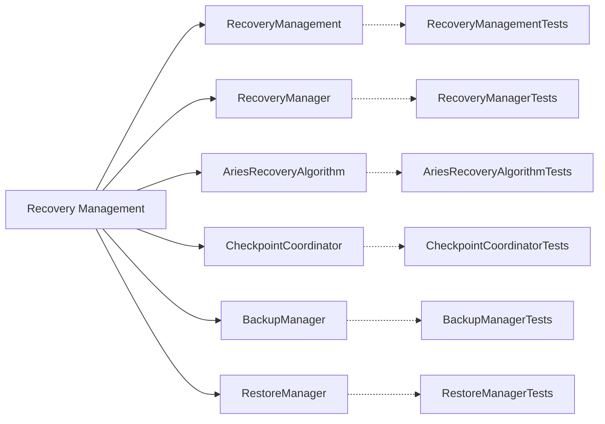
```mermaid
flowchart LR
    Subsystem5["Recovery Management"]

    Class_5_1["RecoveryManagement"]
    Test_5_1["RecoveryManagementTests"]
    Subsystem5 --> Class_5_1
    Class_5_1 -.-> Test_5_1

    Class_5_2["RecoveryManager"]
    Test_5_2["RecoveryManagerTests"]
    Subsystem5 --> Class_5_2
    Class_5_2 -.-> Test_5_2

    Class_5_3["AriesRecoveryAlgorithm"]
    Test_5_3["AriesRecoveryAlgorithmTests"]
    Subsystem5 --> Class_5_3
    Class_5_3 -.-> Test_5_3

    Class_5_4["CheckpointCoordinator"]
    Test_5_4["CheckpointCoordinatorTests"]
    Subsystem5 --> Class_5_4
    Class_5_4 -.-> Test_5_4

    Class_5_5["BackupManager"]
    Test_5_5["BackupManagerTests"]
    Subsystem5 --> Class_5_5
    Class_5_5 -.-> Test_5_5

    Class_5_6["RestoreManager"]
    Test_5_6["RestoreManagerTests"]
    Subsystem5 --> Class_5_6
    Class_5_6 -.-> Test_5_6

```

### 6. Security Management Unit Tests

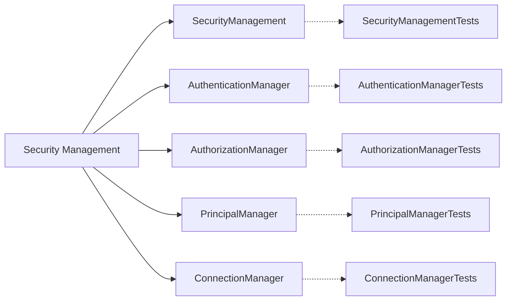
```mermaid
flowchart LR
    Subsystem6["Security Management"]

    Class_6_1["SecurityManagement"]
    Test_6_1["SecurityManagementTests"]
    Subsystem6 --> Class_6_1
    Class_6_1 -.-> Test_6_1

    Class_6_2["AuthenticationManager"]
    Test_6_2["AuthenticationManagerTests"]
    Subsystem6 --> Class_6_2
    Class_6_2 -.-> Test_6_2

    Class_6_3["AuthorizationManager"]
    Test_6_3["AuthorizationManagerTests"]
    Subsystem6 --> Class_6_3
    Class_6_3 -.-> Test_6_3

    Class_6_4["PrincipalManager"]
    Test_6_4["PrincipalManagerTests"]
    Subsystem6 --> Class_6_4
    Class_6_4 -.-> Test_6_4

    Class_6_5["ConnectionManager"]
    Test_6_5["ConnectionManagerTests"]
    Subsystem6 --> Class_6_5
    Class_6_5 -.-> Test_6_5

```

### 7. Database Manager Unit Tests

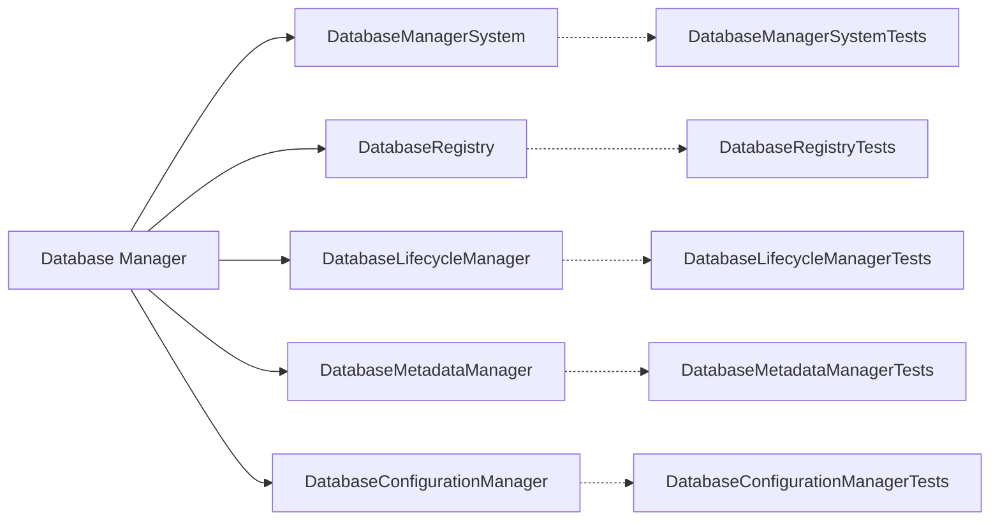
```mermaid
flowchart LR
    Subsystem7["Database Manager"]

    Class_7_1["DatabaseManagerSystem"]
    Test_7_1["DatabaseManagerSystemTests"]
    Subsystem7 --> Class_7_1
    Class_7_1 -.-> Test_7_1

    Class_7_2["DatabaseRegistry"]
    Test_7_2["DatabaseRegistryTests"]
    Subsystem7 --> Class_7_2
    Class_7_2 -.-> Test_7_2

    Class_7_3["DatabaseLifecycleManager"]
    Test_7_3["DatabaseLifecycleManagerTests"]
    Subsystem7 --> Class_7_3
    Class_7_3 -.-> Test_7_3

    Class_7_4["DatabaseMetadataManager"]
    Test_7_4["DatabaseMetadataManagerTests"]
    Subsystem7 --> Class_7_4
    Class_7_4 -.-> Test_7_4

    Class_7_5["DatabaseConfigurationManager"]
    Test_7_5["DatabaseConfigurationManagerTests"]
    Subsystem7 --> Class_7_5
    Class_7_5 -.-> Test_7_5

```

### 8. Database Object Management Unit Tests

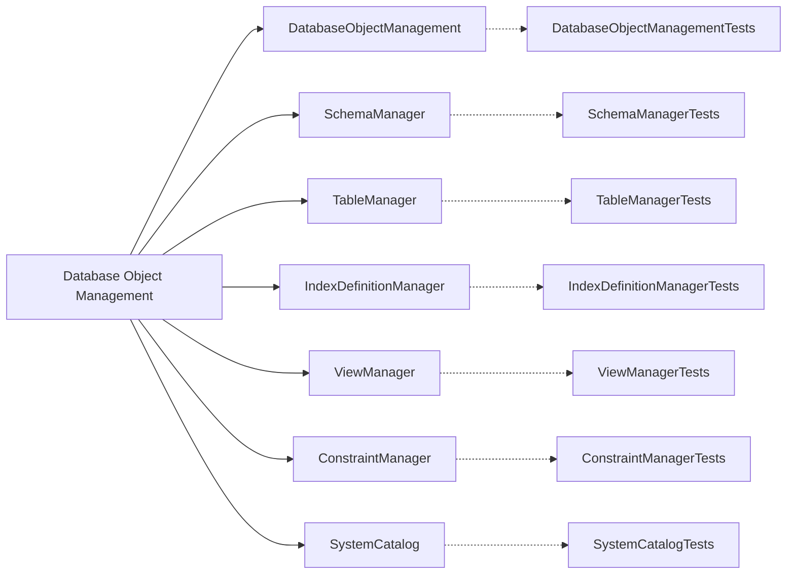
```mermaid
flowchart LR
    Subsystem8["Database Object Management"]

    Class_8_1["DatabaseObjectManagement"]
    Test_8_1["DatabaseObjectManagementTests"]
    Subsystem8 --> Class_8_1
    Class_8_1 -.-> Test_8_1

    Class_8_2["SchemaManager"]
    Test_8_2["SchemaManagerTests"]
    Subsystem8 --> Class_8_2
    Class_8_2 -.-> Test_8_2

    Class_8_3["TableManager"]
    Test_8_3["TableManagerTests"]
    Subsystem8 --> Class_8_3
    Class_8_3 -.-> Test_8_3

    Class_8_4["IndexDefinitionManager"]
    Test_8_4["IndexDefinitionManagerTests"]
    Subsystem8 --> Class_8_4
    Class_8_4 -.-> Test_8_4

    Class_8_5["ViewManager"]
    Test_8_5["ViewManagerTests"]
    Subsystem8 --> Class_8_5
    Class_8_5 -.-> Test_8_5

    Class_8_6["ConstraintManager"]
    Test_8_6["ConstraintManagerTests"]
    Subsystem8 --> Class_8_6
    Class_8_6 -.-> Test_8_6

    Class_8_7["SystemCatalog"]
    Test_8_7["SystemCatalogTests"]
    Subsystem8 --> Class_8_7
    Class_8_7 -.-> Test_8_7

```

### 9. Performance Management Unit Tests

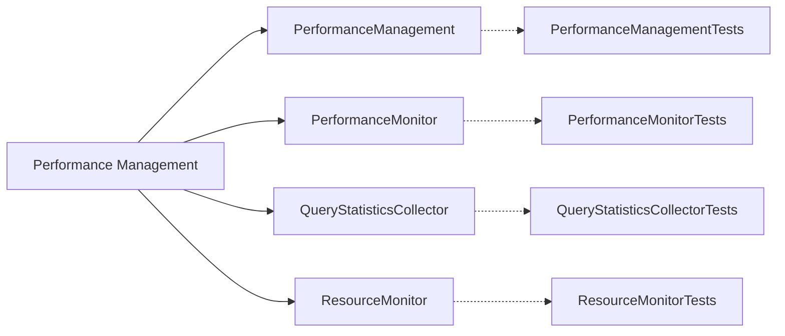
```mermaid
flowchart LR
    Subsystem9["Performance Management"]

    Class_9_1["PerformanceManagement"]
    Test_9_1["PerformanceManagementTests"]
    Subsystem9 --> Class_9_1
    Class_9_1 -.-> Test_9_1

    Class_9_2["PerformanceMonitor"]
    Test_9_2["PerformanceMonitorTests"]
    Subsystem9 --> Class_9_2
    Class_9_2 -.-> Test_9_2

    Class_9_3["QueryStatisticsCollector"]
    Test_9_3["QueryStatisticsCollectorTests"]
    Subsystem9 --> Class_9_3
    Class_9_3 -.-> Test_9_3

    Class_9_4["ResourceMonitor"]
    Test_9_4["ResourceMonitorTests"]
    Subsystem9 --> Class_9_4
    Class_9_4 -.-> Test_9_4

```

### 10. System Management Unit Tests

```mermaid
flowchart LR
    Subsystem10["System Management"]

    Class_10_1["SystemManagement"]
    Test_10_1["SystemManagementTests"]
    Subsystem10 --> Class_10_1
    Class_10_1 -.-> Test_10_1

    Class_10_2["SystemConfigurationManager"]
    Test_10_2["SystemConfigurationManagerTests"]
    Subsystem10 --> Class_10_2
    Class_10_2 -.-> Test_10_2

    Class_10_3["SystemHealthMonitor"]
    Test_10_3["SystemHealthMonitorTests"]
    Subsystem10 --> Class_10_3
    Class_10_3 -.-> Test_10_3

```
