# DBMS
Database management system

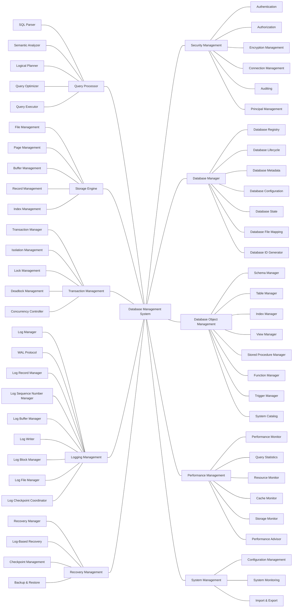

## Architecture Class Diagram

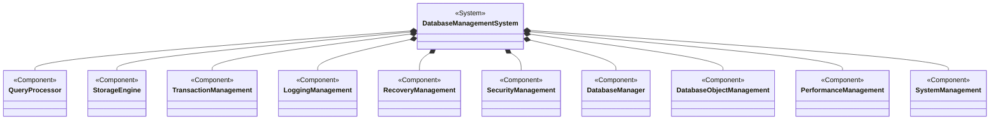

## Component Level Flowcharts

### 1. Query Processor Flowchart

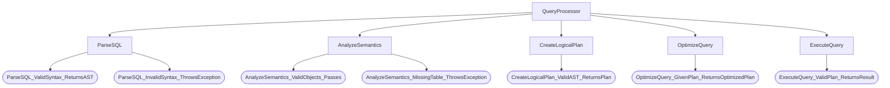

### 2. Storage Engine Flowchart

```mermaid
flowchart TD
    SE[StorageEngine]

    SE_CreateFile[CreateDataFile]
    SE_OpenFile[OpenDataFile]
    SE_ReadPage[ReadPageData]
    SE_WritePage[WritePageData]
    SE_AllocExtent[AllocateExtent]

    SE --> SE_CreateFile
    SE --> SE_OpenFile
    SE --> SE_ReadPage
    SE --> SE_WritePage
    SE --> SE_AllocExtent

    SE_CreateFile_Test1([CreateDataFile_ValidParams_Success])
    SE_CreateFile_Test2([CreateDataFile_AlreadyExists_Throws])
    SE_CreateFile --> SE_CreateFile_Test1
    SE_CreateFile --> SE_CreateFile_Test2

    SE_OpenFile_Test1([OpenDataFile_ExistingFile_Success])
    SE_OpenFile_Test2([OpenDataFile_NotFound_Throws])
    SE_OpenFile --> SE_OpenFile_Test1
    SE_OpenFile --> SE_OpenFile_Test2

    SE_ReadPage_Test1([ReadPageData_ValidId_ReturnsData])
    SE_ReadPage_Test2([ReadPageData_InvalidId_Throws])
    SE_ReadPage --> SE_ReadPage_Test1
    SE_ReadPage --> SE_ReadPage_Test2

    SE_WritePage_Test1([WritePageData_ValidId_Success])
    SE_WritePage --> SE_WritePage_Test1

    SE_AllocExtent_Test1([AllocateExtent_HasSpace_ReturnsExtent])
    SE_AllocExtent --> SE_AllocExtent_Test1
```

### 3. Transaction Management Flowchart

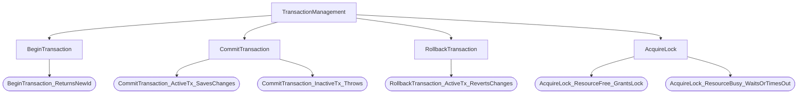

### 4. Logging Management Flowchart

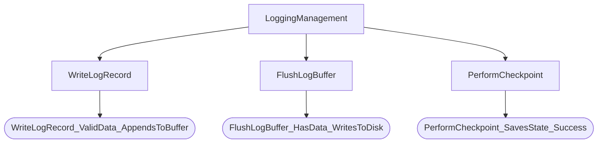

### 5. Recovery Management Flowchart

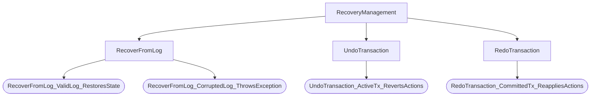

### 6. Security Management Flowchart

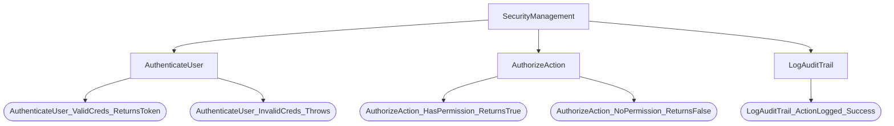

### 7. Database Manager Flowchart

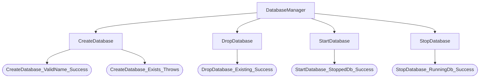

### 8. Database Object Management Flowchart

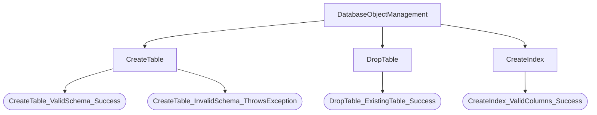

### 9. Performance Management Flowchart

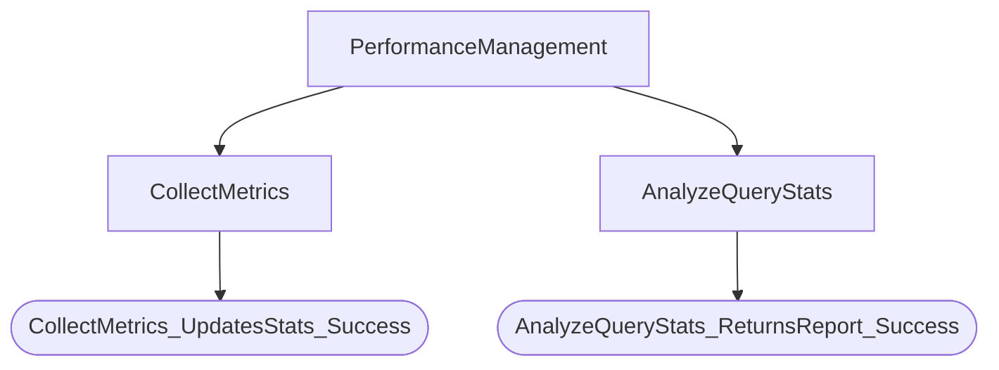

### 10. System Management Flowchart

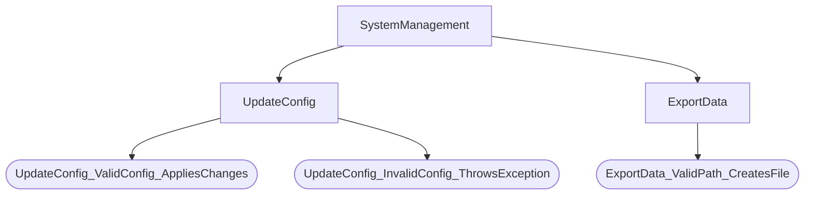
