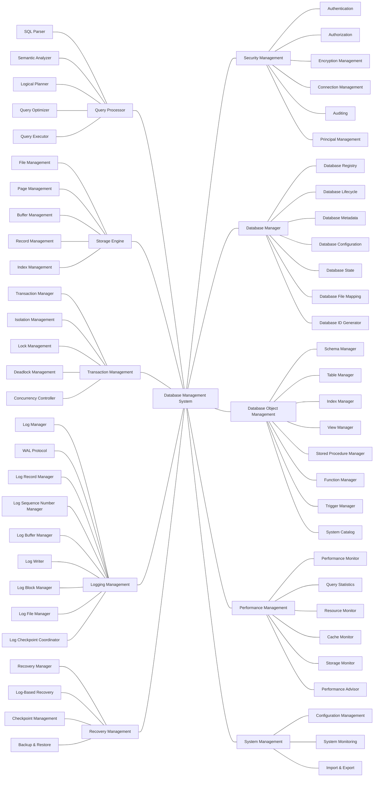

# DBMS
Database management system

```mermaid
flowchart LR
    %% Left side
    QP_SP[SQL Parser] --- QP[Query Processor]
    QP_SA[Semantic Analyzer] --- QP
    QP_LP[Logical Planner] --- QP
    QP_QO[Query Optimizer] --- QP
    QP_QE[Query Executor] --- QP
    QP --- DBMS[Database Management System]
    
    SE_FM[File Management] --- SE[Storage Engine]
    SE_PM[Page Management] --- SE
    SE_BM[Buffer Management] --- SE
    SE_RM[Record Management] --- SE
    SE_IM[Index Management] --- SE
    SE --- DBMS
    
    TM_TM[Transaction Manager] --- TM[Transaction Management]
    TM_IM[Isolation Management] --- TM
    TM_LM[Lock Management] --- TM
    TM_DM[Deadlock Management] --- TM
    TM_CC[Concurrency Controller] --- TM
    TM --- DBMS
    
    LM_LM[Log Manager] --- LM[Logging Management]
    LM_WAL[WAL Protocol] --- LM
    LM_LRM[Log Record Manager] --- LM
    LM_LSNM[Log Sequence Number Manager] --- LM
    LM_LBM[Log Buffer Manager] --- LM
    LM_LW[Log Writer] --- LM
    LM_LBlkM[Log Block Manager] --- LM
    LM_LFM[Log File Manager] --- LM
    LM_LCC[Log Checkpoint Coordinator] --- LM
    LM --- DBMS
    
    RM_RM[Recovery Manager] --- RM[Recovery Management]
    RM_LBR[Log-Based Recovery] --- RM
    RM_CM[Checkpoint Management] --- RM
    RM_BR[Backup & Restore] --- RM
    RM --- DBMS

    %% Right side
    DBMS --- SecM[Security Management]
    SecM --- SecM_AuthN[Authentication]
    SecM --- SecM_AuthZ[Authorization]
    SecM --- SecM_EM[Encryption Management]
    SecM --- SecM_CM[Connection Management]
    SecM --- SecM_Aud[Auditing]
    SecM --- SecM_PM[Principal Management]
    
    DBMS --- DM[Database Manager]
    DM --- DM_DR[Database Registry]
    DM --- DM_DL[Database Lifecycle]
    DM --- DM_DM[Database Metadata]
    DM --- DM_DC[Database Configuration]
    DM --- DM_DS[Database State]
    DM --- DM_DFM[Database File Mapping]
    DM --- DM_DIG[Database ID Generator]
    
    DBMS --- DOM[Database Object Management]
    DOM --- DOM_SM[Schema Manager]
    DOM --- DOM_TM[Table Manager]
    DOM --- DOM_IM[Index Manager]
    DOM --- DOM_VM[View Manager]
    DOM --- DOM_SPM[Stored Procedure Manager]
    DOM --- DOM_FM[Function Manager]
    DOM --- DOM_TrM[Trigger Manager]
    DOM --- DOM_SC[System Catalog]
    
    DBMS --- PM[Performance Management]
    PM --- PM_PM[Performance Monitor]
    PM --- PM_QS[Query Statistics]
    PM --- PM_RM[Resource Monitor]
    PM --- PM_CM[Cache Monitor]
    PM --- PM_SM[Storage Monitor]
    PM --- PM_PA[Performance Advisor]
    
    DBMS --- SysM[System Management]
    SysM --- SysM_CM[Configuration Management]
    SysM --- SysM_SM[System Monitoring]
    SysM --- SysM_IE[Import & Export]
```
