# DBMS 2 layer

Database management system

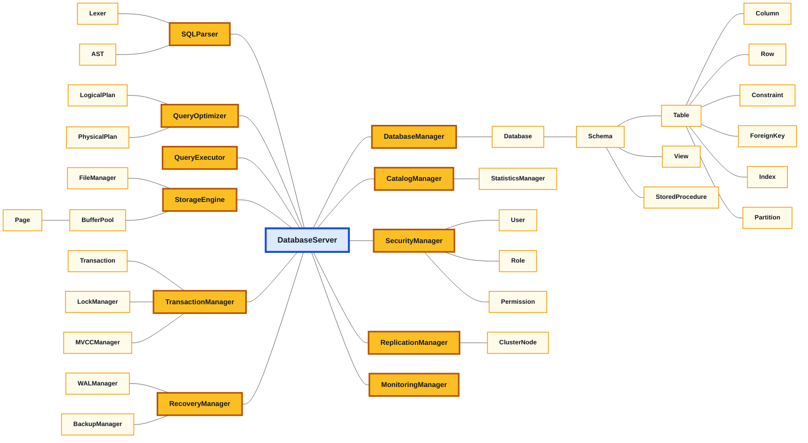

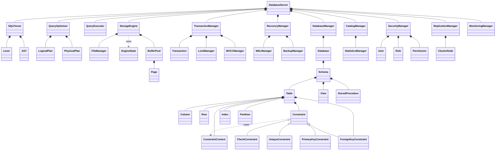

## Feature Class Diagrams

### 1. Storage Engine


### 2. Query Processor

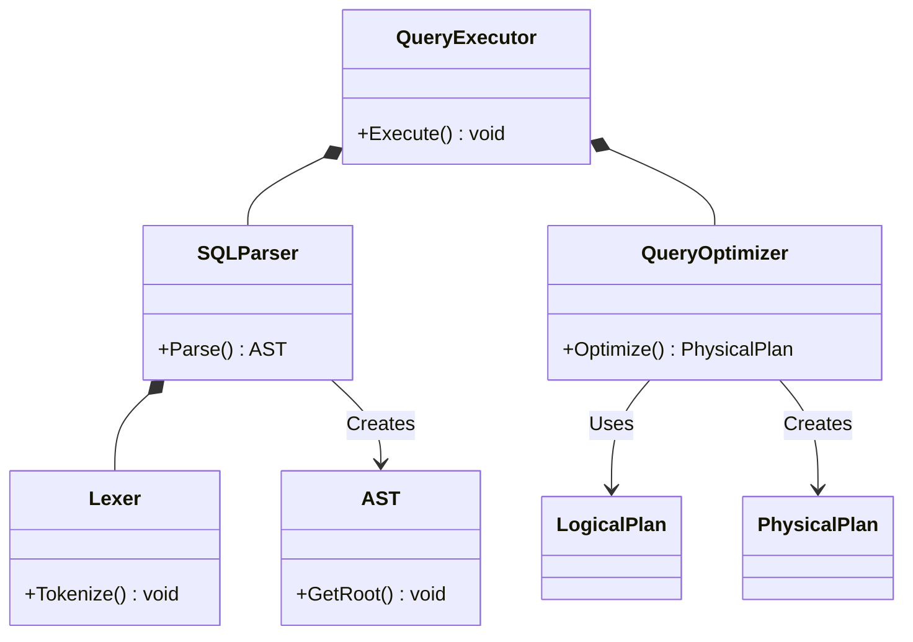

### 3. Transaction Management

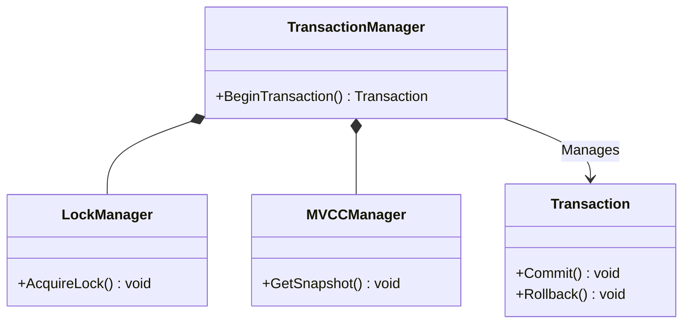

### 4. Recovery Management

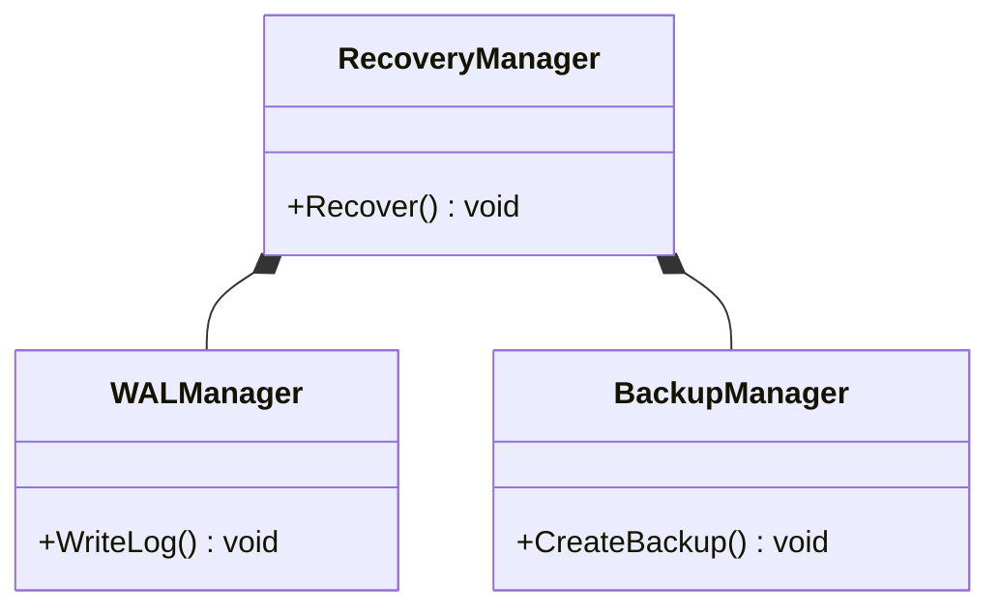

### 5. Security Management

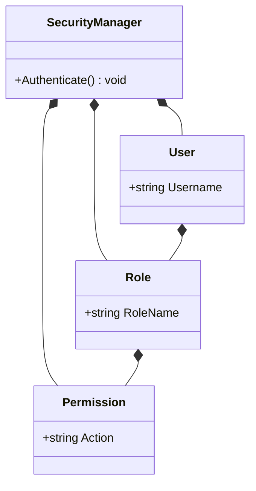

### 6. Database Manager

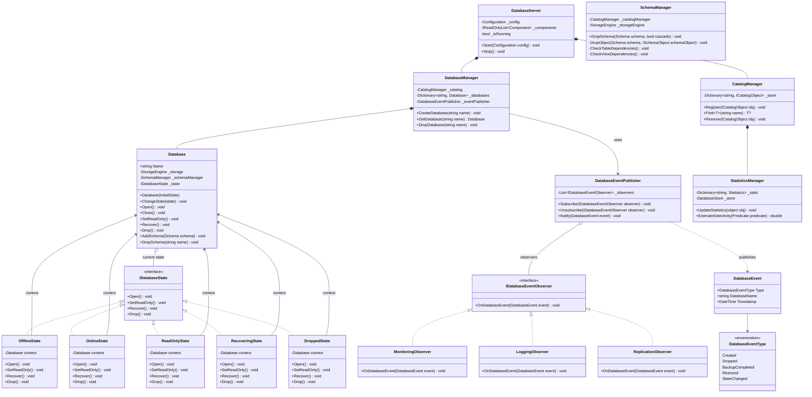

### 7. Database Objects

```mermaid
classDiagram
    direction TB

    class Schema {
        +string Name
        +IReadOnlyCollection~Table~ Tables
        +IReadOnlyCollection~View~ Views
        +IReadOnlyCollection~StoredProcedure~ StoredProcedures
        +IEnumerable~ISchemaObject~ Objects
        -Dictionary~string, Table~ _tables
        -Dictionary~string, View~ _views
        -Dictionary~string, StoredProcedure~ _storedProcedures
        +RegisterObject(ISchemaObject obj) void
        +UnregisterObject(string name) ISchemaObject
        +AddTable(Table table) void
        +DropTable(string tableName) void
        +AlterTable(string tableName, Table newTable) void
        +GetTable(string tableName) Table?
        +ContainsTable(string tableName) bool
        +ContainsObject(string objectName) bool
        +ResolveObject(string objectName) object?
        ~RegisterView(View view) void
        ~UnregisterView(string viewName) void
        ~IsObjectReferenced(string objectName) bool
        -IsTableReferencedByForeignKey(string tableName) bool
        +Drop() void
    }

    class Table {
        +string Name
        +IReadOnlyList~Column~ Columns
        +IReadOnlyList~Row~ Rows
        +IReadOnlyList~Constraint~ Constraints
        +IReadOnlyList~Index~ Indexes
        +IReadOnlyList~Partition~ Partitions
        -List~Column~ _columns
        -List~Row~ _rows
        -List~Constraint~ _constraints
        -List~Index~ _indexes
        -List~Partition~ _partitions
        +AddColumn(Column column) void
        +DropColumn(string columnName) void
        +AlterColumn(string columnName, Column newColumn) void
        +InsertRow(Row row) void
        +DeleteRow(Row row) bool
        +ContainsColumn(string columnName) bool
        +ContainsRow(Row row) bool
        +GetColumn(string columnName) Column
        +GetColumnIndex(Column column) int
        +GetColumnIndex(string columnName) int
        +GetPrimaryIndex() Index?
        +GetForeignKeyIndex() Index?
        -ValidateValueCount(Row row) bool
        -ValidateRowValues(Row row) bool
        -IsColumnReferencedByConstraint(string columnName) bool
        -RemoveColumnValues(int columnIndex) void
    }

    class Column {
        +string Name
        +Type DataType
        +bool IsNullable
        +Create(string name, string type, bool isNullable) Column
        +ValidateValue(object? value) bool
        -ResolveDataType(string type) Type
    }

    class Row {
        +Table Table
        +IReadOnlyList~object?~ Values
        -List~object?~ _values
        +GetValue(string columnName) object?
        +SetValue(string columnName, object? value) void
        ~RemoveValueAt(int columnIndex) void
    }

    class ConstraintContext {
        +Row CandidateRow
        +Row? ExistingRow
        +Table Table
        +Schema Schema
    }

    class Constraint {
        <<abstract>>
        +string Name
        +bool IsEnabled
        +Validate(ConstraintContext context) bool
        +Enable() void
        +Disable() void
        #Check(ConstraintContext context) bool
    }

    class CheckConstraint {
        +Func~Row, bool~ Predicate
        #Check(ConstraintContext context) bool
    }

    class UniqueConstraint {
        +IReadOnlyList~string~ ColumnNames
        #Check(ConstraintContext context) bool
    }

    class PrimaryKeyConstraint {
        +IReadOnlyList~string~ ColumnNames
        #Check(ConstraintContext context) bool
    }

    class ForeignKeyConstraint {
        +string ChildColumnName
        +string ReferencedTableName
        +string ReferencedColumnName
        +IReferentialAction OnDelete
        +IReferentialAction OnUpdate
        +bool IsNullable
        +OnParentRowDeleted(Row parentRow, Table childTable) void
        #Check(ConstraintContext context) bool
    }

    class IReferentialAction {
        <<interface>>
        +Execute(Row parentRow, Table childTable) void
    }

    class CascadeAction {
        +Execute(Row parentRow, Table childTable) void
    }

    class RestrictAction {
        +Execute(Row parentRow, Table childTable) void
    }

    class SetNullAction {
        +Execute(Row parentRow, Table childTable) void
    }

    class Index {
        +bool IsUnique
        +bool AllowsNull
        +IReadOnlyDictionary~object, List~object~~ Entries
        -Dictionary~object, List~object~~ _entries
        +Insert(object? key, object recordPointer) void
        +Search(object key) object?
        +RangeSearch(object startKey, object endKey) object[]
        +Update(object key, object newRecordPointer) void
        +Delete(object key) bool
        -ContainsKey(object key) bool
        -AddEntry(object key, object recordPointer) void
        -ReplaceEntry(object key, object newRecordPointer) void
        -FindEntriesInRange(object startKey, object endKey) IEnumerable~IndexEntry~
        -OrderByKey(IEnumerable~IndexEntry~ entries) object[]
    }

    class IndexEntry {
        +object Key
        +IReadOnlyList~object~ RecordPointers
    }

    class Partition {
        +string Name
        +IReadOnlyList~PartitionRange~ Ranges
        -List~PartitionRange~ _ranges
        +RouteRow(Row row, string partitionKey) Partition
        +AddRange(PartitionRange range) void
        +RemoveRange(PartitionRange range) void
        -FindMatchingRange(object key) PartitionRange?
        -HasOverlappingRange(PartitionRange range) bool
    }

    class PartitionRange {
        +object Start
        +object End
        +bool IncludeStart
        +bool IncludeEnd
        +Partition Target
        +Contains(object key) bool
        +Overlaps(PartitionRange other) bool
    }

    class View {
        +string Name
        +string Query
        +bool IsDropped
        +IReadOnlyList~string~ Dependencies
        -Schema _schema
        +Create(string name, string query, Schema schema) View
        +AlterView(string newQuery) void
        +Drop() void
        +Resolve(Schema schema) object
        -ValidateQuery(string query) void
        -GetDependencies(string query) IReadOnlyList~string~
        -EnsureDependenciesExist(Schema schema, IReadOnlyList~string~ dependencies) void
    }

    class StoredProcedure {
        +string Name
        +bool IsEnabled
        +bool IsDropped
        +ProcedureBody Body
        -TransactionManager _transactionManager
        +Execute(object parameters) object
        +AlterProcedure(ProcedureBody newBody) void
        +Drop() void
        -ValidateParameters(object parameters) bool
        -ValidateBody(ProcedureBody newBody) bool
    }

    class TransactionManager {
        +BeginTransaction() object
        +Commit(object transaction) void
        +Rollback(object transaction) void
    }

    class ProcedureBody {
        +Execute(object parameters, object transaction) object
    }

    class DDLCommandExecutor {
        +Execute(IDDLCommand) DDLResult
    }
    class IDDLCommand {
        <<interface>>
        +Execute() DDLResult
    }
    class CreateTableCommand {
        +Execute() DDLResult
    }
    class AlterTableCommand {
        +Execute() DDLResult
    }
    class DropTableCommand {
        +Execute() DDLResult
    }
    class DDLResult {
        <<enumeration>>
        Success
        Failure
    }

    class ConstraintCreatorRegistry {
        +GetCreator(metadataType) ConstraintCreator
    }
    class ConstraintCreator {
        <<abstract>>
        +CreateConstraint(ConstraintMetadata metadata) Constraint
    }
    class PrimaryKeyConstraintCreator {
        +CreateConstraint(ConstraintMetadata metadata) Constraint
    }
    class ForeignKeyConstraintCreator {
        +CreateConstraint(ConstraintMetadata metadata) Constraint
    }
    class UniqueConstraintCreator {
        +CreateConstraint(ConstraintMetadata metadata) Constraint
    }
    class CheckConstraintCreator {
        +CreateConstraint(ConstraintMetadata metadata) Constraint
    }

    Schema *-- Table
    Schema *-- View
    Schema *-- StoredProcedure

    Table *-- Column
    Table *-- Row
        Constraint <|-- CheckConstraint
    Constraint <|-- UniqueConstraint
    Constraint <|-- PrimaryKeyConstraint
    Constraint <|-- ForeignKeyConstraint
    Constraint ..> ConstraintContext : Uses

    Table *-- ConstraintContext
    Table *-- Constraint
    Table *-- Index
    Table *-- Partition

    Constraint <|-- ForeignKeyConstraint
    Row --> Table
    Row --> Column
    ForeignKeyConstraint --> Schema
    ForeignKeyConstraint --> Table
    ForeignKeyConstraint --> Index
    Partition --> PartitionRange
    StoredProcedure --> TransactionManager
    StoredProcedure --> ProcedureBody

    IReferentialAction <|.. CascadeAction
    IReferentialAction <|.. RestrictAction
    IReferentialAction <|.. SetNullAction
    ForeignKeyConstraint *-- IReferentialAction
    
    class ISchemaObject {
        <<interface>>
        +int Id
        +string Name
        +Drop() void
    }
    
    ISchemaObject <|.. Schema
    ISchemaObject <|.. Table
    ISchemaObject <|.. View
    ISchemaObject <|.. StoredProcedure
    Schema *-- ISchemaObject

    DDLCommandExecutor o--> IDDLCommand : invokes
    IDDLCommand <|.. CreateTableCommand
    IDDLCommand <|.. AlterTableCommand
    IDDLCommand <|.. DropTableCommand
    CreateTableCommand --> Schema : receiver
    CreateTableCommand --> Table : creates
    AlterTableCommand --> Schema : receiver
    DropTableCommand --> Schema : receiver

    ConstraintCreatorRegistry ..> ConstraintCreator : returns
    ConstraintCreator <|-- PrimaryKeyConstraintCreator
    ConstraintCreator <|-- ForeignKeyConstraintCreator
    ConstraintCreator <|-- UniqueConstraintCreator
    ConstraintCreator <|-- CheckConstraintCreator
    
    PrimaryKeyConstraintCreator ..> PrimaryKeyConstraint : creates
    ForeignKeyConstraintCreator ..> ForeignKeyConstraint : creates
    UniqueConstraintCreator ..> UniqueConstraint : creates
    CheckConstraintCreator ..> CheckConstraint : creates
```

### 8. Replication and Cluster

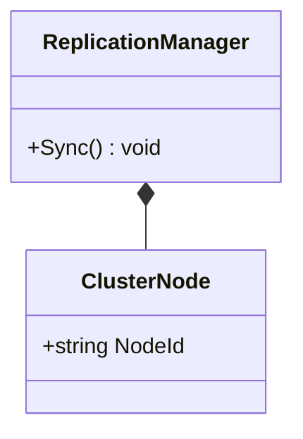

### 9. Monitoring

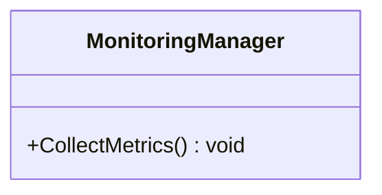

## Unit Tests Architecture

| Module                 | Classes | Test cases |
| ---------------------- | ------: | ---------: |
| Database Manager       |       7 |         51 |
| Database Objects       |      10 |        101 |
| Transaction Management |       3 |         29 |
| Storage Engine         |       4 |         51 |
| Recovery Management    |       3 |         29 |
| Query Processor        |       7 |         53 |
| Security Management    |       4 |         32 |
| Replication & Cluster  |       2 |         19 |
| Monitoring             |       1 |         10 |
| **Total**              |  **41** |    **375** |

---

## 1. Database Manager Unit Tests

### 1.1 `DatabaseServer` — 7 cases

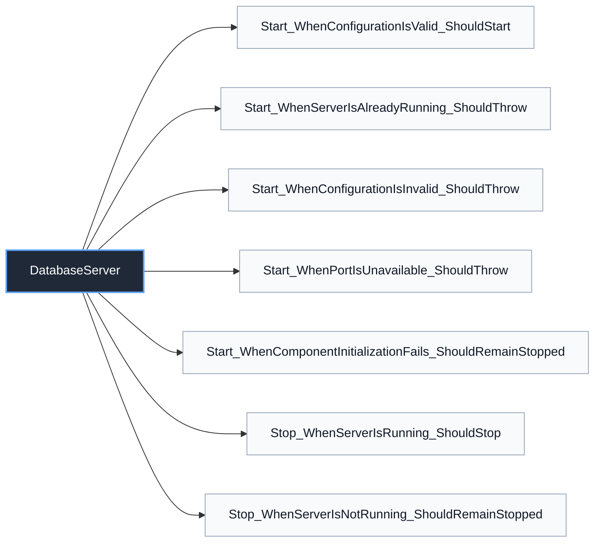

### 1.2 `DatabaseManager` — 10 cases

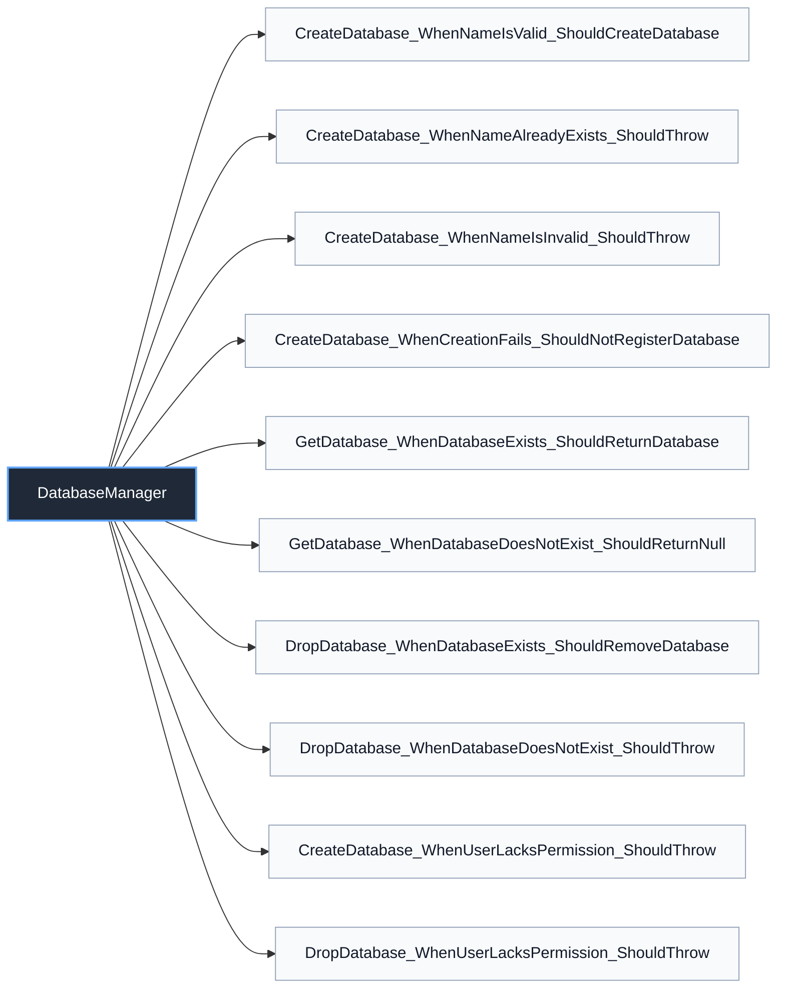

### 1.3 `Database` — 14 cases

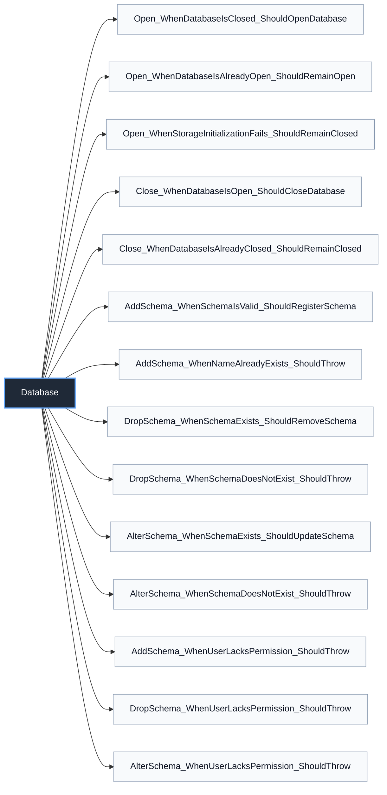

### 1.4 `CatalogManager` — 7 cases

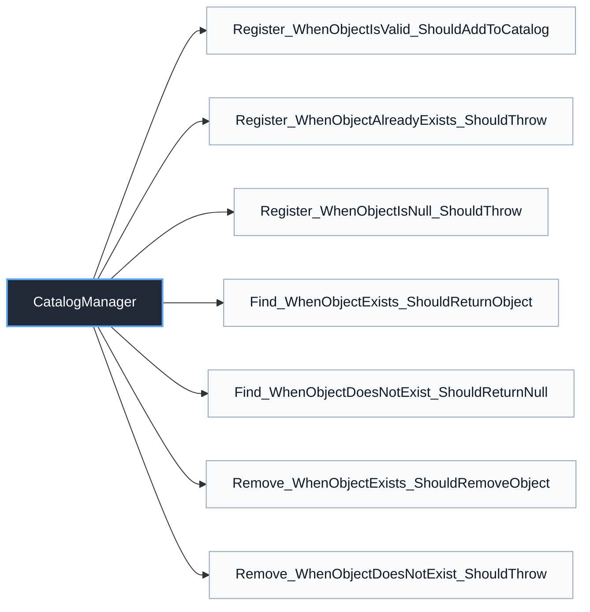

### 1.5 `StatisticsManager` — 5 cases

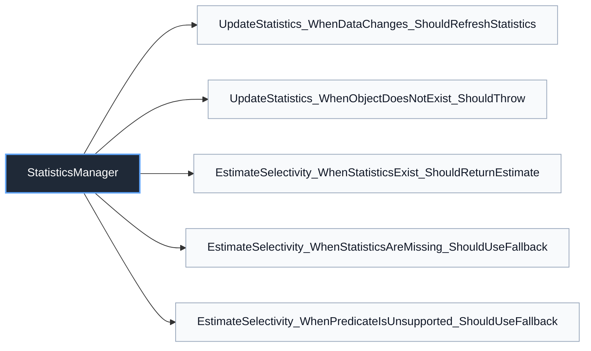

### 1.6 `DatabaseEventPublisher` — 3 cases

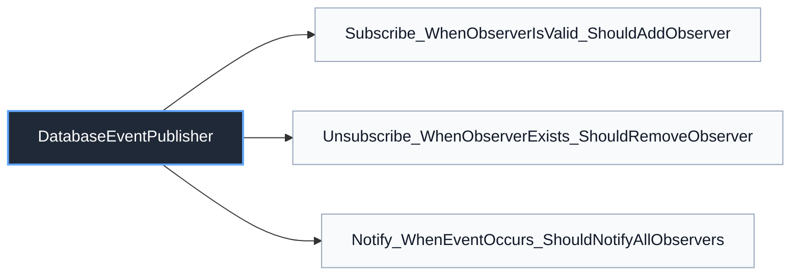

### 1.7 `DatabaseState` — 5 cases

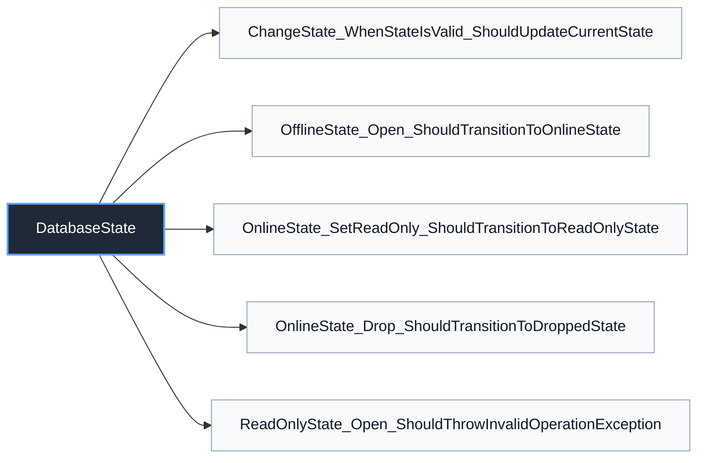

---

## 2. Database Objects Unit Tests

### 2.1 `Schema` — 15 cases

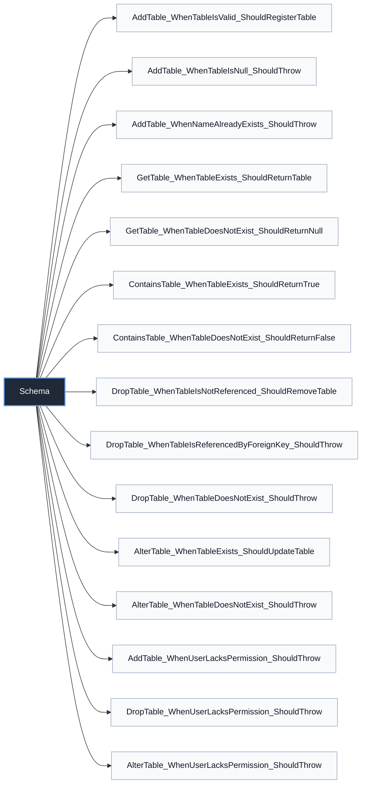

### 2.2 `Table` — 22 cases

```mermaid
flowchart LR
    Database_Objects_Table["Table"]

    Database_Objects_Table --> Database_Objects_Table_T1["AddColumn_WhenColumnIsValid_ShouldAddColumn"]
    Database_Objects_Table --> Database_Objects_Table_T2["AddColumn_WhenColumnIsNull_ShouldThrow"]
    Database_Objects_Table --> Database_Objects_Table_T3["AddColumn_WhenNameAlreadyExists_ShouldThrow"]
    Database_Objects_Table --> Database_Objects_Table_T4["InsertRow_WhenRowIsValid_ShouldInsertRow"]
    Database_Objects_Table --> Database_Objects_Table_T5["InsertRow_WhenRowIsNull_ShouldThrow"]
    Database_Objects_Table --> Database_Objects_Table_T6["InsertRow_WhenValueCountDoesNotMatch_ShouldThrow"]
    Database_Objects_Table --> Database_Objects_Table_T7["InsertRow_WhenValueTypeDoesNotMatch_ShouldThrow"]
    Database_Objects_Table --> Database_Objects_Table_T8["InsertRow_WhenNullValueIsAllowed_ShouldInsertRow"]
    Database_Objects_Table --> Database_Objects_Table_T9["InsertRow_WhenNullValueIsNotAllowed_ShouldThrow"]
    Database_Objects_Table --> Database_Objects_Table_T10["DeleteRow_WhenRowExists_ShouldRemoveRow"]
    Database_Objects_Table --> Database_Objects_Table_T11["DeleteRow_WhenRowDoesNotExist_ShouldReturnFalse"]
    Database_Objects_Table --> Database_Objects_Table_T12["DropColumn_WhenColumnExists_ShouldRemoveColumn"]
    Database_Objects_Table --> Database_Objects_Table_T13["DropColumn_WhenColumnDoesNotExist_ShouldThrow"]
    Database_Objects_Table --> Database_Objects_Table_T14["DropColumn_WhenColumnIsReferencedByConstraint_ShouldThrow"]
    Database_Objects_Table --> Database_Objects_Table_T15["DropColumn_WhenRowsExist_ShouldRemoveCorrespondingValues"]
    Database_Objects_Table --> Database_Objects_Table_T16["AlterColumn_WhenColumnExists_ShouldUpdateDefinition"]
    Database_Objects_Table --> Database_Objects_Table_T17["AlterColumn_WhenColumnDoesNotExist_ShouldThrow"]

    Database_Objects_Table --> Database_Objects_Table_T18["InsertRow_WhenUserLacksPermission_ShouldThrow"]
    Database_Objects_Table --> Database_Objects_Table_T19["DeleteRow_WhenUserLacksPermission_ShouldThrow"]
    Database_Objects_Table --> Database_Objects_Table_T20["AddColumn_WhenUserLacksPermission_ShouldThrow"]
    Database_Objects_Table --> Database_Objects_Table_T21["DropColumn_WhenUserLacksPermission_ShouldThrow"]
    Database_Objects_Table --> Database_Objects_Table_T22["AlterColumn_WhenUserLacksPermission_ShouldThrow"]

    classDef classNode fill:#1f2937,stroke:#60a5fa,color:#ffffff,stroke-width:2px
    classDef testNode fill:#f8fafc,stroke:#94a3b8,color:#111827
    class Database_Objects_Table classNode
    class Database_Objects_Table_T1,Database_Objects_Table_T2,Database_Objects_Table_T3,Database_Objects_Table_T4,Database_Objects_Table_T5,Database_Objects_Table_T6,Database_Objects_Table_T7,Database_Objects_Table_T8,Database_Objects_Table_T9,Database_Objects_Table_T10,Database_Objects_Table_T11,Database_Objects_Table_T12,Database_Objects_Table_T13,Database_Objects_Table_T14,Database_Objects_Table_T15,Database_Objects_Table_T16,Database_Objects_Table_T17,Database_Objects_Table_T18,Database_Objects_Table_T19,Database_Objects_Table_T20,Database_Objects_Table_T21,Database_Objects_Table_T22 testNode
```

### 2.3 `Column` — 7 cases

```mermaid
flowchart LR
    Database_Objects_Column["Column"]

    Database_Objects_Column --> Database_Objects_Column_T1["Create_WhenDefinitionIsValid_ShouldCreateColumn"]
    Database_Objects_Column --> Database_Objects_Column_T2["Create_WhenNameIsInvalid_ShouldThrow"]
    Database_Objects_Column --> Database_Objects_Column_T3["Create_WhenDataTypeIsNull_ShouldThrow"]
    Database_Objects_Column --> Database_Objects_Column_T4["ValidateValue_WhenTypeMatches_ShouldReturnTrue"]
    Database_Objects_Column --> Database_Objects_Column_T5["ValidateValue_WhenTypeDoesNotMatch_ShouldReturnFalse"]
    Database_Objects_Column --> Database_Objects_Column_T6["ValidateValue_WhenValueIsNullAndNullable_ShouldReturnTrue"]
    Database_Objects_Column --> Database_Objects_Column_T7["ValidateValue_WhenValueIsNullAndNotNullable_ShouldReturnFalse"]

    classDef classNode fill:#1f2937,stroke:#60a5fa,color:#ffffff,stroke-width:2px
    classDef testNode fill:#f8fafc,stroke:#94a3b8,color:#111827
    class Database_Objects_Column classNode
    class Database_Objects_Column_T1,Database_Objects_Column_T2,Database_Objects_Column_T3,Database_Objects_Column_T4,Database_Objects_Column_T5,Database_Objects_Column_T6,Database_Objects_Column_T7 testNode
```

### 2.4 `Row` — 8 cases

```mermaid
flowchart LR
    Database_Objects_Row["Row"]

    Database_Objects_Row --> Database_Objects_Row_T1["GetValue_WhenColumnExists_ShouldReturnValue"]
    Database_Objects_Row --> Database_Objects_Row_T2["GetValue_WhenColumnDoesNotExist_ShouldThrow"]
    Database_Objects_Row --> Database_Objects_Row_T3["SetValue_WhenValueIsValid_ShouldUpdateValue"]
    Database_Objects_Row --> Database_Objects_Row_T4["SetValue_WhenTypeDoesNotMatch_ShouldThrow"]
    Database_Objects_Row --> Database_Objects_Row_T5["SetValue_WhenColumnDoesNotExist_ShouldThrow"]
    Database_Objects_Row --> Database_Objects_Row_T6["SetValue_WhenNullIsAllowed_ShouldUpdateValue"]
    Database_Objects_Row --> Database_Objects_Row_T7["SetValue_WhenNullIsNotAllowed_ShouldThrow"]
    Database_Objects_Row --> Database_Objects_Row_T8["SetValue_WhenValidationFails_ShouldPreserveExistingValue"]

    classDef classNode fill:#1f2937,stroke:#60a5fa,color:#ffffff,stroke-width:2px
    classDef testNode fill:#f8fafc,stroke:#94a3b8,color:#111827
    class Database_Objects_Row classNode
    class Database_Objects_Row_T1,Database_Objects_Row_T2,Database_Objects_Row_T3,Database_Objects_Row_T4,Database_Objects_Row_T5,Database_Objects_Row_T6,Database_Objects_Row_T7,Database_Objects_Row_T8 testNode
```

### 2.5 `Constraint` — 6 cases

```mermaid
flowchart LR
    Database_Objects_Constraint["Constraint"]

    Database_Objects_Constraint --> Database_Objects_Constraint_T1["Validate_WhenValueSatisfiesConstraint_ShouldSucceed"]
    Database_Objects_Constraint --> Database_Objects_Constraint_T2["Validate_WhenValueViolatesConstraint_ShouldFail"]
    Database_Objects_Constraint --> Database_Objects_Constraint_T3["Apply_WhenConstraintIsDisabled_ShouldSkipValidation"]
    Database_Objects_Constraint --> Database_Objects_Constraint_T4["Enable_WhenConstraintIsDisabled_ShouldEnable"]
    Database_Objects_Constraint --> Database_Objects_Constraint_T5["Disable_WhenConstraintIsEnabled_ShouldDisable"]
    Database_Objects_Constraint --> Database_Objects_Constraint_T6["Apply_WhenValidationFails_ShouldNotMutateState"]

    classDef classNode fill:#1f2937,stroke:#60a5fa,color:#ffffff,stroke-width:2px
    classDef testNode fill:#f8fafc,stroke:#94a3b8,color:#111827
    class Database_Objects_Constraint classNode
    class Database_Objects_Constraint_T1,Database_Objects_Constraint_T2,Database_Objects_Constraint_T3,Database_Objects_Constraint_T4,Database_Objects_Constraint_T5,Database_Objects_Constraint_T6 testNode
```

### 2.6 `ForeignKey` — 8 cases

```mermaid
flowchart LR
    Database_Objects_ForeignKey["ForeignKey"]

    Database_Objects_ForeignKey --> Database_Objects_ForeignKey_T1["Validate_WhenParentRecordExists_ShouldSucceed"]
    Database_Objects_ForeignKey --> Database_Objects_ForeignKey_T2["Validate_WhenParentRecordDoesNotExist_ShouldFail"]
    Database_Objects_ForeignKey --> Database_Objects_ForeignKey_T3["Validate_WhenValueIsNullAndNullable_ShouldSucceed"]
    Database_Objects_ForeignKey --> Database_Objects_ForeignKey_T4["DeleteParent_WhenRestricted_ShouldRejectDeletion"]
    Database_Objects_ForeignKey --> Database_Objects_ForeignKey_T5["DeleteParent_WhenCascadeIsEnabled_ShouldDeleteChildren"]
    Database_Objects_ForeignKey --> Database_Objects_ForeignKey_T6["DeleteParent_WhenSetNullIsEnabled_ShouldClearChildReference"]
    Database_Objects_ForeignKey --> Database_Objects_ForeignKey_T7["UpdateParent_WhenRestricted_ShouldRejectUpdate"]
    Database_Objects_ForeignKey --> Database_Objects_ForeignKey_T8["UpdateParent_WhenCascadeIsEnabled_ShouldUpdateChildren"]

    classDef classNode fill:#1f2937,stroke:#60a5fa,color:#ffffff,stroke-width:2px
    classDef testNode fill:#f8fafc,stroke:#94a3b8,color:#111827
    class Database_Objects_ForeignKey classNode
    class Database_Objects_ForeignKey_T1,Database_Objects_ForeignKey_T2,Database_Objects_ForeignKey_T3,Database_Objects_ForeignKey_T4,Database_Objects_ForeignKey_T5,Database_Objects_ForeignKey_T6,Database_Objects_ForeignKey_T7,Database_Objects_ForeignKey_T8 testNode
```

### 2.7 `Index` — 10 cases

```mermaid
flowchart LR
    Database_Objects_Index["Index"]

    Database_Objects_Index --> Database_Objects_Index_T1["Insert_WhenKeyIsValid_ShouldAddEntry"]
    Database_Objects_Index --> Database_Objects_Index_T2["Insert_WhenUniqueKeyAlreadyExists_ShouldThrow"]
    Database_Objects_Index --> Database_Objects_Index_T3["Insert_WhenIndexIsNonUnique_ShouldAllowDuplicateKeys"]
    Database_Objects_Index --> Database_Objects_Index_T4["Search_WhenKeyExists_ShouldReturnRecordPointer"]
    Database_Objects_Index --> Database_Objects_Index_T5["Search_WhenKeyDoesNotExist_ShouldReturnNull"]
    Database_Objects_Index --> Database_Objects_Index_T6["Delete_WhenKeyExists_ShouldRemoveEntry"]
    Database_Objects_Index --> Database_Objects_Index_T7["Delete_WhenKeyDoesNotExist_ShouldReturnFalse"]
    Database_Objects_Index --> Database_Objects_Index_T8["Update_WhenKeyExists_ShouldReplaceRecordPointer"]
    Database_Objects_Index --> Database_Objects_Index_T9["Insert_WhenKeyIsNullAndNullsAreNotAllowed_ShouldThrow"]
    Database_Objects_Index --> Database_Objects_Index_T10["RangeSearch_WhenKeysMatch_ShouldReturnOrderedEntries"]

    classDef classNode fill:#1f2937,stroke:#60a5fa,color:#ffffff,stroke-width:2px
    classDef testNode fill:#f8fafc,stroke:#94a3b8,color:#111827
    class Database_Objects_Index classNode
    class Database_Objects_Index_T1,Database_Objects_Index_T2,Database_Objects_Index_T3,Database_Objects_Index_T4,Database_Objects_Index_T5,Database_Objects_Index_T6,Database_Objects_Index_T7,Database_Objects_Index_T8,Database_Objects_Index_T9,Database_Objects_Index_T10 testNode
```

### 2.8 `Partition` — 7 cases

```mermaid
flowchart LR
    Database_Objects_Partition["Partition"]

    Database_Objects_Partition --> Database_Objects_Partition_T1["RouteRow_WhenKeyMatchesRange_ShouldReturnPartition"]
    Database_Objects_Partition --> Database_Objects_Partition_T2["RouteRow_WhenKeyIsOutsideRange_ShouldFail"]
    Database_Objects_Partition --> Database_Objects_Partition_T3["RouteRow_WhenKeyIsOnBoundary_ShouldUseConfiguredBoundary"]
    Database_Objects_Partition --> Database_Objects_Partition_T4["AddRange_WhenRangeIsValid_ShouldAddRange"]
    Database_Objects_Partition --> Database_Objects_Partition_T5["AddRange_WhenRangesOverlap_ShouldThrow"]
    Database_Objects_Partition --> Database_Objects_Partition_T6["RemoveRange_WhenRangeExists_ShouldRemoveRange"]
    Database_Objects_Partition --> Database_Objects_Partition_T7["RemoveRange_WhenRangeDoesNotExist_ShouldThrow"]

    classDef classNode fill:#1f2937,stroke:#60a5fa,color:#ffffff,stroke-width:2px
    classDef testNode fill:#f8fafc,stroke:#94a3b8,color:#111827
    class Database_Objects_Partition classNode
    class Database_Objects_Partition_T1,Database_Objects_Partition_T2,Database_Objects_Partition_T3,Database_Objects_Partition_T4,Database_Objects_Partition_T5,Database_Objects_Partition_T6,Database_Objects_Partition_T7 testNode
```

### 2.9 `View` — 9 cases

```mermaid
flowchart LR
    Database_Objects_View["View"]

    Database_Objects_View --> Database_Objects_View_T1["Create_WhenQueryIsValid_ShouldCreateView"]
    Database_Objects_View --> Database_Objects_View_T2["Create_WhenQueryIsInvalid_ShouldThrow"]
    Database_Objects_View --> Database_Objects_View_T3["Resolve_WhenDependenciesExist_ShouldReturnDefinition"]
    Database_Objects_View --> Database_Objects_View_T4["Resolve_WhenDependencyIsMissing_ShouldThrow"]
    Database_Objects_View --> Database_Objects_View_T5["AlterView_WhenQueryIsValid_ShouldUpdateDefinition"]
    Database_Objects_View --> Database_Objects_View_T6["AlterView_WhenQueryIsInvalid_ShouldThrow"]
    Database_Objects_View --> Database_Objects_View_T7["DropView_WhenViewExists_ShouldRemoveView"]
    Database_Objects_View --> Database_Objects_View_T8["DropView_WhenViewDoesNotExist_ShouldThrow"]
    Database_Objects_View --> Database_Objects_View_T9["DropView_WhenViewIsReferenced_ShouldThrow"]

    classDef classNode fill:#1f2937,stroke:#60a5fa,color:#ffffff,stroke-width:2px
    classDef testNode fill:#f8fafc,stroke:#94a3b8,color:#111827
    class Database_Objects_View classNode
    class Database_Objects_View_T1,Database_Objects_View_T2,Database_Objects_View_T3,Database_Objects_View_T4,Database_Objects_View_T5,Database_Objects_View_T6,Database_Objects_View_T7,Database_Objects_View_T8,Database_Objects_View_T9 testNode
```

### 2.10 `StoredProcedure` — 9 cases

```mermaid
flowchart LR
    Database_Objects_StoredProcedure["StoredProcedure"]

    Database_Objects_StoredProcedure --> Database_Objects_StoredProcedure_T1["Execute_WhenParametersAreValid_ShouldReturnResult"]
    Database_Objects_StoredProcedure --> Database_Objects_StoredProcedure_T2["Execute_WhenRequiredParameterIsMissing_ShouldThrow"]
    Database_Objects_StoredProcedure --> Database_Objects_StoredProcedure_T3["Execute_WhenParameterTypeDoesNotMatch_ShouldThrow"]
    Database_Objects_StoredProcedure --> Database_Objects_StoredProcedure_T4["Execute_WhenTransactionFails_ShouldPropagateFailure"]
    Database_Objects_StoredProcedure --> Database_Objects_StoredProcedure_T5["Execute_WhenProcedureIsDisabled_ShouldRejectExecution"]
    Database_Objects_StoredProcedure --> Database_Objects_StoredProcedure_T6["AlterProcedure_WhenBodyIsValid_ShouldUpdateProcedure"]
    Database_Objects_StoredProcedure --> Database_Objects_StoredProcedure_T7["AlterProcedure_WhenBodyIsInvalid_ShouldThrow"]
    Database_Objects_StoredProcedure --> Database_Objects_StoredProcedure_T8["DropProcedure_WhenProcedureExists_ShouldRemoveProcedure"]
    Database_Objects_StoredProcedure --> Database_Objects_StoredProcedure_T9["DropProcedure_WhenProcedureDoesNotExist_ShouldThrow"]

    classDef classNode fill:#1f2937,stroke:#60a5fa,color:#ffffff,stroke-width:2px
    classDef testNode fill:#f8fafc,stroke:#94a3b8,color:#111827
    class Database_Objects_StoredProcedure classNode
    class Database_Objects_StoredProcedure_T1,Database_Objects_StoredProcedure_T2,Database_Objects_StoredProcedure_T3,Database_Objects_StoredProcedure_T4,Database_Objects_StoredProcedure_T5,Database_Objects_StoredProcedure_T6,Database_Objects_StoredProcedure_T7,Database_Objects_StoredProcedure_T8,Database_Objects_StoredProcedure_T9 testNode
```

---

## 3. Transaction Management Unit Tests

### 3.1 `Transaction` — 8 cases

```mermaid
flowchart LR
    Transaction_Management_Transaction["Transaction"]

    Transaction_Management_Transaction --> Transaction_Management_Transaction_T1["Begin_WhenTransactionIsNew_ShouldBecomeActive"]
    Transaction_Management_Transaction --> Transaction_Management_Transaction_T2["Begin_WhenTransactionIsAlreadyActive_ShouldThrow"]
    Transaction_Management_Transaction --> Transaction_Management_Transaction_T3["Commit_WhenTransactionIsActive_ShouldCommit"]
    Transaction_Management_Transaction --> Transaction_Management_Transaction_T4["Commit_WhenTransactionIsNotActive_ShouldThrow"]
    Transaction_Management_Transaction --> Transaction_Management_Transaction_T5["Rollback_WhenTransactionIsActive_ShouldRollback"]
    Transaction_Management_Transaction --> Transaction_Management_Transaction_T6["Rollback_WhenTransactionAlreadyCommitted_ShouldThrow"]
    Transaction_Management_Transaction --> Transaction_Management_Transaction_T7["Rollback_WhenTransactionAlreadyRolledBack_ShouldRemainRolledBack"]
    Transaction_Management_Transaction --> Transaction_Management_Transaction_T8["MarkFailed_WhenTransactionIsActive_ShouldEnterFailedState"]

    classDef classNode fill:#1f2937,stroke:#60a5fa,color:#ffffff,stroke-width:2px
    classDef testNode fill:#f8fafc,stroke:#94a3b8,color:#111827
    class Transaction_Management_Transaction classNode
    class Transaction_Management_Transaction_T1,Transaction_Management_Transaction_T2,Transaction_Management_Transaction_T3,Transaction_Management_Transaction_T4,Transaction_Management_Transaction_T5,Transaction_Management_Transaction_T6,Transaction_Management_Transaction_T7,Transaction_Management_Transaction_T8 testNode
```

### 3.2 `TransactionManager` — 9 cases

```mermaid
flowchart LR
    Transaction_Management_TransactionManager["TransactionManager"]

    Transaction_Management_TransactionManager --> Transaction_Management_TransactionManager_T1["BeginTransaction_ShouldReturnActiveTransaction"]
    Transaction_Management_TransactionManager --> Transaction_Management_TransactionManager_T2["BeginTransaction_ShouldAssignUniqueTransactionId"]
    Transaction_Management_TransactionManager --> Transaction_Management_TransactionManager_T3["GetTransaction_WhenTransactionExists_ShouldReturnTransaction"]
    Transaction_Management_TransactionManager --> Transaction_Management_TransactionManager_T4["GetTransaction_WhenTransactionDoesNotExist_ShouldReturnNull"]
    Transaction_Management_TransactionManager --> Transaction_Management_TransactionManager_T5["Commit_WhenTransactionExists_ShouldCommitTransaction"]
    Transaction_Management_TransactionManager --> Transaction_Management_TransactionManager_T6["Commit_WhenTransactionDoesNotExist_ShouldThrow"]
    Transaction_Management_TransactionManager --> Transaction_Management_TransactionManager_T7["Rollback_WhenTransactionExists_ShouldAbortTransaction"]
    Transaction_Management_TransactionManager --> Transaction_Management_TransactionManager_T8["Rollback_WhenTransactionDoesNotExist_ShouldThrow"]
    Transaction_Management_TransactionManager --> Transaction_Management_TransactionManager_T9["Complete_WhenTransactionFinishes_ShouldRemoveFromActiveTransactions"]

    classDef classNode fill:#1f2937,stroke:#60a5fa,color:#ffffff,stroke-width:2px
    classDef testNode fill:#f8fafc,stroke:#94a3b8,color:#111827
    class Transaction_Management_TransactionManager classNode
    class Transaction_Management_TransactionManager_T1,Transaction_Management_TransactionManager_T2,Transaction_Management_TransactionManager_T3,Transaction_Management_TransactionManager_T4,Transaction_Management_TransactionManager_T5,Transaction_Management_TransactionManager_T6,Transaction_Management_TransactionManager_T7,Transaction_Management_TransactionManager_T8,Transaction_Management_TransactionManager_T9 testNode
```

### 3.3 `LockManager` — 12 cases

```mermaid
flowchart LR
    Transaction_Management_LockManager["LockManager"]

    Transaction_Management_LockManager --> Transaction_Management_LockManager_T1["Acquire_WhenLocksAreCompatible_ShouldGrantLock"]
    Transaction_Management_LockManager --> Transaction_Management_LockManager_T2["Acquire_WhenSharedLockAlreadyExists_ShouldGrantSharedLock"]
    Transaction_Management_LockManager --> Transaction_Management_LockManager_T3["Acquire_WhenLocksConflict_ShouldRejectOrWait"]
    Transaction_Management_LockManager --> Transaction_Management_LockManager_T4["Acquire_WhenExclusiveLockExists_ShouldRejectOtherTransactions"]
    Transaction_Management_LockManager --> Transaction_Management_LockManager_T5["Acquire_WhenTransactionAlreadyOwnsLock_ShouldReuseLock"]
    Transaction_Management_LockManager --> Transaction_Management_LockManager_T6["Upgrade_WhenTransactionIsSoleReader_ShouldGrantExclusiveLock"]
    Transaction_Management_LockManager --> Transaction_Management_LockManager_T7["Upgrade_WhenOtherReadersExist_ShouldRejectOrWait"]
    Transaction_Management_LockManager --> Transaction_Management_LockManager_T8["Release_WhenLockExists_ShouldRemoveLock"]
    Transaction_Management_LockManager --> Transaction_Management_LockManager_T9["Release_WhenLockDoesNotExist_ShouldThrow"]
    Transaction_Management_LockManager --> Transaction_Management_LockManager_T10["ReleaseAll_WhenTransactionHasLocks_ShouldRemoveAllLocks"]
    Transaction_Management_LockManager --> Transaction_Management_LockManager_T11["DetectDeadlock_WhenCycleExists_ShouldAbortVictimTransaction"]
    Transaction_Management_LockManager --> Transaction_Management_LockManager_T12["DetectDeadlock_WhenNoCycleExists_ShouldNotAbortTransaction"]

    classDef classNode fill:#1f2937,stroke:#60a5fa,color:#ffffff,stroke-width:2px
    classDef testNode fill:#f8fafc,stroke:#94a3b8,color:#111827
    class Transaction_Management_LockManager classNode
    class Transaction_Management_LockManager_T1,Transaction_Management_LockManager_T2,Transaction_Management_LockManager_T3,Transaction_Management_LockManager_T4,Transaction_Management_LockManager_T5,Transaction_Management_LockManager_T6,Transaction_Management_LockManager_T7,Transaction_Management_LockManager_T8,Transaction_Management_LockManager_T9,Transaction_Management_LockManager_T10,Transaction_Management_LockManager_T11,Transaction_Management_LockManager_T12 testNode
```

---

## 4. Storage Engine Unit Tests

### 4.1 `BufferPool` — 16 cases

```mermaid
flowchart LR
    Storage_Engine_BufferPool["BufferPool"]

    Storage_Engine_BufferPool --> Storage_Engine_BufferPool_T1["FetchPage_WhenPageIsBuffered_ShouldReturnExistingFrame"]
    Storage_Engine_BufferPool --> Storage_Engine_BufferPool_T2["FetchPage_WhenPageIsBuffered_ShouldIncrementPinCount"]
    Storage_Engine_BufferPool --> Storage_Engine_BufferPool_T3["FetchPage_WhenPageIsBuffered_ShouldNotReadFromFile"]
    Storage_Engine_BufferPool --> Storage_Engine_BufferPool_T4["FetchPage_WhenSpaceIsAvailable_ShouldLoadPage"]
    Storage_Engine_BufferPool --> Storage_Engine_BufferPool_T5["FetchPage_WhenNoFreeFrameAndCleanVictimExists_ShouldEvictVictim"]
    Storage_Engine_BufferPool --> Storage_Engine_BufferPool_T6["FetchPage_WhenNoFreeFrameAndDirtyVictimExists_ShouldFlushThenEvictVictim"]
    Storage_Engine_BufferPool --> Storage_Engine_BufferPool_T7["FetchPage_WhenAllFramesArePinned_ShouldThrow"]
    Storage_Engine_BufferPool --> Storage_Engine_BufferPool_T8["FetchPage_WhenFileReadFails_ShouldNotRegisterPage"]
    Storage_Engine_BufferPool --> Storage_Engine_BufferPool_T9["Flush_WhenPageIsDirty_ShouldWriteToDisk"]
    Storage_Engine_BufferPool --> Storage_Engine_BufferPool_T10["Flush_WhenPageIsClean_ShouldNotWriteToDisk"]
    Storage_Engine_BufferPool --> Storage_Engine_BufferPool_T11["Flush_WhenPageIsNotBuffered_ShouldThrow"]
    Storage_Engine_BufferPool --> Storage_Engine_BufferPool_T12["Unpin_WhenPageIsPinned_ShouldDecreasePinCount"]
    Storage_Engine_BufferPool --> Storage_Engine_BufferPool_T13["Unpin_WhenPinCountIsZero_ShouldThrow"]
    Storage_Engine_BufferPool --> Storage_Engine_BufferPool_T14["Unpin_WhenMarkedDirty_ShouldSetDirtyFlag"]
    Storage_Engine_BufferPool --> Storage_Engine_BufferPool_T15["Evict_WhenFrameIsUnpinned_ShouldFreeSpace"]
    Storage_Engine_BufferPool --> Storage_Engine_BufferPool_T16["Evict_WhenFrameIsPinned_ShouldThrow"]

    classDef classNode fill:#1f2937,stroke:#60a5fa,color:#ffffff,stroke-width:2px
    classDef testNode fill:#f8fafc,stroke:#94a3b8,color:#111827
    class Storage_Engine_BufferPool classNode
    class Storage_Engine_BufferPool_T1,Storage_Engine_BufferPool_T2,Storage_Engine_BufferPool_T3,Storage_Engine_BufferPool_T4,Storage_Engine_BufferPool_T5,Storage_Engine_BufferPool_T6,Storage_Engine_BufferPool_T7,Storage_Engine_BufferPool_T8,Storage_Engine_BufferPool_T9,Storage_Engine_BufferPool_T10,Storage_Engine_BufferPool_T11,Storage_Engine_BufferPool_T12,Storage_Engine_BufferPool_T13,Storage_Engine_BufferPool_T14,Storage_Engine_BufferPool_T15,Storage_Engine_BufferPool_T16 testNode
```

### 4.2 `Page` — 12 cases

```mermaid
flowchart LR
    Storage_Engine_Page["Page"]

    Storage_Engine_Page --> Storage_Engine_Page_T1["InsertRecord_WhenSpaceIsAvailable_ShouldInsertRecord"]
    Storage_Engine_Page --> Storage_Engine_Page_T2["InsertRecord_WhenSpaceIsInsufficient_ShouldFail"]
    Storage_Engine_Page --> Storage_Engine_Page_T3["InsertRecord_WhenRecordExceedsPageCapacity_ShouldFail"]
    Storage_Engine_Page --> Storage_Engine_Page_T4["GetRecord_WhenSlotExists_ShouldReturnRecord"]
    Storage_Engine_Page --> Storage_Engine_Page_T5["GetRecord_WhenSlotDoesNotExist_ShouldThrow"]
    Storage_Engine_Page --> Storage_Engine_Page_T6["UpdateRecord_WhenSpaceIsSufficient_ShouldModifyRecord"]
    Storage_Engine_Page --> Storage_Engine_Page_T7["UpdateRecord_WhenSpaceIsInsufficient_ShouldPreserveOriginalRecord"]
    Storage_Engine_Page --> Storage_Engine_Page_T8["DeleteRecord_WhenRecordExists_ShouldUpdateSlotDirectory"]
    Storage_Engine_Page --> Storage_Engine_Page_T9["DeleteRecord_WhenRecordDoesNotExist_ShouldReturnFalse"]
    Storage_Engine_Page --> Storage_Engine_Page_T10["DeleteRecord_WhenRecordIsAlreadyDeleted_ShouldReturnFalse"]
    Storage_Engine_Page --> Storage_Engine_Page_T11["Compact_WhenDeletedRecordsExist_ShouldReclaimSpace"]
    Storage_Engine_Page --> Storage_Engine_Page_T12["InsertRecord_WhenDeletedSlotExists_ShouldReuseSlot"]

    classDef classNode fill:#1f2937,stroke:#60a5fa,color:#ffffff,stroke-width:2px
    classDef testNode fill:#f8fafc,stroke:#94a3b8,color:#111827
    class Storage_Engine_Page classNode
    class Storage_Engine_Page_T1,Storage_Engine_Page_T2,Storage_Engine_Page_T3,Storage_Engine_Page_T4,Storage_Engine_Page_T5,Storage_Engine_Page_T6,Storage_Engine_Page_T7,Storage_Engine_Page_T8,Storage_Engine_Page_T9,Storage_Engine_Page_T10,Storage_Engine_Page_T11,Storage_Engine_Page_T12 testNode
```

### 4.3 `StorageEngine` — 8 cases

```mermaid
flowchart LR
    Storage_Engine_StorageEngine["StorageEngine"]

    Storage_Engine_StorageEngine --> Storage_Engine_StorageEngine_T1["Initialize_WhenConfigurationIsValid_ShouldInitializeComponents"]
    Storage_Engine_StorageEngine --> Storage_Engine_StorageEngine_T2["Initialize_WhenConfigurationIsInvalid_ShouldThrow"]
    Storage_Engine_StorageEngine --> Storage_Engine_StorageEngine_T3["Initialize_WhenComponentFails_ShouldCleanUpInitializedComponents"]
    Storage_Engine_StorageEngine --> Storage_Engine_StorageEngine_T4["ReadPage_ShouldDelegateToBufferPool"]
    Storage_Engine_StorageEngine --> Storage_Engine_StorageEngine_T5["WritePage_ShouldMarkPageAsDirty"]
    Storage_Engine_StorageEngine --> Storage_Engine_StorageEngine_T6["Shutdown_ShouldFlushDirtyPagesAndCloseFiles"]
    Storage_Engine_StorageEngine --> Storage_Engine_StorageEngine_T7["Shutdown_WhenEngineIsNotInitialized_ShouldRemainStopped"]
    Storage_Engine_StorageEngine --> Storage_Engine_StorageEngine_T8["Shutdown_WhenFlushFails_ShouldPropagateFailure"]

    classDef classNode fill:#1f2937,stroke:#60a5fa,color:#ffffff,stroke-width:2px
    classDef testNode fill:#f8fafc,stroke:#94a3b8,color:#111827
    class Storage_Engine_StorageEngine classNode
    class Storage_Engine_StorageEngine_T1,Storage_Engine_StorageEngine_T2,Storage_Engine_StorageEngine_T3,Storage_Engine_StorageEngine_T4,Storage_Engine_StorageEngine_T5,Storage_Engine_StorageEngine_T6,Storage_Engine_StorageEngine_T7,Storage_Engine_StorageEngine_T8 testNode
```

### 4.4 `FileManager` — 15 cases

```mermaid
flowchart LR
    Storage_Engine_FileManager["FileManager"]

    Storage_Engine_FileManager --> Storage_Engine_FileManager_T1["CreateFile_WhenPathIsValid_ShouldCreateFile"]
    Storage_Engine_FileManager --> Storage_Engine_FileManager_T2["CreateFile_WhenFileAlreadyExists_ShouldThrow"]
    Storage_Engine_FileManager --> Storage_Engine_FileManager_T3["CreateFile_WhenPathIsInvalid_ShouldThrow"]
    Storage_Engine_FileManager --> Storage_Engine_FileManager_T4["CreateFile_WhenPhysicalCreationFails_ShouldNotRegisterFile"]
    Storage_Engine_FileManager --> Storage_Engine_FileManager_T5["OpenFile_WhenFileExists_ShouldReturnHandle"]
    Storage_Engine_FileManager --> Storage_Engine_FileManager_T6["OpenFile_WhenFileDoesNotExist_ShouldThrow"]
    Storage_Engine_FileManager --> Storage_Engine_FileManager_T7["OpenFile_WhenAccessModeConflicts_ShouldThrow"]
    Storage_Engine_FileManager --> Storage_Engine_FileManager_T8["ReadPage_WhenFileIsOpen_ShouldReturnData"]
    Storage_Engine_FileManager --> Storage_Engine_FileManager_T9["ReadPage_WhenFileIsClosed_ShouldThrow"]
    Storage_Engine_FileManager --> Storage_Engine_FileManager_T10["WritePage_WhenFileIsReadWrite_ShouldWriteData"]
    Storage_Engine_FileManager --> Storage_Engine_FileManager_T11["WritePage_WhenFileIsReadOnly_ShouldThrow"]
    Storage_Engine_FileManager --> Storage_Engine_FileManager_T12["CloseFile_WhenFileIsOpen_ShouldCloseHandle"]
    Storage_Engine_FileManager --> Storage_Engine_FileManager_T13["CloseFile_WhenFileIsAlreadyClosed_ShouldRemainClosed"]
    Storage_Engine_FileManager --> Storage_Engine_FileManager_T14["DeleteFile_WhenFileIsNotOpen_ShouldDeleteFile"]
    Storage_Engine_FileManager --> Storage_Engine_FileManager_T15["DeleteFile_WhenFileIsInUse_ShouldThrow"]

    classDef classNode fill:#1f2937,stroke:#60a5fa,color:#ffffff,stroke-width:2px
    classDef testNode fill:#f8fafc,stroke:#94a3b8,color:#111827
    class Storage_Engine_FileManager classNode
    class Storage_Engine_FileManager_T1,Storage_Engine_FileManager_T2,Storage_Engine_FileManager_T3,Storage_Engine_FileManager_T4,Storage_Engine_FileManager_T5,Storage_Engine_FileManager_T6,Storage_Engine_FileManager_T7,Storage_Engine_FileManager_T8,Storage_Engine_FileManager_T9,Storage_Engine_FileManager_T10,Storage_Engine_FileManager_T11,Storage_Engine_FileManager_T12,Storage_Engine_FileManager_T13,Storage_Engine_FileManager_T14,Storage_Engine_FileManager_T15 testNode
```

---

## 5. Recovery Management Unit Tests

### 5.1 `WALManager` — 10 cases

```mermaid
flowchart LR
    Recovery_Management_WALManager["WALManager"]

    Recovery_Management_WALManager --> Recovery_Management_WALManager_T1["Append_WhenRecordIsValid_ShouldAssignLSN"]
    Recovery_Management_WALManager --> Recovery_Management_WALManager_T2["Append_WhenSequenceIsInvalid_ShouldThrow"]
    Recovery_Management_WALManager --> Recovery_Management_WALManager_T3["Append_WhenWriteFails_ShouldNotAdvanceDurableLSN"]
    Recovery_Management_WALManager --> Recovery_Management_WALManager_T4["Flush_WhenTargetLSNExists_ShouldPersistRecords"]
    Recovery_Management_WALManager --> Recovery_Management_WALManager_T5["Flush_WhenTargetLSNIsAlreadyDurable_ShouldDoNothing"]
    Recovery_Management_WALManager --> Recovery_Management_WALManager_T6["Flush_WhenTargetLSNDoesNotExist_ShouldThrow"]
    Recovery_Management_WALManager --> Recovery_Management_WALManager_T7["GetRecord_WhenLSNExists_ShouldReturnRecord"]
    Recovery_Management_WALManager --> Recovery_Management_WALManager_T8["GetRecord_WhenLSNDoesNotExist_ShouldReturnNull"]
    Recovery_Management_WALManager --> Recovery_Management_WALManager_T9["Truncate_WhenRecordsAreObsolete_ShouldFreeSpace"]
    Recovery_Management_WALManager --> Recovery_Management_WALManager_T10["Truncate_WhenRecordsAreStillRequired_ShouldPreserveRecords"]

    classDef classNode fill:#1f2937,stroke:#60a5fa,color:#ffffff,stroke-width:2px
    classDef testNode fill:#f8fafc,stroke:#94a3b8,color:#111827
    class Recovery_Management_WALManager classNode
    class Recovery_Management_WALManager_T1,Recovery_Management_WALManager_T2,Recovery_Management_WALManager_T3,Recovery_Management_WALManager_T4,Recovery_Management_WALManager_T5,Recovery_Management_WALManager_T6,Recovery_Management_WALManager_T7,Recovery_Management_WALManager_T8,Recovery_Management_WALManager_T9,Recovery_Management_WALManager_T10 testNode
```

### 5.2 `RecoveryManager` — 9 cases

```mermaid
flowchart LR
    Recovery_Management_RecoveryManager["RecoveryManager"]

    Recovery_Management_RecoveryManager --> Recovery_Management_RecoveryManager_T1["Recover_ShouldRedoCommittedTransactions"]
    Recovery_Management_RecoveryManager --> Recovery_Management_RecoveryManager_T2["Recover_ShouldUndoUncommittedTransactions"]
    Recovery_Management_RecoveryManager --> Recovery_Management_RecoveryManager_T3["Recover_WhenCheckpointExists_ShouldStartFromCheckpoint"]
    Recovery_Management_RecoveryManager --> Recovery_Management_RecoveryManager_T4["Recover_WhenLogIsEmpty_ShouldCompleteWithoutChanges"]
    Recovery_Management_RecoveryManager --> Recovery_Management_RecoveryManager_T5["Recover_WhenLogRecordIsCorrupted_ShouldThrow"]
    Recovery_Management_RecoveryManager --> Recovery_Management_RecoveryManager_T6["Recover_WhenRedoIsRepeated_ShouldRemainIdempotent"]
    Recovery_Management_RecoveryManager --> Recovery_Management_RecoveryManager_T7["CreateCheckpoint_ShouldFlushWALBeforeBufferPool"]
    Recovery_Management_RecoveryManager --> Recovery_Management_RecoveryManager_T8["CreateCheckpoint_WhenWALFlushFails_ShouldNotFlushBufferPool"]
    Recovery_Management_RecoveryManager --> Recovery_Management_RecoveryManager_T9["CreateCheckpoint_WhenBufferFlushFails_ShouldPropagateFailure"]

    classDef classNode fill:#1f2937,stroke:#60a5fa,color:#ffffff,stroke-width:2px
    classDef testNode fill:#f8fafc,stroke:#94a3b8,color:#111827
    class Recovery_Management_RecoveryManager classNode
    class Recovery_Management_RecoveryManager_T1,Recovery_Management_RecoveryManager_T2,Recovery_Management_RecoveryManager_T3,Recovery_Management_RecoveryManager_T4,Recovery_Management_RecoveryManager_T5,Recovery_Management_RecoveryManager_T6,Recovery_Management_RecoveryManager_T7,Recovery_Management_RecoveryManager_T8,Recovery_Management_RecoveryManager_T9 testNode
```

### 5.3 `BackupManager` — 10 cases

```mermaid
flowchart LR
    Recovery_Management_BackupManager["BackupManager"]

    Recovery_Management_BackupManager --> Recovery_Management_BackupManager_T1["CreateBackup_WhenDatabaseIsOnline_ShouldCreateBackup"]
    Recovery_Management_BackupManager --> Recovery_Management_BackupManager_T2["CreateBackup_WhenDatabaseIsOffline_ShouldRejectBackup"]
    Recovery_Management_BackupManager --> Recovery_Management_BackupManager_T3["CreateBackup_WhenDestinationAlreadyExists_ShouldThrow"]
    Recovery_Management_BackupManager --> Recovery_Management_BackupManager_T4["CreateBackup_WhenWriteFails_ShouldCleanPartialBackup"]
    Recovery_Management_BackupManager --> Recovery_Management_BackupManager_T5["Restore_WhenBackupIsValid_ShouldRestoreDatabase"]
    Recovery_Management_BackupManager --> Recovery_Management_BackupManager_T6["Restore_WhenBackupIsCorrupt_ShouldFail"]
    Recovery_Management_BackupManager --> Recovery_Management_BackupManager_T7["Restore_WhenBackupDoesNotExist_ShouldThrow"]
    Recovery_Management_BackupManager --> Recovery_Management_BackupManager_T8["Restore_WhenFormatVersionIsUnsupported_ShouldThrow"]
    Recovery_Management_BackupManager --> Recovery_Management_BackupManager_T9["Restore_WhenWriteFails_ShouldPreserveExistingDatabase"]
    Recovery_Management_BackupManager --> Recovery_Management_BackupManager_T10["ValidateBackup_WhenBackupIsValid_ShouldReturnTrue"]

    classDef classNode fill:#1f2937,stroke:#60a5fa,color:#ffffff,stroke-width:2px
    classDef testNode fill:#f8fafc,stroke:#94a3b8,color:#111827
    class Recovery_Management_BackupManager classNode
    class Recovery_Management_BackupManager_T1,Recovery_Management_BackupManager_T2,Recovery_Management_BackupManager_T3,Recovery_Management_BackupManager_T4,Recovery_Management_BackupManager_T5,Recovery_Management_BackupManager_T6,Recovery_Management_BackupManager_T7,Recovery_Management_BackupManager_T8,Recovery_Management_BackupManager_T9,Recovery_Management_BackupManager_T10 testNode
```

---

## 6. Query Processor Unit Tests

### 6.1 `Lexer` — 10 cases

```mermaid
flowchart LR
    Query_Processor_Lexer["Lexer"]

    Query_Processor_Lexer --> Query_Processor_Lexer_T1["Tokenize_WhenSQLIsValid_ShouldReturnTokens"]
    Query_Processor_Lexer --> Query_Processor_Lexer_T2["Tokenize_WhenInputContainsWhitespace_ShouldIgnoreWhitespace"]
    Query_Processor_Lexer --> Query_Processor_Lexer_T3["Tokenize_WhenInputContainsComments_ShouldIgnoreComments"]
    Query_Processor_Lexer --> Query_Processor_Lexer_T4["Tokenize_WhenKeywordIsProvided_ShouldReturnKeywordToken"]
    Query_Processor_Lexer --> Query_Processor_Lexer_T5["Tokenize_WhenIdentifierIsProvided_ShouldReturnIdentifierToken"]
    Query_Processor_Lexer --> Query_Processor_Lexer_T6["Tokenize_WhenNumberLiteralIsProvided_ShouldReturnNumberToken"]
    Query_Processor_Lexer --> Query_Processor_Lexer_T7["Tokenize_WhenStringLiteralIsProvided_ShouldReturnStringToken"]
    Query_Processor_Lexer --> Query_Processor_Lexer_T8["Tokenize_WhenOperatorIsProvided_ShouldReturnOperatorToken"]
    Query_Processor_Lexer --> Query_Processor_Lexer_T9["Tokenize_WhenTokenIsInvalid_ShouldThrow"]
    Query_Processor_Lexer --> Query_Processor_Lexer_T10["Tokenize_WhenStringLiteralIsUnterminated_ShouldThrow"]

    classDef classNode fill:#1f2937,stroke:#60a5fa,color:#ffffff,stroke-width:2px
    classDef testNode fill:#f8fafc,stroke:#94a3b8,color:#111827
    class Query_Processor_Lexer classNode
    class Query_Processor_Lexer_T1,Query_Processor_Lexer_T2,Query_Processor_Lexer_T3,Query_Processor_Lexer_T4,Query_Processor_Lexer_T5,Query_Processor_Lexer_T6,Query_Processor_Lexer_T7,Query_Processor_Lexer_T8,Query_Processor_Lexer_T9,Query_Processor_Lexer_T10 testNode
```

### 6.2 `SQLParser` — 9 cases

```mermaid
flowchart LR
    Query_Processor_SQLParser["SQLParser"]

    Query_Processor_SQLParser --> Query_Processor_SQLParser_T1["Parse_WhenSelectStatementIsValid_ShouldReturnAST"]
    Query_Processor_SQLParser --> Query_Processor_SQLParser_T2["Parse_WhenInsertStatementIsValid_ShouldReturnAST"]
    Query_Processor_SQLParser --> Query_Processor_SQLParser_T3["Parse_WhenUpdateStatementIsValid_ShouldReturnAST"]
    Query_Processor_SQLParser --> Query_Processor_SQLParser_T4["Parse_WhenDeleteStatementIsValid_ShouldReturnAST"]
    Query_Processor_SQLParser --> Query_Processor_SQLParser_T5["Parse_WhenStatementIsIncomplete_ShouldThrowSyntaxError"]
    Query_Processor_SQLParser --> Query_Processor_SQLParser_T6["Parse_WhenTokensAreEmpty_ShouldRejectInput"]
    Query_Processor_SQLParser --> Query_Processor_SQLParser_T7["Parse_WhenUnexpectedTokenAppears_ShouldReportTokenPosition"]
    Query_Processor_SQLParser --> Query_Processor_SQLParser_T8["Parse_WhenExpressionIsNested_ShouldPreservePrecedence"]
    Query_Processor_SQLParser --> Query_Processor_SQLParser_T9["Parse_WhenClauseOrderIsInvalid_ShouldThrowSyntaxError"]

    classDef classNode fill:#1f2937,stroke:#60a5fa,color:#ffffff,stroke-width:2px
    classDef testNode fill:#f8fafc,stroke:#94a3b8,color:#111827
    class Query_Processor_SQLParser classNode
    class Query_Processor_SQLParser_T1,Query_Processor_SQLParser_T2,Query_Processor_SQLParser_T3,Query_Processor_SQLParser_T4,Query_Processor_SQLParser_T5,Query_Processor_SQLParser_T6,Query_Processor_SQLParser_T7,Query_Processor_SQLParser_T8,Query_Processor_SQLParser_T9 testNode
```

### 6.3 `AST` — 6 cases

```mermaid
flowchart LR
    Query_Processor_AST["AST"]

    Query_Processor_AST --> Query_Processor_AST_T1["Accept_WhenVisitorIsProvided_ShouldDispatchVisitor"]
    Query_Processor_AST --> Query_Processor_AST_T2["Build_WhenChildrenAreValid_ShouldPreserveTreeStructure"]
    Query_Processor_AST --> Query_Processor_AST_T3["Build_WhenRequiredNodeIsMissing_ShouldFail"]
    Query_Processor_AST --> Query_Processor_AST_T4["AddChild_WhenNodeIsValid_ShouldAddChild"]
    Query_Processor_AST --> Query_Processor_AST_T5["AddChild_WhenNodeIsNull_ShouldThrow"]
    Query_Processor_AST --> Query_Processor_AST_T6["Traverse_ShouldVisitNodesInDefinedOrder"]

    classDef classNode fill:#1f2937,stroke:#60a5fa,color:#ffffff,stroke-width:2px
    classDef testNode fill:#f8fafc,stroke:#94a3b8,color:#111827
    class Query_Processor_AST classNode
    class Query_Processor_AST_T1,Query_Processor_AST_T2,Query_Processor_AST_T3,Query_Processor_AST_T4,Query_Processor_AST_T5,Query_Processor_AST_T6 testNode
```

### 6.4 `QueryOptimizer` — 9 cases

```mermaid
flowchart LR
    Query_Processor_QueryOptimizer["QueryOptimizer"]

    Query_Processor_QueryOptimizer --> Query_Processor_QueryOptimizer_T1["Optimize_WhenMultiplePlansExist_ShouldChooseLowestCostPlan"]
    Query_Processor_QueryOptimizer --> Query_Processor_QueryOptimizer_T2["Optimize_ShouldPreserveLogicalSemantics"]
    Query_Processor_QueryOptimizer --> Query_Processor_QueryOptimizer_T3["Optimize_WhenNoAlternativeExists_ShouldReturnOriginalPlan"]
    Query_Processor_QueryOptimizer --> Query_Processor_QueryOptimizer_T4["Optimize_WhenStatisticsAreMissing_ShouldUseFallbackCost"]
    Query_Processor_QueryOptimizer --> Query_Processor_QueryOptimizer_T5["Optimize_WhenPredicatePushdownIsValid_ShouldPushPredicate"]
    Query_Processor_QueryOptimizer --> Query_Processor_QueryOptimizer_T6["Optimize_WhenJoinReorderingReducesCost_ShouldReorderJoins"]
    Query_Processor_QueryOptimizer --> Query_Processor_QueryOptimizer_T7["Optimize_WhenIndexScanIsCheaper_ShouldChooseIndexScan"]
    Query_Processor_QueryOptimizer --> Query_Processor_QueryOptimizer_T8["Optimize_WhenIndexIsUnavailable_ShouldChooseTableScan"]
    Query_Processor_QueryOptimizer --> Query_Processor_QueryOptimizer_T9["Optimize_WhenLogicalPlanIsInvalid_ShouldThrow"]

    classDef classNode fill:#1f2937,stroke:#60a5fa,color:#ffffff,stroke-width:2px
    classDef testNode fill:#f8fafc,stroke:#94a3b8,color:#111827
    class Query_Processor_QueryOptimizer classNode
    class Query_Processor_QueryOptimizer_T1,Query_Processor_QueryOptimizer_T2,Query_Processor_QueryOptimizer_T3,Query_Processor_QueryOptimizer_T4,Query_Processor_QueryOptimizer_T5,Query_Processor_QueryOptimizer_T6,Query_Processor_QueryOptimizer_T7,Query_Processor_QueryOptimizer_T8,Query_Processor_QueryOptimizer_T9 testNode
```

### 6.5 `LogicalPlan` — 5 cases

```mermaid
flowchart LR
    Query_Processor_LogicalPlan["LogicalPlan"]

    Query_Processor_LogicalPlan --> Query_Processor_LogicalPlan_T1["AddOperator_WhenOperatorIsValid_ShouldUpdatePlan"]
    Query_Processor_LogicalPlan --> Query_Processor_LogicalPlan_T2["AddOperator_WhenOperatorIsNull_ShouldThrow"]
    Query_Processor_LogicalPlan --> Query_Processor_LogicalPlan_T3["Validate_WhenOperatorInputsMatch_ShouldSucceed"]
    Query_Processor_LogicalPlan --> Query_Processor_LogicalPlan_T4["Validate_WhenSchemaDoesNotMatch_ShouldFail"]
    Query_Processor_LogicalPlan --> Query_Processor_LogicalPlan_T5["GetRoot_WhenPlanHasRoot_ShouldReturnRootOperator"]

    classDef classNode fill:#1f2937,stroke:#60a5fa,color:#ffffff,stroke-width:2px
    classDef testNode fill:#f8fafc,stroke:#94a3b8,color:#111827
    class Query_Processor_LogicalPlan classNode
    class Query_Processor_LogicalPlan_T1,Query_Processor_LogicalPlan_T2,Query_Processor_LogicalPlan_T3,Query_Processor_LogicalPlan_T4,Query_Processor_LogicalPlan_T5 testNode
```

### 6.6 `PhysicalPlan` — 6 cases

```mermaid
flowchart LR
    Query_Processor_PhysicalPlan["PhysicalPlan"]

    Query_Processor_PhysicalPlan --> Query_Processor_PhysicalPlan_T1["Build_WhenLogicalPlanIsValid_ShouldCreatePhysicalOperators"]
    Query_Processor_PhysicalPlan --> Query_Processor_PhysicalPlan_T2["Build_WhenOperatorIsUnsupported_ShouldThrow"]
    Query_Processor_PhysicalPlan --> Query_Processor_PhysicalPlan_T3["CalculateCost_ShouldReturnEstimatedExecutionCost"]
    Query_Processor_PhysicalPlan --> Query_Processor_PhysicalPlan_T4["Validate_WhenPlanIsExecutable_ShouldSucceed"]
    Query_Processor_PhysicalPlan --> Query_Processor_PhysicalPlan_T5["Validate_WhenRequiredOperatorIsMissing_ShouldFail"]
    Query_Processor_PhysicalPlan --> Query_Processor_PhysicalPlan_T6["Build_WhenMultipleAlgorithmsExist_ShouldChooseConfiguredAlgorithm"]

    classDef classNode fill:#1f2937,stroke:#60a5fa,color:#ffffff,stroke-width:2px
    classDef testNode fill:#f8fafc,stroke:#94a3b8,color:#111827
    class Query_Processor_PhysicalPlan classNode
    class Query_Processor_PhysicalPlan_T1,Query_Processor_PhysicalPlan_T2,Query_Processor_PhysicalPlan_T3,Query_Processor_PhysicalPlan_T4,Query_Processor_PhysicalPlan_T5,Query_Processor_PhysicalPlan_T6 testNode
```

### 6.7 `QueryExecutor` — 8 cases

```mermaid
flowchart LR
    Query_Processor_QueryExecutor["QueryExecutor"]

    Query_Processor_QueryExecutor --> Query_Processor_QueryExecutor_T1["Execute_WhenPlanIsValid_ShouldReturnRows"]
    Query_Processor_QueryExecutor --> Query_Processor_QueryExecutor_T2["Execute_WhenResultIsEmpty_ShouldReturnEmptySet"]
    Query_Processor_QueryExecutor --> Query_Processor_QueryExecutor_T3["Execute_WhenStorageFails_ShouldPropagateFailure"]
    Query_Processor_QueryExecutor --> Query_Processor_QueryExecutor_T4["Execute_WhenTransactionFails_ShouldRollback"]
    Query_Processor_QueryExecutor --> Query_Processor_QueryExecutor_T5["Execute_WhenExecutionIsCancelled_ShouldStopExecution"]
    Query_Processor_QueryExecutor --> Query_Processor_QueryExecutor_T6["Execute_WhenOperatorFails_ShouldReleaseResources"]
    Query_Processor_QueryExecutor --> Query_Processor_QueryExecutor_T7["Execute_WhenFailureOccurs_ShouldNotReturnPartialResult"]
    Query_Processor_QueryExecutor --> Query_Processor_QueryExecutor_T8["Execute_WhenPlanIsInvalid_ShouldRejectExecution"]

    classDef classNode fill:#1f2937,stroke:#60a5fa,color:#ffffff,stroke-width:2px
    classDef testNode fill:#f8fafc,stroke:#94a3b8,color:#111827
    class Query_Processor_QueryExecutor classNode
    class Query_Processor_QueryExecutor_T1,Query_Processor_QueryExecutor_T2,Query_Processor_QueryExecutor_T3,Query_Processor_QueryExecutor_T4,Query_Processor_QueryExecutor_T5,Query_Processor_QueryExecutor_T6,Query_Processor_QueryExecutor_T7,Query_Processor_QueryExecutor_T8 testNode
```

---

## 7. Security Management Unit Tests

### 7.1 `SecurityManager` — 9 cases

```mermaid
flowchart LR
    Security_Management_SecurityManager["SecurityManager"]

    Security_Management_SecurityManager --> Security_Management_SecurityManager_T1["Authenticate_WhenCredentialsAreValid_ShouldReturnUser"]
    Security_Management_SecurityManager --> Security_Management_SecurityManager_T2["Authenticate_WhenCredentialsAreInvalid_ShouldFail"]
    Security_Management_SecurityManager --> Security_Management_SecurityManager_T3["Authenticate_WhenUserIsDisabled_ShouldDenyAccess"]
    Security_Management_SecurityManager --> Security_Management_SecurityManager_T4["Authenticate_WhenUserDoesNotExist_ShouldFail"]
    Security_Management_SecurityManager --> Security_Management_SecurityManager_T5["Authorize_WhenPermissionIsGranted_ShouldAllowAccess"]
    Security_Management_SecurityManager --> Security_Management_SecurityManager_T6["Authorize_WhenPermissionIsMissing_ShouldDenyAccess"]
    Security_Management_SecurityManager --> Security_Management_SecurityManager_T7["Authorize_WhenPermissionIsGrantedThroughRole_ShouldAllowAccess"]
    Security_Management_SecurityManager --> Security_Management_SecurityManager_T8["Authorize_WhenUserHasNoRoles_ShouldDenyAccess"]
    Security_Management_SecurityManager --> Security_Management_SecurityManager_T9["Authorize_WhenUserIsDisabled_ShouldDenyAccess"]

    classDef classNode fill:#1f2937,stroke:#60a5fa,color:#ffffff,stroke-width:2px
    classDef testNode fill:#f8fafc,stroke:#94a3b8,color:#111827
    class Security_Management_SecurityManager classNode
    class Security_Management_SecurityManager_T1,Security_Management_SecurityManager_T2,Security_Management_SecurityManager_T3,Security_Management_SecurityManager_T4,Security_Management_SecurityManager_T5,Security_Management_SecurityManager_T6,Security_Management_SecurityManager_T7,Security_Management_SecurityManager_T8,Security_Management_SecurityManager_T9 testNode
```

### 7.2 `User` — 9 cases

```mermaid
flowchart LR
    Security_Management_User["User"]

    Security_Management_User --> Security_Management_User_T1["AssignRole_WhenRoleIsValid_ShouldAddRole"]
    Security_Management_User --> Security_Management_User_T2["AssignRole_WhenRoleAlreadyAssigned_ShouldNotDuplicate"]
    Security_Management_User --> Security_Management_User_T3["AssignRole_WhenRoleIsNull_ShouldThrow"]
    Security_Management_User --> Security_Management_User_T4["RemoveRole_WhenRoleExists_ShouldRemoveRole"]
    Security_Management_User --> Security_Management_User_T5["RemoveRole_WhenRoleDoesNotExist_ShouldRemainUnchanged"]
    Security_Management_User --> Security_Management_User_T6["Disable_WhenUserIsActive_ShouldDisableUser"]
    Security_Management_User --> Security_Management_User_T7["Enable_WhenUserIsDisabled_ShouldEnableUser"]
    Security_Management_User --> Security_Management_User_T8["HasRole_WhenRoleIsAssigned_ShouldReturnTrue"]
    Security_Management_User --> Security_Management_User_T9["HasRole_WhenRoleIsNotAssigned_ShouldReturnFalse"]

    classDef classNode fill:#1f2937,stroke:#60a5fa,color:#ffffff,stroke-width:2px
    classDef testNode fill:#f8fafc,stroke:#94a3b8,color:#111827
    class Security_Management_User classNode
    class Security_Management_User_T1,Security_Management_User_T2,Security_Management_User_T3,Security_Management_User_T4,Security_Management_User_T5,Security_Management_User_T6,Security_Management_User_T7,Security_Management_User_T8,Security_Management_User_T9 testNode
```

### 7.3 `Role` — 7 cases

```mermaid
flowchart LR
    Security_Management_Role["Role"]

    Security_Management_Role --> Security_Management_Role_T1["AddPermission_WhenPermissionIsValid_ShouldAddPermission"]
    Security_Management_Role --> Security_Management_Role_T2["AddPermission_WhenPermissionExists_ShouldNotDuplicate"]
    Security_Management_Role --> Security_Management_Role_T3["AddPermission_WhenPermissionIsNull_ShouldThrow"]
    Security_Management_Role --> Security_Management_Role_T4["RemovePermission_WhenPermissionExists_ShouldRemovePermission"]
    Security_Management_Role --> Security_Management_Role_T5["RemovePermission_WhenPermissionDoesNotExist_ShouldRemainUnchanged"]
    Security_Management_Role --> Security_Management_Role_T6["HasPermission_WhenPermissionExists_ShouldReturnTrue"]
    Security_Management_Role --> Security_Management_Role_T7["HasPermission_WhenPermissionDoesNotExist_ShouldReturnFalse"]

    classDef classNode fill:#1f2937,stroke:#60a5fa,color:#ffffff,stroke-width:2px
    classDef testNode fill:#f8fafc,stroke:#94a3b8,color:#111827
    class Security_Management_Role classNode
    class Security_Management_Role_T1,Security_Management_Role_T2,Security_Management_Role_T3,Security_Management_Role_T4,Security_Management_Role_T5,Security_Management_Role_T6,Security_Management_Role_T7 testNode
```

### 7.4 `Permission` — 7 cases

```mermaid
flowchart LR
    Security_Management_Permission["Permission"]

    Security_Management_Permission --> Security_Management_Permission_T1["Allows_WhenActionAndResourceMatch_ShouldReturnTrue"]
    Security_Management_Permission --> Security_Management_Permission_T2["Allows_WhenActionDoesNotMatch_ShouldReturnFalse"]
    Security_Management_Permission --> Security_Management_Permission_T3["Allows_WhenResourceDoesNotMatch_ShouldReturnFalse"]
    Security_Management_Permission --> Security_Management_Permission_T4["Allows_WhenScopeDoesNotMatch_ShouldReturnFalse"]
    Security_Management_Permission --> Security_Management_Permission_T5["Allows_WhenActionWildcardMatches_ShouldReturnTrue"]
    Security_Management_Permission --> Security_Management_Permission_T6["Allows_WhenResourceWildcardMatches_ShouldReturnTrue"]
    Security_Management_Permission --> Security_Management_Permission_T7["Create_WhenDefinitionIsInvalid_ShouldThrow"]

    classDef classNode fill:#1f2937,stroke:#60a5fa,color:#ffffff,stroke-width:2px
    classDef testNode fill:#f8fafc,stroke:#94a3b8,color:#111827
    class Security_Management_Permission classNode
    class Security_Management_Permission_T1,Security_Management_Permission_T2,Security_Management_Permission_T3,Security_Management_Permission_T4,Security_Management_Permission_T5,Security_Management_Permission_T6,Security_Management_Permission_T7 testNode
```

---

## 8. Replication & Cluster Unit Tests

### 8.1 `ReplicationManager` — 11 cases

```mermaid
flowchart LR
    Replication___Cluster_ReplicationManager["ReplicationManager"]

    Replication___Cluster_ReplicationManager --> Replication___Cluster_ReplicationManager_T1["Replicate_WhenFollowerIsAvailable_ShouldSendLogRecords"]
    Replication___Cluster_ReplicationManager --> Replication___Cluster_ReplicationManager_T2["Replicate_WhenFollowerFails_ShouldRetry"]
    Replication___Cluster_ReplicationManager --> Replication___Cluster_ReplicationManager_T3["Replicate_WhenRetryLimitIsReached_ShouldFail"]
    Replication___Cluster_ReplicationManager --> Replication___Cluster_ReplicationManager_T4["Replicate_WhenFollowerIsBehind_ShouldSendMissingRecords"]
    Replication___Cluster_ReplicationManager --> Replication___Cluster_ReplicationManager_T5["Replicate_WhenRecordIsDuplicate_ShouldRemainIdempotent"]
    Replication___Cluster_ReplicationManager --> Replication___Cluster_ReplicationManager_T6["Replicate_WhenAcknowledgementTimesOut_ShouldFail"]
    Replication___Cluster_ReplicationManager --> Replication___Cluster_ReplicationManager_T7["Replicate_ShouldPreserveLogRecordOrder"]
    Replication___Cluster_ReplicationManager --> Replication___Cluster_ReplicationManager_T8["Commit_WhenQuorumIsReached_ShouldSucceed"]
    Replication___Cluster_ReplicationManager --> Replication___Cluster_ReplicationManager_T9["Commit_WhenQuorumIsNotReached_ShouldFail"]
    Replication___Cluster_ReplicationManager --> Replication___Cluster_ReplicationManager_T10["ElectLeader_WhenCurrentLeaderFails_ShouldPromoteFollower"]
    Replication___Cluster_ReplicationManager --> Replication___Cluster_ReplicationManager_T11["ElectLeader_WhenNoEligibleFollowerExists_ShouldFail"]

    classDef classNode fill:#1f2937,stroke:#60a5fa,color:#ffffff,stroke-width:2px
    classDef testNode fill:#f8fafc,stroke:#94a3b8,color:#111827
    class Replication___Cluster_ReplicationManager classNode
    class Replication___Cluster_ReplicationManager_T1,Replication___Cluster_ReplicationManager_T2,Replication___Cluster_ReplicationManager_T3,Replication___Cluster_ReplicationManager_T4,Replication___Cluster_ReplicationManager_T5,Replication___Cluster_ReplicationManager_T6,Replication___Cluster_ReplicationManager_T7,Replication___Cluster_ReplicationManager_T8,Replication___Cluster_ReplicationManager_T9,Replication___Cluster_ReplicationManager_T10,Replication___Cluster_ReplicationManager_T11 testNode
```

### 8.2 `ClusterNode` — 8 cases

```mermaid
flowchart LR
    Replication___Cluster_ClusterNode["ClusterNode"]

    Replication___Cluster_ClusterNode --> Replication___Cluster_ClusterNode_T1["Create_WhenEndpointIsValid_ShouldCreateNode"]
    Replication___Cluster_ClusterNode --> Replication___Cluster_ClusterNode_T2["Create_WhenEndpointIsInvalid_ShouldThrow"]
    Replication___Cluster_ClusterNode --> Replication___Cluster_ClusterNode_T3["ReceiveHeartbeat_ShouldUpdateLastSeenTime"]
    Replication___Cluster_ClusterNode --> Replication___Cluster_ClusterNode_T4["ReceiveHeartbeat_WhenHeartbeatIsStale_ShouldIgnoreHeartbeat"]
    Replication___Cluster_ClusterNode --> Replication___Cluster_ClusterNode_T5["MarkUnavailable_WhenHeartbeatExpires_ShouldChangeState"]
    Replication___Cluster_ClusterNode --> Replication___Cluster_ClusterNode_T6["MarkAvailable_WhenHeartbeatRestored_ShouldChangeState"]
    Replication___Cluster_ClusterNode --> Replication___Cluster_ClusterNode_T7["ChangeRole_WhenTransitionIsValid_ShouldUpdateRole"]
    Replication___Cluster_ClusterNode --> Replication___Cluster_ClusterNode_T8["ChangeRole_WhenTransitionIsInvalid_ShouldThrow"]

    classDef classNode fill:#1f2937,stroke:#60a5fa,color:#ffffff,stroke-width:2px
    classDef testNode fill:#f8fafc,stroke:#94a3b8,color:#111827
    class Replication___Cluster_ClusterNode classNode
    class Replication___Cluster_ClusterNode_T1,Replication___Cluster_ClusterNode_T2,Replication___Cluster_ClusterNode_T3,Replication___Cluster_ClusterNode_T4,Replication___Cluster_ClusterNode_T5,Replication___Cluster_ClusterNode_T6,Replication___Cluster_ClusterNode_T7,Replication___Cluster_ClusterNode_T8 testNode
```

---

## 9. Monitoring Unit Tests

### 9.1 `MonitoringManager` — 10 cases

```mermaid
flowchart LR
    Monitoring_MonitoringManager["MonitoringManager"]

    Monitoring_MonitoringManager --> Monitoring_MonitoringManager_T1["RegisterSource_ShouldAddMetricSource"]
    Monitoring_MonitoringManager --> Monitoring_MonitoringManager_T2["RegisterSource_WhenSourceAlreadyExists_ShouldNotDuplicate"]
    Monitoring_MonitoringManager --> Monitoring_MonitoringManager_T3["RegisterSource_WhenSourceIsNull_ShouldThrow"]
    Monitoring_MonitoringManager --> Monitoring_MonitoringManager_T4["CollectMetrics_WhenSourcesAreAvailable_ShouldReturnMetrics"]
    Monitoring_MonitoringManager --> Monitoring_MonitoringManager_T5["CollectMetrics_WhenNoSourcesExist_ShouldReturnEmptyCollection"]
    Monitoring_MonitoringManager --> Monitoring_MonitoringManager_T6["CollectMetrics_WhenSourceFails_ShouldRecordFailure"]
    Monitoring_MonitoringManager --> Monitoring_MonitoringManager_T7["CollectMetrics_WhenOneSourceFails_ShouldContinueCollectingOtherSources"]
    Monitoring_MonitoringManager --> Monitoring_MonitoringManager_T8["Evaluate_WhenThresholdIsExceeded_ShouldRaiseAlert"]
    Monitoring_MonitoringManager --> Monitoring_MonitoringManager_T9["Evaluate_WhenThresholdIsNotExceeded_ShouldNotRaiseAlert"]
    Monitoring_MonitoringManager --> Monitoring_MonitoringManager_T10["Evaluate_WhenAlertIsAlreadyActive_ShouldNotDuplicateAlert"]

    classDef classNode fill:#1f2937,stroke:#60a5fa,color:#ffffff,stroke-width:2px
    classDef testNode fill:#f8fafc,stroke:#94a3b8,color:#111827
    class Monitoring_MonitoringManager classNode
    class Monitoring_MonitoringManager_T1,Monitoring_MonitoringManager_T2,Monitoring_MonitoringManager_T3,Monitoring_MonitoringManager_T4,Monitoring_MonitoringManager_T5,Monitoring_MonitoringManager_T6,Monitoring_MonitoringManager_T7,Monitoring_MonitoringManager_T8,Monitoring_MonitoringManager_T9,Monitoring_MonitoringManager_T10 testNode
```

---


