# DBMS 2 layer

Database management system

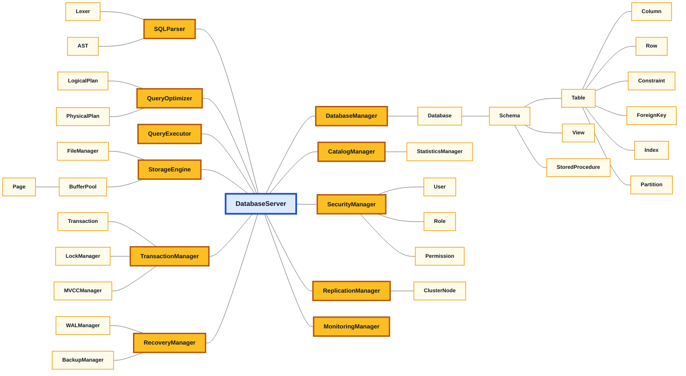

## Feature Class Diagrams

### 1. Storage Engine

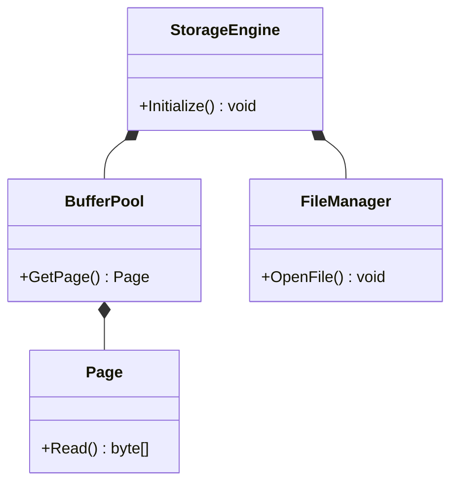

### 2. Query Processor

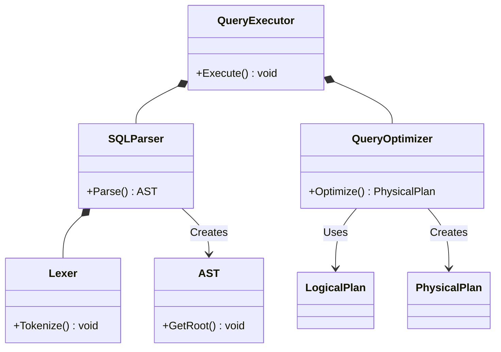

### 3. Transaction Management

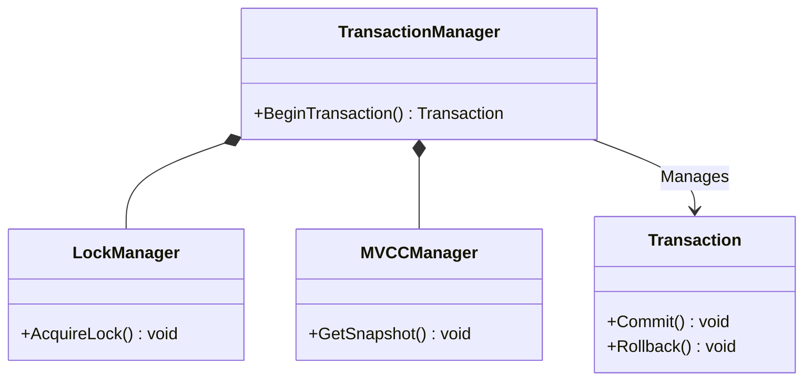

### 4. Recovery Management

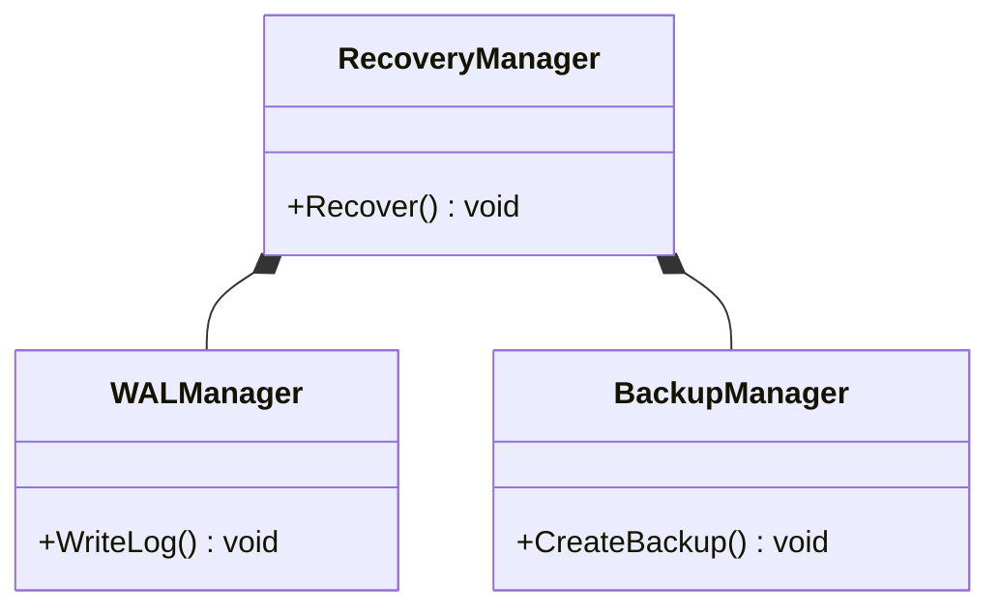

### 5. Security Management

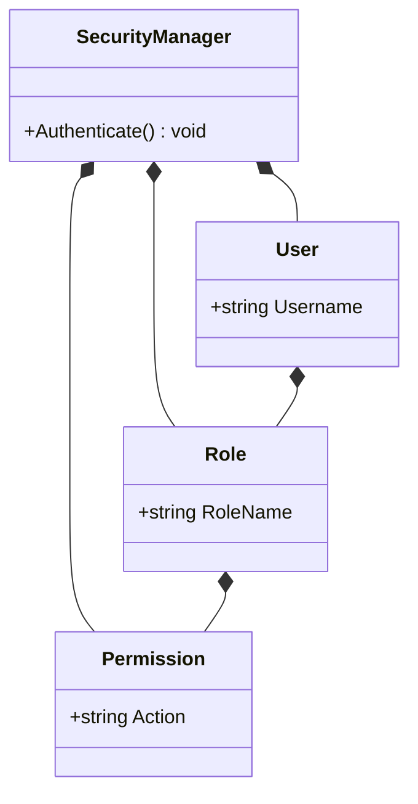

### 6. Database Manager

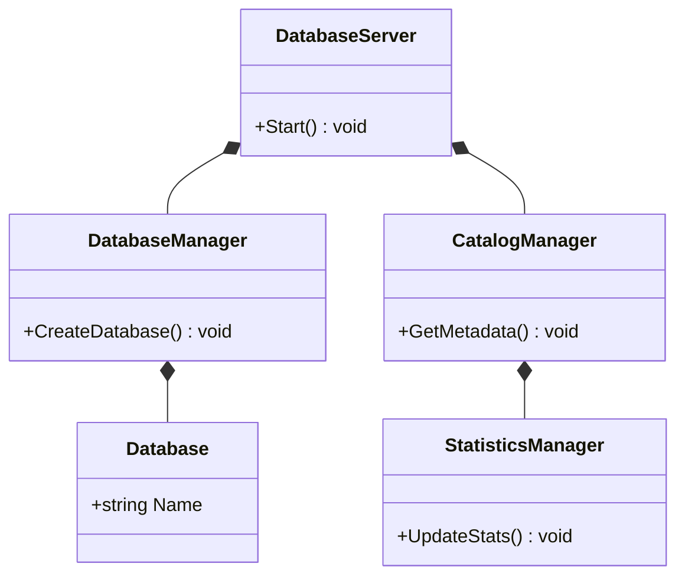

### 7. Database Objects

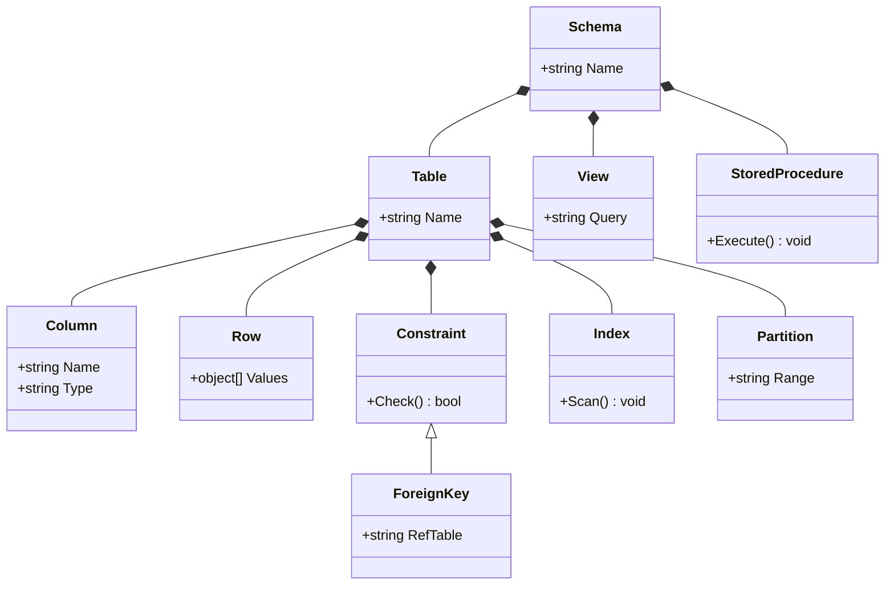

### 8. Replication and Cluster

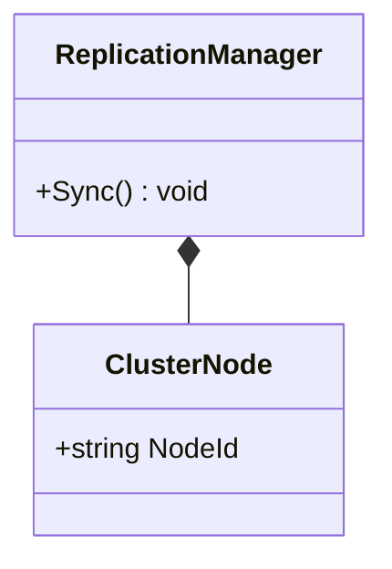

### 9. Monitoring

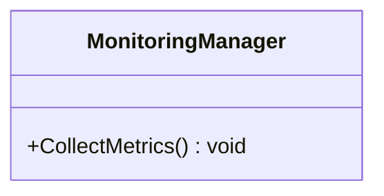

## Unit Tests Architecture

```mermaid
flowchart TB

    %% =====================================================
    %% DATABASE OBJECTS AND CATALOG
    %% =====================================================

    subgraph DATABASE_LAYER["Database Objects & Catalog"]
        direction TB

        DBS["DatabaseServer"]
        DBS_TEST["Start_WhenConfigurationIsValid_ShouldStart<br/>
        Stop_WhenServerIsRunning_ShouldStop<br/>
        Start_WhenPortIsUnavailable_ShouldThrow"]
        DBS --> DBS_TEST

        DBM["DatabaseManager"]
        DBM_TEST["CreateDatabase_WhenNameIsValid_ShouldCreateDatabase<br/>
        CreateDatabase_WhenNameAlreadyExists_ShouldThrow<br/>
        DropDatabase_WhenDatabaseExists_ShouldRemoveDatabase"]
        DBM --> DBM_TEST

        DB["Database"]
        DB_TEST["Open_WhenDatabaseIsClosed_ShouldOpenDatabase<br/>
        Close_WhenDatabaseIsOpen_ShouldCloseDatabase<br/>
        AddSchema_WhenNameAlreadyExists_ShouldThrow"]
        DB --> DB_TEST

        SCH["Schema"]
        SCH_TEST["AddTable_WhenTableIsValid_ShouldRegisterTable<br/>
        AddTable_WhenNameAlreadyExists_ShouldThrow<br/>
        RemoveTable_WhenTableExists_ShouldRemoveTable"]
        SCH --> SCH_TEST

        TBL["Table"]
        TBL_TEST["InsertRow_WhenRowIsValid_ShouldInsertRow<br/>
        InsertRow_WhenSchemaDoesNotMatch_ShouldThrow<br/>
        AddColumn_WhenNameAlreadyExists_ShouldThrow"]
        TBL --> TBL_TEST

        COL["Column"]
        COL_TEST["Create_WhenDefinitionIsValid_ShouldCreateColumn<br/>
        Create_WhenNameIsInvalid_ShouldThrow<br/>
        ValidateValue_WhenTypeDoesNotMatch_ShouldReturnFalse"]
        COL --> COL_TEST

        ROW["Row"]
        ROW_TEST["GetValue_WhenColumnExists_ShouldReturnValue<br/>
        SetValue_WhenValueIsValid_ShouldUpdateValue<br/>
        SetValue_WhenTypeDoesNotMatch_ShouldThrow"]
        ROW --> ROW_TEST

        CON["Constraint"]
        CON_TEST["Validate_WhenValueSatisfiesConstraint_ShouldSucceed<br/>
        Validate_WhenValueViolatesConstraint_ShouldFail<br/>
        Apply_WhenConstraintIsDisabled_ShouldSkipValidation"]
        CON --> CON_TEST

        FK["ForeignKey"]
        FK_TEST["Validate_WhenParentRecordExists_ShouldSucceed<br/>
        Validate_WhenParentRecordDoesNotExist_ShouldFail<br/>
        DeleteParent_WhenRestricted_ShouldRejectDeletion"]
        FK --> FK_TEST

        IDX["Index"]
        IDX_TEST["Insert_WhenKeyIsValid_ShouldAddEntry<br/>
        Search_WhenKeyExists_ShouldReturnRecordPointer<br/>
        Insert_WhenUniqueKeyAlreadyExists_ShouldThrow"]
        IDX --> IDX_TEST

        PART["Partition"]
        PART_TEST["RouteRow_WhenKeyMatchesRange_ShouldReturnPartition<br/>
        RouteRow_WhenKeyIsOutsideRange_ShouldFail<br/>
        AddRange_WhenRangesOverlap_ShouldThrow"]
        PART --> PART_TEST

        VIEW["View"]
        VIEW_TEST["Create_WhenQueryIsValid_ShouldCreateView<br/>
        Resolve_WhenDependenciesExist_ShouldReturnDefinition<br/>
        Resolve_WhenDependencyIsMissing_ShouldThrow"]
        VIEW --> VIEW_TEST

        SP["StoredProcedure"]
        SP_TEST["Execute_WhenParametersAreValid_ShouldReturnResult<br/>
        Execute_WhenRequiredParameterIsMissing_ShouldThrow<br/>
        Execute_WhenTransactionFails_ShouldPropagateFailure"]
        SP --> SP_TEST

        CAT["CatalogManager"]
        CAT_TEST["Register_WhenObjectIsValid_ShouldAddToCatalog<br/>
        Register_WhenObjectAlreadyExists_ShouldThrow<br/>
        Find_WhenObjectDoesNotExist_ShouldReturnNull"]
        CAT --> CAT_TEST

        STAT["StatisticsManager"]
        STAT_TEST["UpdateStatistics_WhenDataChanges_ShouldRefreshStatistics<br/>
        EstimateSelectivity_WhenStatisticsExist_ShouldReturnEstimate<br/>
        EstimateSelectivity_WhenStatisticsAreMissing_ShouldUseFallback"]
        STAT --> STAT_TEST
    end

    %% =====================================================
    %% TRANSACTION AND STORAGE
    %% =====================================================

    subgraph STORAGE_LAYER["Transaction & Storage"]
        direction TB

        TX["Transaction"]
        TX_TEST["Begin_WhenTransactionIsNew_ShouldBecomeActive<br/>
        Commit_WhenTransactionIsActive_ShouldCommit<br/>
        Rollback_WhenTransactionIsActive_ShouldRollback"]
        TX --> TX_TEST

        TXM["TransactionManager"]
        TXM_TEST["BeginTransaction_ShouldReturnActiveTransaction<br/>
        Commit_WhenTransactionExists_ShouldCommitTransaction<br/>
        Commit_WhenTransactionDoesNotExist_ShouldThrow"]
        TXM --> TXM_TEST

        LOCK["LockManager"]
        LOCK_TEST["Acquire_WhenLocksAreCompatible_ShouldGrantLock<br/>
        Acquire_WhenLocksConflict_ShouldRejectOrWait<br/>
        Release_WhenLockExists_ShouldRemoveLock"]
        LOCK --> LOCK_TEST

        MVCC["MVCCManager"]
        MVCC_TEST["CreateVersion_WhenRowChanges_ShouldCreateNewVersion<br/>
        ReadVersion_WhenVersionIsVisible_ShouldReturnVersion<br/>
        Cleanup_WhenVersionIsObsolete_ShouldRemoveVersion"]
        MVCC --> MVCC_TEST

        BP["BufferPool"]
        BP_TEST["FetchPage_WhenPageIsBuffered_ShouldReturnExistingFrame<br/>
        FetchPage_WhenSpaceIsAvailable_ShouldLoadPage<br/>
        FetchPage_WhenAllFramesArePinned_ShouldThrow"]
        BP --> BP_TEST

        PAGE["Page"]
        PAGE_TEST["InsertRecord_WhenSpaceIsAvailable_ShouldInsertRecord<br/>
        InsertRecord_WhenSpaceIsInsufficient_ShouldFail<br/>
        DeleteRecord_WhenRecordExists_ShouldUpdateSlotDirectory"]
        PAGE --> PAGE_TEST

        SE["StorageEngine"]
        SE_TEST["Initialize_WhenConfigurationIsValid_ShouldInitializeComponents<br/>
        ReadPage_ShouldDelegateToBufferPool<br/>
        Shutdown_ShouldFlushDirtyPagesAndCloseFiles"]
        SE --> SE_TEST

        FM["FileManager"]
        FM_TEST["CreateFile_WhenPathIsValid_ShouldCreateFile<br/>
        OpenFile_WhenFileExists_ShouldReturnHandle<br/>
        DeleteFile_WhenFileIsInUse_ShouldThrow"]
        FM --> FM_TEST

        WAL["WALManager"]
        WAL_TEST["Append_WhenRecordIsValid_ShouldAssignLSN<br/>
        Flush_WhenTargetLSNExists_ShouldPersistRecords<br/>
        Append_WhenSequenceIsInvalid_ShouldThrow"]
        WAL --> WAL_TEST

        REC["RecoveryManager"]
        REC_TEST["Recover_ShouldRedoCommittedTransactions<br/>
        Recover_ShouldUndoUncommittedTransactions<br/>
        Recover_WhenCheckpointExists_ShouldStartFromCheckpoint"]
        REC --> REC_TEST
    end

    %% =====================================================
    %% QUERY PROCESSING
    %% =====================================================

    subgraph QUERY_LAYER["Query Processing"]
        direction TB

        LEX["Lexer"]
        LEX_TEST["Tokenize_WhenSQLIsValid_ShouldReturnTokens<br/>
        Tokenize_WhenInputContainsWhitespace_ShouldIgnoreWhitespace<br/>
        Tokenize_WhenTokenIsInvalid_ShouldThrow"]
        LEX --> LEX_TEST

        PARSER["SQLParser"]
        PARSER_TEST["Parse_WhenSelectStatementIsValid_ShouldReturnAST<br/>
        Parse_WhenStatementIsIncomplete_ShouldThrowSyntaxError<br/>
        Parse_WhenTokensAreEmpty_ShouldRejectInput"]
        PARSER --> PARSER_TEST

        AST_NODE["AST"]
        AST_TEST["Accept_WhenVisitorIsProvided_ShouldDispatchVisitor<br/>
        Build_WhenChildrenAreValid_ShouldPreserveTreeStructure<br/>
        Build_WhenRequiredNodeIsMissing_ShouldFail"]
        AST_NODE --> AST_TEST

        QO["QueryOptimizer"]
        QO_TEST["Optimize_WhenMultiplePlansExist_ShouldChooseLowestCostPlan<br/>
        Optimize_ShouldPreserveLogicalSemantics<br/>
        Optimize_WhenNoAlternativeExists_ShouldReturnOriginalPlan"]
        QO --> QO_TEST

        LP["LogicalPlan"]
        LP_TEST["AddOperator_WhenOperatorIsValid_ShouldUpdatePlan<br/>
        Validate_WhenOperatorInputsMatch_ShouldSucceed<br/>
        Validate_WhenSchemaDoesNotMatch_ShouldFail"]
        LP --> LP_TEST

        PP["PhysicalPlan"]
        PP_TEST["Build_WhenLogicalPlanIsValid_ShouldCreatePhysicalOperators<br/>
        CalculateCost_ShouldReturnEstimatedExecutionCost<br/>
        Validate_WhenOperatorIsUnsupported_ShouldFail"]
        PP --> PP_TEST

        QE["QueryExecutor"]
        QE_TEST["Execute_WhenPlanIsValid_ShouldReturnRows<br/>
        Execute_WhenStorageFails_ShouldPropagateFailure<br/>
        Execute_WhenTransactionFails_ShouldRollback"]
        QE --> QE_TEST
    end

    %% =====================================================
    %% SECURITY
    %% =====================================================

    subgraph SECURITY_LAYER["Security"]
        direction TB

        SM["SecurityManager"]
        SM_TEST["Authenticate_WhenCredentialsAreValid_ShouldReturnUser<br/>
        Authenticate_WhenCredentialsAreInvalid_ShouldFail<br/>
        Authorize_WhenPermissionIsMissing_ShouldDenyAccess"]
        SM --> SM_TEST

        USER["User"]
        USER_TEST["AssignRole_WhenRoleIsValid_ShouldAddRole<br/>
        AssignRole_WhenRoleAlreadyAssigned_ShouldNotDuplicate<br/>
        Disable_WhenUserIsActive_ShouldDisableUser"]
        USER --> USER_TEST

        ROLE["Role"]
        ROLE_TEST["AddPermission_WhenPermissionIsValid_ShouldAddPermission<br/>
        AddPermission_WhenPermissionExists_ShouldNotDuplicate<br/>
        RemovePermission_WhenPermissionExists_ShouldRemovePermission"]
        ROLE --> ROLE_TEST

        PERM["Permission"]
        PERM_TEST["Allows_WhenActionAndResourceMatch_ShouldReturnTrue<br/>
        Allows_WhenActionDoesNotMatch_ShouldReturnFalse<br/>
        Allows_WhenScopeDoesNotMatch_ShouldReturnFalse"]
        PERM --> PERM_TEST
    end

    %% =====================================================
    %% DISTRIBUTED SYSTEM AND ADMINISTRATION
    %% =====================================================

    subgraph ADMIN_LAYER["Replication, Cluster & Administration"]
        direction TB

        REPL["ReplicationManager"]
        REPL_TEST["Replicate_WhenFollowerIsAvailable_ShouldSendLogRecords<br/>
        Replicate_WhenFollowerFails_ShouldRetry<br/>
        Commit_WhenQuorumIsNotReached_ShouldFail"]
        REPL --> REPL_TEST

        NODE["ClusterNode"]
        NODE_TEST["ReceiveHeartbeat_ShouldUpdateLastSeenTime<br/>
        MarkUnavailable_WhenHeartbeatExpires_ShouldChangeState<br/>
        Create_WhenEndpointIsInvalid_ShouldThrow"]
        NODE --> NODE_TEST

        BACKUP["BackupManager"]
        BACKUP_TEST["CreateBackup_WhenDatabaseIsOnline_ShouldCreateBackup<br/>
        Restore_WhenBackupIsValid_ShouldRestoreDatabase<br/>
        CreateBackup_WhenWriteFails_ShouldCleanPartialBackup"]
        BACKUP --> BACKUP_TEST

        MON["MonitoringManager"]
        MON_TEST["CollectMetrics_WhenSourcesAreAvailable_ShouldReturnMetrics<br/>
        Evaluate_WhenThresholdIsExceeded_ShouldRaiseAlert<br/>
        CollectMetrics_WhenSourceFails_ShouldRecordFailure"]
        MON --> MON_TEST
    end

    classDef classNode fill:#1f2937,stroke:#60a5fa,color:#ffffff,stroke-width:2px
    classDef testNode fill:#f8fafc,stroke:#94a3b8,color:#111827

    class DBS,DBM,DB,SCH,TBL,COL,ROW,CON,FK,IDX,PART,VIEW,SP,CAT,STAT classNode
    class TX,TXM,LOCK,MVCC,BP,PAGE,SE,FM,WAL,REC classNode
    class LEX,PARSER,AST_NODE,QO,LP,PP,QE classNode
    class SM,USER,ROLE,PERM classNode
    class REPL,NODE,BACKUP,MON classNode

    class DBS_TEST,DBM_TEST,DB_TEST,SCH_TEST,TBL_TEST,COL_TEST,ROW_TEST testNode
    class CON_TEST,FK_TEST,IDX_TEST,PART_TEST,VIEW_TEST,SP_TEST,CAT_TEST,STAT_TEST testNode
    class TX_TEST,TXM_TEST,LOCK_TEST,MVCC_TEST,BP_TEST,PAGE_TEST,SE_TEST,FM_TEST,WAL_TEST,REC_TEST testNode
    class LEX_TEST,PARSER_TEST,AST_TEST,QO_TEST,LP_TEST,PP_TEST,QE_TEST testNode
    class SM_TEST,USER_TEST,ROLE_TEST,PERM_TEST testNode
    class REPL_TEST,NODE_TEST,BACKUP_TEST,MON_TEST testNode
```
