# DBMS
Database management system

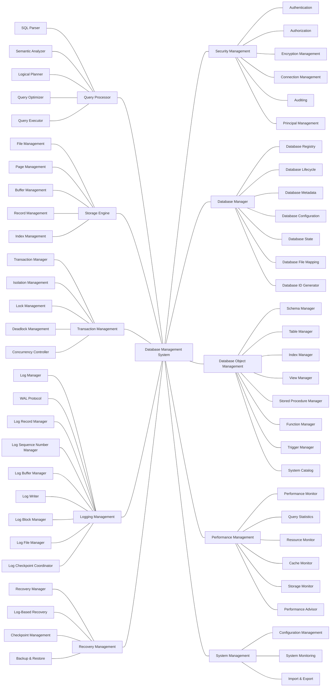

## Feature Class Diagrams

### 1. Storage Engine
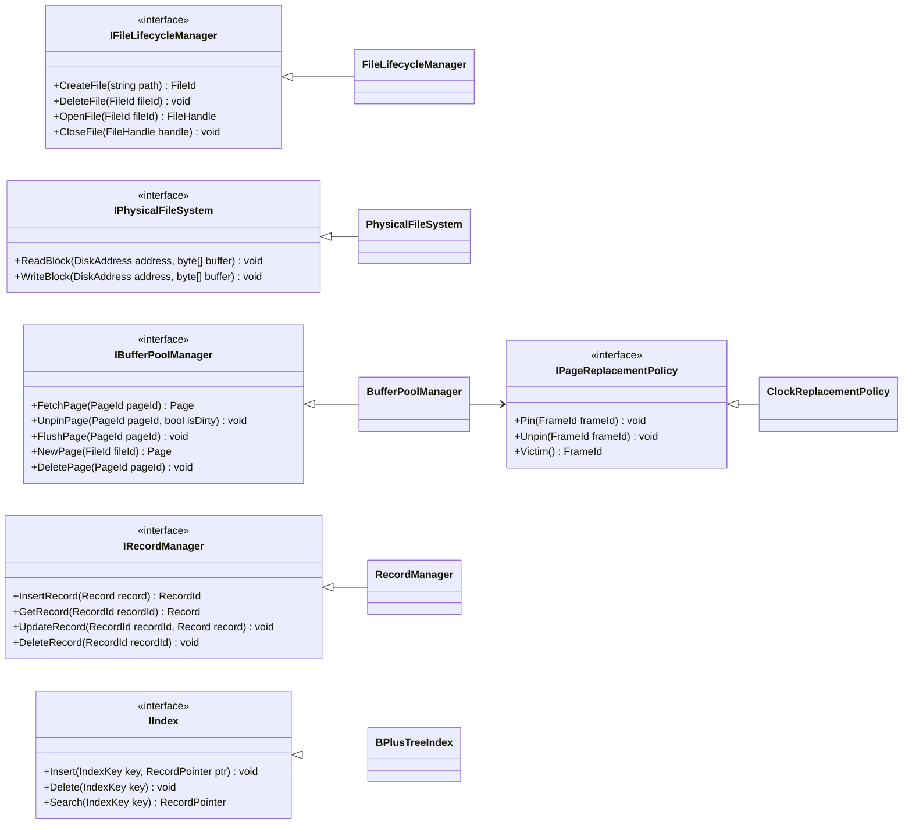

### 2. Query Processor
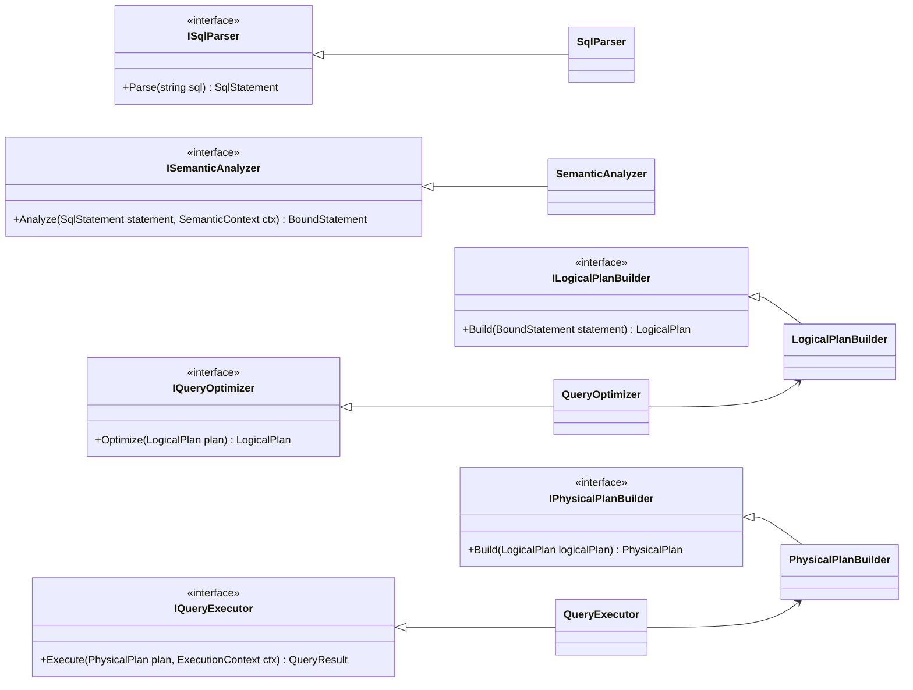

### 3. Transaction Management
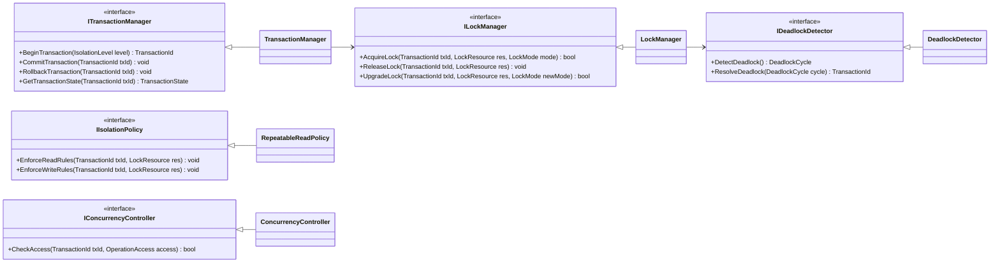

### 4. Logging Management
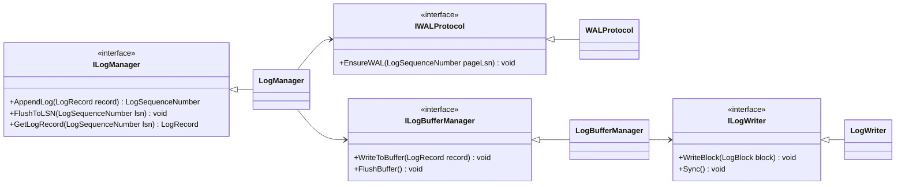

### 5. Recovery Management
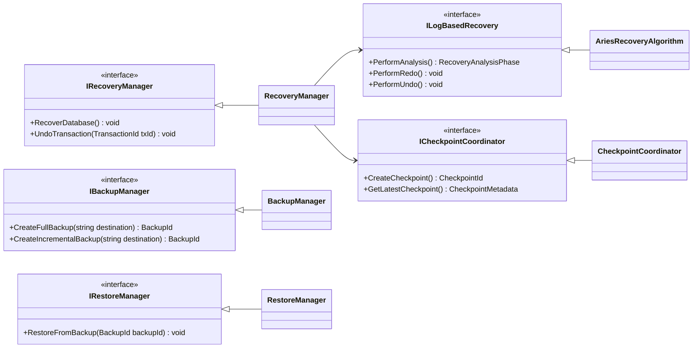

### 6. Security Management
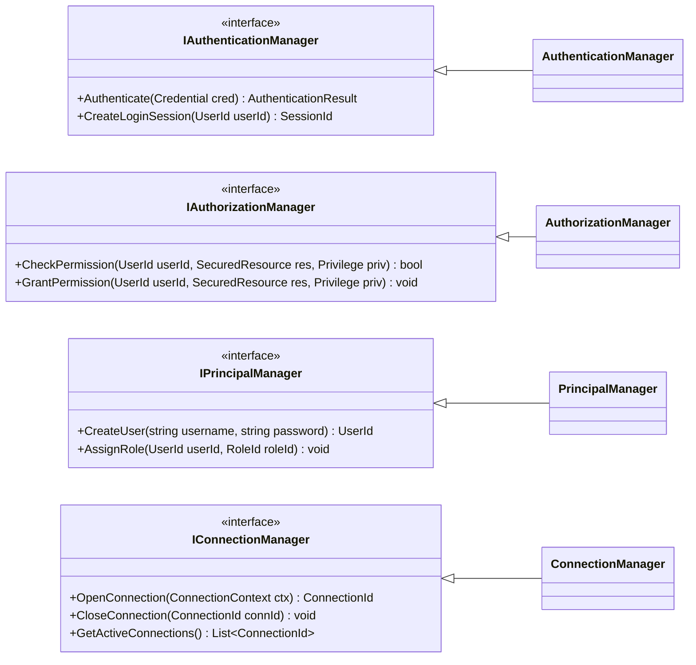

### 7. Database Manager
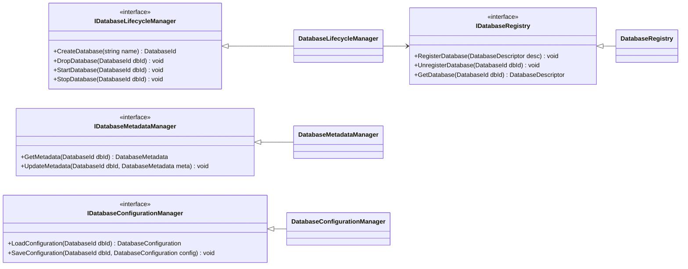

### 8. Database Object Management
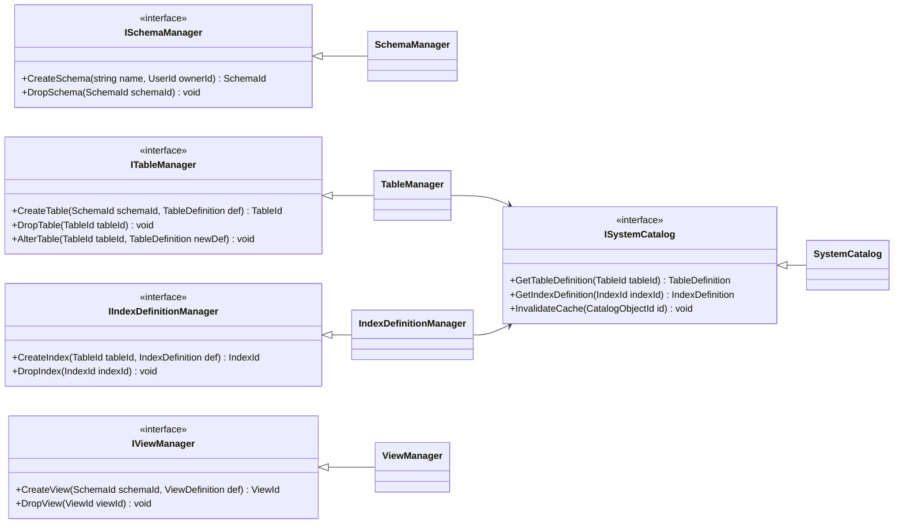

### 9. Performance Management
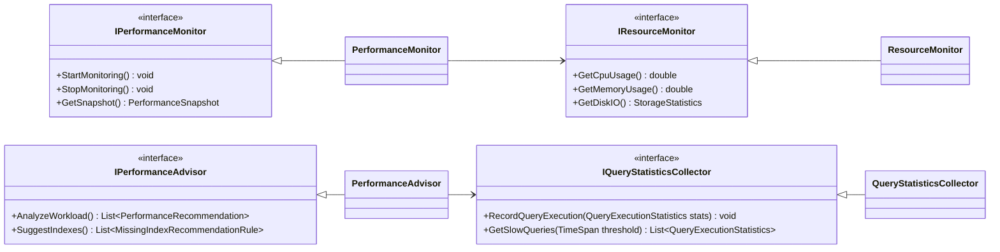

### 10. System Management
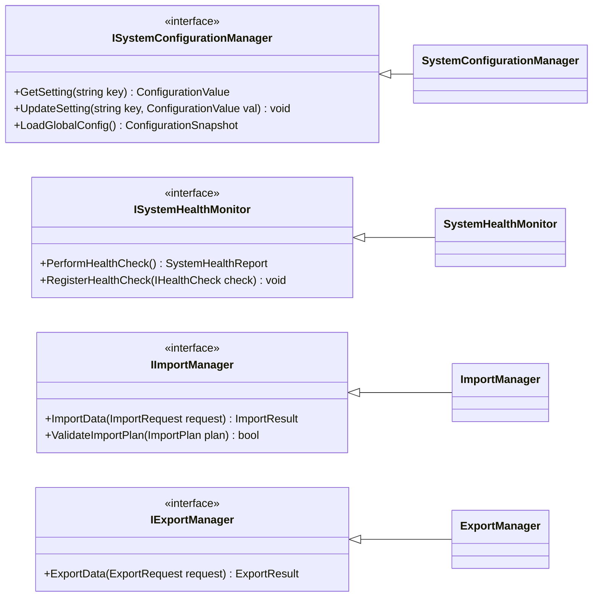
