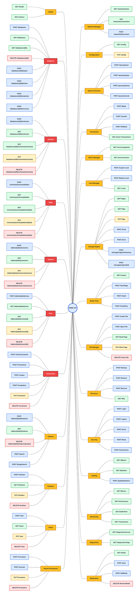

```mermaid
flowchart LR
    %% =====================================================
    %% LEFT SIDE
    %% =====================================================
    subgraph LEFT_SIDE[" "]
        direction TB

        Health
        Database
        Schema
        Table
        Column
        Row
        Constraints
        Indexes
        Partition
        Views
        StoredProcedures["Stored Procedures"]

        H1["GET /health"] --- Health
        H2["GET /metrics"] --- Health

        DB1["POST /databases"] --- Database
        DB2["GET /databases"] --- Database
        DB3["GET /databases/{db}"] --- Database
        DB4["DELETE /databases/{db}"] --- Database
        DB5["POST /databases/{db}/open"] --- Database
        DB6["POST /databases/{db}/close"] --- Database
        DB7["POST /databases/{db}/readonly"] --- Database
        DB8["POST /databases/{db}/recovery"] --- Database

        SC1["POST /databases/{db}/schemas"] --- Schema
        SC2["GET /databases/{db}/schemas"] --- Schema
        SC3["GET /databases/{db}/schemas/{schema}"] --- Schema
        SC4["PUT /databases/{db}/schemas/{schema}"] --- Schema
        SC5["DELETE /databases/{db}/schemas/{schema}"] --- Schema

        TB1["POST /schemas/{schema}/tables"] --- Table
        TB2["GET /schemas/{schema}/tables"] --- Table
        TB3["GET /schemas/{schema}/tables/{table}"] --- Table
        TB4["PUT /schemas/{schema}/tables/{table}"] --- Table
        TB5["DELETE /schemas/{schema}/tables/{table}"] --- Table

        C1["POST /tables/{table}/columns"] --- Column
        C2["GET /tables/{table}/columns"] --- Column
        C3["PUT /tables/{table}/columns/{column}"] --- Column
        C4["DELETE /tables/{table}/columns/{column}"] --- Column

        R1["POST /tables/{table}/rows"] --- Row
        R2["GET /tables/{table}/rows"] --- Row
        R3["GET /tables/{table}/rows/{id}"] --- Row
        R4["PUT /tables/{table}/rows/{id}"] --- Row
        R5["DELETE /tables/{table}/rows/{id}"] --- Row

        CT1["POST CheckConstraint"] --- Constraints
        CT2["POST PrimaryKey"] --- Constraints
        CT3["POST Unique"] --- Constraints
        CT4["POST ForeignKey"] --- Constraints
        CT5["PUT Constraint"] --- Constraints
        CT6["DELETE Constraint"] --- Constraints

        I1["POST /tables/{table}/indexes"] --- Indexes
        I2["GET /tables/{table}/indexes"] --- Indexes
        I3["DELETE /tables/{table}/indexes/{index}"] --- Indexes
        I4["POST Search"] --- Indexes
        I5["POST RangeSearch"] --- Indexes

        P1["POST Partition"] --- Partition
        P2["GET Partitions"] --- Partition
        P3["PUT Partition"] --- Partition
        P4["DELETE Partition"] --- Partition

        V1["POST View"] --- Views
        V2["GET Views"] --- Views
        V3["PUT View"] --- Views
        V4["DELETE View"] --- Views

        SP1["POST Procedure"] --- StoredProcedures
        SP2["POST Execute"] --- StoredProcedures
        SP3["PUT Procedure"] --- StoredProcedures
        SP4["DELETE Procedure"] --- StoredProcedures
    end

    %% =====================================================
    %% CENTER
    %% =====================================================
    API((DBMS API))

    Health --- API
    Database --- API
    Schema --- API
    Table --- API
    Column --- API
    Row --- API
    Constraints --- API
    Indexes --- API
    Partition --- API
    Views --- API
    StoredProcedures --- API

    %% =====================================================
    %% RIGHT SIDE
    %% =====================================================
    subgraph RIGHT_SIDE[" "]
        direction TB

        Network["Network Manager"]
        Config["Configuration"]
        QueryProcessor["Query Processor"]
        Transaction
        MVCC["MVCC Manager"]
        LockManager["Lock Manager"]
        StorageEngine["Storage Engine"]
        BufferPool["Buffer Pool"]
        FileManager["File Manager"]
        Recovery
        Security
        Catalog
        Monitoring
        Diagnostics
        Replication

        Network --- NW1["GET /network/status"]
        Network --- NW2["GET /network/connections"]
        Network --- NW3["POST /network/disconnect"]

        Config --- CFG1["GET /config"]
        Config --- CFG2["PUT /config"]

        QueryProcessor --- QP1["POST /query/parse"]
        QueryProcessor --- QP2["POST /query/analyze"]
        QueryProcessor --- QP3["POST /query/optimize"]
        QueryProcessor --- QP4["POST /query/execute"]

        Transaction --- TX1["POST Begin"]
        Transaction --- TX2["POST Commit"]
        Transaction --- TX3["POST Rollback"]
        Transaction --- TX4["GET Active Transactions"]

        MVCC --- MV1["GET /mvcc/snapshots"]
        MVCC --- MV2["GET /mvcc/versions"]

        LockManager --- LM1["POST Acquire Lock"]
        LockManager --- LM2["POST Release Lock"]
        LockManager --- LM3["GET Locks"]

        StorageEngine --- SE1["GET Pages"]
        StorageEngine --- SE2["GET Page"]
        StorageEngine --- SE3["PUT Page"]
        StorageEngine --- SE4["POST Flush"]
        StorageEngine --- SE5["POST Evict"]
        StorageEngine --- SE6["POST /storage/engine/inmemory"]
        StorageEngine --- SE7["POST /storage/engine/disk"]

        BufferPool --- BP1["GET Frames"]
        BufferPool --- BP2["POST FetchPage"]
        BufferPool --- BP3["POST Unpin"]
        BufferPool --- BP4["POST FlushDirty"]

        FileManager --- FM1["POST Create File"]
        FileManager --- FM2["POST Open File"]
        FileManager --- FM3["GET Read Page"]
        FileManager --- FM4["PUT Write Page"]
        FileManager --- FM5["DELETE Close File"]

        Recovery --- RC1["POST Backup"]
        Recovery --- RC2["POST Restore"]
        Recovery --- RC3["POST Recover"]
        Recovery --- RC4["GET WAL"]

        Security --- SEC1["POST Login"]
        Security --- SEC2["POST Logout"]
        Security --- SEC3["POST Users"]
        Security --- SEC4["POST Roles"]
        Security --- SEC5["POST Permissions"]

        Catalog --- CAT1["GET Objects"]
        Catalog --- CAT2["GET Statistics"]
        Catalog --- CAT3["POST UpdateStatistics"]

        Monitoring --- M1["GET Metrics"]
        Monitoring --- M2["GET Performance"]
        Monitoring --- M3["GET BufferPool"]
        Monitoring --- M4["GET Transactions"]

        Diagnostics --- DIAG1["GET /diagnostics/errors"]
        Diagnostics --- DIAG2["GET /diagnostics/logs"]

        Replication --- REP1["GET Nodes"]
        Replication --- REP2["POST Sync"]
        Replication --- REP3["POST AddNode"]
        Replication --- REP4["DELETE RemoveNode"]
    end

    API --- Network
    API --- Config
    API --- QueryProcessor
    API --- Transaction
    API --- MVCC
    API --- LockManager
    API --- StorageEngine
    API --- BufferPool
    API --- FileManager
    API --- Recovery
    API --- Security
    API --- Catalog
    API --- Monitoring
    API --- Diagnostics
    API --- Replication

    %% =====================================================
    %% STYLES
    %% =====================================================
    classDef root fill:#dbeafe,stroke:#1d4ed8,stroke-width:4px,color:#111827,font-weight:bold
    classDef module fill:#fbbf24,stroke:#b45309,stroke-width:2px,color:#111827,font-weight:bold
    classDef highlight fill:#ef4444,stroke:#7f1d1d,stroke-width:3px,color:#ffffff,font-weight:bold
    classDef get fill:#dcfce7,stroke:#16a34a,stroke-width:2px,color:#111827
    classDef post fill:#dbeafe,stroke:#2563eb,stroke-width:2px,color:#111827
    classDef put fill:#fef3c7,stroke:#d97706,stroke-width:2px,color:#111827
    classDef delete fill:#fee2e2,stroke:#dc2626,stroke-width:2px,color:#111827

    class API root

    class Database,Schema,Table,Column,Row,Constraints highlight
    class Health,Indexes,Partition,Views,StoredProcedures module
    class Network,Config,QueryProcessor,Transaction,MVCC,LockManager,StorageEngine,BufferPool,FileManager,Recovery,Security,Catalog,Monitoring,Diagnostics,Replication module

    class H1,H2,DB2,DB3,SC2,SC3,TB2,TB3,C2,R2,R3,I2,P2,V2,NW1,NW2,CFG1,TX4,MV1,MV2,LM3,SE1,SE2,BP1,FM3,RC4,CAT1,CAT2,M1,M2,M3,M4,DIAG1,DIAG2,REP1 get

    class DB1,DB5,DB6,DB7,DB8,SC1,TB1,C1,R1,CT1,CT2,CT3,CT4,I1,I4,I5,P1,V1,SP1,SP2,NW3,QP1,QP2,QP3,QP4,TX1,TX2,TX3,LM1,LM2,SE4,SE5,SE6,SE7,BP2,BP3,BP4,FM1,FM2,RC1,RC2,RC3,SEC1,SEC2,SEC3,SEC4,SEC5,CAT3,REP2,REP3 post

    class SC4,TB4,C3,R4,CT5,P3,V3,SP3,CFG2,SE3,FM4 put
    class DB4,SC5,TB5,C4,R5,CT6,I3,P4,V4,SP4,FM5,REP4 delete

    style LEFT_SIDE fill:transparent,stroke:transparent
    style RIGHT_SIDE fill:transparent,stroke:transparent
```