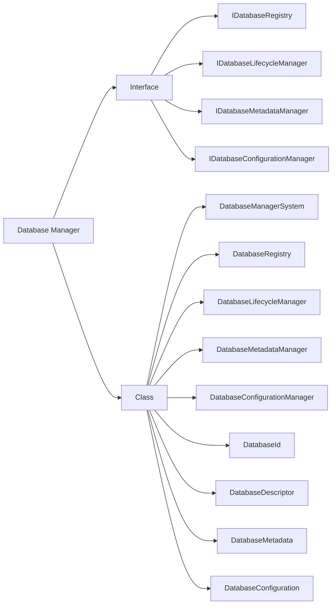

# 7. Database Manager Mindmap

```mermaid
flowchart LR
    DM[Database Manager]

    %% Interfaces
    DM --> INT[Interface]
    INT --> IDR[IDatabaseRegistry]
    INT --> IDLM[IDatabaseLifecycleManager]
    INT --> IDMM[IDatabaseMetadataManager]
    INT --> IDCM[IDatabaseConfigurationManager]

    %% Classes (Implementations)
    DM --> CLS[Class]
    CLS --> DMS[DatabaseManagerSystem]
    CLS --> DR[DatabaseRegistry]
    CLS --> DLM[DatabaseLifecycleManager]
    CLS --> DMM[DatabaseMetadataManager]
    CLS --> DCM[DatabaseConfigurationManager]

    %% Domain Models (Also in Class folder)
    CLS --> DID[DatabaseId]
    CLS --> DDESC[DatabaseDescriptor]
    CLS --> DMETA[DatabaseMetadata]
    CLS --> DCONF[DatabaseConfiguration]
```
