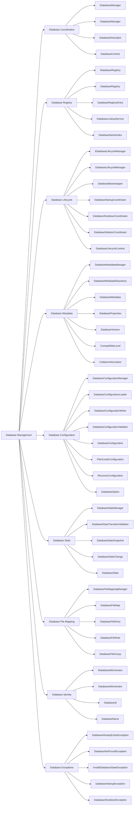

# 7. Database Manager Mindmap

```mermaid
flowchart LR
    DBM[Database Management]

    DBM --> DC[Database Coordination]
    DBM --> DR[Database Registry]
    DBM --> DL[Database Lifecycle]
    DBM --> DM[Database Metadata]
    DBM --> DCONF[Database Configuration]
    DBM --> DS[Database State]
    DBM --> DFM[Database File Mapping]
    DBM --> DI[Database Identity]
    DBM --> DE[Database Exceptions]

    %% Database Coordination
    DC --> IDM[IDatabaseManager]
    DC --> DBMGR[DatabaseManager]
    DC --> DD[DatabaseDescriptor]
    DC --> DCTX[DatabaseContext]

    %% Database Registry
    DR --> IDR[IDatabaseRegistry]
    DR --> DRG[DatabaseRegistry]
    DR --> DRE[DatabaseRegistryEntry]
    DR --> DLS[DatabaseLookupService]
    DR --> DNI[DatabaseNameIndex]

    %% Database Lifecycle
    DL --> IDLM[IDatabaseLifecycleManager]
    DL --> DLM[DatabaseLifecycleManager]
    DL --> DB[DatabaseBootstrapper]
    DL --> DSC[DatabaseStartupCoordinator]
    DL --> DSHC[DatabaseShutdownCoordinator]
    DL --> DDC[DatabaseDeletionCoordinator]
    DL --> DLC[DatabaseLifecycleContext]

    %% Database Metadata
    DM --> DMM[DatabaseMetadataManager]
    DM --> DMR[DatabaseMetadataRepository]
    DM --> DMD[DatabaseMetadata]
    DM --> DP[DatabaseProperties]
    DM --> DV[DatabaseVersion]
    DM --> CL[CompatibilityLevel]
    DM --> CI[CollationInformation]

    %% Database Configuration
    DCONF --> DCM[DatabaseConfigurationManager]
    DCONF --> DCL[DatabaseConfigurationLoader]
    DCONF --> DCW[DatabaseConfigurationWriter]
    DCONF --> DCV[DatabaseConfigurationValidator]
    DCONF --> DCO[DatabaseConfiguration]
    DCONF --> FGC[FileGrowthConfiguration]
    DCONF --> RC[RecoveryConfiguration]
    DCONF --> DOPT[DatabaseOption]

    %% Database State
    DS --> DSM[DatabaseStateManager]
    DS --> DSTV[DatabaseStateTransitionValidator]
    DS --> DSS[DatabaseStateSnapshot]
    DS --> DSCG[DatabaseStateChange]
    DS --> DSTATE[DatabaseState]

    %% Database File Mapping
    DFM --> DFMM[DatabaseFileMappingManager]
    DFM --> DFMAP[DatabaseFileMap]
    DFM --> DFE[DatabaseFileEntry]
    DFM --> DFR[DatabaseFileRole]
    DFM --> DFG[DatabaseFileGroup]

    %% Database Identity
    DI --> IDIG[IDatabaseIdGenerator]
    DI --> DIG[DatabaseIdGenerator]
    DI --> DID[DatabaseId]
    DI --> DN[DatabaseName]

    %% Exceptions
    DE --> DAEE[DatabaseAlreadyExistsException]
    DE --> DNFE[DatabaseNotFoundException]
    DE --> IDSE[InvalidDatabaseStateException]
    DE --> DSTE[DatabaseStartupException]
    DE --> DSHE[DatabaseShutdownException]
```
