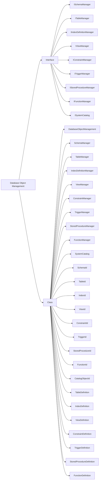

# 8. Database Object Management Mindmap

```mermaid
flowchart LR
    DOM[Database Object Management]

    %% Interfaces
    DOM --> INT[Interface]
    INT --> ISM[ISchemaManager]
    INT --> ITM[ITableManager]
    INT --> IIDM[IIndexDefinitionManager]
    INT --> IVM[IViewManager]
    INT --> ICM[IConstraintManager]
    INT --> ITGM[ITriggerManager]
    INT --> ISPM[IStoredProcedureManager]
    INT --> IFM[IFunctionManager]
    INT --> ISC[ISystemCatalog]

    %% Classes (Implementations)
    DOM --> CLS[Class]
    CLS --> DOMS[DatabaseObjectManagement]
    CLS --> SM[SchemaManager]
    CLS --> TMGR[TableManager]
    CLS --> IDM[IndexDefinitionManager]
    CLS --> VM[ViewManager]
    CLS --> CMGR[ConstraintManager]
    CLS --> TGMGR[TriggerManager]
    CLS --> SPMGR[StoredProcedureManager]
    CLS --> FMGR[FunctionManager]
    CLS --> SC[SystemCatalog]

    %% Domain Models (Also in Class folder)
    CLS --> SCHID[SchemaId]
    CLS --> TBID[TableId]
    CLS --> IDXID[IndexId]
    CLS --> VID[ViewId]
    CLS --> CID[ConstraintId]
    CLS --> TGID[TriggerId]
    CLS --> SPID[StoredProcedureId]
    CLS --> FID[FunctionId]
    CLS --> COID[CatalogObjectId]
    CLS --> TDEF[TableDefinition]
    CLS --> IDEF[IndexDefinition]
    CLS --> VDEF[ViewDefinition]
    CLS --> CDEF[ConstraintDefinition]
    CLS --> TGDEF[TriggerDefinition]
    CLS --> SPDEF[StoredProcedureDefinition]
    CLS --> FDEF[FunctionDefinition]
```
