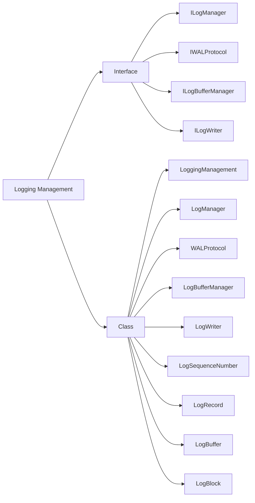

# 4. Logging Management Mindmap

```mermaid
flowchart LR
    LM[Logging Management]

    %% Interfaces
    LM --> INT[Interface]
    INT --> ILMGR[ILogManager]
    INT --> IWAL[IWALProtocol]
    INT --> ILBM[ILogBufferManager]
    INT --> ILW[ILogWriter]

    %% Classes (Implementations)
    LM --> CLS[Class]
    CLS --> LMRS[LoggingManagement]
    CLS --> LMGR[LogManager]
    CLS --> WAL[WALProtocol]
    CLS --> LBM[LogBufferManager]
    CLS --> LW[LogWriter]

    %% Domain Models (Also in Class folder)
    CLS --> LSN[LogSequenceNumber]
    CLS --> LR[LogRecord]
    CLS --> LB[LogBuffer]
    CLS --> LBLK[LogBlock]
```
