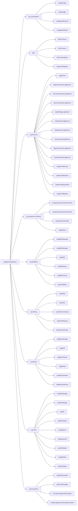

# 4. Logging Management Mindmap

```mermaid
flowchart LR
    LOG[Logging Management]

    LOG --> LC[Log Coordination]
    LOG --> WAL[WAL]
    LOG --> LR[Log Records]
    LOG --> LSN[Log Sequence Numbers]
    LOG --> LB[Log Buffering]
    LOG --> LW[Log Writing]
    LOG --> LBLK[Log Blocks]
    LOG --> LF[Log Files]
    LOG --> LE[Log Exceptions]

    %% Log Coordination
    LC --> ILM[ILogManager]
    LC --> LM[LogManager]
    LC --> LAR[LogAppendRequest]
    LC --> LARES[LogAppendResult]

    %% WAL
    WAL --> IWAL[IWALProtocol]
    WAL --> WALP[WALProtocol]
    WAL --> WRV[WALRuleValidator]
    WAL --> PLSNV[PageLSNValidator]

    %% Log Records
    LR --> LREC[LogRecord]
    LR --> BTLR[BeginTransactionLogRecord]
    LR --> CTLR[CommitTransactionLogRecord]
    LR --> ATLR[AbortTransactionLogRecord]
    LR --> UPLR[UpdatePageLogRecord]
    LR --> IRLR[InsertRecordLogRecord]
    LR --> DRLR[DeleteRecordLogRecord]
    LR --> CLR[CompensationLogRecord]
    LR --> BCLR[BeginCheckpointLogRecord]
    LR --> ECLR[EndCheckpointLogRecord]
    LR --> LRF[LogRecordFactory]
    LR --> LRS[LogRecordSerializer]
    LR --> LRD[LogRecordDeserializer]
    LR --> LRDR[LogRecordReader]

    %% Log Sequence Numbers
    LSN --> ILSNG[ILogSequenceNumberGenerator]
    LSN --> LSNG[LogSequenceNumberGenerator]
    LSN --> LSNVO[LogSequenceNumber]
    LSN --> LA[LogAddress]

    %% Log Buffering
    LB --> ILBM[ILogBufferManager]
    LB --> LBM[LogBufferManager]
    LB --> LBUF[LogBuffer]
    LB --> LBE[LogBufferEntry]
    LB --> LBC[LogBufferCursor]
    LB --> LFB[LogFlushBatch]

    %% Log Writing
    LW --> ILW[ILogWriter]
    LW --> LWR[LogWriter]
    LW --> LFC[LogFlushCoordinator]
    LW --> LFR[LogFlushRequest]
    LW --> DLT[DurableLSNTracker]

    %% Log Blocks
    LBLK --> LBMGR[LogBlockManager]
    LBLK --> LBLOCK[LogBlock]
    LBLK --> LBH[LogBlockHeader]
    LBLK --> LBID[LogBlockId]
    LBLK --> LBS[LogBlockSerializer]
    LBLK --> LBCS[LogBlockChecksum]

    %% Log Files
    LF --> ILFM[ILogFileManager]
    LF --> LFM[LogFileManager]
    LF --> LFILE[LogFile]
    LF --> LFH[LogFileHeader]
    LF --> LSEG[LogSegment]
    LF --> LSID[LogSegmentId]
    LF --> LFRD[LogFileReader]
    LF --> LFWR[LogFileWriter]
    LF --> LROT[LogFileRotator]

    %% Exceptions
    LE --> LWE[LogWriteException]
    LE --> LFE[LogFlushException]
    LE --> CLRE[CorruptedLogRecordException]
    LE --> ILSNE[InvalidLogSequenceNumberException]
```
