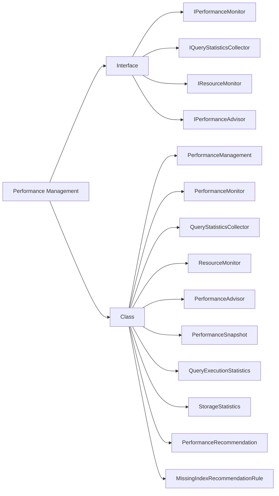

# 9. Performance Management Mindmap

```mermaid
flowchart LR
    PM[Performance Management]

    %% Interfaces
    PM --> INT[Interface]
    INT --> IPMON[IPerformanceMonitor]
    INT --> IQSC[IQueryStatisticsCollector]
    INT --> IRMON[IResourceMonitor]
    INT --> IPADV[IPerformanceAdvisor]

    %% Classes (Implementations)
    PM --> CLS[Class]
    CLS --> PMRS[PerformanceManagement]
    CLS --> PMON[PerformanceMonitor]
    CLS --> QSC[QueryStatisticsCollector]
    CLS --> RMON[ResourceMonitor]
    CLS --> PADV[PerformanceAdvisor]

    %% Domain Models (Also in Class folder)
    CLS --> PSNAP[PerformanceSnapshot]
    CLS --> QESTAT[QueryExecutionStatistics]
    CLS --> SSTAT[StorageStatistics]
    CLS --> PRECMD[PerformanceRecommendation]
    CLS --> MIRR[MissingIndexRecommendationRule]
```
