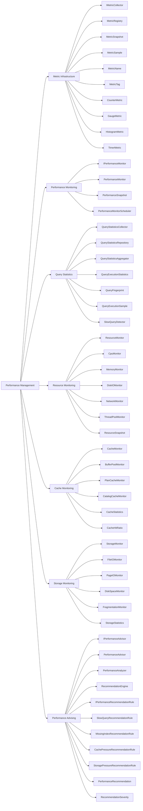

# 9. Performance Management Mindmap

```mermaid
flowchart LR
    PM[Performance Management]

    PM --> MI[Metric Infrastructure]
    PM --> MON[Performance Monitoring]
    PM --> QS[Query Statistics]
    PM --> RM[Resource Monitoring]
    PM --> CM[Cache Monitoring]
    PM --> SM[Storage Monitoring]
    PM --> PA[Performance Advising]

    %% Metric Infrastructure
    MI --> IMC[IMetricCollector]
    MI --> MR[MetricRegistry]
    MI --> MS[MetricSnapshot]
    MI --> MSA[MetricSample]
    MI --> MN[MetricName]
    MI --> MT[MetricTag]
    MI --> CMT[CounterMetric]
    MI --> GMT[GaugeMetric]
    MI --> HMT[HistogramMetric]
    MI --> TMT[TimerMetric]

    %% Performance Monitoring
    MON --> IPM[IPerformanceMonitor]
    MON --> PMON[PerformanceMonitor]
    MON --> PS[PerformanceSnapshot]
    MON --> PMS[PerformanceMonitorScheduler]

    %% Query Statistics
    QS --> QSC[QueryStatisticsCollector]
    QS --> QSR[QueryStatisticsRepository]
    QS --> QSA[QueryStatisticsAggregator]
    QS --> QES[QueryExecutionStatistics]
    QS --> QF[QueryFingerprint]
    QS --> QESP[QueryExecutionSample]
    QS --> SQD[SlowQueryDetector]

    %% Resource Monitoring
    RM --> RMON[ResourceMonitor]
    RM --> CPU[CpuMonitor]
    RM --> MEM[MemoryMonitor]
    RM --> DIO[DiskIOMonitor]
    RM --> NET[NetworkMonitor]
    RM --> TPM[ThreadPoolMonitor]
    RM --> RS[ResourceSnapshot]

    %% Cache Monitoring
    CM --> CMON[CacheMonitor]
    CM --> BPM[BufferPoolMonitor]
    CM --> PCM[PlanCacheMonitor]
    CM --> CCM[CatalogCacheMonitor]
    CM --> CS[CacheStatistics]
    CM --> CHR[CacheHitRatio]

    %% Storage Monitoring
    SM --> STMON[StorageMonitor]
    SM --> FIOM[FileIOMonitor]
    SM --> PIOM[PageIOMonitor]
    SM --> DSM[DiskSpaceMonitor]
    SM --> FMON[FragmentationMonitor]
    SM --> SS[StorageStatistics]

    %% Performance Advising
    PA --> IPA[IPerformanceAdvisor]
    PA --> PADV[PerformanceAdvisor]
    PA --> PAN[PerformanceAnalyzer]
    PA --> RE[RecommendationEngine]
    PA --> IPRR[IPerformanceRecommendationRule]
    PA --> SQRR[SlowQueryRecommendationRule]
    PA --> MIRR[MissingIndexRecommendationRule]
    PA --> CPRR[CachePressureRecommendationRule]
    PA --> SPRR[StoragePressureRecommendationRule]
    PA --> PREC[PerformanceRecommendation]
    PA --> RS2[RecommendationSeverity]
```
