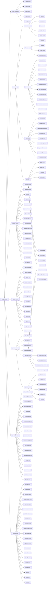

# 2. Query Processor Mindmap

```mermaid
flowchart LR
    QP[Query Processor]

    QP --> QC[Query Coordination]
    QP --> SP[SQL Parsing]
    QP --> SA[Semantic Analysis]
    QP --> LP[Logical Planning]
    QP --> QO[Query Optimization]
    QP --> PP[Physical Planning]
    QP --> QE[Query Execution]

    %% Query Coordination
    QC --> IQP[IQueryProcessor]
    QC --> QPS[QueryProcessor]
    QC --> QR[QueryRequest]
    QC --> QCTX[QueryContext]
    QC --> QRES[QueryResult]

    %% SQL Parsing
    SP --> LA[Lexical Analysis]
    LA --> SL[SqlLexer]
    LA --> TS[TokenStream]
    LA --> ST[SqlToken]
    LA --> STT[SqlTokenType]
    LA --> SLOC[SourceLocation]

    SP --> SYNP[Syntax Parsing]
    SYNP --> ISP[ISqlParser]
    SYNP --> SQLP[SqlParser]
    SYNP --> PC[ParserContext]
    SYNP --> SSE[SqlSyntaxException]

    SP --> STMTS[Statements]
    STMTS --> SS[SqlStatement]
    STMTS --> SEL[SelectStatement]
    STMTS --> INS[InsertStatement]
    STMTS --> UPD[UpdateStatement]
    STMTS --> DEL[DeleteStatement]
    STMTS --> CTS[CreateTableStatement]
    STMTS --> ATS[AlterTableStatement]
    STMTS --> DTS[DropTableStatement]
    STMTS --> CIS[CreateIndexStatement]
    STMTS --> BTS[BeginTransactionStatement]
    STMTS --> CS[CommitStatement]
    STMTS --> RS[RollbackStatement]

    SP --> EXPRS[Expressions]
    EXPRS --> SE[SqlExpression]
    EXPRS --> LE[LiteralExpression]
    EXPRS --> CRE[ColumnReferenceExpression]
    EXPRS --> BE[BinaryExpression]
    EXPRS --> UE[UnaryExpression]
    EXPRS --> FCE[FunctionCallExpression]
    EXPRS --> AE[AggregateExpression]
    EXPRS --> PE[ParameterExpression]
    EXPRS --> SQE[SubqueryExpression]

    SP --> CLAUSES[Clauses]
    CLAUSES --> SC[SelectClause]
    CLAUSES --> FC[FromClause]
    CLAUSES --> JC[JoinClause]
    CLAUSES --> WC[WhereClause]
    CLAUSES --> GBC[GroupByClause]
    CLAUSES --> HC[HavingClause]
    CLAUSES --> OBC[OrderByClause]
    CLAUSES --> LC[LimitClause]

    %% Semantic Analysis
    SA --> ISA[ISemanticAnalyzer]
    SA --> SAN[SemanticAnalyzer]
    SA --> SB[SqlBinder]
    SA --> TB[TableBinder]
    SA --> CB[ColumnBinder]
    SA --> EB[ExpressionBinder]
    SA --> FB[FunctionBinder]
    SA --> ONR[ObjectNameResolver]
    SA --> DTR[DataTypeResolver]
    SA --> ETC[ExpressionTypeChecker]
    SA --> AV[AggregateValidator]
    SA --> GV[GroupingValidator]
    SA --> SCTX[SemanticContext]
    SA --> BS[BoundStatement]
    SA --> BEX[BoundExpression]
    SA --> BT[BoundTable]
    SA --> BC[BoundColumn]

    %% Logical Planning
    LP --> ILPB[ILogicalPlanBuilder]
    LP --> LPB[LogicalPlanBuilder]
    LP --> LPLAN[LogicalPlan]
    LP --> LPN[LogicalPlanNode]
    LP --> LTS[LogicalTableScan]
    LP --> LF[LogicalFilter]
    LP --> LPROJ[LogicalProjection]
    LP --> LJ[LogicalJoin]
    LP --> LAGG[LogicalAggregate]
    LP --> LSORT[LogicalSort]
    LP --> LLIM[LogicalLimit]
    LP --> LINS[LogicalInsert]
    LP --> LUPD[LogicalUpdate]
    LP --> LDEL[LogicalDelete]

    %% Query Optimization
    QO --> IQO[IQueryOptimizer]
    QO --> QOPT[QueryOptimizer]
    QO --> OC[OptimizationContext]
    QO --> ORS[OptimizationRuleSet]

    QO --> RULES[Optimization Rules]
    RULES --> IOR[IOptimizationRule]
    RULES --> PPR[PredicatePushdownRule]
    RULES --> PPR2[ProjectionPruningRule]
    RULES --> CFR[ConstantFoldingRule]
    RULES --> JRR[JoinReorderingRule]
    RULES --> ROR[RedundantOperatorRemovalRule]
    RULES --> SFR[SubqueryFlatteningRule]

    QO --> CE[Cost Estimation]
    CE --> ICE[ICostEstimator]
    CE --> CEST[CostEstimator]
    CE --> CDEST[CardinalityEstimator]
    CE --> STP[StatisticsProvider]
    CE --> OPC[OperatorCost]
    CE --> PLC[PlanCost]

    %% Physical Planning
    PP --> IPPB[IPhysicalPlanBuilder]
    PP --> PPB[PhysicalPlanBuilder]
    PP --> APS[AccessPathSelector]
    PP --> JAS[JoinAlgorithmSelector]
    PP --> PPLAN[PhysicalPlan]
    PP --> PPN[PhysicalPlanNode]
    PP --> SSO[SequentialScanOperator]
    PP --> ISO[IndexScanOperator]
    PP --> FO[FilterOperator]
    PP --> PO[ProjectionOperator]
    PP --> NLJO[NestedLoopJoinOperator]
    PP --> HJO[HashJoinOperator]
    PP --> MJO[MergeJoinOperator]
    PP --> HAO[HashAggregateOperator]
    PP --> SO[SortOperator]
    PP --> LO[LimitOperator]
    PP --> IO[InsertOperator]
    PP --> UO[UpdateOperator]
    PP --> DO[DeleteOperator]

    %% Query Execution
    QE --> IQE[IQueryExecutor]
    QE --> QEX[QueryExecutor]
    QE --> ECTX[ExecutionContext]
    QE --> OEF[OperatorExecutorFactory]
    QE --> IOE[IOperatorExecutor]
    QE --> SSE2[SequentialScanExecutor]
    QE --> ISE[IndexScanExecutor]
    QE --> FE[FilterExecutor]
    QE --> PRE[ProjectionExecutor]
    QE --> NLJE[NestedLoopJoinExecutor]
    QE --> HJE[HashJoinExecutor]
    QE --> MJE[MergeJoinExecutor]
    QE --> AGE[AggregateExecutor]
    QE --> SE2[SortExecutor]
    QE --> LE2[LimitExecutor]
    QE --> IE[InsertExecutor]
    QE --> UE2[UpdateExecutor]
    QE --> DE[DeleteExecutor]
    QE --> RSET[ResultSet]
    QE --> RROW[ResultRow]
    QE --> DV[DataValue]
```
