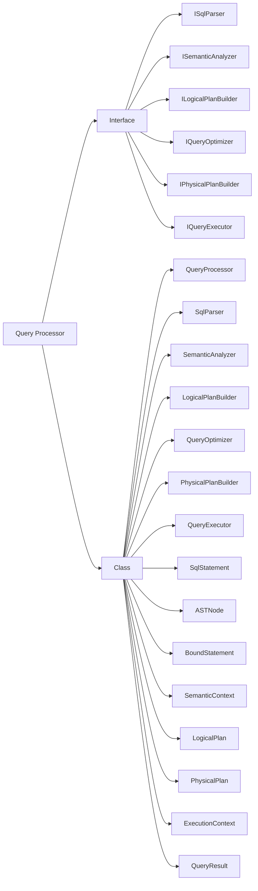

# 2. Query Processor Mindmap

```mermaid
flowchart LR
    QP[Query Processor]

    %% Interfaces
    QP --> INT[Interface]
    INT --> ISP[ISqlParser]
    INT --> ISA[ISemanticAnalyzer]
    INT --> ILPB[ILogicalPlanBuilder]
    INT --> IQO[IQueryOptimizer]
    INT --> IPPB[IPhysicalPlanBuilder]
    INT --> IQE[IQueryExecutor]

    %% Classes (Implementations)
    QP --> CLS[Class]
    CLS --> QPRoot[QueryProcessor]
    CLS --> SP[SqlParser]
    CLS --> SA[SemanticAnalyzer]
    CLS --> LPB[LogicalPlanBuilder]
    CLS --> QO[QueryOptimizer]
    CLS --> PPB[PhysicalPlanBuilder]
    CLS --> QE[QueryExecutor]

    %% Domain Models (Also in Class folder)
    CLS --> SS[SqlStatement]
    CLS --> AST[ASTNode]
    CLS --> BS[BoundStatement]
    CLS --> SC[SemanticContext]
    CLS --> LP[LogicalPlan]
    CLS --> PP[PhysicalPlan]
    CLS --> EC[ExecutionContext]
    CLS --> QR[QueryResult]
```
