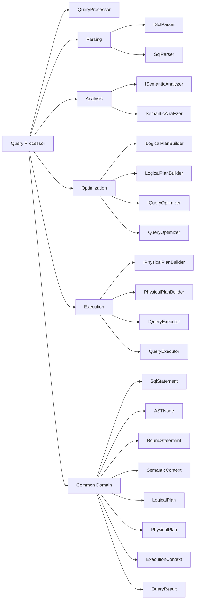

# 2. Query Processor Mindmap

```mermaid
flowchart LR
    QP[Query Processor]

    %% Root
    QP --> QPRoot[QueryProcessor]

    %% Parsing
    QP --> PARS[Parsing]
    PARS --> ISP[ISqlParser]
    PARS --> SP[SqlParser]

    %% Analysis
    QP --> ANA[Analysis]
    ANA --> ISA[ISemanticAnalyzer]
    ANA --> SA[SemanticAnalyzer]

    %% Optimization
    QP --> OPT[Optimization]
    OPT --> ILPB[ILogicalPlanBuilder]
    OPT --> LPB[LogicalPlanBuilder]
    OPT --> IQO[IQueryOptimizer]
    OPT --> QO[QueryOptimizer]

    %% Execution
    QP --> EXEC[Execution]
    EXEC --> IPPB[IPhysicalPlanBuilder]
    EXEC --> PPB[PhysicalPlanBuilder]
    EXEC --> IQE[IQueryExecutor]
    EXEC --> QE[QueryExecutor]

    %% Common Domain
    QP --> CD[Common Domain]
    CD --> SS[SqlStatement]
    CD --> AST[ASTNode]
    CD --> BS[BoundStatement]
    CD --> SC[SemanticContext]
    CD --> LP[LogicalPlan]
    CD --> PP[PhysicalPlan]
    CD --> EC[ExecutionContext]
    CD --> QR[QueryResult]
```
