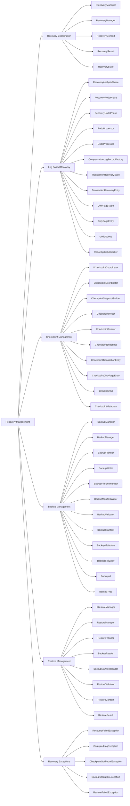

# 5. Recovery Management Mindmap

```mermaid
flowchart LR
    REC[Recovery Management]

    REC --> RC[Recovery Coordination]
    REC --> LBR[Log Based Recovery]
    REC --> CM[Checkpoint Management]
    REC --> BM[Backup Management]
    REC --> RSM[Restore Management]
    REC --> RE[Recovery Exceptions]

    %% Recovery Coordination
    RC --> IRM[IRecoveryManager]
    RC --> RM[RecoveryManager]
    RC --> RCTX[RecoveryContext]
    RC --> RRES[RecoveryResult]
    RC --> RS[RecoveryState]

    %% Log Based Recovery
    LBR --> RAP[RecoveryAnalysisPhase]
    LBR --> RRP[RecoveryRedoPhase]
    LBR --> RUP[RecoveryUndoPhase]
    LBR --> RP[RedoProcessor]
    LBR --> UP[UndoProcessor]
    LBR --> CLRF[CompensationLogRecordFactory]
    LBR --> TRT[TransactionRecoveryTable]
    LBR --> TRE[TransactionRecoveryEntry]
    LBR --> DPT[DirtyPageTable]
    LBR --> DPE[DirtyPageEntry]
    LBR --> UQ[UndoQueue]
    LBR --> RECHECK[RedoEligibilityChecker]

    %% Checkpoint Management
    CM --> ICC[ICheckpointCoordinator]
    CM --> CC[CheckpointCoordinator]
    CM --> CSB[CheckpointSnapshotBuilder]
    CM --> CW[CheckpointWriter]
    CM --> CR[CheckpointReader]
    CM --> CS[CheckpointSnapshot]
    CM --> CTE[CheckpointTransactionEntry]
    CM --> CDPE[CheckpointDirtyPageEntry]
    CM --> CID[CheckpointId]
    CM --> CMD[CheckpointMetadata]

    %% Backup Management
    BM --> IBM[IBackupManager]
    BM --> BMG[BackupManager]
    BM --> BP[BackupPlanner]
    BM --> BW[BackupWriter]
    BM --> BFE[BackupFileEnumerator]
    BM --> BMW[BackupManifestWriter]
    BM --> BV[BackupValidator]
    BM --> BMAN[BackupManifest]
    BM --> BMD[BackupMetadata]
    BM --> BFILEE[BackupFileEntry]
    BM --> BID[BackupId]
    BM --> BT[BackupType]

    %% Restore Management
    RSM --> IRSM[IRestoreManager]
    RSM --> RSMGR[RestoreManager]
    RSM --> RPL[RestorePlanner]
    RSM --> BR[BackupReader]
    RSM --> BMR[BackupManifestReader]
    RSM --> RV[RestoreValidator]
    RSM --> RSCTX[RestoreContext]
    RSM --> RSRES[RestoreResult]

    %% Exceptions
    RE --> RFE[RecoveryFailedException]
    RE --> CLE[CorruptedLogException]
    RE --> CNFE[CheckpointNotFoundException]
    RE --> BVE[BackupValidationException]
    RE --> RSFE[RestoreFailedException]
```
