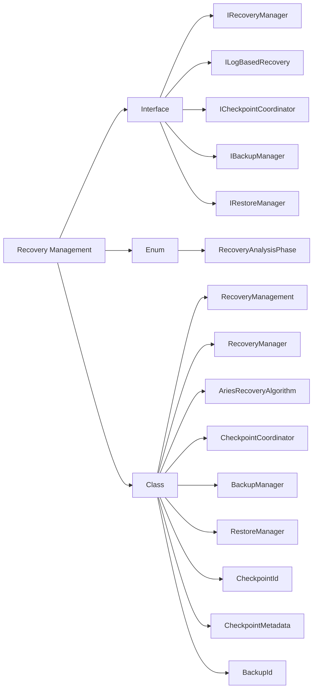

# 5. Recovery Management Mindmap

```mermaid
flowchart LR
    RM[Recovery Management]

    %% Interfaces
    RM --> INT[Interface]
    INT --> IRMGR[IRecoveryManager]
    INT --> ILBR[ILogBasedRecovery]
    INT --> ICC[ICheckpointCoordinator]
    INT --> IBM[IBackupManager]
    INT --> IRESM[IRestoreManager]

    %% Enums
    RM --> ENM[Enum]
    ENM --> RAP[RecoveryAnalysisPhase]

    %% Classes (Implementations)
    RM --> CLS[Class]
    CLS --> RMRS[RecoveryManagement]
    CLS --> RMGR[RecoveryManager]
    CLS --> ARA[AriesRecoveryAlgorithm]
    CLS --> CC[CheckpointCoordinator]
    CLS --> BMGR[BackupManager]
    CLS --> RESM[RestoreManager]

    %% Domain Models (Also in Class folder)
    CLS --> CHKID[CheckpointId]
    CLS --> CHKMD[CheckpointMetadata]
    CLS --> BKID[BackupId]
```
