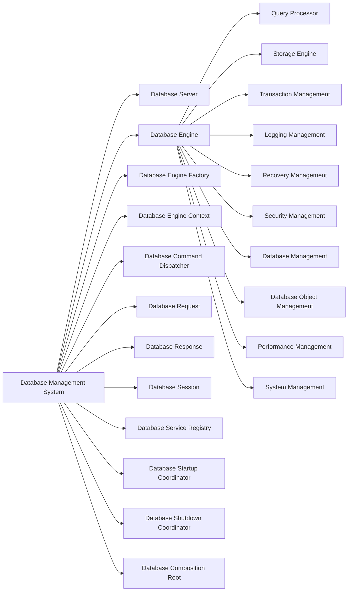

# 11. Root DBMS Mindmap

```mermaid
flowchart LR
    DBMS[Database Management System]

    DBMS --> DS[Database Server]
    DBMS --> DE[Database Engine]
    DBMS --> DEF[Database Engine Factory]
    DBMS --> DEC[Database Engine Context]
    DBMS --> DCD[Database Command Dispatcher]
    DBMS --> DR[Database Request]
    DBMS --> DRES[Database Response]
    DBMS --> DSESS[Database Session]
    DBMS --> DSR[Database Service Registry]
    DBMS --> DSC[Database Startup Coordinator]
    DBMS --> DSHC[Database Shutdown Coordinator]
    DBMS --> DCR[Database Composition Root]

    DE --> QP[Query Processor]
    DE --> SE[Storage Engine]
    DE --> TM[Transaction Management]
    DE --> LM[Logging Management]
    DE --> RM[Recovery Management]
    DE --> SEC[Security Management]
    DE --> DBM[Database Management]
    DE --> DOM[Database Object Management]
    DE --> PM[Performance Management]
    DE --> SM[System Management]
```
