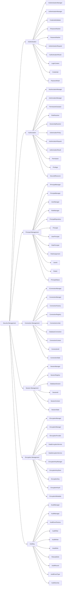

# 6. Security Management Mindmap

```mermaid
flowchart LR
    SEC[Security Management]

    SEC --> AUTHN[Authentication]
    SEC --> AUTHZ[Authorization]
    SEC --> PM[Principal Management]
    SEC --> CM[Connection Management]
    SEC --> SM[Session Management]
    SEC --> EM[Encryption Management]
    SEC --> AUD[Auditing]

    %% Authentication
    AUTHN --> IAM[IAuthenticationManager]
    AUTHN --> AM[AuthenticationManager]
    AUTHN --> CV[CredentialValidator]
    AUTHN --> IPH[IPasswordHasher]
    AUTHN --> PH[PasswordHasher]
    AUTHN --> AR[AuthenticationRequest]
    AUTHN --> ARES[AuthenticationResult]
    AUTHN --> LC[LoginContext]
    AUTHN --> CRED[Credential]
    AUTHN --> PWH[PasswordHash]

    %% Authorization
    AUTHZ --> IAZM[IAuthorizationManager]
    AUTHZ --> AZM[AuthorizationManager]
    AUTHZ --> PE[PermissionEvaluator]
    AUTHZ --> RR[RoleResolver]
    AUTHZ --> OR[OwnershipResolver]
    AUTHZ --> AP[AuthorizationPolicy]
    AUTHZ --> AZR[AuthorizationRequest]
    AUTHZ --> AZRES[AuthorizationResult]
    AUTHZ --> PERM[Permission]
    AUTHZ --> PRIV[Privilege]
    AUTHZ --> SR[SecuredResource]

    %% Principal Management
    PM --> IPM[IPrincipalManager]
    PM --> PMGR[PrincipalManager]
    PM --> UM[UserManager]
    PM --> RM[RoleManager]
    PM --> PR[PrincipalRepository]
    PM --> P[Principal]
    PM --> UP[UserPrincipal]
    PM --> RP[RolePrincipal]
    PM --> RA[RoleAssignment]
    PM --> UID[UserId]
    PM --> RID[RoleId]
    PM --> PS[PrincipalStatus]

    %% Connection Management
    CM --> ICM[IConnectionManager]
    CM --> CMGR[ConnectionManager]
    CM --> CF[ConnectionFactory]
    CM --> CR[ConnectionRegistry]
    CM --> CL[ConnectionLimiter]
    CM --> DC[DatabaseConnection]
    CM --> CCTX[ConnectionContext]
    CM --> CID[ConnectionId]
    CM --> CS[ConnectionState]

    %% Session Management
    SM --> SSM[SessionManager]
    SM --> SSR[SessionRegistry]
    SM --> DS[DatabaseSession]
    SM --> SID[SessionId]
    SM --> SCTX[SessionContext]
    SM --> SST[SessionState]

    %% Encryption Management
    EM --> IEM[IEncryptionManager]
    EM --> EMGR[EncryptionManager]
    EM --> IEP[IEncryptionProvider]
    EM --> DES[DataEncryptionService]
    EM --> DDS[DataDecryptionService]
    EM --> EKM[EncryptionKeyManager]
    EM --> EKS[EncryptionKeyStore]
    EM --> EK[EncryptionKey]
    EM --> EKID[EncryptionKeyId]
    EM --> EMD[EncryptionMetadata]

    %% Auditing
    AUD --> IAM2[IAuditManager]
    AUD --> AUDM[AuditManager]
    AUD --> AEF[AuditEventFactory]
    AUD --> AF[AuditFilter]
    AUD --> AW[AuditWriter]
    AUD --> IAS[IAuditSink]
    AUD --> FAS[FileAuditSink]
    AUD --> AREC[AuditRecord]
    AUD --> AET[AuditEventType]
    AUD --> AS[AuditSeverity]
```
