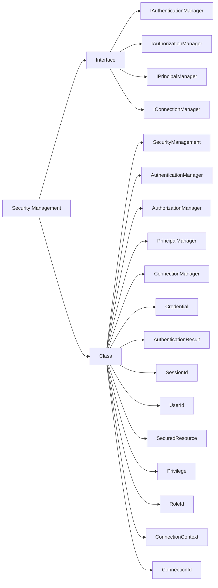

# 6. Security Management Mindmap

```mermaid
flowchart LR
    SecM[Security Management]

    %% Interfaces
    SecM --> INT[Interface]
    INT --> IAUTHN[IAuthenticationManager]
    INT --> IAUTHZ[IAuthorizationManager]
    INT --> IPMGR[IPrincipalManager]
    INT --> ICONN[IConnectionManager]

    %% Classes (Implementations)
    SecM --> CLS[Class]
    CLS --> SECM[SecurityManagement]
    CLS --> AUTHN[AuthenticationManager]
    CLS --> AUTHZ[AuthorizationManager]
    CLS --> PMGR[PrincipalManager]
    CLS --> CONN[ConnectionManager]

    %% Domain Models (Also in Class folder)
    CLS --> CRED[Credential]
    CLS --> ARET[AuthenticationResult]
    CLS --> SESS[SessionId]
    CLS --> UID[UserId]
    CLS --> SRES[SecuredResource]
    CLS --> PRIV[Privilege]
    CLS --> RID[RoleId]
    CLS --> CCTX[ConnectionContext]
    CLS --> CID[ConnectionId]
```
