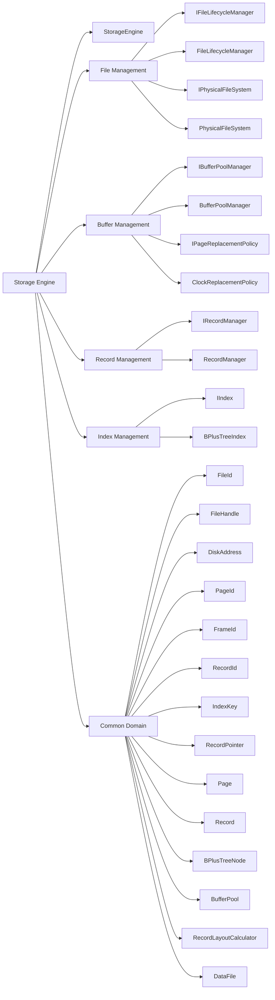

# 1. Storage Engine Mindmap

```mermaid
flowchart LR
    SE[Storage Engine]

    %% Root
    SE --> SERoot[StorageEngine]

    %% File Management
    SE --> FM[File Management]
    FM --> IFLM[IFileLifecycleManager]
    FM --> FLM[FileLifecycleManager]
    FM --> IPFS[IPhysicalFileSystem]
    FM --> PFS[PhysicalFileSystem]

    %% Buffer Management
    SE --> BM[Buffer Management]
    BM --> IBPM[IBufferPoolManager]
    BM --> BPM[BufferPoolManager]
    BM --> IPRP[IPageReplacementPolicy]
    BM --> CRP[ClockReplacementPolicy]

    %% Record Management
    SE --> RM[Record Management]
    RM --> IRM[IRecordManager]
    RM --> RMGR[RecordManager]

    %% Index Management
    SE --> IM[Index Management]
    IM --> IIDX[IIndex]
    IM --> BPTI[BPlusTreeIndex]

    %% Common Domain
    SE --> CD[Common Domain]
    CD --> FID[FileId]
    CD --> FH[FileHandle]
    CD --> DA[DiskAddress]
    CD --> PID[PageId]
    CD --> FRID[FrameId]
    CD --> RID[RecordId]
    CD --> IK[IndexKey]
    CD --> RP[RecordPointer]
    CD --> PAGE[Page]
    CD --> REC[Record]
    CD --> BPTN[BPlusTreeNode]
    CD --> BPOOL[BufferPool]
    CD --> RLC[RecordLayoutCalculator]
    CD --> DF[DataFile]
```
