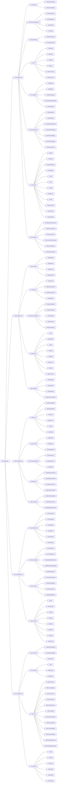

# 1. Storage Engine Mindmap

```mermaid
flowchart LR
    SE[Storage Engine]

    SE --> FM[File Management]
    SE --> PGM[Page Management]
    SE --> BM[Buffer Management]
    SE --> RM[Record Management]
    SE --> IM[Index Management]

    %% File Management
    FM --> FL[File Lifecycle]
    FL --> IFLM[IFileLifecycleManager]
    FL --> FLM[FileLifecycleManager]

    FM --> RFM[Runtime File Management]
    RFM --> IOFM[IOpenFileManager]
    RFM --> OFM[OpenFileManager]
    RFM --> OFE[OpenFileEntry]
    RFM --> FH[FileHandle]

    FM --> PS[Physical Storage]
    PS --> IPFS[IPhysicalFileSystem]
    PS --> PFS[PhysicalFileSystem]

    FM --> FIO[File IO]
    FIO --> IFR[IFileReader]
    FIO --> FR[FileReader]
    FIO --> IFW[IFileWriter]
    FIO --> FW[FileWriter]
    FIO --> IFS[IFileSynchronizer]
    FIO --> FS[FileSynchronizer]

    FM --> FV[File Validation]
    FV --> IFV[IFileValidator]
    FV --> FVAL[FileValidator]
    FV --> FHV[FileHeaderValidator]
    FV --> AMV[AllocationMetadataValidator]
    FV --> FSV[FileSizeValidator]

    FM --> EM[Extent Management]
    EM --> IEM[IExtentManager]
    EM --> EMM[ExtentManager]
    EM --> IEAS[IExtentAllocationStrategy]
    EM --> FFES[FirstFreeExtentStrategy]
    EM --> NFES[NextFitExtentStrategy]
    EM --> BFES[BestFitExtentStrategy]
    EM --> EUT[ExtentUsageTracker]

    FM --> FD[File Domain]
    FD --> DF[DataFile]
    FD --> FHD[FileHeader]
    FD --> AMD[AllocationMetadata]
    FD --> EB[ExtentBitmap]
    FD --> EXT[Extent]
    FD --> FID[FileId]
    FD --> EID[ExtentId]
    FD --> DA[DiskAddress]
    FD --> FT[FileType]
    FD --> FAM[FileAccessMode]
    FD --> FLM2[FileLockMode]
    FD --> AS[AllocationStatus]

    FM --> FE[File Exceptions]
    FE --> FAEE[FileAlreadyExistsException]
    FE --> FNFE[FileNotFoundException]
    FE --> FIUE[FileInUseException]
    FE --> FACE[FileAccessConflictException]
    FE --> FFE[FileFormatException]
    FE --> FOE[FileOperationException]

    %% Page Management
    PGM --> PL[Page Lifecycle]
    PL --> IPM[IPageManager]
    PL --> PM[PageManager]
    PL --> PA[PageAllocator]
    PL --> PD[PageDeallocator]

    PGM --> PLO[Page Layout]
    PLO --> PF[PageFactory]
    PLO --> PLC[PageLayoutCalculator]
    PLO --> POC[PageOffsetCalculator]
    PLO --> PI[PageInitializer]

    PGM --> FSM[Free Space Management]
    FSM --> IFSM[IFreeSpaceManager]
    FSM --> FSMGR[FreeSpaceManager]
    FSM --> FSMAP[FreeSpaceMap]
    FSM --> FSE[FreeSpaceEntry]
    FSM --> PSS[PageSpaceSelector]

    PGM --> PGD[Page Domain]
    PGD --> PAGE[Page]
    PGD --> PH[PageHeader]
    PGD --> PID[PageId]
    PGD --> PT[PageType]
    PGD --> PST[PageState]
    PGD --> SD[SlotDirectory]
    PGD --> SDE[SlotEntry]
    PGD --> PC[PageChecksum]

    PGM --> PV[Page Validation]
    PV --> IPV[IPageValidator]
    PV --> PVAL[PageValidator]
    PV --> PIV[PageIdValidator]
    PV --> PCV[PageChecksumValidator]

    %% Buffer Management
    BM --> BP[Buffer Pool]
    BP --> IBPM[IBufferPoolManager]
    BP --> BPM[BufferPoolManager]
    BP --> BPO[BufferPool]
    BP --> BF[BufferFrame]
    BP --> FRID[FrameId]
    BP --> FTBL[FrameTable]

    BM --> PGL[Page Loading]
    PGL --> PLDR[PageLoader]
    PGL --> PE[PageEvictor]
    PGL --> BPMAP[BufferPageMapper]

    BM --> DPM[Dirty Page Management]
    DPM --> DPT[DirtyPageTracker]
    DPM --> DPF[DirtyPageFlusher]
    DPM --> FB[FlushBatch]

    BM --> RP[Replacement]
    RP --> IPRP[IPageReplacementPolicy]
    RP --> CRP[ClockReplacementPolicy]
    RP --> LRP[LruReplacementPolicy]
    RP --> RC[ReplacementCandidate]

    BM --> BE[Buffer Exceptions]
    BE --> BPFE[BufferPoolFullException]
    BE --> PPE[PagePinnedException]
    BE --> PNBE[PageNotBufferedException]

    %% Record Management
    RM --> RO[Record Operations]
    RO --> IRM[IRecordManager]
    RO --> RMGR[RecordManager]
    RO --> RR[RecordReader]
    RO --> RW[RecordWriter]
    RO --> RU[RecordUpdater]
    RO --> RD[RecordDeleter]

    RM --> RS[Record Serialization]
    RS --> RSER[RecordSerializer]
    RS --> RDES[RecordDeserializer]
    RS --> FLFS[FixedLengthFieldSerializer]
    RS --> VLFS[VariableLengthFieldSerializer]
    RS --> NBS[NullBitmapSerializer]

    RM --> RL[Record Layout]
    RL --> RLC[RecordLayoutCalculator]
    RL --> SDM[SlotDirectoryManager]
    RL --> RCMP[RecordCompactor]
    RL --> VDM[VariableDataManager]

    RM --> RDOM[Record Domain]
    RDOM --> REC[Record]
    RDOM --> RH[RecordHeader]
    RDOM --> RID[RecordId]
    RDOM --> ROW[RowData]
    RDOM --> FV2[FieldValue]
    RDOM --> NB[NullBitmap]
    RDOM --> FXD[FixedData]
    RDOM --> VD[VariableData]

    %% Index Management
    IM --> IL[Index Lifecycle]
    IL --> IPIM[IPhysicalIndexManager]
    IL --> PIM[PhysicalIndexManager]
    IL --> IFAC[IndexFactory]

    IM --> IC[Index Contract]
    IC --> II[IIndex]
    IC --> IIR[IIndexReader]
    IC --> IIW[IIndexWriter]

    IM --> BPT[B Plus Tree]
    BPT --> BPTI[BPlusTreeIndex]
    BPT --> BPTN[BPlusTreeNavigator]
    BPT --> BPTINS[BPlusTreeInserter]
    BPT --> BPTDEL[BPlusTreeDeleter]
    BPT --> BPTR[BPlusTreeRebalancer]
    BPT --> BPTNODE[BPlusTreeNode]
    BPT --> BPTIN[BPlusTreeInternalNode]
    BPT --> BPTLN[BPlusTreeLeafNode]
    BPT --> BPTNS[BPlusTreeNodeSplitter]
    BPT --> BPTNM[BPlusTreeNodeMerger]
    BPT --> BPTSER[BPlusTreeNodeSerializer]
    BPT --> BPTDES[BPlusTreeNodeDeserializer]

    IM --> IDOM[Index Domain]
    IDOM --> IID[IndexId]
    IDOM --> IK[IndexKey]
    IDOM --> IE[IndexEntry]
    IDOM --> IPID[IndexPageId]
    IDOM --> INID[IndexNodeId]
    IDOM --> RPTR[RecordPointer]
```
