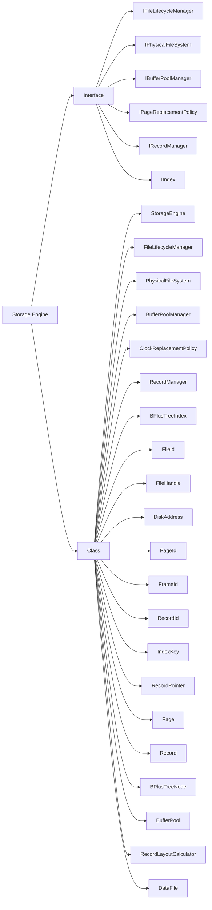

# 1. Storage Engine Mindmap

```mermaid
flowchart LR
    SE[Storage Engine]

    %% Interfaces
    SE --> INT[Interface]
    INT --> IFLM[IFileLifecycleManager]
    INT --> IPFS[IPhysicalFileSystem]
    INT --> IBPM[IBufferPoolManager]
    INT --> IPRP[IPageReplacementPolicy]
    INT --> IRM[IRecordManager]
    INT --> IIDX[IIndex]

    %% Classes (Implementations)
    SE --> CLS[Class]
    CLS --> SERoot[StorageEngine]
    CLS --> FLM[FileLifecycleManager]
    CLS --> PFS[PhysicalFileSystem]
    CLS --> BPM[BufferPoolManager]
    CLS --> CRP[ClockReplacementPolicy]
    CLS --> RMGR[RecordManager]
    CLS --> BPTI[BPlusTreeIndex]

    %% Domain Models (Also in Class folder)
    CLS --> FID[FileId]
    CLS --> FH[FileHandle]
    CLS --> DA[DiskAddress]
    CLS --> PID[PageId]
    CLS --> FRID[FrameId]
    CLS --> RID[RecordId]
    CLS --> IK[IndexKey]
    CLS --> RP[RecordPointer]
    CLS --> PAGE[Page]
    CLS --> REC[Record]
    CLS --> BPTN[BPlusTreeNode]
    CLS --> BPOOL[BufferPool]
    CLS --> RLC[RecordLayoutCalculator]
    CLS --> DF[DataFile]
```
