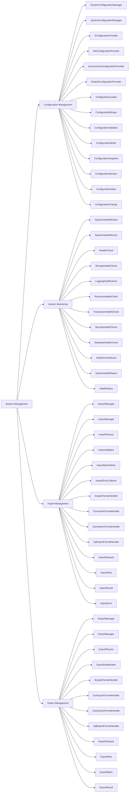

# 10. System Management Mindmap

```mermaid
flowchart LR
    SYSM[System Management]

    SYSM --> CM[Configuration Management]
    SYSM --> SM[System Monitoring]
    SYSM --> IM[Import Management]
    SYSM --> EM[Export Management]

    %% Configuration Management
    CM --> ISCM[ISystemConfigurationManager]
    CM --> SCM[SystemConfigurationManager]
    CM --> ICP[IConfigurationProvider]
    CM --> FCP[FileConfigurationProvider]
    CM --> ECP[EnvironmentConfigurationProvider]
    CM --> DCP[DefaultConfigurationProvider]
    CM --> CL[ConfigurationLoader]
    CM --> CMR[ConfigurationMerger]
    CM --> CV[ConfigurationValidator]
    CM --> CW[ConfigurationWriter]
    CM --> CS[ConfigurationSnapshot]
    CM --> CSEC[ConfigurationSection]
    CM --> CVAL[ConfigurationValue]
    CM --> CCH[ConfigurationChange]

    %% System Monitoring
    SM --> ISHM[ISystemHealthMonitor]
    SM --> SHM[SystemHealthMonitor]
    SM --> IHC[IHealthCheck]
    SM --> SHC[StorageHealthCheck]
    SM --> LHC[LoggingHealthCheck]
    SM --> RHC[RecoveryHealthCheck]
    SM --> THC[TransactionHealthCheck]
    SM --> SEHC[SecurityHealthCheck]
    SM --> DHC[DatabaseHealthCheck]
    SM --> HCR[HealthCheckResult]
    SM --> SHR[SystemHealthReport]
    SM --> HS[HealthStatus]

    %% Import Management
    IM --> IIM[IImportManager]
    IM --> IMG[ImportManager]
    IM --> IP[ImportPlanner]
    IM --> IV[ImportValidator]
    IM --> IBW[ImportBatchWriter]
    IM --> IEC[ImportErrorCollector]
    IM --> IIFH[IImportFormatHandler]
    IM --> CIFH[CsvImportFormatHandler]
    IM --> JIFH[JsonImportFormatHandler]
    IM --> SIFH[SqlImportFormatHandler]
    IM --> IR[ImportRequest]
    IM --> IPLAN[ImportPlan]
    IM --> IRES[ImportResult]
    IM --> IE[ImportError]

    %% Export Management
    EM --> IEM[IExportManager]
    EM --> EMGR[ExportManager]
    EM --> EP[ExportPlanner]
    EM --> EDR[ExportDataReader]
    EM --> IEFH[IExportFormatHandler]
    EM --> CEFH[CsvExportFormatHandler]
    EM --> JEFH[JsonExportFormatHandler]
    EM --> SEFH[SqlExportFormatHandler]
    EM --> ER[ExportRequest]
    EM --> EPLAN[ExportPlan]
    EM --> EB[ExportBatch]
    EM --> ERES[ExportResult]
```
