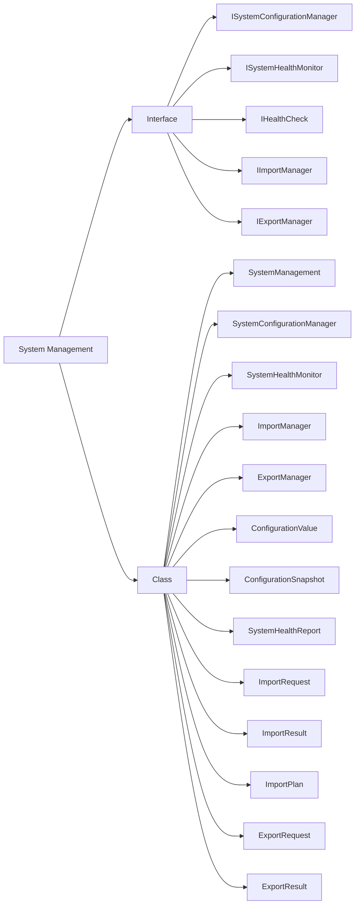

# 10. System Management Mindmap

```mermaid
flowchart LR
    SysM[System Management]

    %% Interfaces
    SysM --> INT[Interface]
    INT --> ISCM[ISystemConfigurationManager]
    INT --> ISHM[ISystemHealthMonitor]
    INT --> IHC[IHealthCheck]
    INT --> IIM[IImportManager]
    INT --> IEM[IExportManager]

    %% Classes (Implementations)
    SysM --> CLS[Class]
    CLS --> SYSM[SystemManagement]
    CLS --> SCM[SystemConfigurationManager]
    CLS --> SHM[SystemHealthMonitor]
    CLS --> IMGR[ImportManager]
    CLS --> EMGR[ExportManager]

    %% Domain Models (Also in Class folder)
    CLS --> CVAL[ConfigurationValue]
    CLS --> CSNAP[ConfigurationSnapshot]
    CLS --> SHREP[SystemHealthReport]
    CLS --> IREQ[ImportRequest]
    CLS --> IRES[ImportResult]
    CLS --> IPLAN[ImportPlan]
    CLS --> EREQ[ExportRequest]
    CLS --> ERES[ExportResult]
```
