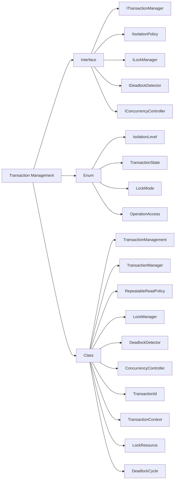

# 3. Transaction Management Mindmap

```mermaid
flowchart LR
    TM[Transaction Management]

    %% Interfaces
    TM --> INT[Interface]
    INT --> ITM[ITransactionManager]
    INT --> IIP[IIsolationPolicy]
    INT --> ILM[ILockManager]
    INT --> IDD[IDeadlockDetector]
    INT --> ICC[IConcurrencyController]

    %% Enums
    TM --> ENM[Enum]
    ENM --> IL[IsolationLevel]
    ENM --> TS[TransactionState]
    ENM --> LM[LockMode]
    ENM --> OA[OperationAccess]

    %% Classes (Implementations)
    TM --> CLS[Class]
    CLS --> TMRoot[TransactionManagement]
    CLS --> TMGR[TransactionManager]
    CLS --> RRP[RepeatableReadPolicy]
    CLS --> LMGR[LockManager]
    CLS --> DD[DeadlockDetector]
    CLS --> CCM[ConcurrencyController]

    %% Domain Models (Also in Class folder)
    CLS --> TID[TransactionId]
    CLS --> TC[TransactionContext]
    CLS --> LR[LockResource]
    CLS --> DC[DeadlockCycle]
```
