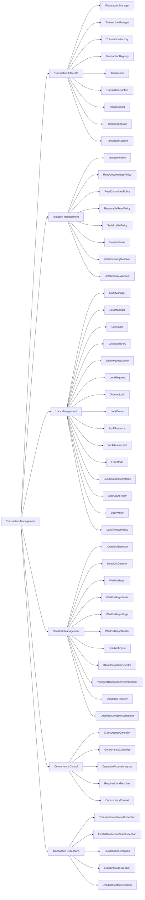

# 3. Transaction Management Mindmap

```mermaid
flowchart LR
    TM[Transaction Management]

    TM --> TL[Transaction Lifecycle]
    TM --> ISO[Isolation Management]
    TM --> LM[Lock Management]
    TM --> DM[Deadlock Management]
    TM --> CC[Concurrency Control]
    TM --> TE[Transaction Exceptions]

    %% Transaction Lifecycle
    TL --> ITM[ITransactionManager]
    TL --> TMGR[TransactionManager]
    TL --> TF[TransactionFactory]
    TL --> TR[TransactionRegistry]
    TL --> TX[Transaction]
    TL --> TC[TransactionContext]
    TL --> TID[TransactionId]
    TL --> TS[TransactionState]
    TL --> TO[TransactionOptions]

    %% Isolation Management
    ISO --> IIP[IIsolationPolicy]
    ISO --> RUIP[ReadUncommittedPolicy]
    ISO --> RCIP[ReadCommittedPolicy]
    ISO --> RRIP[RepeatableReadPolicy]
    ISO --> SIP[SerializablePolicy]
    ISO --> IL[IsolationLevel]
    ISO --> IPR[IsolationPolicyResolver]
    ISO --> IRV[IsolationRuleValidator]

    %% Lock Management
    LM --> ILM[ILockManager]
    LM --> LMGR[LockManager]
    LM --> LT[LockTable]
    LM --> LTE[LockTableEntry]
    LM --> LRQ[LockRequestQueue]
    LM --> LR[LockRequest]
    LM --> GL[GrantedLock]
    LM --> LO[LockOwner]
    LM --> LRES[LockResource]
    LM --> LRID[LockResourceId]
    LM --> LMODE[LockMode]
    LM --> LCM[LockCompatibilityMatrix]
    LM --> LGP[LockGrantPolicy]
    LM --> LW[LockWaiter]
    LM --> LTP[LockTimeoutPolicy]

    %% Deadlock Management
    DM --> IDD[IDeadlockDetector]
    DM --> DD[DeadlockDetector]
    DM --> WFG[WaitForGraph]
    DM --> WFGN[WaitForGraphNode]
    DM --> WFGE[WaitForGraphEdge]
    DM --> WFGB[WaitForGraphBuilder]
    DM --> DC[DeadlockCycle]
    DM --> IDVS[IDeadlockVictimSelector]
    DM --> YTVS[YoungestTransactionVictimSelector]
    DM --> DR[DeadlockResolver]
    DM --> DDS[DeadlockDetectionScheduler]

    %% Concurrency Control
    CC --> ICC[IConcurrencyController]
    CC --> CCTRL[ConcurrencyController]
    CC --> OAA[OperationAccessAnalyzer]
    CC --> RLR[RequiredLockResolver]
    CC --> CCTX[ConcurrencyContext]

    %% Exceptions
    TE --> TNFE[TransactionNotFoundException]
    TE --> ITSE[InvalidTransactionStateException]
    TE --> LCE[LockConflictException]
    TE --> LTE2[LockTimeoutException]
    TE --> DVE[DeadlockVictimException]
```
