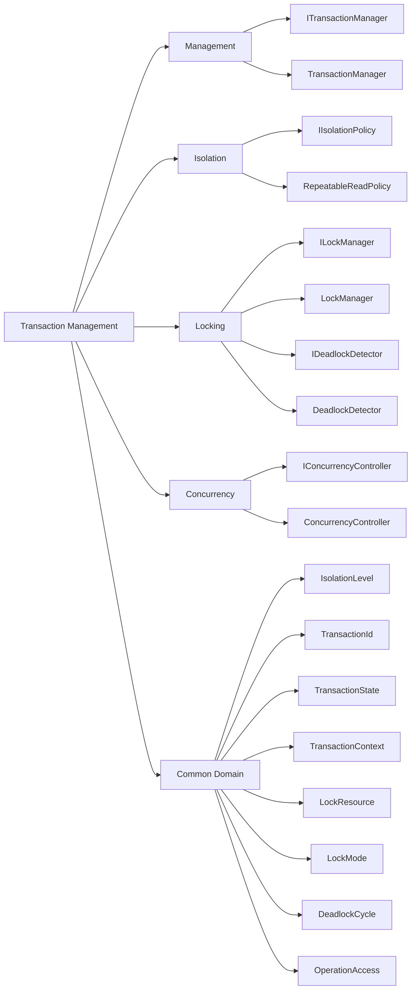

# 3. Transaction Management Mindmap

```mermaid
flowchart LR
    TM[Transaction Management]

    %% Management
    TM --> MGT[Management]
    MGT --> ITM[ITransactionManager]
    MGT --> TMGR[TransactionManager]

    %% Isolation
    TM --> ISO[Isolation]
    ISO --> IIP[IIsolationPolicy]
    ISO --> RRP[RepeatableReadPolicy]

    %% Locking
    TM --> LCK[Locking]
    LCK --> ILM[ILockManager]
    LCK --> LMGR[LockManager]
    LCK --> IDD[IDeadlockDetector]
    LCK --> DD[DeadlockDetector]

    %% Concurrency
    TM --> CC[Concurrency]
    CC --> ICC[IConcurrencyController]
    CC --> CCM[ConcurrencyController]

    %% Common Domain
    TM --> CD[Common Domain]
    CD --> IL[IsolationLevel]
    CD --> TID[TransactionId]
    CD --> TS[TransactionState]
    CD --> TC[TransactionContext]
    CD --> LR[LockResource]
    CD --> LM[LockMode]
    CD --> DC[DeadlockCycle]
    CD --> OA[OperationAccess]
```
