# Database Design Patterns

This document tracks the design patterns used across different modules in the DBMS and their current implementation status.

```mermaid
flowchart LR

    %% =========================================================
    %% LEFT SIDE — DATABASE OBJECTS
    %% =========================================================

    Obj_TM["🔴 Template Method ☑<br/>Constraint Validation"] --> DBObj["Database Objects"]
    Obj_FM["🔴 Factory Method ☑<br/>Constraint Creation"] --> DBObj
    Obj_S["🔴 Strategy ☑<br/>Referential Actions"] --> DBObj
    Obj_C["🔴 Composite ☑<br/>Schema Objects"] --> DBObj
    Obj_Cmd["🔴 Command ☑<br/>DDL Operations"] --> DBObj

    Obj_I["🟡 Iterator ☑<br/>Schema Traversal"] --> DBObj
    Obj_V["🟡 Visitor ☑<br/>Schema Operations"] --> DBObj
    Obj_B["🟡 Builder ☑<br/>Table Definition"] --> DBObj

    Obj_P["🟢 Prototype ☑<br/>Object Cloning"] --> DBObj
    Obj_D["🟢 Decorator ☐<br/>Constraint Extension"] --> DBObj
    Obj_M["🟢 Mediator ☐<br/>Dependency Coordination"] --> DBObj


    %% =========================================================
    %% LEFT SIDE — DATABASE MANAGEMENT
    %% =========================================================

    Mgmt_F["🔴 Facade ☑<br/>DatabaseServer"] --> DBMgmt["Database Management"]
    Mgmt_Sing["🔴 Singleton ☑<br/>DatabaseManager"] --> DBMgmt
    Mgmt_Cmd["🔴 Command ☑<br/>Database Operations"] --> DBMgmt
    Mgmt_O["🔴 Observer ☑<br/>Database Events"] --> DBMgmt
    Mgmt_S["🔴 State ☑<br/>Database Lifecycle"] --> DBMgmt
    Mgmt_Br["🔴 Bridge ☐<br/>Database ↔ Storage Engine"] --> DBMgmt

    Mgmt_FM["🟡 Factory Method ☑<br/>Database Creation"] --> DBMgmt
    Mgmt_TM["🟡 Template Method ☑<br/>Lifecycle Workflow"] --> DBMgmt

    Mgmt_B["🟢 Builder ☐<br/>Database Configuration"] --> DBMgmt
    Mgmt_M["🟢 Mediator ☐<br/>Subsystem Coordination"] --> DBMgmt


    %% =========================================================
    %% LEFT SIDE — STORAGE ENGINE
    %% =========================================================

    SE_Str["🔴 Strategy ☐<br/>Page Replacement"] --> SE["Storage Engine"]
    SE_F["🔴 Facade ☐<br/>Storage API"] --> SE
    SE_A["🔴 Adapter ☐<br/>Physical File System"] --> SE

    SE_TM["🟡 Template Method ☐<br/>Page Operations"] --> SE
    SE_FM["🟡 Factory Method ☐<br/>Page Creation"] --> SE
    SE_P["🟡 Proxy ☐<br/>Buffered Page Access"] --> SE

    SE_S["🟢 State ☐<br/>Engine Lifecycle"] --> SE
    SE_D["🟢 Decorator ☐<br/>Storage Instrumentation"] --> SE


    %% =========================================================
    %% LEFT SIDE — TRANSACTION MANAGEMENT
    %% =========================================================

    TM_F["🔴 Facade ☐<br/>Transaction API"] --> TM["Transaction Management"]
    TM_Str["🔴 Strategy ☐<br/>Concurrency Control"] --> TM
    TM_S["🔴 State ☐<br/>Transaction Lifecycle"] --> TM
    TM_CoR["🔴 Chain of Responsibility ☐<br/>Lock Compatibility"] --> TM

    TM_Cmd["🟡 Command ☐<br/>Transactional Operations"] --> TM
    TM_O["🟡 Observer ☐<br/>Transaction Events"] --> TM
    TM_TM["🟡 Template Method ☐<br/>Commit / Rollback Workflow"] --> TM

    TM_FM["🟢 Factory Method ☐<br/>Transaction Creation"] --> TM


    %% =========================================================
    %% LEFT SIDE — RECOVERY MANAGEMENT
    %% =========================================================

    RM_TM["🔴 Template Method ☐<br/>Recovery Workflow"] --> RM["Recovery Management"]
    RM_Cmd["🔴 Command ☐<br/>WAL Log Records"] --> RM
    RM_Str["🔴 Strategy ☐<br/>Recovery / Backup Strategy"] --> RM
    RM_Mem["🔴 Memento ☐<br/>Database Checkpoint / Configuration Snapshot"] --> RM

    RM_O["🟡 Observer ☐<br/>Recovery Events"] --> RM
    RM_B["🟡 Builder ☐<br/>Backup Construction"] --> RM
    RM_CoR["🟡 Chain of Responsibility ☐<br/>Recovery Phases"] --> RM

    RM_FM["🟢 Factory Method ☐<br/>Log Record Creation"] --> RM


    %% =========================================================
    %% LEFT MODULES → ROOT
    %% =========================================================

    DBObj --- Root["DBMS<br/>Design Patterns"]
    DBMgmt --- Root
    SE --- Root
    TM --- Root
    RM --- Root


    %% =========================================================
    %% ROOT → RIGHT MODULES
    %% =========================================================

    Root --- QP["Query Processor"]
    Root --- CM["Catalog Management"]
    Root --- SM["Security Management"]
    Root --- RepM["Replication Management"]
    Root --- MonM["Monitoring Management"]


    %% =========================================================
    %% RIGHT SIDE — QUERY PROCESSOR
    %% =========================================================

    QP --> QP_Int["🔴 Interpreter ☑<br/>SQL / AST Evaluation"]
    QP --> QP_Vis["🔴 Visitor ☑<br/>AST Processing"]
    QP --> QP_Str["🔴 Strategy ☑<br/>Query Optimization"]
    QP --> QP_FM["🔴 Factory Method ☑<br/>Physical Operator Creation"]
    QP --> QP_AF["🔴 Abstract Factory ☐<br/>Query Processor Factory"]
    QP --> QP_Px["🔴 Proxy ☐<br/>Lazy Physical Operator / Remote Table Proxy"]
    QP --> QP_Comp["🟡 Composite ☑<br/>Query Plan Tree"]
    QP --> QP_Iter["🟡 Iterator ☑<br/>Query Result Execution"]

    QP --> QP_Cmd["🟡 Command ☐<br/>SQL Statement Execution"]

    QP --> QP_CoR["🟢 Chain of Responsibility ☐<br/>Optimization Pipeline"]
    QP --> QP_Bld["🟢 Builder ☐<br/>Query Plan Construction"]
    QP --> QP_TM["🟢 Template Method ☐<br/>Physical Operator Execution"]


    %% =========================================================
    %% RIGHT SIDE — CATALOG MANAGEMENT
    %% =========================================================

    CM --> CM_R["🔴 Repository ☐<br/>Catalog Object Registry"]
    CM --> CM_O["🔴 Observer ☐<br/>Metadata Synchronization"]
    CM --> CM_Str["🔴 Strategy ☐<br/>Selectivity Estimation"]
    CM --> CM_FW["🔴 Flyweight ☑<br/>Shared DataType / Metadata"]

    CM --> CM_V["🟡 Visitor ☐<br/>Metadata Operations"]
    CM --> CM_FM["🟡 Factory Method ☐<br/>Catalog Entry Creation"]
    CM --> CM_C["🟡 Composite ☐<br/>Metadata Hierarchy"]

    CM --> CM_D["🟢 Decorator ☐<br/>Metadata Cache"]


    %% =========================================================
    %% RIGHT SIDE — SECURITY MANAGEMENT
    %% =========================================================

    SM --> SM_CoR["🔴 Chain of Responsibility ☐<br/>Authentication / Authorization"]
    SM --> SM_Comp["🔴 Composite ☐<br/>Role / Permission Hierarchy"]
    SM --> SM_P["🔴 Proxy ☐<br/>Protected Resource Access"]

    SM --> SM_Str["🟡 Strategy ☐<br/>Authentication Strategy"]
    SM --> SM_O["🟡 Observer ☐<br/>Security Audit Events"]

    SM --> SM_FM["🟢 Factory Method ☐<br/>Principal Creation"]
    SM --> SM_D["🟢 Decorator ☐<br/>Audit Extension"]


    %% =========================================================
    %% RIGHT SIDE — REPLICATION MANAGEMENT
    %% =========================================================

    RepM --> Rep_Str["🔴 Strategy ☐<br/>Replication Mode"]
    RepM --> Rep_O["🔴 Observer ☐<br/>Database Change Events"]
    RepM --> Rep_S["🔴 State ☐<br/>Cluster Node Lifecycle"]

    RepM --> Rep_Cmd["🟡 Command ☐<br/>Replication Messages"]
    RepM --> Rep_M["🟡 Mediator ☐<br/>Cluster Coordination"]

    RepM --> Rep_CoR["🟢 Chain of Responsibility ☐<br/>Replication Pipeline"]


    %% =========================================================
    %% RIGHT SIDE — MONITORING MANAGEMENT
    %% =========================================================

    MonM --> Mon_O["🔴 Observer ☐<br/>System Events"]
    MonM --> Mon_Str["🔴 Strategy ☐<br/>Metric Collection"]

    MonM --> Mon_D["🟡 Decorator ☐<br/>Instrumentation"]
    MonM --> Mon_V["🟡 Visitor ☐<br/>Component Inspection"]

    MonM --> Mon_A["🟢 Adapter ☐<br/>External Monitoring Export"]


    %% =========================================================
    %% STYLES
    %% =========================================================

    classDef root fill:#dbeafe,stroke:#1d4ed8,stroke-width:5px,color:#111827,font-weight:bold,font-size:18px;

    classDef main_module fill:#8b5cf6,stroke:#5b21b6,stroke-width:4px,color:#ffffff,font-weight:bold,font-size:17px;

    classDef module fill:#fbbf24,stroke:#b45309,stroke-width:3px,color:#111827,font-weight:bold,font-size:15px;

    classDef implemented fill:#dcfce7,stroke:#16a34a,stroke-width:2px,color:#111827;

    classDef high fill:#fee2e2,stroke:#dc2626,stroke-width:2px,color:#111827;

    classDef medium fill:#fef3c7,stroke:#d97706,stroke-width:2px,color:#111827;

    classDef low fill:#dcfce7,stroke:#16a34a,stroke-width:1px,color:#111827;


    %% ROOT
    class Root root;


    %% MODULES
    class DBObj,DBMgmt main_module;
    class SE,TM,RM,QP,CM,SM,RepM,MonM module;


%% HIGH PRIORITY
    class Obj_TM,Obj_FM,Obj_S,Obj_C,Obj_Cmd,Mgmt_F,Mgmt_Sing,Mgmt_O,Mgmt_S,Mgmt_Cmd,Mgmt_Br,SE_Str,SE_F,SE_A,TM_F,TM_Str,TM_S,TM_CoR,RM_TM,RM_Cmd,RM_Str,RM_Mem,QP_Int,QP_Vis,QP_Str,QP_FM,QP_AF,QP_Px,CM_R,CM_O,CM_Str,CM_FW,SM_CoR,SM_Comp,SM_P,Rep_Str,Rep_O,Rep_S,Mon_O,Mon_Str high;


    %% MEDIUM PRIORITY
    class Obj_I,Obj_V,Obj_B,Mgmt_FM,Mgmt_TM,SE_TM,SE_FM,SE_P,TM_Cmd,TM_O,TM_TM,RM_O,RM_B,RM_CoR,QP_Cmd,QP_Comp,QP_Iter,CM_V,CM_FM,CM_C,SM_Str,SM_O,Rep_Cmd,Rep_M,Mon_D,Mon_V medium;


    %% LOW PRIORITY
    class Obj_P,Obj_D,Obj_M,Mgmt_B,Mgmt_M,SE_S,SE_D,TM_FM,RM_FM,QP_TM,QP_CoR,QP_Bld,CM_D,SM_FM,SM_D,Rep_CoR,Mon_A low;
```

## 1. Database Objects

### Design Patterns & Unit Tests Flowchart

```mermaid
flowchart LR
    %% Patterns
    TM["Template Method"]
    FM["Factory Method"]
    S["Strategy"]
    C["Composite"]
    Cmd["Command"]
    I["Iterator"]
    V["Visitor"]
    B["Builder"]
    P["Prototype"]
    FW["Flyweight"]

    %% Template Method Files & Methods
    TM --> TM_CT["ConstraintTests.cs"]
    TM_CT --> TM_CT_1["Validate_WhenConstraintIsEnabled_ShouldCallCheck"]
    TM_CT --> TM_CT_2["Validate_WhenCheckReturnsTrue_ShouldReturnTrue"]
    TM_CT --> TM_CT_3["Validate_WhenCheckReturnsFalse_ShouldReturnFalse"]
    TM_CT --> TM_CT_4["Validate_WhenConstraintIsDisabled_ShouldSkipCheck"]
    TM_CT --> TM_CT_5["Disable_WhenConstraintIsEnabled_ShouldDisable"]
    TM_CT --> TM_CT_6["Enable_WhenConstraintIsDisabled_ShouldEnable"]

    TM --> TM_UC["UniqueConstraintTests.cs"]
    TM_UC --> TM_UC_1["Validate_WhenKeyIsUnique_ShouldReturnTrue"]
    TM_UC --> TM_UC_2["Validate_WhenDuplicateKeyExists_ShouldReturnFalse"]
    TM_UC --> TM_UC_3["Validate_WhenUpdatingSameRow_ShouldIgnoreExistingRow"]
    TM_UC --> TM_UC_4["Validate_WhenCompositeKeyAlreadyExists_ShouldReturnFalse"]

    TM --> TM_PC["PrimaryKeyConstraintTests.cs"]
    TM_PC --> TM_PC_1["Validate_WhenKeyIsUniqueAndNotNull_ShouldReturnTrue"]
    TM_PC --> TM_PC_2["Validate_WhenKeyContainsNull_ShouldReturnFalse"]
    TM_PC --> TM_PC_3["Validate_WhenDuplicateKeyExists_ShouldReturnFalse"]
    TM_PC --> TM_PC_4["Validate_WhenUpdatingSameRow_ShouldIgnoreExistingRow"]

    TM --> TM_CC["CheckConstraintTests.cs"]
    TM_CC --> TM_CC_1["Validate_WhenPredicateReturnsTrue_ShouldReturnTrue"]
    TM_CC --> TM_CC_2["Validate_WhenPredicateReturnsFalse_ShouldReturnFalse"]
    TM_CC --> TM_CC_3["Validate_WhenPredicateUsesMultipleColumns_ShouldEvaluateCandidateRow"]

    TM --> TM_FC["ForeignKeyConstraintTests.cs"]
    TM_FC --> TM_FC_1["Validate_WhenReferencedValueExists_ShouldReturnTrue"]
    TM_FC --> TM_FC_2["Validate_WhenReferencedValueDoesNotExist_ShouldReturnFalse"]
    TM_FC --> TM_FC_3["Validate_WhenForeignKeyValueIsNull_ShouldSkipReferenceCheck"]
    TM_FC --> TM_FC_4["Validate_WhenReferencedTableDoesNotExist_ShouldThrow"]
    TM_FC --> TM_FC_5["Validate_WhenReferencedColumnDoesNotExist_ShouldThrow"]

    %% Factory Method Files & Methods
    FM --> FM_CCT["ConstrainCreatorTests.cs"]
    FM_CCT --> FM_CCT_1["CreateConstraint_ShouldReturnValidConstraint"]

    FM --> FM_CCR["ContraintCreatorRegistryTests.cs"]
    FM_CCR --> FM_CCR_1["Register_ShouldAddCreator"]
    FM_CCR --> FM_CCR_2["GetCreator_ShouldReturnRegisteredCreator"]

    %% Strategy Files & Methods
    S --> S_RAT["ReferentialActionTests.cs"]
    S_RAT --> S_RAT_1["ForeignKeyConstraint_OnParentRowDeleted_WhenRestrictStrategy_ShouldThrowReferentialIntegrityException"]
    S_RAT --> S_RAT_2["ForeignKeyConstraint_OnParentRowDeleted_WhenCascadeStrategy_ShouldDelegateToStrategy"]
    S_RAT --> S_RAT_3["ForeignKeyConstraint_OnParentRowDeleted_WhenSetNullStrategy_ShouldDelegateToStrategy"]

    %% Composite Files & Methods
    C --> C_ST["SchemaTests.cs"]
    C_ST --> C_ST_1["AddTable_WhenTableIsValid_ShouldRegisterTable"]
    C_ST --> C_ST_2["AddTable_WhenTableIsNull_ShouldThrow"]
    C_ST --> C_ST_3["AddTable_WhenNameAlreadyExists_ShouldThrow"]
    C_ST --> C_ST_4["GetTable_WhenTableExists_ShouldReturnTable"]
    C_ST --> C_ST_5["GetTable_WhenTableDoesNotExist_ShouldReturnNull"]
    C_ST --> C_ST_6["ContainsTable_WhenTableExists_ShouldReturnTrue"]
    C_ST --> C_ST_7["ContainsTable_WhenTableDoesNotExist_ShouldReturnFalse"]
    C_ST --> C_ST_8["DropTable_WhenTableIsNotReferenced_ShouldRemoveTable"]
    C_ST --> C_ST_9["DropTable_WhenTableIsReferencedByForeignKey_ShouldThrow"]
    C_ST --> C_ST_10["DropTable_WhenTableDoesNotExist_ShouldThrow"]
    C_ST --> C_ST_11["AlterTable_WhenTableExists_ShouldUpdateTable"]
    C_ST --> C_ST_12["AlterTable_WhenTableDoesNotExist_ShouldThrow"]
    C_ST --> C_ST_13["Drop_WhenSchemaIsEmpty_ShouldNotThrow"]
    C_ST --> C_ST_14["DropSchema_WhenSchemaContainsObjects_ShouldThrow"]
    C_ST --> C_ST_15["DropSchema_WhenCascadeIsTrue_ShouldDropAllSchemaObjectsAndNotThrow"]

    %% Command Files & Methods
    Cmd --> Cmd_CTC["CreateTableCommandTests.cs"]
    Cmd_CTC --> Cmd_CTC_1["Execute_WhenTableDoesNotExist_ShouldAddTableAndReturnSuccess"]
    Cmd_CTC --> Cmd_CTC_2["Execute_WhenTableAlreadyExists_ShouldThrowTableAlreadyExistsException"]

    Cmd --> Cmd_DTC["DropTableCommandTests.cs"]
    Cmd_DTC --> Cmd_DTC_1["Execute_ShouldDropTableFromSchema"]

    Cmd --> Cmd_ATC["AlterTableCommandTests.cs"]
    Cmd_ATC --> Cmd_ATC_1["Execute_ShouldAlterTableInSchema"]

    Cmd --> Cmd_DDL["DDLCommandExecutorTests.cs"]
    Cmd_DDL --> Cmd_DDL_1["Execute_WhenCommandIsValid_ShouldReturnCommandResult"]

    %% Iterator Files & Methods
    I --> I_ST["SchemaTests.cs (Iterator)"]
    I_ST --> I_ST_1["(Covered by SchemaTests.cs composite operations)"]

    %% Visitor Files & Methods
    V --> V_BV["BackupVisitorTests.cs"]
    V_BV --> V_BV_1["Visit_Schema_ShouldBackupSchema"]
    V_BV --> V_BV_2["Visit_Table_ShouldBackupTable"]
    V_BV --> V_BV_3["Visit_View_ShouldBackupView"]
    V_BV --> V_BV_4["Visit_StoredProcedure_ShouldBackupStoredProcedure"]

    V --> V_EV["ExportVisitorTests.cs"]
    V_EV --> V_EV_1["Visit_Schema_ShouldExportSchema"]
    V_EV --> V_EV_2["Visit_Table_ShouldExportTable"]
    V_EV --> V_EV_3["Visit_View_ShouldExportView"]
    V_EV --> V_EV_4["Visit_StoredProcedure_ShouldExportStoredProcedure"]

    V --> V_VV["ValidationVisitorTests.cs"]
    V_VV --> V_VV_1["Visit_Schema_ShouldValidateSchema"]
    V_VV --> V_VV_2["Visit_Table_ShouldValidateTable"]
    V_VV --> V_VV_3["Visit_View_ShouldValidateView"]
    V_VV --> V_VV_4["Visit_StoredProcedure_ShouldValidateStoredProcedure"]

    %% Builder Files & Methods
    B --> B_TB["TableBuilderTests.cs"]
    B_TB --> B_TB_1["SetName_ShouldReturnBuilder_AndSetTableName"]
    B_TB --> B_TB_2["AddColumn_ShouldReturnBuilder_AndAddColumn"]
    B_TB --> B_TB_3["AddConstraint_ShouldReturnBuilder_AndAddConstraint"]
    B_TB --> B_TB_4["AddIndex_ShouldReturnBuilder_AndAddIndex"]
    B_TB --> B_TB_5["AddPartition_ShouldReturnBuilder_AndAddPartition"]
    B_TB --> B_TB_6["Build_ShouldReturnTable_WithAllPropertiesSet"]

    %% Prototype Files & Methods
    P --> P_PT["PrototypeTests.cs"]
    P_PT --> P_PT_1["Clone_Schema_ShouldReturnDeepCopy"]
    P_PT --> P_PT_2["Clone_Table_ShouldReturnDeepCopy"]
    P_PT --> P_PT_3["Clone_View_ShouldReturnDeepCopy"]
    P_PT --> P_PT_4["Clone_StoredProcedure_ShouldReturnDeepCopy"]

    %% Flyweight Files & Methods
    FW --> FW_DT["DataTypeFactoryTests.cs"]
    FW_DT --> FW_DT_1["GetDataType_WhenValidType_ShouldReturnSharedInstance"]
    FW_DT --> FW_DT_2["GetDataType_WhenInvalidType_ShouldThrow"]
    FW_DT --> FW_DT_3["Validate_ShouldDelegateToConcreteFlyweight"]

    classDef patternNode fill:#4b5563,stroke:#9ca3af,color:#ffffff,stroke-width:2px,stroke-dasharray: 5 5
    classDef classNode fill:#1f2937,stroke:#60a5fa,color:#ffffff,stroke-width:2px
    classDef completedTest fill:#dcfce7,stroke:#22c55e,color:#111827,stroke-width:2px

    class TM,FM,S,C,Cmd,I,V,B,P,FW patternNode
    class TM_CT,TM_UC,TM_PC,TM_CC,TM_FC,FM_CCT,FM_CCR,S_RAT,C_ST,Cmd_CTC,Cmd_DTC,Cmd_ATC,Cmd_DDL,I_ST,V_BV,V_EV,V_VV,B_TB,P_PT,FW_DT classNode
    class TM_CT_1,TM_CT_2,TM_CT_3,TM_CT_4,TM_CT_5,TM_CT_6,TM_UC_1,TM_UC_2,TM_UC_3,TM_UC_4,TM_PC_1,TM_PC_2,TM_PC_3,TM_PC_4,TM_CC_1,TM_CC_2,TM_CC_3,TM_FC_1,TM_FC_2,TM_FC_3,TM_FC_4,TM_FC_5 completedTest
    class FM_CCT_1,FM_CCR_1,FM_CCR_2,S_RAT_1,S_RAT_2,S_RAT_3 completedTest
    class C_ST_1,C_ST_2,C_ST_3,C_ST_4,C_ST_5,C_ST_6,C_ST_7,C_ST_8,C_ST_9,C_ST_10,C_ST_11,C_ST_12,C_ST_13,C_ST_14,C_ST_15 completedTest
    class Cmd_CTC_1,Cmd_CTC_2,Cmd_DTC_1,Cmd_ATC_1,Cmd_DDL_1,I_ST_1 completedTest
    class V_BV_1,V_BV_2,V_BV_3,V_BV_4,V_EV_1,V_EV_2,V_EV_3,V_EV_4,V_VV_1,V_VV_2,V_VV_3,V_VV_4,B_TB_1,B_TB_2,B_TB_3,B_TB_4,B_TB_5,B_TB_6,P_PT_1,P_PT_2,P_PT_3,P_PT_4,FW_DT_1,FW_DT_2,FW_DT_3 completedTest
```

## 2. Database Management

### Design Patterns & Unit Tests Flowchart

```mermaid
flowchart LR
    %% Patterns
    Facade["Facade"]
    Singleton["Singleton"]
    Observer["Observer"]
    State["State"]
    Command["Command"]
    Bridge["Bridge"]

    %% Singleton Files & Methods
    Singleton --> Sing_DMT["DatabaseManagerTests.cs"]
    Sing_DMT --> Sing_DMT_1["Instance_ShouldReturnSameInstance"]

    %% Facade Files & Methods
    Facade --> Fac_DST["DatabaseServerTests.cs"]
    Fac_DST --> Fac_DST_1["Start_WhenConfigurationIsValid_ShouldStartServer"]
    Fac_DST --> Fac_DST_2["Start_WhenServerIsAlreadyRunning_ShouldNotInitializeComponentsAgain"]
    Fac_DST --> Fac_DST_3["Start_WhenComponentInitializationFails_ShouldRemainStopped"]
    Fac_DST --> Fac_DST_4["Stop_WhenServerIsRunning_ShouldStopAllComponents"]
    Fac_DST --> Fac_DST_5["Start_WhenPortIsUnavailable_ShouldThrow"]
    Fac_DST --> Fac_DST_6["Start_WhenConfigurationIsInvalid_ShouldThrow"]
    Fac_DST --> Fac_DST_7["Stop_WhenServerIsNotRunning_ShouldRemainStopped"]
    Fac_DST --> Fac_DST_8["Stop_WhenComponentStopFails_ShouldReportFailureAndRemainConsistent"]

    %% Observer Files & Methods
    Observer --> Obs_DMT["DatabaseManagerTests.cs"]
    Obs_DMT --> Obs_DMT_1["CreateDatabase_WhenNameIsValid_ShouldRegisterDatabase"]
    Obs_DMT --> Obs_DMT_2["CreateDatabase_WhenNameAlreadyExists_ShouldThrow"]
    Obs_DMT --> Obs_DMT_3["CreateDatabase_WhenCreationFails_ShouldNotRegisterDatabase"]
    Obs_DMT --> Obs_DMT_4["GetDatabase_WhenDatabaseExists_ShouldReturnDatabase"]
    Obs_DMT --> Obs_DMT_5["DropDatabase_WhenDatabaseExists_ShouldRemoveDatabase"]
    Obs_DMT --> Obs_DMT_6["DropDatabase_WhenDatabaseDoesNotExist_ShouldThrow"]
    Obs_DMT --> Obs_DMT_7["CreateDatabase_WhenNameIsInvalid_ShouldThrow"]
    Obs_DMT --> Obs_DMT_8["GetDatabase_WhenDatabaseDoesNotExist_ShouldReturnNull"]

    Observer --> Obs_DT["DatabaseTests.cs (Observer)"]
    Obs_DT --> Obs_DT_1["AddSchema_WhenSchemaIsValid_ShouldRegisterSchema"]
    Obs_DT --> Obs_DT_2["AddSchema_WhenNameAlreadyExists_ShouldThrow"]
    Obs_DT --> Obs_DT_3["DropSchema_WhenSchemaExists_ShouldRemoveSchema"]
    Obs_DT --> Obs_DT_4["DropSchema_WhenSchemaIsReferenced_ShouldThrow"]
    Obs_DT --> Obs_DT_5["DropSchema_WhenSchemaDoesNotExist_ShouldThrow"]
    Obs_DT --> Obs_DT_6["AlterSchema_WhenSchemaExists_ShouldUpdateSchema"]
    Obs_DT --> Obs_DT_7["AlterSchema_WhenSchemaDoesNotExist_ShouldThrow"]

    %% State Files & Methods
    State --> St_DST["DatabaseStateTests.cs"]
    St_DST --> St_DST_1["ChangeState_WhenStateIsValid_ShouldUpdateCurrentState"]
    St_DST --> St_DST_2["OfflineState_Open_ShouldTransitionToOnlineState"]
    St_DST --> St_DST_3["OnlineState_SetReadOnly_ShouldTransitionToReadOnlyState"]
    St_DST --> St_DST_4["OnlineState_Drop_ShouldTransitionToDroppedState"]
    St_DST --> St_DST_5["ReadOnlyState_Open_ShouldThrowInvalidOperationException"]

    State --> St_DT["DatabaseTests.cs (State)"]
    St_DT --> St_DT_1["Open_WhenDatabaseIsClosed_ShouldOpenDatabase"]
    St_DT --> St_DT_2["Open_WhenStorageInitializationFails_ShouldRemainClosed"]
    St_DT --> St_DT_3["Close_WhenDatabaseIsOpen_ShouldCloseDatabase"]
    St_DT --> St_DT_4["Close_WhenFlushFails_ShouldNotReportSuccessfulClose"]
    St_DT --> St_DT_5["Open_WhenDatabaseIsAlreadyOpen_ShouldRemainOpen"]
    St_DT --> St_DT_6["Close_WhenDatabaseIsAlreadyClosed_ShouldRemainClosed"]

    %% Command Files & Methods
    Command["Command"]
    
    Command --> Cmd_CDC["CreateDatabaseCommandTests.cs"]
    Cmd_CDC --> Cmd_CDC_1["Execute_WhenDatabaseDoesNotExist_ShouldAddDatabaseAndReturnSuccess"]
    Cmd_CDC --> Cmd_CDC_2["Execute_WhenDatabaseAlreadyExists_ShouldReturnFailure"]

    Command --> Cmd_DDC["DropDatabaseCommandTests.cs"]
    Cmd_DDC --> Cmd_DDC_1["Execute_WhenDatabaseExists_ShouldDropDatabaseAndReturnSuccess"]
    Cmd_DDC --> Cmd_DDC_2["Execute_WhenDatabaseDoesNotExist_ShouldReturnFailure"]

    Command --> Cmd_RDC["RenameDatabaseCommandTests.cs"]
    Cmd_RDC --> Cmd_RDC_1["Execute_WhenDatabaseExists_ShouldRenameDatabaseAndReturnSuccess"]
    Cmd_RDC --> Cmd_RDC_2["Execute_WhenDatabaseDoesNotExist_ShouldReturnFailure"]
    Cmd_RDC --> Cmd_RDC_3["Execute_WhenNewNameAlreadyExists_ShouldReturnFailure"]

    Command --> Cmd_DCE["DDLCommandExecutorTests.cs"]
    Cmd_DCE --> Cmd_DCE_1["Execute_WhenCommandIsValid_ShouldInvokeCommandAndReturnResult"]


    %% Template Method Files & Methods
    TemplateMethod["Template Method"]
    
    TemplateMethod --> TM_DBT["DatabaseBackupTests.cs"]
    TM_DBT --> TM_DBT_1["ExecuteBackup_ShouldCallStepsInCorrectOrder"]

    TemplateMethod --> TM_FBT["FullBackupTests.cs"]
    TM_FBT --> TM_FBT_1["ExtractData_ShouldExtractAllData"]
    TM_FBT --> TM_FBT_2["FinalizeBackup_ShouldSetFullBackupMetadata"]

    TemplateMethod --> TM_IBT["IncrementalBackupTests.cs"]
    TM_IBT --> TM_IBT_1["ExtractData_ShouldExtractOnlyChangedData"]
    TM_IBT --> TM_IBT_2["FinalizeBackup_ShouldSetIncrementalBackupMetadata"]

    %% Bridge Files & Methods
    Bridge --> Br_DBT["DatabaseTests.cs (Bridge)"]
    Br_DBT --> Br_DBT_1["ReadPage_ShouldDelegateToStorageEngine"]

    Bridge --> Br_ISET["InMemoryStorageEngineTests.cs"]
    Br_ISET --> Br_ISET_1["FetchPage_ShouldReadFromMemory"]
    Br_ISET --> Br_ISET_2["FlushPage_ShouldWriteToMemory"]

    Bridge --> Br_DSET["DiskStorageEngineTests.cs"]
    Br_DSET --> Br_DSET_1["FetchPage_ShouldReadFromDisk"]
    Br_DSET --> Br_DSET_2["FlushPage_ShouldWriteToDisk"]

    classDef patternNode fill:#4b5563,stroke:#9ca3af,color:#ffffff,stroke-width:2px,stroke-dasharray: 5 5
    classDef classNode fill:#1f2937,stroke:#60a5fa,color:#ffffff,stroke-width:2px
    classDef completedTest fill:#dcfce7,stroke:#22c55e,color:#111827,stroke-width:2px

    class Facade,Singleton,Observer,State,Command,TemplateMethod,Bridge patternNode
    class Sing_DMT,Fac_DST,Obs_DMT,Obs_DT,St_DST,St_DT,Cmd_CDC,Cmd_DDC,Cmd_RDC,Cmd_DCE,TM_DBT,TM_FBT,TM_IBT,Br_DBT,Br_ISET,Br_DSET classNode
    class Sing_DMT_1,Fac_DST_1,Fac_DST_2,Fac_DST_3,Fac_DST_4,Fac_DST_5,Fac_DST_6,Fac_DST_7,Fac_DST_8 completedTest
    class Obs_DMT_1,Obs_DMT_2,Obs_DMT_3,Obs_DMT_4,Obs_DMT_5,Obs_DMT_6,Obs_DMT_7,Obs_DMT_8 completedTest
    class Obs_DT_1,Obs_DT_2,Obs_DT_3,Obs_DT_4,Obs_DT_5,Obs_DT_6,Obs_DT_7 completedTest
    class St_DST_1,St_DST_2,St_DST_3,St_DST_4,St_DST_5,St_DT_1,St_DT_2,St_DT_3,St_DT_4,St_DT_5,St_DT_6 completedTest
    class Cmd_CDC_1,Cmd_CDC_2,Cmd_DDC_1,Cmd_DDC_2,Cmd_RDC_1,Cmd_RDC_2,Cmd_RDC_3,Cmd_DCE_1 completedTest
    class TM_DBT_1,TM_FBT_1,TM_FBT_2,TM_IBT_1,TM_IBT_2 completedTest
    class Br_DBT_1,Br_ISET_1,Br_ISET_2,Br_DSET_1,Br_DSET_2 completedTest
```

## 3. Query Processor

```mermaid
flowchart LR

    %% =========================================================
    %% Interpreter Files & Methods
    %% =========================================================
    Interpreter["Interpreter"]
    
    Interpreter --> Int_IT["InterpreterTests.cs"]
    Int_IT --> Int_IT_1["ColumnExpression_Interpret_ShouldResolveColumnFromContext"]
    Int_IT --> Int_IT_2["TableExpression_Interpret_ShouldResolveTableFromContext"]
    Int_IT --> Int_IT_3["LiteralExpression_Interpret_ShouldReturnLiteralLogicalNode"]
    Int_IT --> Int_IT_4["BinaryExpression_Interpret_ShouldInterpretLeftAndRightAndReturnNode"]
    Int_IT --> Int_IT_5["WhereExpression_Interpret_ShouldInterpretConditionAndReturnNode"]
    Int_IT --> Int_IT_6["SelectExpression_Interpret_ShouldInterpretFromWhereAndColumns"]

    %% =========================================================
    %% Strategy Files & Methods
    %% =========================================================
    Strategy["Strategy"]
    
    Strategy --> Str_QO["QueryOptimizerTests.cs"]
    Str_QO --> Str_QO_1["QueryOptimizer_Optimize_WhenStrategyIsNull_ShouldThrow"]
    Str_QO --> Str_QO_2["QueryOptimizer_Optimize_ShouldDelegateToStrategy"]

    Strategy --> Str_CB["CostBasedOptimizationStrategyTests.cs"]
    Str_CB --> Str_CB_1["SelectBestPlan_WhenMultiplePlansExist_ShouldChooseLowestCostPlan"]
    Str_CB --> Str_CB_2["SelectBestPlan_WhenIndexScanIsCheaper_ShouldChooseIndexScan"]
    Str_CB --> Str_CB_3["SelectBestPlan_WhenIndexIsUnavailable_ShouldChooseTableScan"]

    Strategy --> Str_RB["RuleBasedOptimizationStrategyTests.cs"]
    Str_RB --> Str_RB_1["ApplyPredicatePushdown_WhenValidPlan_ShouldReturnOptimizedPlan"]
    Str_RB --> Str_RB_2["ApplyProjectionPruning_WhenValidPlan_ShouldReturnOptimizedPlan"]
    Str_RB --> Str_RB_3["ApplyConstantFolding_WhenValidPlan_ShouldReturnOptimizedPlan"]

    %% =========================================================
    %% Factory Method Files & Methods
    %% =========================================================
    FactoryMethod["Factory Method"]
    
    FactoryMethod --> FM_POFT["PhysicalOperatorFactoryTests.cs"]
    FM_POFT --> FM_POFT_1["CreateOperator_GivenLogicalTableScan_ReturnsTableScanOperator"]
    FM_POFT --> FM_POFT_2["CreateOperator_GivenLogicalIndexScan_ReturnsIndexScanOperator"]
    FM_POFT --> FM_POFT_3["CreateOperator_GivenLogicalHashJoin_ReturnsHashJoinOperator"]
    FM_POFT --> FM_POFT_4["CreateOperator_GivenLogicalNestedLoopJoin_ReturnsNestedLoopJoinOperator"]
    FM_POFT --> FM_POFT_5["CreateOperator_GivenLogicalSort_ReturnsSortOperator"]
    FM_POFT --> FM_POFT_6["CreateOperator_GivenUnsupportedNode_ThrowsNotSupportedException"]

    %% =========================================================
    %% Composite Files & Methods
    %% =========================================================
    Composite["Composite"]
    
    Composite --> Comp_PO["CompositePhysicalOperatorTests.cs"]
    Comp_PO --> Comp_PO_1["AddChild_ShouldAddChildToOperator"]
    Comp_PO --> Comp_PO_2["RemoveChild_ShouldRemoveChildFromOperator"]

    %% =========================================================
    %% Iterator Files & Methods
    %% =========================================================
    Iterator["Iterator"]

    Iterator --> Iter_TS["TableScanOperatorTests.cs"]
    Iter_TS --> TS_001["Open_ShouldInitializeEnumerator"]
    Iter_TS --> TS_002["Next_WhenRowsExist_ShouldReturnTrue"]
    Iter_TS --> TS_003["Next_WhenNoMoreRows_ShouldReturnFalse"]
    Iter_TS --> TS_004["GetCurrent_ShouldReturnCorrectRow"]

    Iterator --> Iter_FL["FilterOperatorTests.cs"]
    Iter_FL --> FL_001["Next_WhenRowMatchesPredicate_ShouldReturnTrue"]
    Iter_FL --> FL_002["Next_WhenNoRowMatches_ShouldReturnFalse"]
    Iter_FL --> FL_003["GetCurrent_ShouldReturnMatchedRow"]
    Iter_FL --> FL_004["Close_ShouldCloseChildOperator"]

    %% =========================================================
    %% Proxy Files & Methods
    %% =========================================================
    Proxy["Proxy"]

    Proxy --> Px_LTS["LazyTableScanOperatorProxyTests.cs"]
    Px_LTS --> Px_LTS_1["Open_WhenCalled_ShouldInitializeRealOperatorAndOpen"]
    Px_LTS --> Px_LTS_2["Next_WhenRealOperatorNotInitialized_ShouldThrow"]
    Px_LTS --> Px_LTS_3["GetCurrent_WhenRealOperatorNotInitialized_ShouldThrow"]
    Px_LTS --> Px_LTS_4["Next_WhenRealOperatorInitialized_ShouldDelegate"]
    Px_LTS --> Px_LTS_5["GetCurrent_WhenRealOperatorInitialized_ShouldDelegate"]
    Px_LTS --> Px_LTS_6["Close_WhenRealOperatorInitialized_ShouldDelegate"]
    Px_LTS --> Px_LTS_7["Close_WhenRealOperatorNotInitialized_ShouldNotThrow"]

    %% =========================================================
    %% Chain of Responsibility Files & Methods
    %% =========================================================
    ChainOfResponsibility["Chain of Responsibility"]

    ChainOfResponsibility --> CoR_OPT["OptimizationPipelineTests.cs"]
    CoR_OPT --> CoR_OPT_1["Optimize_ShouldPassThroughChainInCorrectOrder"]
    CoR_OPT --> CoR_OPT_2["ConstantFoldingRule_Optimize_ShouldTransformPlan"]
    CoR_OPT --> CoR_OPT_3["PredicatePushdownRule_Optimize_ShouldTransformPlan"]
    CoR_OPT --> CoR_OPT_4["ProjectionPruningRule_Optimize_ShouldTransformPlan"]
    CoR_OPT --> CoR_OPT_5["Rule_WhenNextIsNull_ShouldReturnPlan"]

    classDef patternNode fill:#4b5563,stroke:#9ca3af,color:#ffffff,stroke-width:2px,stroke-dasharray: 5 5
    classDef classNode fill:#1f2937,stroke:#60a5fa,color:#ffffff,stroke-width:2px
    classDef completedTest fill:#dcfce7,stroke:#22c55e,color:#111827,stroke-width:2px

    class Interpreter,Strategy,FactoryMethod,Composite,Iterator,Proxy,ChainOfResponsibility patternNode
    class Int_IT,Str_QO,Str_CB,Str_RB,FM_POFT,Comp_PO,Iter_TS,Iter_FL,Px_LTS,CoR_OPT classNode
    class Int_IT_1,Int_IT_2,Int_IT_3,Int_IT_4,Int_IT_5,Int_IT_6 completedTest
    class Str_QO_1,Str_QO_2,Str_CB_1,Str_CB_2,Str_CB_3,Str_RB_1,Str_RB_2,Str_RB_3 completedTest
    class FM_POFT_1,FM_POFT_2,FM_POFT_3,FM_POFT_4,FM_POFT_5,FM_POFT_6 completedTest
    class Comp_PO_1,Comp_PO_2 completedTest
    class TS_001,TS_002,TS_003,TS_004,FL_001,FL_002,FL_003,FL_004 completedTest
    class Px_LTS_1,Px_LTS_2,Px_LTS_3,Px_LTS_4,Px_LTS_5,Px_LTS_6,Px_LTS_7 completedTest
    class CoR_OPT_1,CoR_OPT_2,CoR_OPT_3,CoR_OPT_4,CoR_OPT_5 completedTest
```

