# Database Design Patterns

This document tracks the design patterns used across different modules in the DBMS and their current implementation status.

## 1. Database Objects

| Priority  | Status | Design Pattern      | Feature                 | Reason / Context                                                                                      |
| :-------: | :----: | :------------------ | :---------------------- | :---------------------------------------------------------------------------------------------------- |
|  🔴 High  | `[x]`  | **Template Method** | Constraint              | `Validate()` defines the workflow, while each concrete constraint only implements `Check()`.          |
|  🔴 High  | `[x]`  | **Factory Method**  | Constraint Creation     | Creates `PrimaryKey`, `ForeignKey`, `Unique`, and `CheckConstraint` objects from metadata.            |
|  🔴 High  | `[x]`  | **Strategy**        | Referential Action      | Selects Cascade, Restrict, SetNull, or SetDefault behavior when deleting or updating referenced rows. |
|  🔴 High  | `[x]`  | **Composite**       | Schema Objects          | Schema contains Tables, Views, and Stored Procedures and manages them uniformly as `ISchemaObject`.   |
|  🔴 High  | `[x]`  | **Command**         | DDL Command             | `CreateTable`, `DropTable`, and `AlterTable` operations are encapsulated into command objects.        |
| 🟡 Medium | `[x]`  | **Iterator**        | Schema Object Traversal | Provides sequential access to schema objects without exposing internal collections.                   |
| 🟡 Medium | `[x]`  | **Visitor**         | Schema Operations       | Backup, Export, and Validation can operate on all schema object types.                                |
| 🟡 Medium | `[x]`  | **Builder**         | Table Definition        | Builds a Table step by step from columns, constraints, indexes, and partitions.                       |
|  🟢 Low   | `[ ]`  | **Prototype**       | Schema Object Cloning   | Clones schema objects for migration, temporary objects, or schema duplication.                        |
|  🟢 Low   | `[ ]`  | **Decorator**       | Constraint Extension    | Adds logging, metrics, or auditing without modifying existing constraints.                            |
|  🟢 Low   | `[ ]`  | **Mediator**        | Dependency Management   | Coordinates interactions among Tables, Views, Procedures, and Foreign Keys.                           |

---

## 2. Database Management

For Database Management patterns, please see [Database Management Patterns](./database-managment/README.md).

_Note: Update the status column to `[x]` when a pattern is implemented in the source code to manage progress._

## 3. Pattern Implementation Details

### 3.1. Template Method (Constraint)

The **Template Method** pattern is used in the `Constraint` class.

- Define a template method with **multiple steps**.

- Delegate subclass implement how each step work.

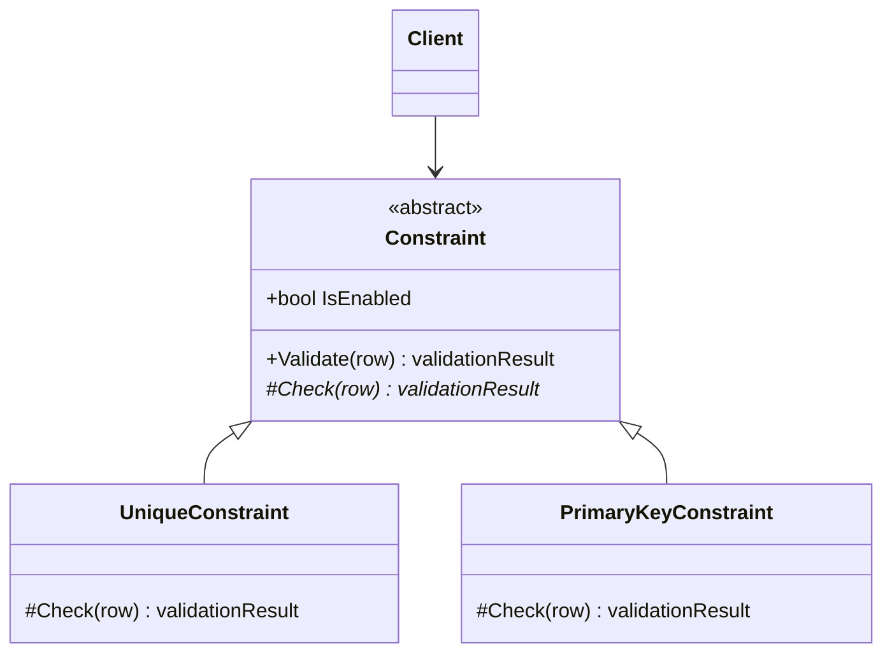

#### Sequence Diagram: Constraint Validation Workflow

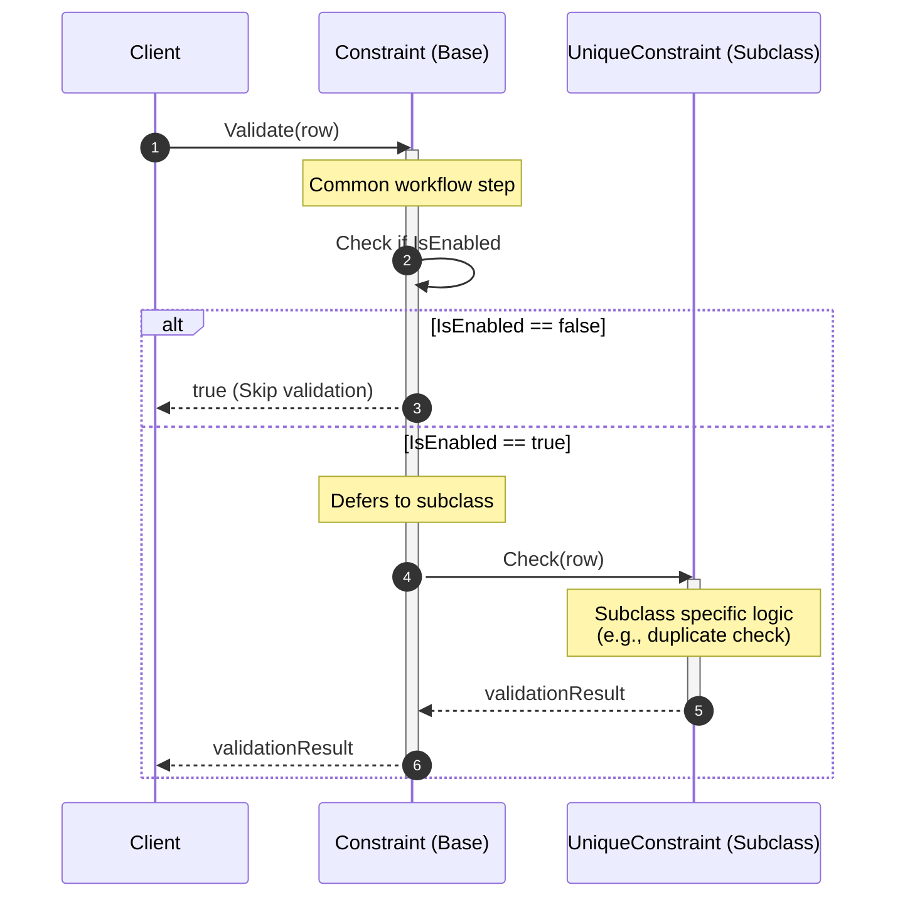

### 3.2. Factory Method (Constraint Creation)

The **Factory Method** pattern uses for creating `Constraint`.

- Define a abstract **Factory Method**
- Delegate object creations to **Concrete Creator** through Polymorphism.

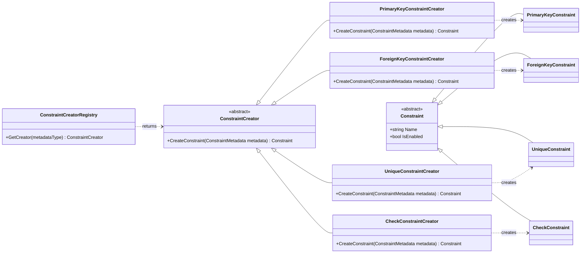

#### Sequence Diagram: Constraint Instantiation

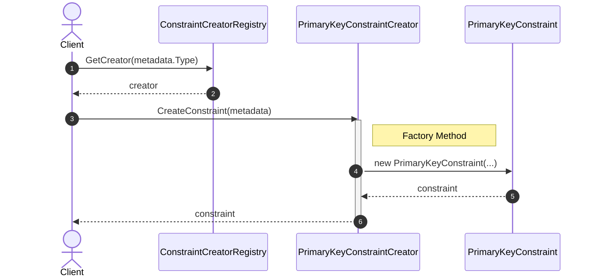

### 3.3. Strategy (Referential Action)

The **Strategy** pattern is used to implemnt Referential Action of FK.

- **Using Polymorphism to dispatch appropriate algorithm** (runtime).

#### Sequence Diagram: Referential Action Execution

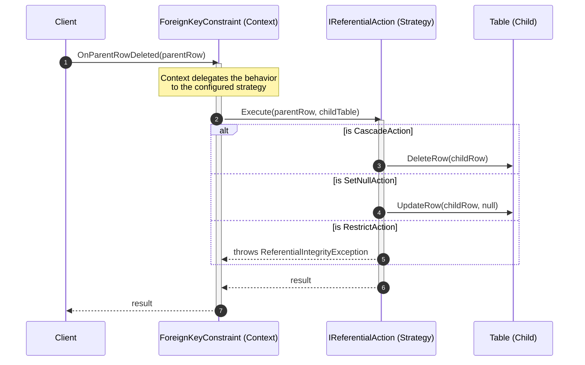

### 3.4. Composite (Schema Objects)

The **Composite** pattern is used to treat individual database objects (`Table`, `View`, `StoredProcedure`) and groups of objects uniformly.
The `Schema` class acts as the composite node that manages collections of these leaf objects. When a high-level lifecycle operation such as `Drop()` is performed on the `Schema`, it delegates the operation to all of its child components.

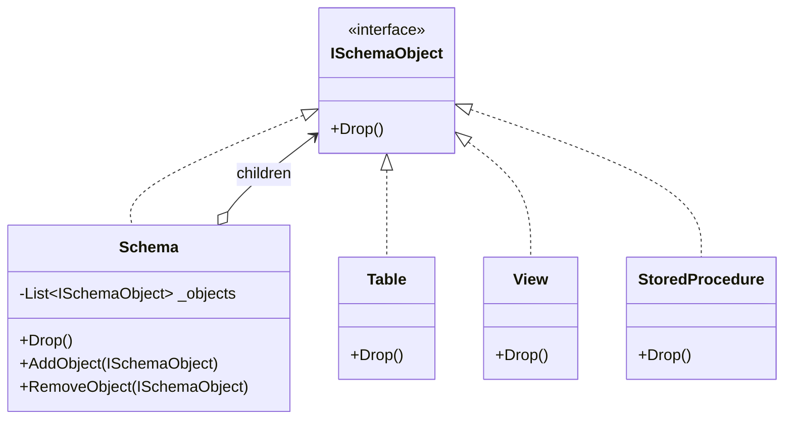

#### Sequence Diagram: Recursive Drop Operation

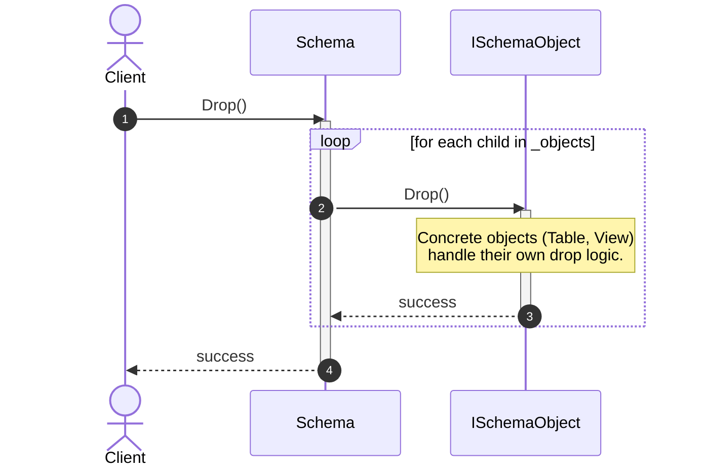

### 3.5. Command (DDL Command)

The **Command** pattern is used to encapsulate DDL operations (like `CreateTable`, `DropTable`, and `AlterTable`) into standalone command objects.
This allows the system to parameterize clients with different requests, queue or log requests, and support undoable operations. The `DDLCommandExecutor` acts as the invoker that executes the concrete `IDDLCommand`.

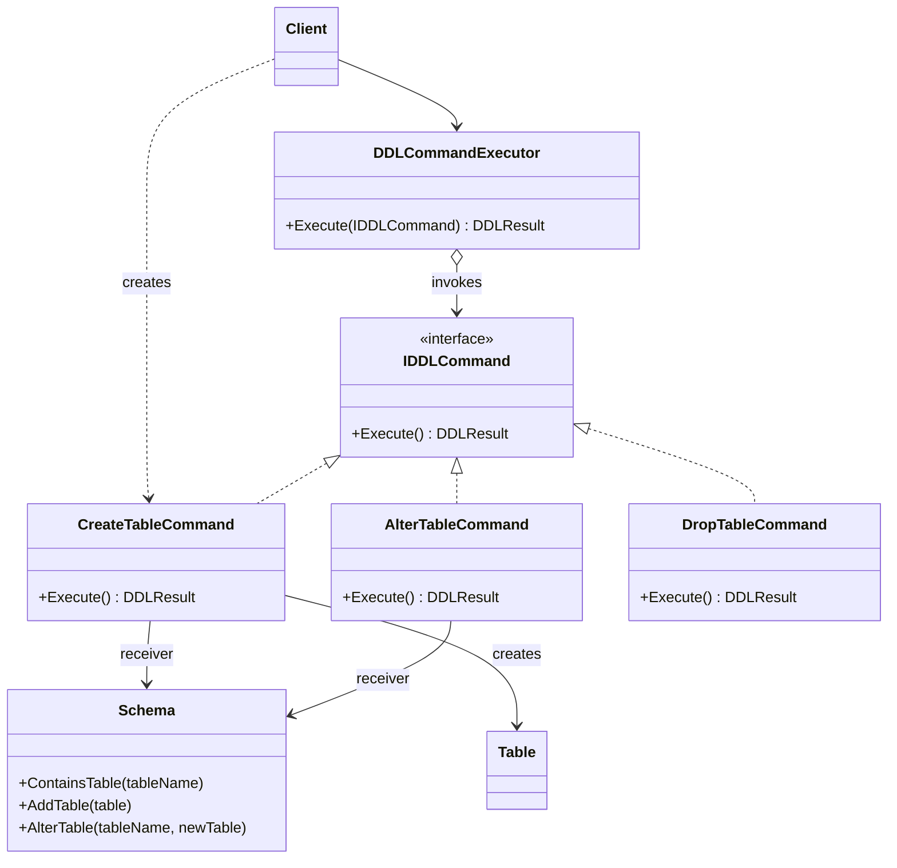

#### Sequence Diagram: DDL Command Execution

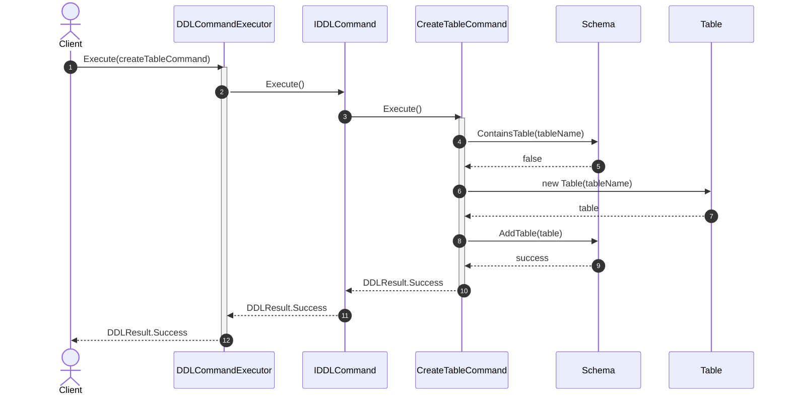

### 3.6. Iterator (Schema Object Traversal)

The **Iterator** pattern provides sequential access to schema objects without exposing the internal collection structures

- Encapsulates the traversal logic inside an Iterator.
- Allow client traverse a collection without knowing about how it's stored.

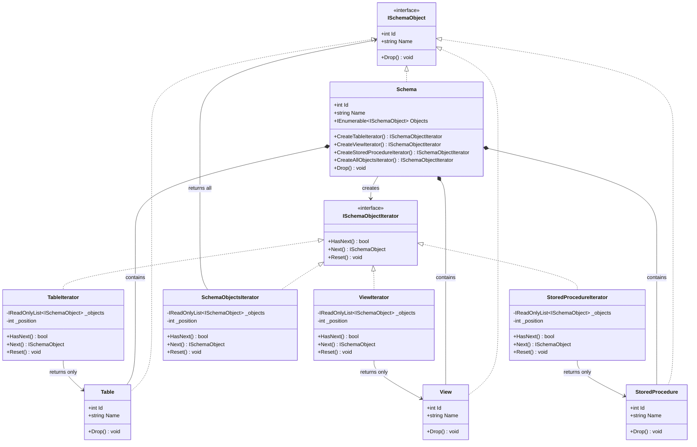

#### Sequence Diagram: Schema Object Traversal

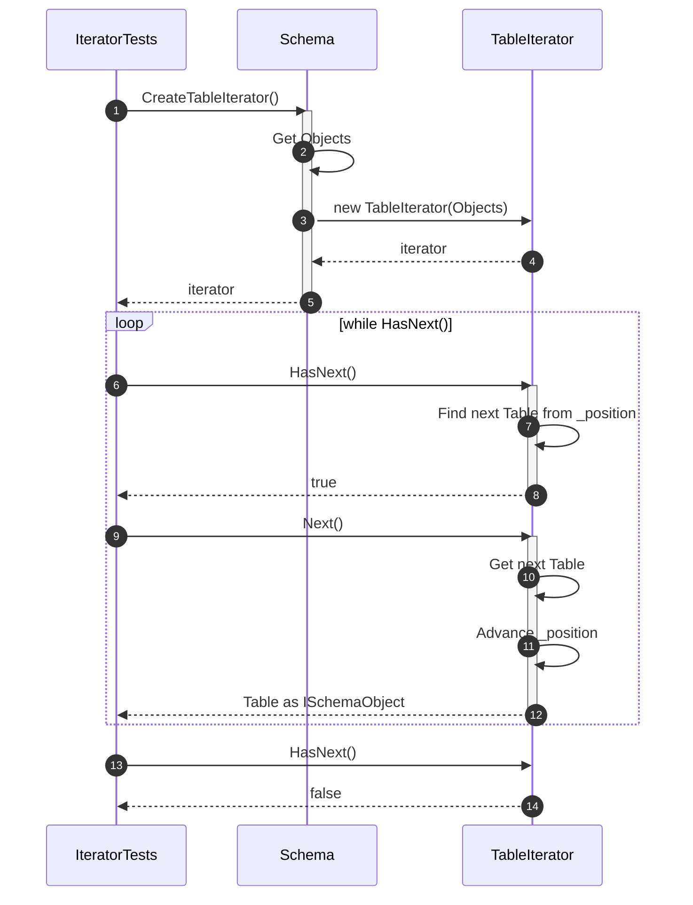

### 3.7. Visitor (Schema Operations)

The **Visitor** pattern is used for schema operations like backup, export, and validation.

- It allows **defining new operations** on schema objects (Table, View, StoredProcedure, Schema) **without modifying their classes**.

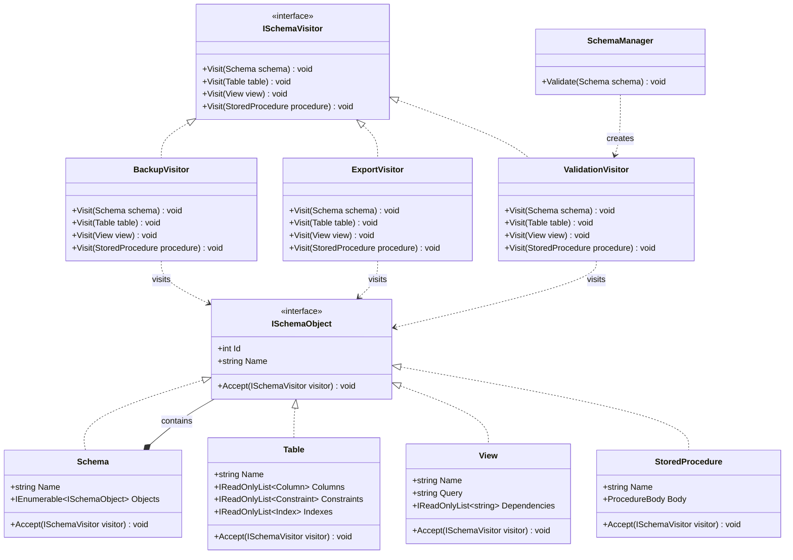

#### Sequence Diagram: Visitor Dispatch Workflow

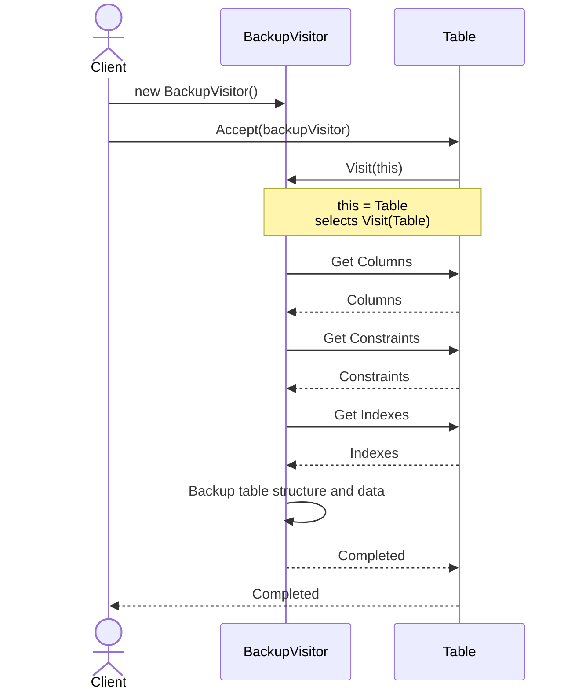

### 3.8. Builder (Table Definition)

The **Builder** pattern is used to construct complex `Table` objects step by step. This encapsulates the construction logic of columns, constraints, indexes, and partitions, keeping the `Table` constructor clean and preventing partially initialized tables.

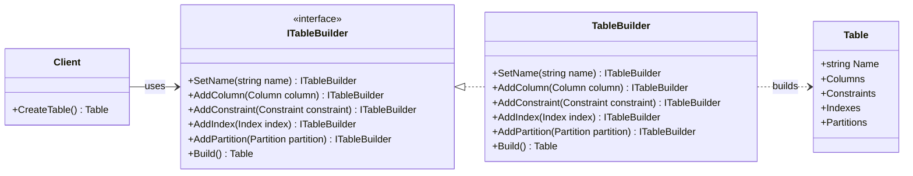

#### Sequence Diagram: Step-by-Step Table Construction

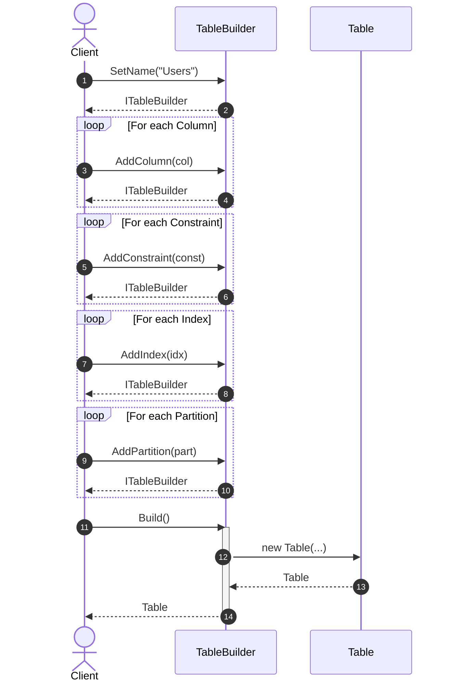
