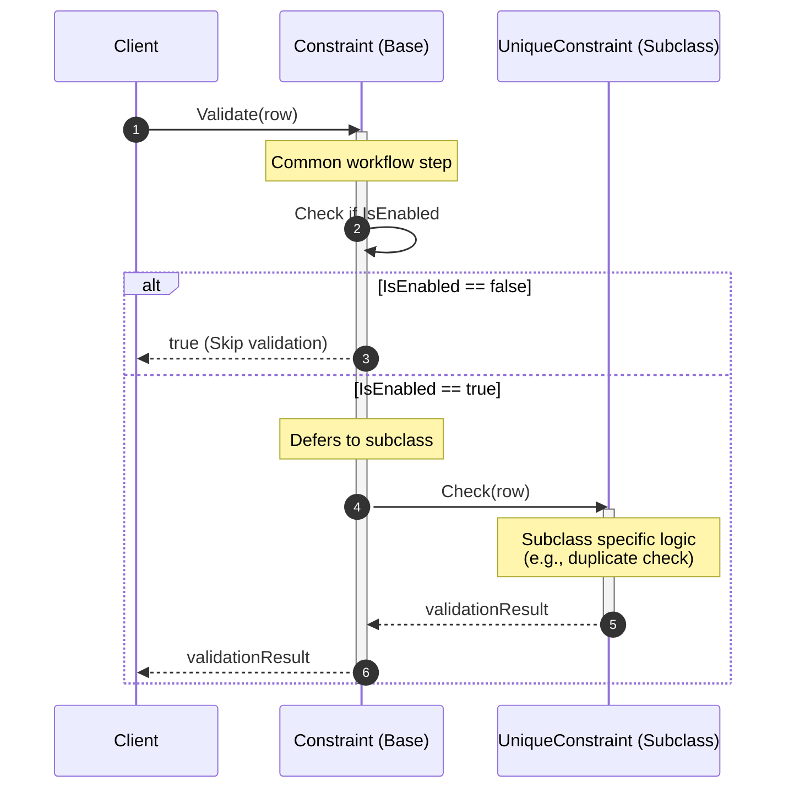
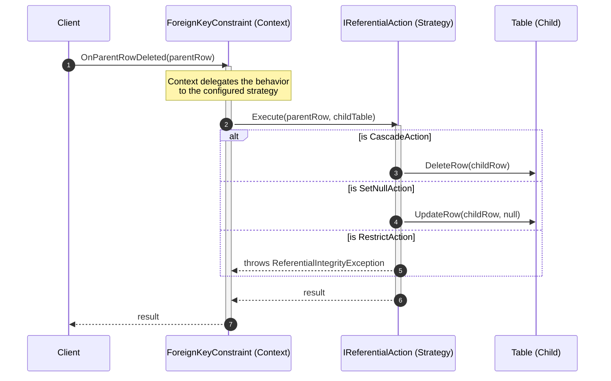

# Database Design Patterns

This document tracks the design patterns used across different modules in the DBMS and their current implementation status.

## 1. Database Objects

| Status | Design Pattern | Feature | Reason / Context |
| :---: | :--- | :--- | :--- |
| `[ ]` | **Template Method** | Constraint | `Validate()` defines the workflow, each constraint only implements `Check()`. |
| `[ ]` | **Strategy** | Referential Action | Selects Cascade, Restrict, SetNull, or SetDefault behavior when deleting/updating. |
| `[ ]` | **Composite** | Schema Objects | Schema contains Tables, Views, Procedures and manages them uniformly. |
| `[ ]` | **Visitor** | Schema Traversal | Backup, Export, and Dependency Analysis traverse the entire object hierarchy. |
| `[ ]` | **Command** | DDL Command | `CreateTable`, `DropTable`, and `AlterTable` operations are encapsulated into commands. |
| `[ ]` | **State** | Object Status | Table transitions between states like Creating, Available, Dropping, Dropped. |

## 2. Database Management

| Status | Design Pattern | Feature | Reason / Context |
| :---: | :--- | :--- | :--- |
| `[ ]` | **Facade** | DatabaseManager | Provides a single unified API to create, open, close, and drop databases. |
| `[ ]` | **Factory Method** | Database Creation | Creates a Database along with its dependencies like SystemCatalog, Schema, and Storage. |
| `[ ]` | **Command** | Database Operations | `CreateDatabase`, `DropDatabase`, and `RenameDatabase` are encapsulated as commands. |
| `[ ]` | **State** | Database Lifecycle | Database transitions between states such as Offline, Online, ReadOnly, and Recovering. |
| `[ ]` | **Observer** | Database Events | Monitoring systems receive events for Create, Drop, Backup, and Restore. |
| `[ ]` | **Template Method** | Backup/Restore | Provides a fixed backup workflow, while differentiating between Full and Incremental backup implementations. |

*Note: Update the status column to `[x]` when a pattern is implemented in the source code to manage progress.*

## 3. Pattern Implementation Details

### 3.1. Template Method (Constraint)

The **Template Method** pattern is used in the `Constraint` class. The base class defines the skeletal workflow for validation in the `Validate()` method (e.g., checking if the constraint is enabled), and defers the specific logic to the `Check()` method which must be implemented by subclasses like `UniqueConstraint` or `PrimaryKeyConstraint`.

### 3.2. Strategy (Referential Action)

The **Strategy** pattern is used to handle foreign key referential actions (`ON DELETE`, `ON UPDATE`). Instead of writing hardcoded `switch` statements inside the `ForeignKeyConstraint` class, the behavior is delegated to a strategy interface `IReferentialAction`. Concrete strategies like `CascadeAction`, `RestrictAction`, `SetNullAction`, and `SetDefaultAction` implement the specific execution logic dynamically based on table metadata.

