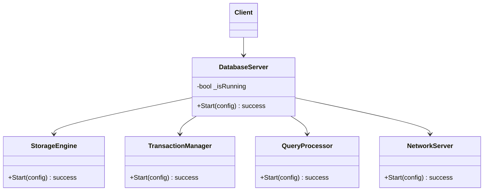
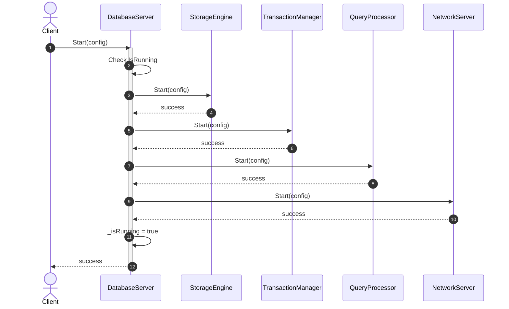
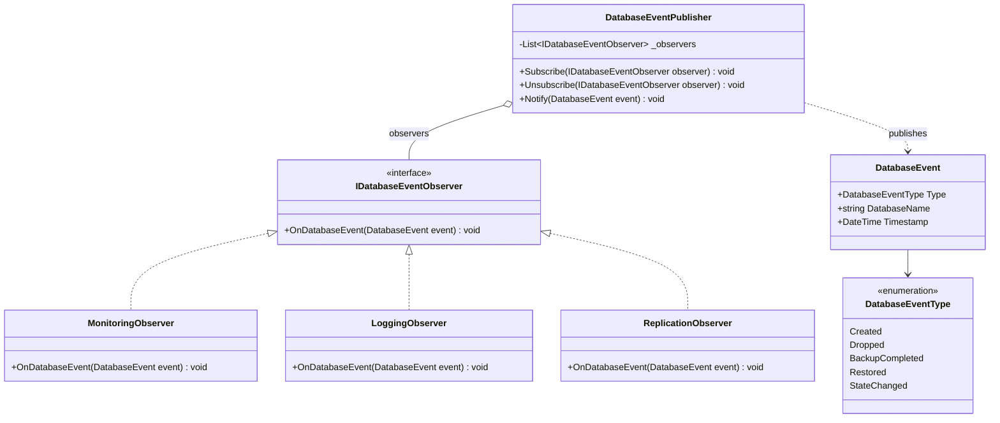
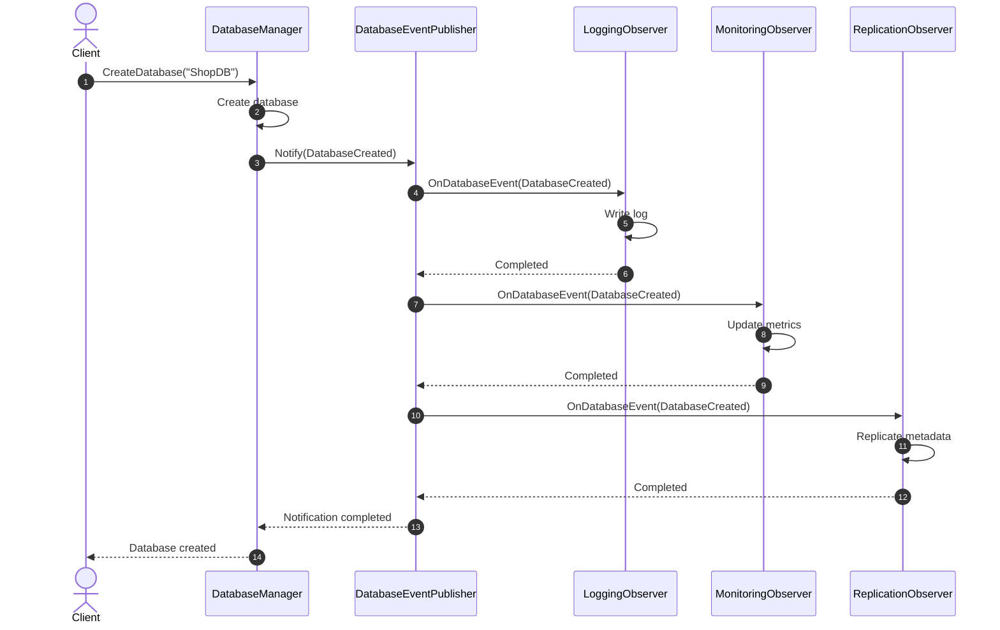

# Database Management Patterns

## 2. Database Management

|  Priority | Status | Design Pattern       | Feature                    | Reason / Context                                                                                         |
| :-------: | :----: | :------------------- | :------------------------- | :------------------------------------------------------------------------------------------------------- |
|  🔴 High  |  `[x]` | **Facade**           | DatabaseServer             | Provides a single unified API to start, stop, configure, and access the database server.                 |
|  🔴 High  |  `[ ]` | **Command**          | Database Operations        | Encapsulates `CreateDatabase`, `DropDatabase`, and `RenameDatabase` into command objects.                |
|  🔴 High  |  `[x]` | **Observer**         | Database Events            | Monitoring, Logging, and Replication receive Create, Drop, Backup, Restore, and State events.            |
| 🟡 Medium |  `[ ]` | **Factory Method**   | Database Creation          | Allows different Database implementations to be instantiated by subclasses or providers.                 |
| 🟡 Medium |  `[ ]` | **State**            | Database Lifecycle         | Database transitions between Offline, Online, ReadOnly, Recovering, and Dropped states.                  |
| 🟡 Medium |  `[ ]` | **Template Method**  | Backup/Restore             | Defines a common workflow while allowing Full and Incremental implementations to differ.                 |
| 🟡 Medium |  `[ ]` | **Adapter**          | External Storage           | Adapts operating-system or cloud-storage APIs to DBMS storage interfaces.                                |
|   🟢 Low  |  `[ ]` | **Builder**          | Database Configuration     | Builds database configuration (page size, logging, storage, security) step by step.                      |
|   🟢 Low  |  `[ ]` | **Proxy**            | Database Access            | Adds authorization, lazy opening, remote access, or logging around database access.                      |
|   🟢 Low  |  `[ ]` | **Bridge**           | Database Storage           | Separates Database abstraction from different storage implementations.                                   |
|   🟢 Low  |  `[ ]` | **Mediator**         | Subsystem Coordination     | Coordinates Storage, Catalog, Transaction, Recovery, Security, and Monitoring modules.                   |
|   🟢 Low  |  `[ ]` | **Decorator**        | Database Service Extension | Adds metrics, tracing, caching, or auditing without changing the core service.                           |

## 3. Pattern Implementation Details

### 3.1. Facade (DatabaseServer)

The **Facade** pattern is used in `DatabaseServer` to provide a single, unified interface for starting and stopping the database system. Instead of the client interacting with multiple complex subsystems (such as `StorageEngine`, `TransactionManager`, `QueryProcessor`, and `NetworkServer`), the `DatabaseServer` coordinates their initialization and startup sequences in the correct order.

### 3.2. Observer (Database Events)

The **Observer** pattern is used to notify various subsystems (like Monitoring, Logging, and Replication) about database lifecycle events. When an event occurs (e.g., `DatabaseCreated`), the `DatabaseEventPublisher` notifies all registered `IDatabaseEventObserver` instances.

#### Sequence Diagram: Database Event Notification

