# Database Management Patterns

Your current design has DatabaseServer owning DatabaseManager, and DatabaseManager centrally manages the collection of Database objects through CreateDatabase(), GetDatabase(), and DropDatabase().

You could model it like this:

## 2. Database Management

| Priority  | Status | Design Pattern      | Feature                    | Reason / Context                                                                              |
| :-------: | :----: | :------------------ | :------------------------- | :-------------------------------------------------------------------------------------------- |
|  🔴 High  | `[x]`  | **Facade**          | DatabaseServer             | Provides a single unified API to start, stop, configure, and access the database server.      |
|  🔴 High  | `[x]`  | **Singleton**       | DatabaseManager            | Ensures a single instance of DatabaseManager centrally manages all database objects.          |
|  🔴 High  | `[x]`  | **Command**         | Database Operations        | Encapsulates `CreateDatabase`, `DropDatabase`, and `RenameDatabase` into command objects.     |
|  🔴 High  | `[x]`  | **Observer**        | Database Events            | Monitoring, Logging, and Replication receive Create, Drop, Backup, Restore, and State events. |
|  🔴 High  | `[x]`  | **Bridge**          | Database ↔ Storage Engine  | Separates Database abstraction from different storage implementations.                        |
|  🔴 High  | `[ ]`  | **Memento**         | Database Checkpoint / Configuration Snapshot | Captures and restores database checkpoints or configuration snapshots.                      |
| 🟡 Medium | `[x]`  | **State**           | Database Lifecycle         | Database transitions between Offline, Online, ReadOnly, Recovering, and Dropped states.       |
| 🟡 Medium | `[x]`  | **Template Method** | Backup/Restore             | Defines a common workflow while allowing Full and Incremental implementations to differ.      |
|  🟢 Low   | `[ ]`  | **Builder**         | Database Configuration     | Builds database configuration (page size, logging, storage, security) step by step.           |
|  🟢 Low   | `[ ]`  | **Proxy**           | Database Access            | Adds authorization, lazy opening, remote access, or logging around database access.           |
|  🟢 Low   | `[ ]`  | **Mediator**        | Subsystem Coordination     | Coordinates Storage, Catalog, Transaction, Recovery, Security, and Monitoring modules.        |
|  🟢 Low   | `[ ]`  | **Decorator**       | Database Service Extension | Adds metrics, tracing, caching, or auditing without changing the core service.                |

## 3. Pattern Implementation Details

### 3.1. Facade (DatabaseServer)

The **Facade** pattern is used in `DatabaseServer` to provide a single, unified interface for starting and stopping the database system. Instead of the client interacting with multiple complex subsystems (such as `StorageEngine`, `TransactionManager`, `QueryProcessor`, and `NetworkServer`), the `DatabaseServer` coordinates their initialization and startup sequences in the correct order.

#### Structure Diagram

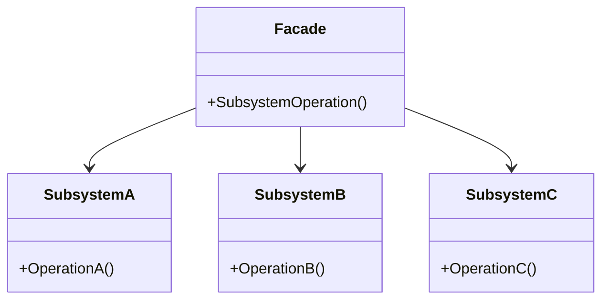
```mermaid
classDiagram
    class Facade {
        +SubsystemOperation()
    }
    class SubsystemA {
        +OperationA()
    }
    class SubsystemB {
        +OperationB()
    }
    class SubsystemC {
        +OperationC()
    }
    Facade --> SubsystemA
    Facade --> SubsystemB
    Facade --> SubsystemC
```

#### Example code

```csharp
public class SubsystemA
{
    public void OperationA() {
        Console.WriteLine("Do A");
    }
}
public class SubsystemB
{
    public void OperationB() {
        Console.WriteLine("Do B");
    }
}
public class SubsystemC
{
    public void OperationC() {
        Console.WriteLine("Do C");
    }
}

public class Facade
{
    private readonly SubsystemA _a;
    private readonly SubsystemB _b;
    private readonly SubsystemC _c;

    public Facade(SubsystemA a, SubsystemB b, SubsystemC c)
    {
        _a = a;
        _b = b;
        _c = c;
    }

    // Client use Facade without knowing about a b c
    public void SubsystemOperation()
    {
        _a.OperationA();
        _b.OperationB();
        _c.OperationC();
    }
}

// Usage Example
public class Program
{
    public static void Main()
    {
        var facade = new Facade(new SubsystemA(), new SubsystemB(), new SubsystemC());
        facade.SubsystemOperation();
    }
}
```

#### Class diagram

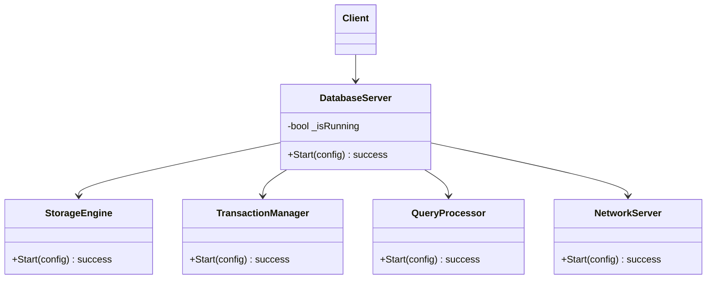
```mermaid
classDiagram
    class Client
    class DatabaseServer {
        -bool _isRunning
        +Start(config) success
    }
    class StorageEngine {
        +Start(config) success
    }
    class TransactionManager {
        +Start(config) success
    }
    class QueryProcessor {
        +Start(config) success
    }
    class NetworkServer {
        +Start(config) success
    }

    Client --> DatabaseServer
    DatabaseServer --> StorageEngine
    DatabaseServer --> TransactionManager
    DatabaseServer --> QueryProcessor
    DatabaseServer --> NetworkServer
```

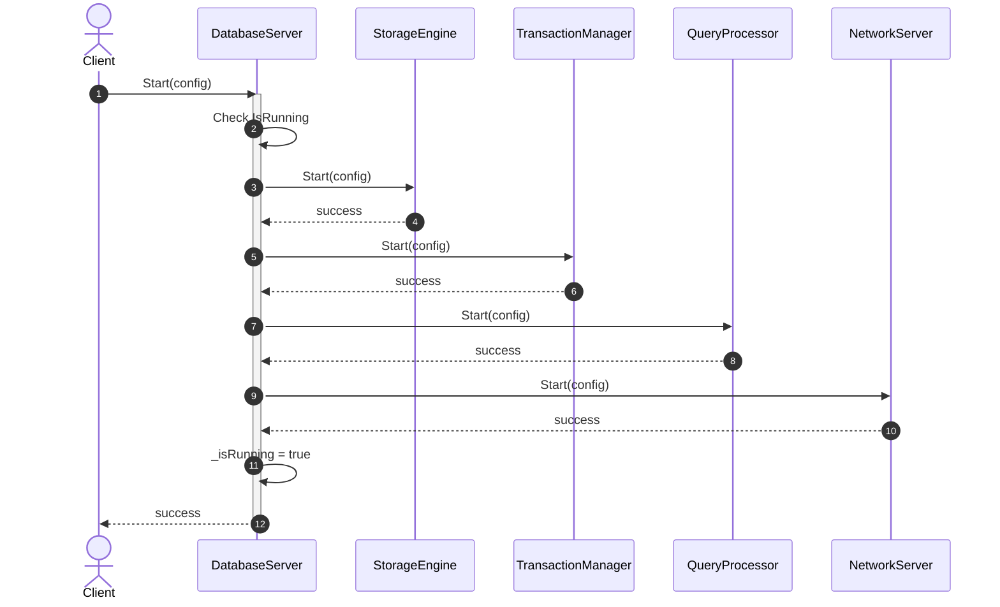
```mermaid
sequenceDiagram
    autonumber

    actor Client
    participant Server as DatabaseServer
    participant Storage as StorageEngine
    participant Transaction as TransactionManager
    participant Query as QueryProcessor
    participant Network as NetworkServer

    Client->>Server: Start(config)
    activate Server

    Server->>Server: Check IsRunning

    Server->>Storage: Start(config)
    Storage-->>Server: success

    Server->>Transaction: Start(config)
    Transaction-->>Server: success

    Server->>Query: Start(config)
    Query-->>Server: success

    Server->>Network: Start(config)
    Network-->>Server: success

    Server->>Server: _isRunning = true
    Server-->>Client: success

    deactivate Server
```

### 3.2. Observer (Database Events)

The **Observer** pattern is used to notify various subsystems (like Monitoring, Logging, and Replication) about database lifecycle events. When an event occurs (e.g., `DatabaseCreated`), the `DatabaseEventPublisher` notifies all registered `IDatabaseEventObserver` instances.

#### Structure Diagram

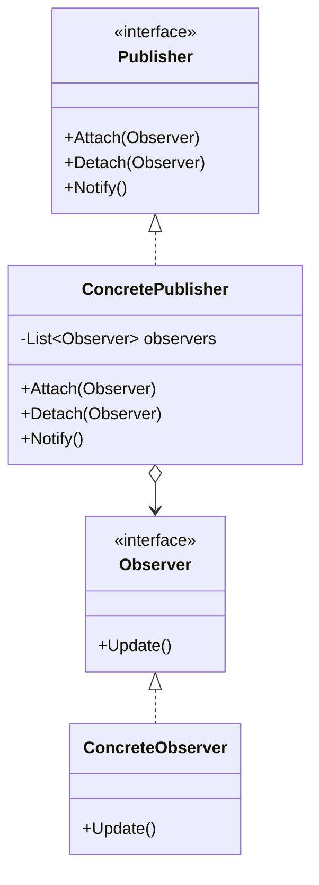
```mermaid
classDiagram
    class Publisher {
        <<interface>>
        +Attach(Observer)
        +Detach(Observer)
        +Notify()
    }
    class Observer {
        <<interface>>
        +Update()
    }
    class ConcretePublisher {
        -List~Observer~ observers
        +Attach(Observer)
        +Detach(Observer)
        +Notify()
    }
    class ConcreteObserver {
        +Update()
    }
    Publisher <|.. ConcretePublisher
    Observer <|.. ConcreteObserver
    ConcretePublisher o--> Observer
```

#### Example code

```csharp
public interface IObserver
{
    void Update();
}

public interface IPublisher
{
    void Attach(IObserver observer);
    void Detach(IObserver observer);
    void Notify();
}

public class ConcretePublisher : IPublisher
{
    private readonly List<IObserver> _observers = new List<IObserver>();

    public void Attach(IObserver observer) { throw new NotImplementedException(); }
    public void Detach(IObserver observer) { throw new NotImplementedException(); }
    public void Notify() {
        foreach(IObserver observer in _observers)
        {
            // Notify all subcribers
            observer.Update();
        }
    }
}

public class ConcreteObserver : IObserver
{
    public void Update() {
        // Do concrete observer job
    }
}

// Usage Example
public class Program
{
    public static void Main()
    {
        var publisher = new ConcretePublisher();
        var observer = new ConcreteObserver();
        
        publisher.Attach(observer);
        publisher.Notify();
    }
}
```

#### Class diagram


```mermaid
classDiagram
    direction TB

    class DatabaseEventPublisher {
        -List~IDatabaseEventObserver~ _observers
        +Subscribe(IDatabaseEventObserver observer) void
        +Unsubscribe(IDatabaseEventObserver observer) void
        +Notify(DatabaseEvent event) void
    }

    class IDatabaseEventObserver {
        <<interface>>
        +OnDatabaseEvent(DatabaseEvent event) void
    }

    class MonitoringObserver {
        +OnDatabaseEvent(DatabaseEvent event) void
    }

    class LoggingObserver {
        +OnDatabaseEvent(DatabaseEvent event) void
    }

    class ReplicationObserver {
        +OnDatabaseEvent(DatabaseEvent event) void
    }

    class DatabaseEvent {
        +DatabaseEventType Type
        +string DatabaseName
        +DateTime Timestamp
    }

    class DatabaseEventType {
        <<enumeration>>
        Created
        Dropped
        BackupCompleted
        Restored
        StateChanged
    }

    DatabaseEventPublisher o-- IDatabaseEventObserver : observers

    IDatabaseEventObserver <|.. MonitoringObserver
    IDatabaseEventObserver <|.. LoggingObserver
    IDatabaseEventObserver <|.. ReplicationObserver

    DatabaseEventPublisher ..> DatabaseEvent : publishes
    DatabaseEvent --> DatabaseEventType
```

#### Sequence Diagram: Database Event Notification

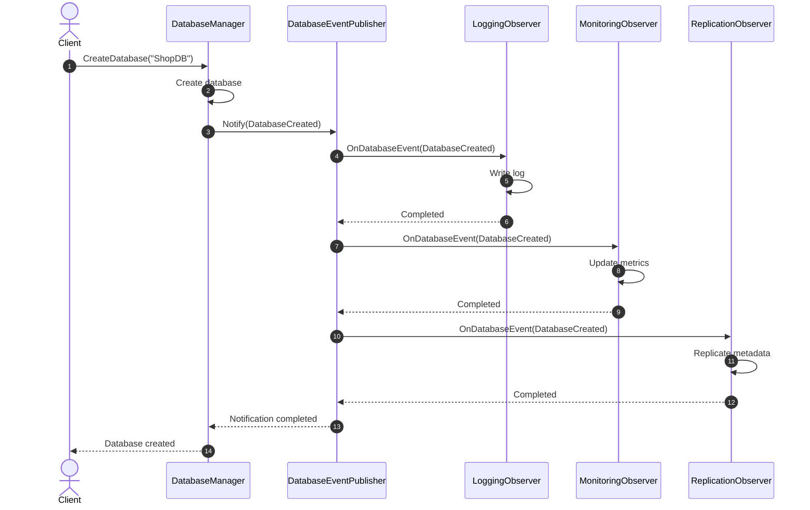
```mermaid
sequenceDiagram
    autonumber

    actor Client
    participant DM as DatabaseManager
    participant EP as DatabaseEventPublisher
    participant LO as LoggingObserver
    participant MO as MonitoringObserver
    participant RO as ReplicationObserver

    Client->>DM: CreateDatabase("ShopDB")

    DM->>DM: Create database

    DM->>EP: Notify(DatabaseCreated)

    EP->>LO: OnDatabaseEvent(DatabaseCreated)
    LO->>LO: Write log
    LO-->>EP: Completed

    EP->>MO: OnDatabaseEvent(DatabaseCreated)
    MO->>MO: Update metrics
    MO-->>EP: Completed

    EP->>RO: OnDatabaseEvent(DatabaseCreated)
    RO->>RO: Replicate metadata
    RO-->>EP: Completed

    EP-->>DM: Notification completed

    DM-->>Client: Database created
```

### 3.3. State (Database Lifecycle)

The **State** pattern is used to manage the database lifecycle. The database transitions between different states such as Offline, Online, ReadOnly, Recovering, and Dropped. Each state encapsulates the behavior specific to that state.

#### Structure Diagram

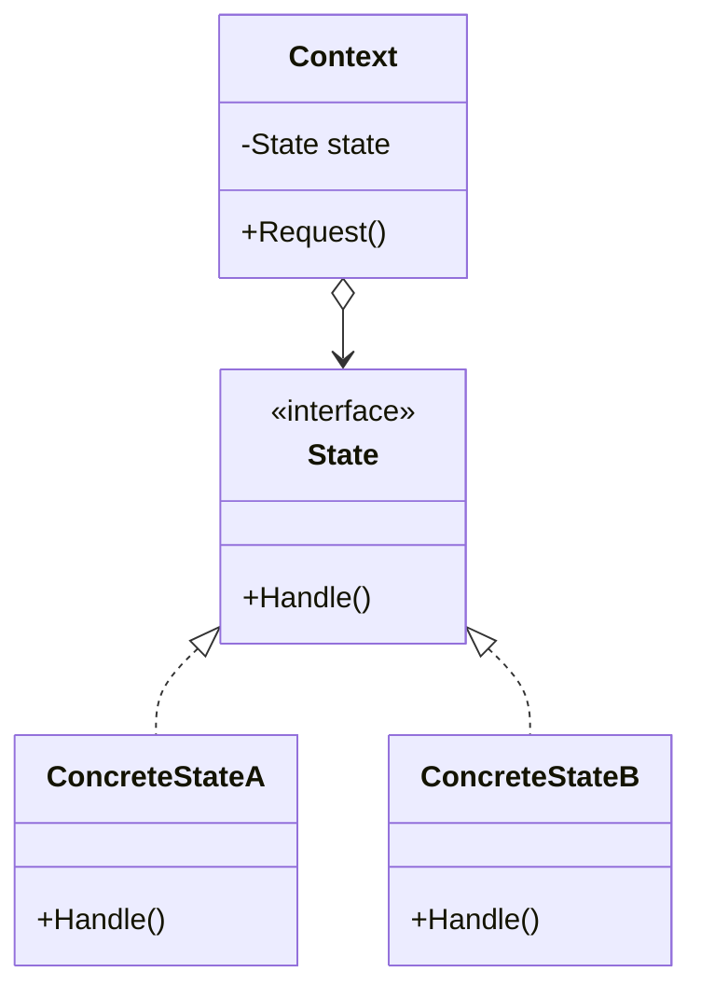
```mermaid
classDiagram
    class Context {
        -State state
        +Request()
    }
    class State {
        <<interface>>
        +Handle()
    }
    class ConcreteStateA {
        +Handle()
    }
    class ConcreteStateB {
        +Handle()
    }
    State <|.. ConcreteStateA
    State <|.. ConcreteStateB
    Context o--> State
```

#### Example code

```csharp
// State
public interface IDatabaseState
{
    void Open(Database database);
    void Read(Database database);
    void Write(Database database, string data);
    void Close(Database database);
}

// Concrete State
public class OfflineState  : IState
{
   public void Open(Database database)
    {
        Console.WriteLine("Opening database...");
        database.SetState(new OnlineState());
    }

    public void Read(Database database)
    {
        Console.WriteLine("Cannot read: Database is offline.");
    }

    public void Write(Database database, string data)
    {
        Console.WriteLine("Cannot write: Database is offline.");
    }

    public void Close(Database database)
    {
        Console.WriteLine("Database is already offline.");
    }
}

public class OnlineState : IDatabaseState
{
    public void Open(Database database)
    {
        Console.WriteLine("Database is already online.");
    }

    public void Read(Database database)
    {
        Console.WriteLine("Reading data...");
    }

    public void Write(Database database, string data)
    {
        Console.WriteLine($"Writing: {data}");
    }

    public void Close(Database database)
    {
        Console.WriteLine("Closing database...");
        database.SetState(new OfflineState());
    }
}

public class Database
{
    private IDatabaseState _state;

    public Database()
    {
        _state = new OfflineState();
    }

    public void SetState(IDatabaseState state)
    {
        _state = state;
    }

    public void Open()
    {
        _state.Open(this);
    }

    public void Read()
    {
        _state.Read(this);
    }

    public void Write(string data)
    {
        _state.Write(this, data);
    }

    public void Close()
    {
        _state.Close(this);
    }
}

// Usage Example
public class Program
{
    public static void Main()
    {
        var db = new Database(); // Starts in OfflineState
        db.Open(); // Transitions to OnlineState
        db.Read();
        db.Write("Data");
        db.Close(); // Transitions back to OfflineState
    }
}
```

#### Class diagram

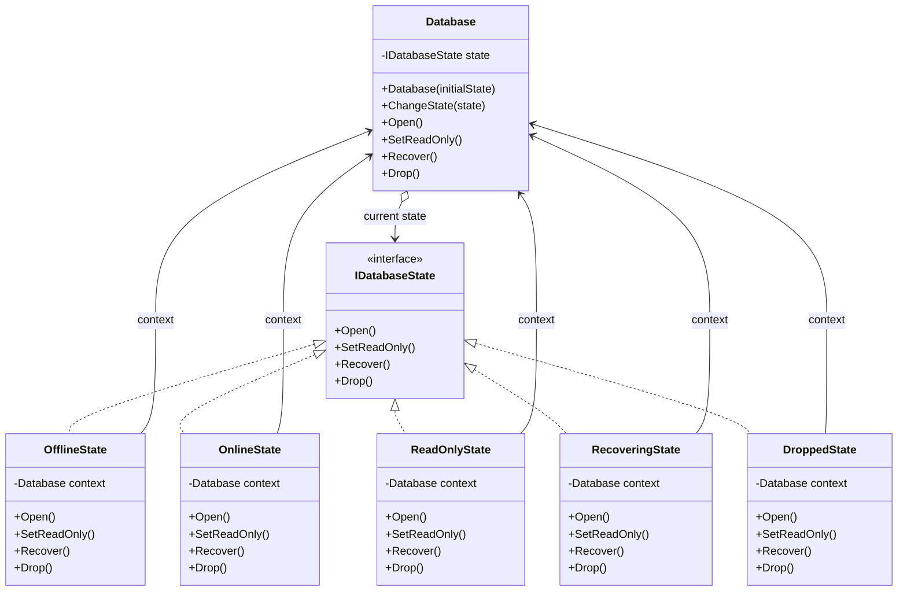
```mermaid
classDiagram
    class Database {
        -IDatabaseState state
        +Database(initialState)
        +ChangeState(state)
        +Open()
        +SetReadOnly()
        +Recover()
        +Drop()
    }

    class IDatabaseState {
        <<interface>>
        +Open()
        +SetReadOnly()
        +Recover()
        +Drop()
    }

    class OfflineState {
        -Database context
        +Open()
        +SetReadOnly()
        +Recover()
        +Drop()
    }

    class OnlineState {
        -Database context
        +Open()
        +SetReadOnly()
        +Recover()
        +Drop()
    }

    class ReadOnlyState {
        -Database context
        +Open()
        +SetReadOnly()
        +Recover()
        +Drop()
    }

    class RecoveringState {
        -Database context
        +Open()
        +SetReadOnly()
        +Recover()
        +Drop()
    }

    class DroppedState {
        -Database context
        +Open()
        +SetReadOnly()
        +Recover()
        +Drop()
    }

    Database o--> IDatabaseState : current state

    IDatabaseState <|.. OfflineState
    IDatabaseState <|.. OnlineState
    IDatabaseState <|.. ReadOnlyState
    IDatabaseState <|.. RecoveringState
    IDatabaseState <|.. DroppedState

    OfflineState --> Database : context
    OnlineState --> Database : context
    ReadOnlyState --> Database : context
    RecoveringState --> Database : context
    DroppedState --> Database : context
```

#### Sequence Diagram: Database Open

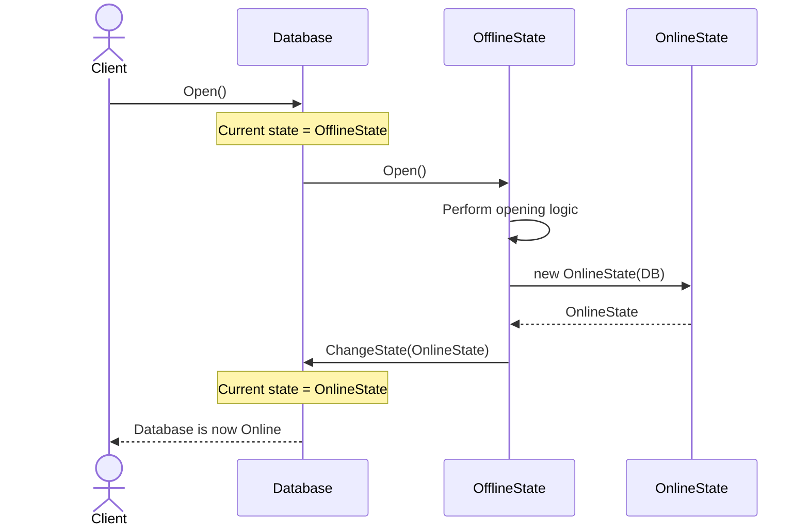
```mermaid
sequenceDiagram
    actor Client
    participant DB as Database
    participant Offline as OfflineState
    participant Online as OnlineState

    Client->>DB: Open()

    Note over DB: Current state = OfflineState

    DB->>Offline: Open()

    Offline->>Offline: Perform opening logic

    Offline->>Online: new OnlineState(DB)
    Online-->>Offline: OnlineState

    Offline->>DB: ChangeState(OnlineState)

    Note over DB: Current state = OnlineState

    DB-->>Client: Database is now Online
```

### 3.4. Command (Database Operations)

The **Command** pattern is used to encapsulate database operations (such as Create, Drop, and Rename Database) into standalone command objects. This allows operations to be parameterized, queued, and executed uniformly by a `DDLCommandExecutor`.

#### Structure Diagram

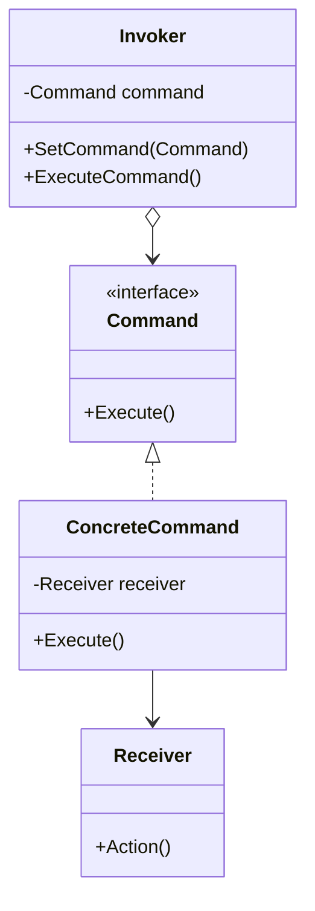
```mermaid
classDiagram
    class Command {
        <<interface>>
        +Execute()
    }
    class ConcreteCommand {
        -Receiver receiver
        +Execute()
    }
    class Receiver {
        +Action()
    }
    class Invoker {
        -Command command
        +SetCommand(Command)
        +ExecuteCommand()
    }
    Command <|.. ConcreteCommand
    ConcreteCommand --> Receiver
    Invoker o--> Command
```

#### Example code

```csharp
public interface ICommand
{
    void Execute();
}

public class Receiver
{
    public void Action() { throw new NotImplementedException(); }
}

public class ConcreteCommand : ICommand
{
    private readonly Receiver _receiver;

    public ConcreteCommand(Receiver receiver)
    {
        _receiver = receiver;
    }

    public void Execute()
    {
        throw new NotImplementedException();
    }
}

public class Invoker
{
    private ICommand _command;

    public void SetCommand(ICommand command)
    {
        _command = command;
    }

    public void ExecuteCommand()
    {
        throw new NotImplementedException();
    }
}

// Usage Example
public class Program
{
    public static void Main()
    {
        var receiver = new Receiver();
        var command = new ConcreteCommand(receiver);
        
        var invoker = new Invoker();
        invoker.SetCommand(command);
        invoker.ExecuteCommand();
    }
}
```

#### Class diagram

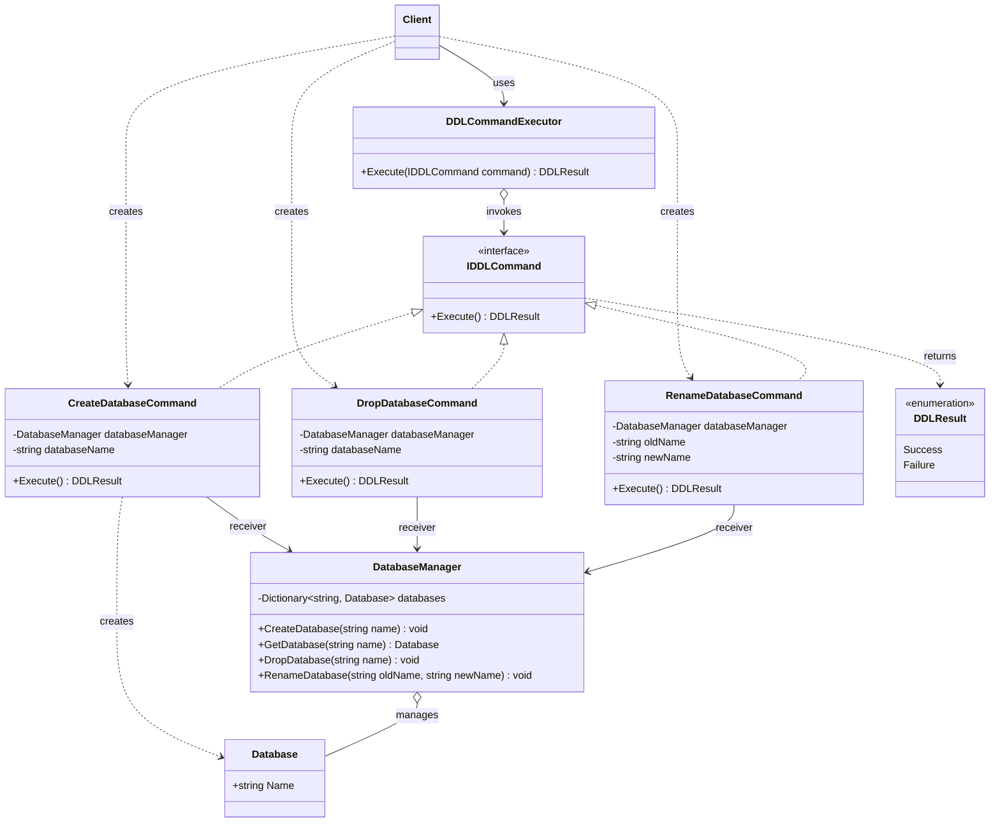
```mermaid
classDiagram
    direction TB

    class Client

    class DDLCommandExecutor {
        +Execute(IDDLCommand command) DDLResult
    }

    class IDDLCommand {
        <<interface>>
        +Execute() DDLResult
    }

    class CreateDatabaseCommand {
        -DatabaseManager databaseManager
        -string databaseName
        +Execute() DDLResult
    }

    class DropDatabaseCommand {
        -DatabaseManager databaseManager
        -string databaseName
        +Execute() DDLResult
    }

    class RenameDatabaseCommand {
        -DatabaseManager databaseManager
        -string oldName
        -string newName
        +Execute() DDLResult
    }

    class DatabaseManager {
        -Dictionary~string, Database~ databases
        +CreateDatabase(string name) void
        +GetDatabase(string name) Database
        +DropDatabase(string name) void
        +RenameDatabase(string oldName, string newName) void
    }

    class Database {
        +string Name
    }

    class DDLResult {
        <<enumeration>>
        Success
        Failure
    }

    Client --> DDLCommandExecutor : uses

    Client ..> CreateDatabaseCommand : creates
    Client ..> DropDatabaseCommand : creates
    Client ..> RenameDatabaseCommand : creates

    DDLCommandExecutor o--> IDDLCommand : invokes

    IDDLCommand <|.. CreateDatabaseCommand
    IDDLCommand <|.. DropDatabaseCommand
    IDDLCommand <|.. RenameDatabaseCommand

    CreateDatabaseCommand --> DatabaseManager : receiver
    DropDatabaseCommand --> DatabaseManager : receiver
    RenameDatabaseCommand --> DatabaseManager : receiver

    CreateDatabaseCommand ..> Database : creates
    DatabaseManager o-- Database : manages

    IDDLCommand ..> DDLResult : returns
```

#### Sequence Diagram: Execute CreateDatabaseCommand

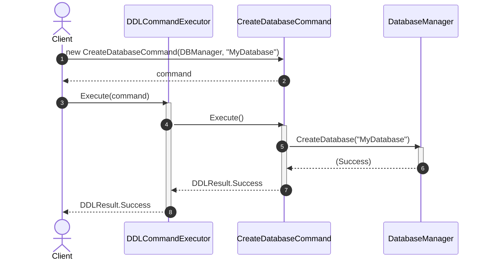
```mermaid
sequenceDiagram
    autonumber
    actor Client
    participant Executor as DDLCommandExecutor
    participant Command as CreateDatabaseCommand
    participant DBManager as DatabaseManager

    Client->>Command: new CreateDatabaseCommand(DBManager, "MyDatabase")
    Command-->>Client: command

    Client->>Executor: Execute(command)
    activate Executor

    Executor->>Command: Execute()
    activate Command

    Command->>DBManager: CreateDatabase("MyDatabase")
    activate DBManager
    DBManager-->>Command: (Success)
    deactivate DBManager

    Command-->>Executor: DDLResult.Success
    deactivate Command

    Executor-->>Client: DDLResult.Success
    deactivate Executor
```

### 3.5. Template Method (Backup/Restore)

The **Template Method** pattern is used in Backup and Restore operations to define the skeleton of an algorithm in a base class, while letting subclasses override specific steps without changing the algorithm's structure. For example, `FullBackup` and `IncrementalBackup` follow the same core steps but differ in how data is extracted.

#### Structure Diagram

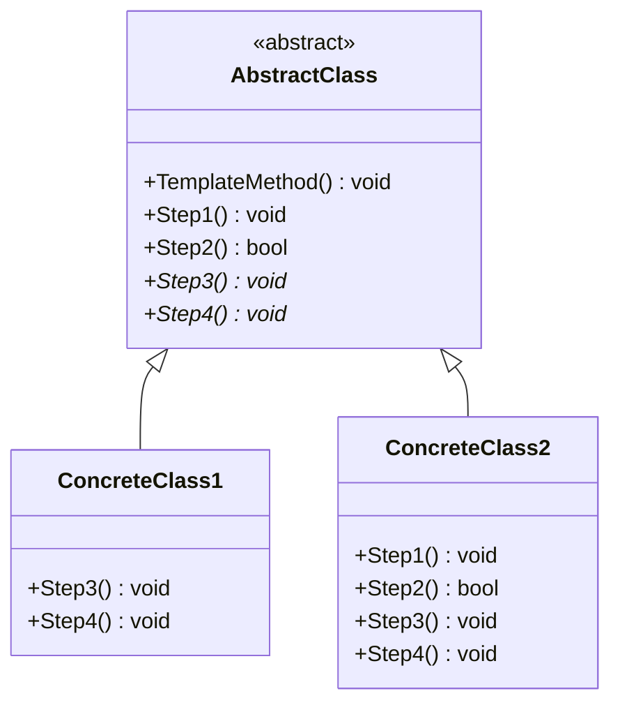
```mermaid
classDiagram
    class AbstractClass {
        <<abstract>>
        +TemplateMethod() void
        +Step1() void
        +Step2() bool
        +Step3()* void
        +Step4()* void
    }

    class ConcreteClass1 {
        +Step3() void
        +Step4() void
    }

    class ConcreteClass2 {
        +Step1() void
        +Step2() bool
        +Step3() void
        +Step4() void
    }

    AbstractClass <|-- ConcreteClass1
    AbstractClass <|-- ConcreteClass2
```

#### Example code

```csharp
public abstract class AbstractClass
{
    public void TemplateMethod()
    {
        Step1();
        if (Step2())
        {
            Step3();
        }
        else
        {
            Step4();
        }
    }

    protected void Step1() { throw new NotImplementedException(); }
    protected virtual bool Step2() { throw new NotImplementedException(); }
    protected abstract void Step3();
    protected abstract void Step4();
}

public class ConcreteClass1 : AbstractClass
{
    protected override void Step3() { throw new NotImplementedException(); }
    protected override void Step4() { throw new NotImplementedException(); }
}

// Usage Example
public class Program
{
    public static void Main()
    {
        AbstractClass backup = new ConcreteClass1();
        backup.TemplateMethod();
    }
}
```

#### Class diagram

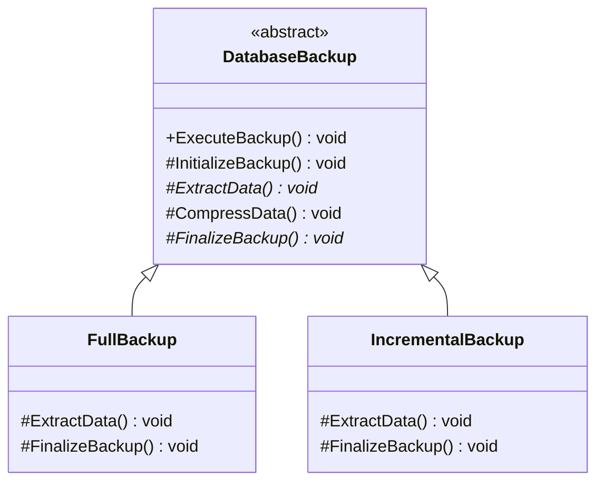
```mermaid
classDiagram
    class DatabaseBackup {
        <<abstract>>
        +ExecuteBackup() void
        #InitializeBackup() void
        #ExtractData()* void
        #CompressData() void
        #FinalizeBackup()* void
    }

    class FullBackup {
        #ExtractData() void
        #FinalizeBackup() void
    }

    class IncrementalBackup {
        #ExtractData() void
        #FinalizeBackup() void
    }

    DatabaseBackup <|-- FullBackup
    DatabaseBackup <|-- IncrementalBackup
```

#### Sequence Diagram: Backup Execution Workflow

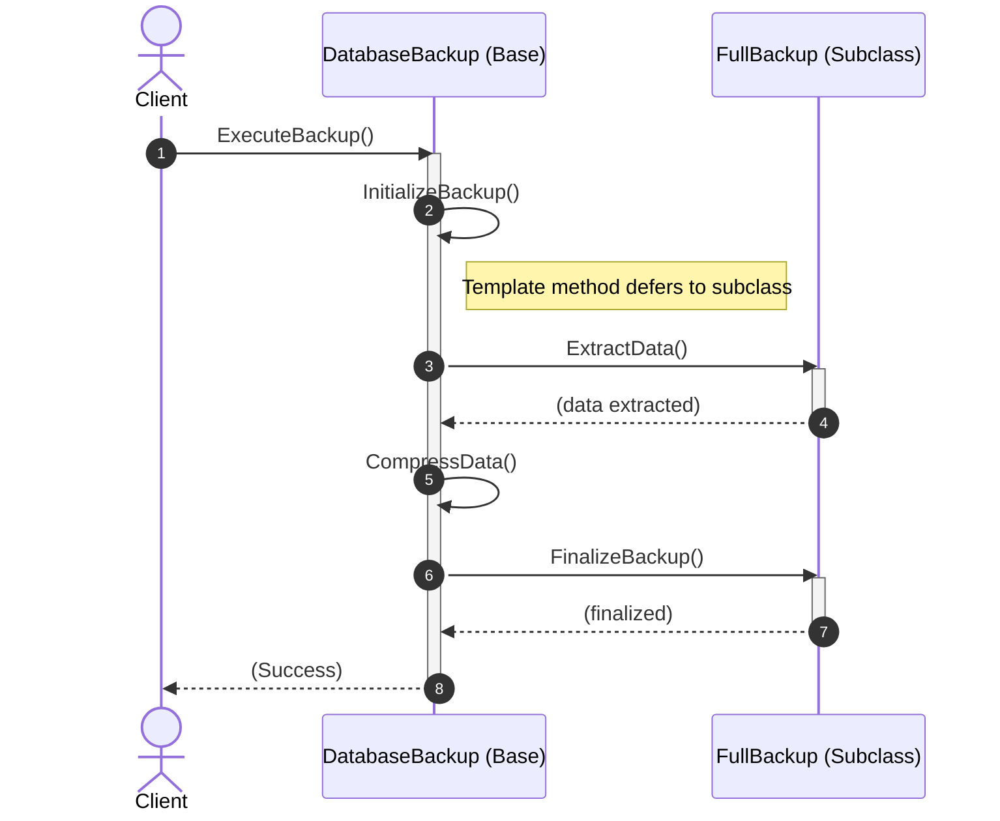
```mermaid
sequenceDiagram
    autonumber
    actor Client
    participant Base as DatabaseBackup (Base)
    participant Concrete as FullBackup (Subclass)

    Client->>Base: ExecuteBackup()
    activate Base

    Base->>Base: InitializeBackup()

    Note right of Base: Template method defers to subclass
    Base->>Concrete: ExtractData()
    activate Concrete
    Concrete-->>Base: (data extracted)
    deactivate Concrete

    Base->>Base: CompressData()

    Base->>Concrete: FinalizeBackup()
    activate Concrete
    Concrete-->>Base: (finalized)
    deactivate Concrete

    Base-->>Client: (Success)
    deactivate Base
```

### 3.6. Singleton (DatabaseManager)

The **Singleton** pattern is used to ensure that only one instance of the `DatabaseManager` exists throughout the application lifecycle. This provides a centralized point of access for managing all database instances, avoiding conflicting state or duplicate database tracking.

#### Structure Diagram

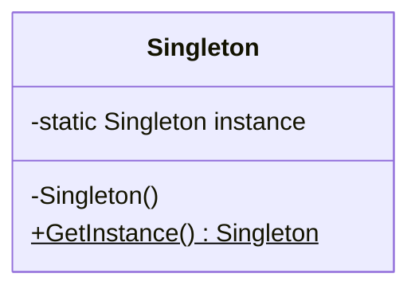
```mermaid
classDiagram
    class Singleton {
        -static Singleton instance
        -Singleton()
        +GetInstance()$ Singleton
    }
```

#### Example code

```csharp
public sealed class Singleton
{
    private static readonly Singleton _instance = new Singleton();

    private Singleton() { }

    public static Singleton GetInstance()
    {
        return _instance;
    }
}

// Usage Example
public class Program
{
    public static void Main()
    {
        var instance1 = Singleton.GetInstance();
        var instance2 = Singleton.GetInstance();
        
        Console.WriteLine(ReferenceEquals(instance1, instance2)); // Output: True
    }
}
```

#### Class diagram

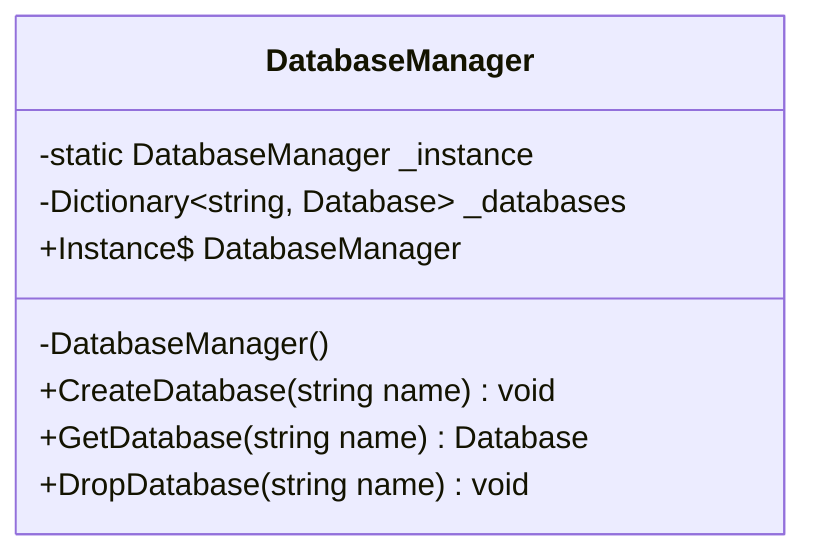
```mermaid
classDiagram
    class DatabaseManager {
        -static DatabaseManager _instance
        -Dictionary~string, Database~ _databases
        -DatabaseManager()
        +Instance$ DatabaseManager
        +CreateDatabase(string name) void
        +GetDatabase(string name) Database
        +DropDatabase(string name) void
    }
```

#### Sequence Diagram: Accessing DatabaseManager

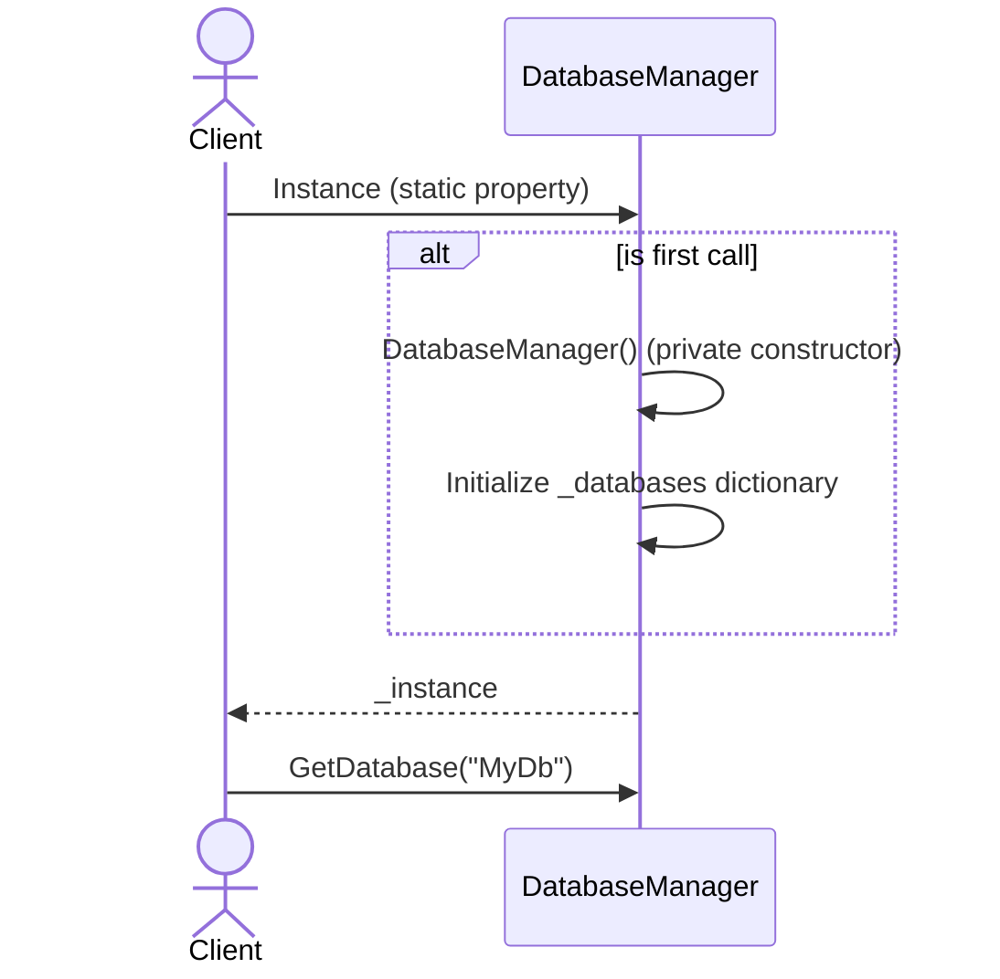
```mermaid
sequenceDiagram
    actor Client
    participant DM as DatabaseManager

    Client->>DM: Instance (static property)

    alt is first call
        DM->>DM: DatabaseManager() (private constructor)
        DM->>DM: Initialize _databases dictionary
    end

    DM-->>Client: _instance
    Client->>DM: GetDatabase("MyDb")
```

### 3.7. Bridge (Database ↔ Storage Engine)

The **Bridge** pattern is used to decouple the database's logical abstraction from its physical storage implementation. This allows the DBMS to support various storage engines (e.g., In-Memory, Disk-based, or Cloud-native) dynamically without altering the core database logic or requiring a massive class hierarchy for every combination of database feature and storage type.

#### Structure Diagram

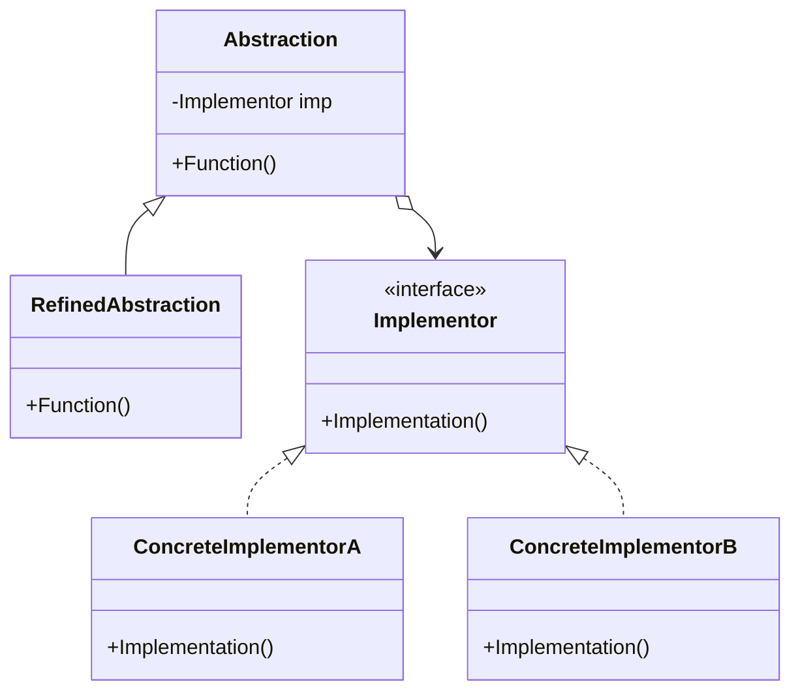
```mermaid
classDiagram
    class Abstraction {
        -Implementor imp
        +Function()
    }
    class RefinedAbstraction {
        +Function()
    }
    class Implementor {
        <<interface>>
        +Implementation()
    }
    class ConcreteImplementorA {
        +Implementation()
    }
    class ConcreteImplementorB {
        +Implementation()
    }

    Abstraction o--> Implementor
    Abstraction <|-- RefinedAbstraction
    Implementor <|.. ConcreteImplementorA
    Implementor <|.. ConcreteImplementorB
```

#### Example code

```csharp
// Implementor
public interface IStorageEngine
{
    void ReadData();
    void WriteData();
}

// Concrete Implementors
public class InMemoryStorageEngine : IStorageEngine
{
    public void ReadData() { Console.WriteLine("Reading from memory"); }
    public void WriteData() { Console.WriteLine("Writing to memory"); }
}

public class DiskStorageEngine : IStorageEngine
{
    public void ReadData() { Console.WriteLine("Reading from disk"); }
    public void WriteData() { Console.WriteLine("Writing to disk"); }
}

// Abstraction
public abstract class Database
{
    protected IStorageEngine _storageEngine;

    public Database(IStorageEngine storageEngine)
    {
        _storageEngine = storageEngine;
    }

    public virtual void Connect() { Console.WriteLine("Connecting to database"); }
    public abstract void ExecuteQuery();
}

// Refined Abstraction
public class RelationalDatabase : Database
{
    public RelationalDatabase(IStorageEngine storageEngine) : base(storageEngine) { }

    public override void ExecuteQuery()
    {
        Console.WriteLine("Executing SQL Query...");
        _storageEngine.ReadData();
    }
}

// Usage Example
public class Program
{
    public static void Main()
    {
        IStorageEngine diskEngine = new DiskStorageEngine();
        Database relationalDb = new RelationalDatabase(diskEngine);
        
        relationalDb.Connect();
        relationalDb.ExecuteQuery(); // Will read from disk
    }
}
```

#### Class diagram

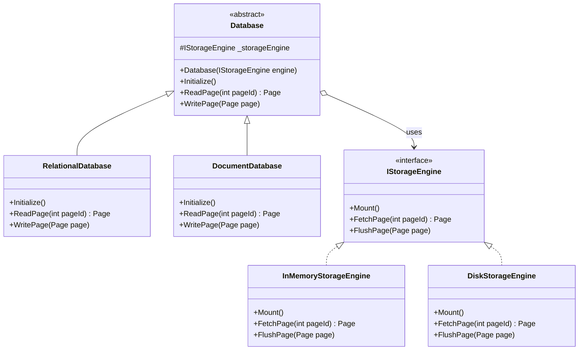
```mermaid
classDiagram
    class Database {
        <<abstract>>
        #IStorageEngine _storageEngine
        +Database(IStorageEngine engine)
        +Initialize()
        +ReadPage(int pageId) Page
        +WritePage(Page page)
    }

    class RelationalDatabase {
        +Initialize()
        +ReadPage(int pageId) Page
        +WritePage(Page page)
    }

    class DocumentDatabase {
        +Initialize()
        +ReadPage(int pageId) Page
        +WritePage(Page page)
    }

    class IStorageEngine {
        <<interface>>
        +Mount()
        +FetchPage(int pageId) Page
        +FlushPage(Page page)
    }

    class InMemoryStorageEngine {
        +Mount()
        +FetchPage(int pageId) Page
        +FlushPage(Page page)
    }

    class DiskStorageEngine {
        +Mount()
        +FetchPage(int pageId) Page
        +FlushPage(Page page)
    }

    Database o--> IStorageEngine : uses
    Database <|-- RelationalDatabase
    Database <|-- DocumentDatabase

    IStorageEngine <|.. InMemoryStorageEngine
    IStorageEngine <|.. DiskStorageEngine
```

#### Sequence Diagram: Storage Execution Workflow

```mermaid
sequenceDiagram
    autonumber
    actor Client
    participant DB as RelationalDatabase (Abstraction)
    participant Engine as DiskStorageEngine (Implementor)

    Client->>DB: ReadPage(105)
    activate DB

    Note right of DB: Delegates to configured StorageEngine
    DB->>Engine: FetchPage(105)
    activate Engine

    Engine->>Engine: Read from disk
    Engine-->>DB: Page data
    deactivate Engine

    DB-->>Client: Page
    deactivate DB
```
