# Database Design Patterns

This document tracks the design patterns used across different modules in the DBMS and their current implementation status.

## 1. Database Objects

| Priority  | Status | Design Pattern      | Feature                 | Reason / Context                                                                                      |
| :-------: | :----: | :------------------ | :---------------------- | :---------------------------------------------------------------------------------------------------- |
|  🔴 High  | `[x]`  | **Template Method** | Constraint              | `Validate()` defines the workflow, while each concrete constraint only implements `Check()`.          |
|  🔴 High  | `[x]`  | **Factory Method**  | Constraint Creation     | Creates `PrimaryKey`, `ForeignKey`, `Unique`, and `CheckConstraint` objects from metadata.            |
|  🔴 High  | `[x]`  | **Strategy**        | Referential Action      | Selects Cascade, Restrict, SetNull, or SetDefault behavior when deleting or updating referenced rows. |
|  🔴 High  | `[x]`  | **Composite**       | Schema Objects          | Schema contains Tables, Views, and Stored Procedures and manages them uniformly as `ISchemaObject`.   |
|  🔴 High  | `[x]`  | **Command**         | DDL Command             | `CreateTable`, `DropTable`, and `AlterTable` operations are encapsulated into command objects.        |
| 🟡 Medium | `[x]`  | **Iterator**        | Schema Object Traversal | Provides sequential access to schema objects without exposing internal collections.                   |
| 🟡 Medium | `[x]`  | **Visitor**         | Schema Operations       | Backup, Export, and Validation can operate on all schema object types.                                |
| 🟡 Medium | `[x]`  | **Builder**         | Table Definition        | Builds a Table step by step from columns, constraints, indexes, and partitions.                       |
|  🟢 Low   | `[x]`  | **Prototype**       | Schema Object Cloning   | Clones schema objects for migration, temporary objects, or schema duplication.                        |
|  🟢 Low   | `[ ]`  | **Decorator**       | Constraint Extension    | Adds logging, metrics, or auditing without modifying existing constraints.                            |
|  🟢 Low   | `[ ]`  | **Mediator**        | Dependency Management   | Coordinates interactions among Tables, Views, Procedures, and Foreign Keys.                           |

---

## 2. Pattern Implementation Details

### 2.1. Template Method (Constraint)

The **Template Method** pattern is used in the `Constraint` class.

- Define a template method with **multiple steps**.

- Delegate subclass implement how each step work.

#### Structure Diagram

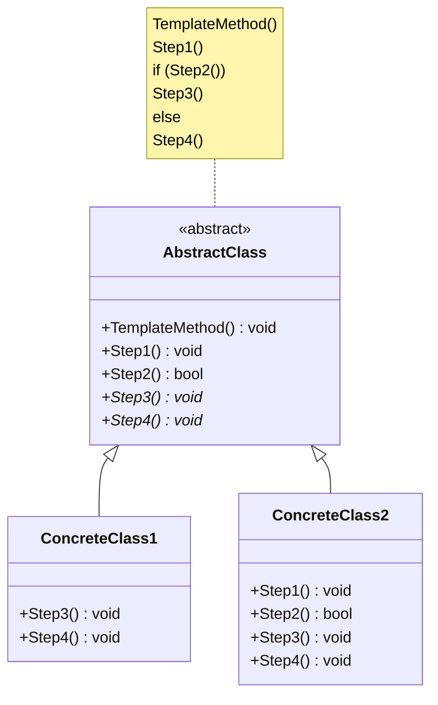
```mermaid
classDiagram
    direction TB

    class AbstractClass {
        <<abstract>>
        +TemplateMethod() void
        +Step1() void
        +Step2() bool
        +Step3()* void
        +Step4()* void
    }

    class ConcreteClass1 {
        +Step3() void
        +Step4() void
    }

    class ConcreteClass2 {
        +Step1() void
        +Step2() bool
        +Step3() void
        +Step4() void
    }

    AbstractClass <|-- ConcreteClass1
    AbstractClass <|-- ConcreteClass2

    note for AbstractClass "TemplateMethod()
    Step1()
    if (Step2())
        Step3()
    else
        Step4()"
```

#### Example code

```csharp
// Abstract class
public abstract class Constraint
{
public bool IsEnaled;

    protected abstract bool Check (Context context);

    public bool Validate(Context context)
    {
        if(!IsEnabled)
        {
            return true;
        }
        return Check(context);
    }

}

// Concrete Class
public class UniqueConstraint : Constraint
{
    protected override bool Check(Context context)
    {
        foreach(Row row in context.rows)
        {
            if(IsDouplicate(row, context))
                return false;
        }
        return true;
    }
}

public class PrimaryConstraint : Constraint
{
    protected override bool Check(Context context)
    {
        foreach(Row row in context.rows)
        {
            if(HasNullKey(row) || IsDouplicate(row,context))
                return false;
        }
        return true;
    }
}
```

#### Class diagram

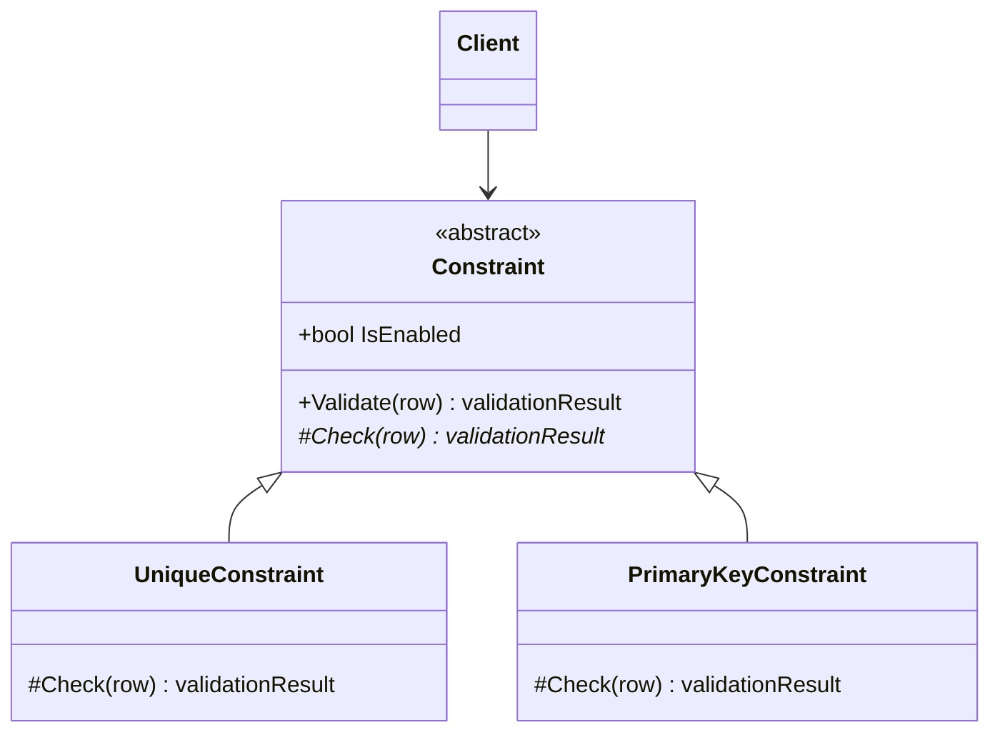
```mermaid
classDiagram
    class Client
    class Constraint {
        <<abstract>>
        +bool IsEnabled
        +Validate(row) validationResult
        #Check(row)* validationResult
    }
    class UniqueConstraint {
        #Check(row) validationResult
    }
    class PrimaryKeyConstraint {
        #Check(row) validationResult
    }

    Client --> Constraint
    Constraint <|-- UniqueConstraint
    Constraint <|-- PrimaryKeyConstraint
```

#### Sequence Diagram: Constraint Validation Workflow

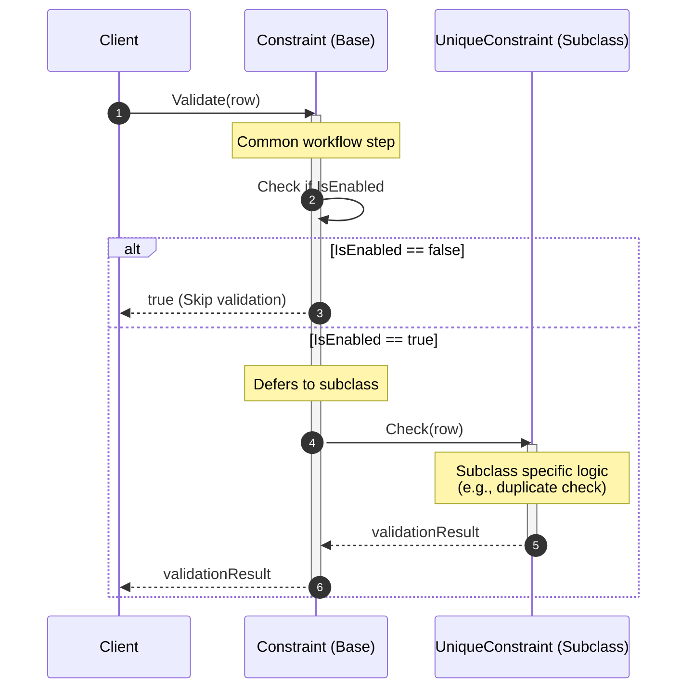
```mermaid
sequenceDiagram
    autonumber

    participant Client
    participant BaseConstraint as Constraint (Base)
    participant ConcreteConstraint as UniqueConstraint (Subclass)

    Client->>BaseConstraint: Validate(row)
    activate BaseConstraint

    Note over BaseConstraint: Common workflow step
    BaseConstraint->>BaseConstraint: Check if IsEnabled

    alt IsEnabled == false
        BaseConstraint-->>Client: true (Skip validation)
    else IsEnabled == true
        Note over BaseConstraint: Defers to subclass
        BaseConstraint->>ConcreteConstraint: Check(row)
        activate ConcreteConstraint

        Note over ConcreteConstraint: Subclass specific logic<br/>(e.g., duplicate check)
        ConcreteConstraint-->>BaseConstraint: validationResult
        deactivate ConcreteConstraint

        BaseConstraint-->>Client: validationResult
    end
    deactivate BaseConstraint
```

### 2.2. Factory Method (Constraint Creation)

The **Factory Method** pattern uses for creating `Constraint`.

- Define a abstract **Factory Method**
- Delegate object creations to **Concrete Creator** through Polymorphism.

#### Structure Diagram

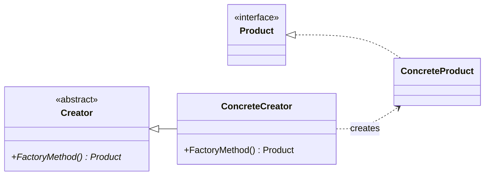
```mermaid
classDiagram
    direction LR

    class Product {
        <<interface>>
    }

    class ConcreteProduct

    class Creator {
        <<abstract>>
        +FactoryMethod()* Product
    }

    class ConcreteCreator {
        +FactoryMethod() Product
    }

    Product <|.. ConcreteProduct
    Creator <|-- ConcreteCreator

    ConcreteCreator ..> ConcreteProduct : creates
```

#### Example code

```csharp
// Creator
public abstract class ConstraintCreator
{
    public abstract Constraint FactoryMethod();
}

// Concrete Creator
public class ForeignKeyConstraintCreator : ConstraintCreator
{
    public override Constraint FactoryMethod()
    {
        return new ForeignKey();
    }
}

public class PrimaryKeyConstraintCreator : ConstraintCreator
{
    public override Constraint FactoryMethod()
    {
        return new PrimaryKey();
    }
}

// Product
public interface Constraint
{
    void DoSomething();
}

// Concrete Product
public class ForeignKey : Constraint
{
    public void DoSomething()
    {
        // Do foreign key work
    }
}
public class PrimaryKey : Constraint
{
    public void DoSomething()
    {
        // Do primary key work
    }
}
```

#### Class diagram

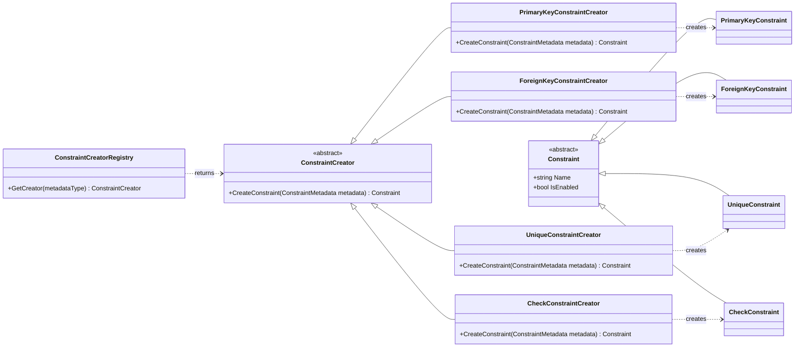
```mermaid
classDiagram
    direction LR

    class ConstraintCreatorRegistry {
        +GetCreator(metadataType) ConstraintCreator
    }

    %% Constraint Creators
    class ConstraintCreator {
        <<abstract>>
        +CreateConstraint(ConstraintMetadata metadata) Constraint
    }
    class PrimaryKeyConstraintCreator {
        +CreateConstraint(ConstraintMetadata metadata) Constraint
    }
    class ForeignKeyConstraintCreator {
        +CreateConstraint(ConstraintMetadata metadata) Constraint
    }
    class UniqueConstraintCreator {
        +CreateConstraint(ConstraintMetadata metadata) Constraint
    }
    class CheckConstraintCreator {
        +CreateConstraint(ConstraintMetadata metadata) Constraint
    }

    ConstraintCreatorRegistry ..> ConstraintCreator : returns

    ConstraintCreator <|-- PrimaryKeyConstraintCreator
    ConstraintCreator <|-- ForeignKeyConstraintCreator
    ConstraintCreator <|-- UniqueConstraintCreator
    ConstraintCreator <|-- CheckConstraintCreator

    %% Constraints
    class Constraint {
        <<abstract>>
        +string Name
        +bool IsEnabled
    }
    class PrimaryKeyConstraint
    class ForeignKeyConstraint
    class UniqueConstraint
    class CheckConstraint

    Constraint <|-- PrimaryKeyConstraint
    Constraint <|-- ForeignKeyConstraint
    Constraint <|-- UniqueConstraint
    Constraint <|-- CheckConstraint

    %% Factory Relationships
    PrimaryKeyConstraintCreator ..> PrimaryKeyConstraint : creates
    ForeignKeyConstraintCreator ..> ForeignKeyConstraint : creates
    UniqueConstraintCreator ..> UniqueConstraint : creates
    CheckConstraintCreator ..> CheckConstraint : creates
```

#### Sequence Diagram: Constraint Instantiation

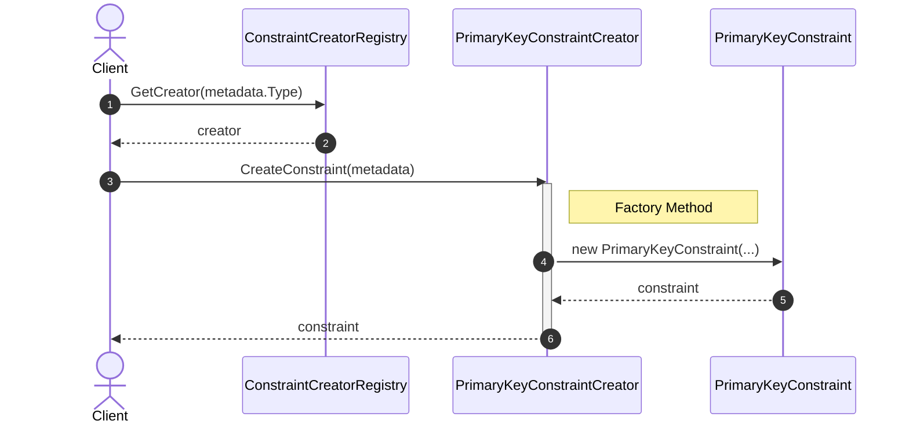
```mermaid
sequenceDiagram
    autonumber

    actor Client
    participant Registry as ConstraintCreatorRegistry
    participant Creator as PrimaryKeyConstraintCreator
    participant Constraint as PrimaryKeyConstraint

    Client->>Registry: GetCreator(metadata.Type)
    Registry-->>Client: creator

    Client->>Creator: CreateConstraint(metadata)
    activate Creator

    Note right of Creator: Factory Method
    Creator->>Constraint: new PrimaryKeyConstraint(...)
    Constraint-->>Creator: constraint

    Creator-->>Client: constraint
    deactivate Creator
```

### 2.3. Strategy (Referential Action)

The **Strategy** pattern is used to implemnt Referential Action of FK.

- **Using Polymorphism to dispatch appropriate algorithm** (runtime).

#### Structure Diagram

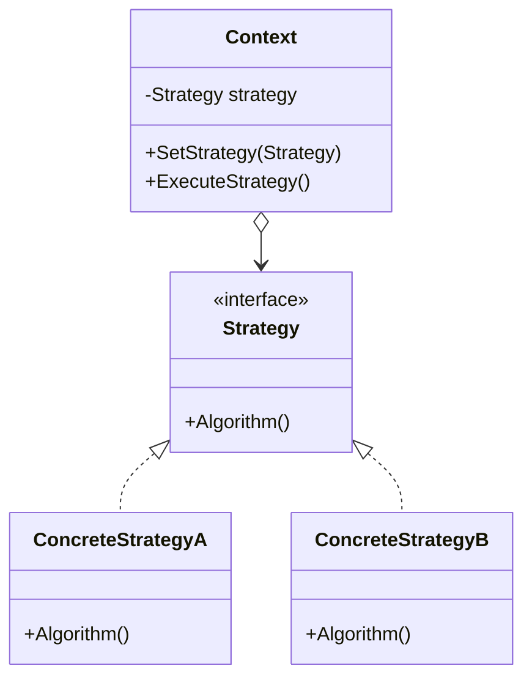
```mermaid
classDiagram
    class Strategy {
        <<interface>>
        +Algorithm()
    }
    class ConcreteStrategyA {
        +Algorithm()
    }
    class ConcreteStrategyB {
        +Algorithm()
    }
    class Context {
        -Strategy strategy
        +SetStrategy(Strategy)
        +ExecuteStrategy()
    }
    Strategy <|.. ConcreteStrategyA
    Strategy <|.. ConcreteStrategyB
    Context o--> Strategy
```

#### Example code

```csharp
// Strategy
public interface IReferentialAction
{
    void Execute(Row parentRow, Table childTable);
}

// Concrete Strategy
public class CascadeAction : IReferentialAction
{
    public void Execute(Row parentRow, Table childTable)
    {
        // Delete all row related
        foreach(Row row in childTable.rows)
        {
            row.Remove();
        }
    }
}

// Context
public class ForeingKey
{
    private IReferentialAction _strategy;

    public void SetStrategy(IStrategy strategy)
    {
        _strategy = strategy;
    }

    public void ExecuteStrategy()
    {
        _strategy.Execute(parentRow, childTable);
    }
}
```

#### Class diagram

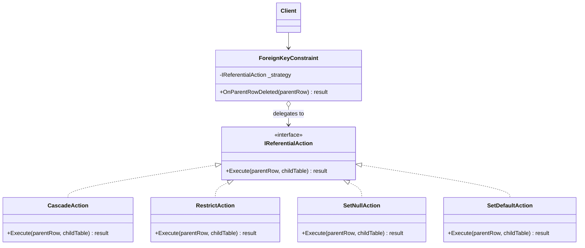
```mermaid
classDiagram
    class Client
    class ForeignKeyConstraint {
        -IReferentialAction _strategy
        +OnParentRowDeleted(parentRow) result
    }
    class IReferentialAction {
        <<interface>>
        +Execute(parentRow, childTable) result
    }
    class CascadeAction {
        +Execute(parentRow, childTable) result
    }
    class RestrictAction {
        +Execute(parentRow, childTable) result
    }
    class SetNullAction {
        +Execute(parentRow, childTable) result
    }
    class SetDefaultAction {
        +Execute(parentRow, childTable) result
    }

    Client --> ForeignKeyConstraint
    ForeignKeyConstraint o--> IReferentialAction : delegates to
    IReferentialAction <|.. CascadeAction
    IReferentialAction <|.. RestrictAction
    IReferentialAction <|.. SetNullAction
    IReferentialAction <|.. SetDefaultAction
```

#### Sequence Diagram: Referential Action Execution

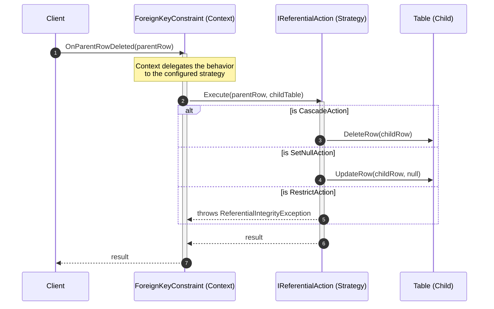
```mermaid
sequenceDiagram
    autonumber

    participant Client
    participant FK as ForeignKeyConstraint (Context)
    participant Strategy as IReferentialAction (Strategy)
    participant ChildTable as Table (Child)

    Client->>FK: OnParentRowDeleted(parentRow)
    activate FK

    Note over FK: Context delegates the behavior<br/>to the configured strategy
    FK->>Strategy: Execute(parentRow, childTable)
    activate Strategy

    alt is CascadeAction
        Strategy->>ChildTable: DeleteRow(childRow)
    else is SetNullAction
        Strategy->>ChildTable: UpdateRow(childRow, null)
    else is RestrictAction
        Strategy-->>FK: throws ReferentialIntegrityException
    end

    Strategy-->>FK: result
    deactivate Strategy

    FK-->>Client: result
    deactivate FK
```

### 2.4. Composite (Schema Objects)

The **Composite** pattern is used to treat individual database objects (`Table`, `View`, `StoredProcedure`) and groups of objects uniformly.
The `Schema` class acts as the composite node that manages collections of these leaf objects. When a high-level lifecycle operation such as `Drop()` is performed on the `Schema`, it delegates the operation to all of its child components.

#### Structure Diagram

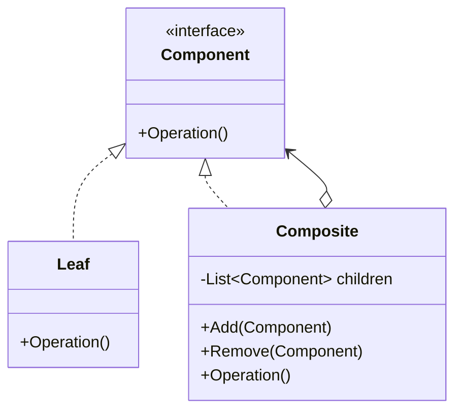
```mermaid
classDiagram
    class Component {
        <<interface>>
        +Operation()
    }
    class Leaf {
        +Operation()
    }
    class Composite {
        -List~Component~ children
        +Add(Component)
        +Remove(Component)
        +Operation()
    }
    Component <|.. Leaf
    Component <|.. Composite
    Composite o--> Component
```

#### Example code

```csharp

// Component
public interface ISchemaObject
{
    void Drop();
}

// Leaft
public class Table : ISchemaObject
{
    public void Drop()
    {
        // Table Drop
    }
}

// Composite
public class Schema : ISchemaObject
{
    private readonly List<ISchemaObject> _children = new List<ISchemaObject>();

    public void Add(ISchemaObject component)
    {
        _children.Add(component);
    }

    public void Drop()
    {
        foreach(ISchemaObject child in _children)
        {
            _children.Drop();
        }
    }
}
```

#### Class diagram

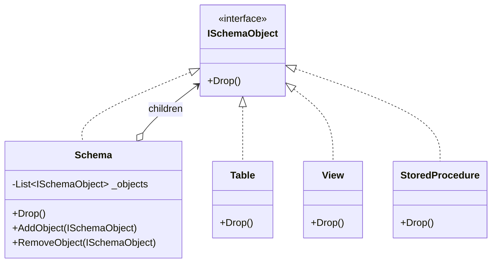
```mermaid
classDiagram
    class ISchemaObject {
        <<interface>>
        +Drop()
    }
    class Schema {
        -List~ISchemaObject~ _objects
        +Drop()
        +AddObject(ISchemaObject)
        +RemoveObject(ISchemaObject)
    }
    class Table {
        +Drop()
    }
    class View {
        +Drop()
    }
    class StoredProcedure {
        +Drop()
    }

    ISchemaObject <|.. Schema
    ISchemaObject <|.. Table
    ISchemaObject <|.. View
    ISchemaObject <|.. StoredProcedure
    Schema o--> ISchemaObject : children
```

#### Sequence Diagram: Recursive Drop Operation

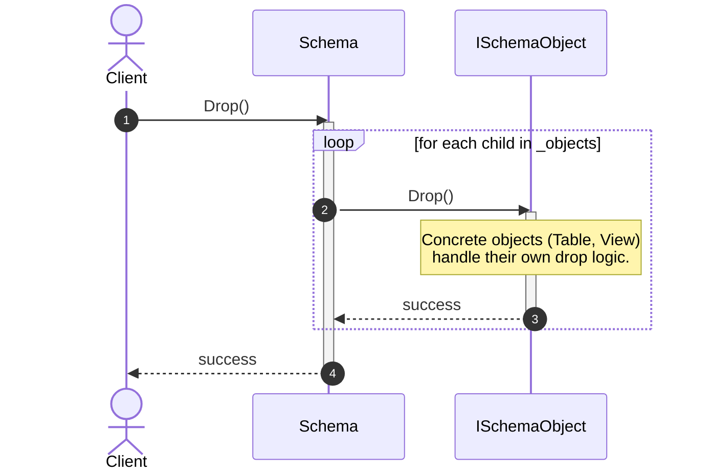
```mermaid
sequenceDiagram
    autonumber

    actor Client
    participant Schema
    participant Child as ISchemaObject

    Client->>Schema: Drop()
    activate Schema

    loop for each child in _objects
        Schema->>Child: Drop()
        activate Child
        Note over Child: Concrete objects (Table, View) <br/> handle their own drop logic.
        Child-->>Schema: success
        deactivate Child
    end

    Schema-->>Client: success
    deactivate Schema
```

### 2.5. Command (DDL Command)

The **Command** pattern is used to encapsulate DDL operations (like `CreateTable`, `DropTable`, and `AlterTable`) into standalone command objects.
This allows the system to parameterize clients with different requests, queue or log requests, and support undoable operations. The `DDLCommandExecutor` acts as the invoker that executes the concrete `IDDLCommand`.

#### Structure Diagram

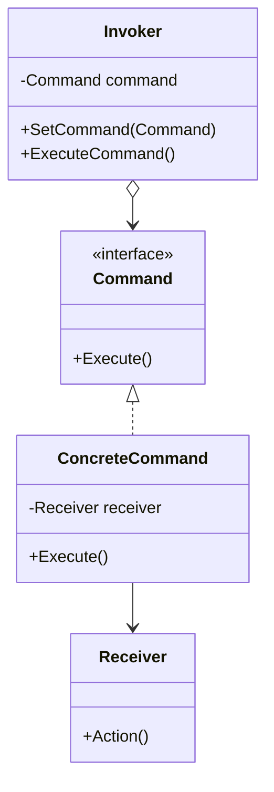
```mermaid
classDiagram
    class Command {
        <<interface>>
        +Execute()
    }
    class ConcreteCommand {
        -Receiver receiver
        +Execute()
    }
    class Receiver {
        +Action()
    }
    class Invoker {
        -Command command
        +SetCommand(Command)
        +ExecuteCommand()
    }
    Command <|.. ConcreteCommand
    ConcreteCommand --> Receiver
    Invoker o--> Command
```

#### Example code

```csharp
// Command
public interface IDDLCommand
{
    void Execute();
}

// Concrete IDDLCommand
public class CreateTableCommand : IDDLCommand
{
    private readonly Table _table;

    public ConcreteCommand(Table table)
    {
        _table = table;
    }

    public void Execute()
    {
        _table.Create();
    }
}

// Receiver
public class Table
{
    public void Create()
    {
        // Create table
    }
}

// Invoker
public class DDLCommandExecutor
{
    private IDDLCommand _command;

    public void SetCommand(IDDLCommand command)
    {
        _command = command;
    }

    public void ExecuteCommand()
    {
        _command.Execute();
    }
}
```

#### Class diagram

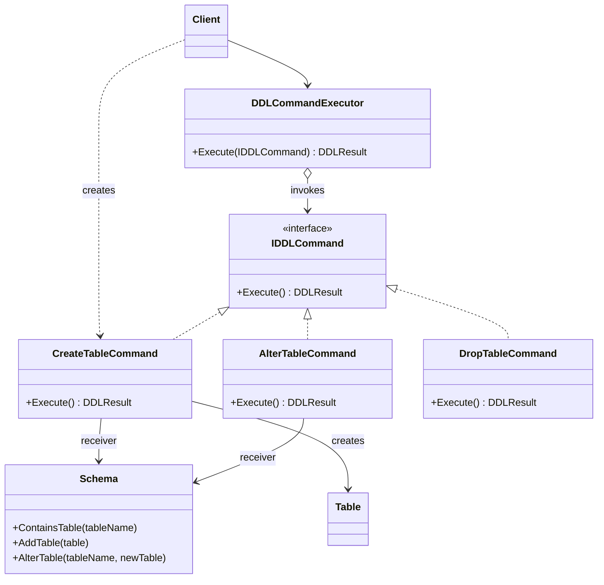
```mermaid
classDiagram
    class Client
    class DDLCommandExecutor {
        +Execute(IDDLCommand) DDLResult
    }
    class IDDLCommand {
        <<interface>>
        +Execute() DDLResult
    }
    class CreateTableCommand {
        +Execute() DDLResult
    }
    class AlterTableCommand {
        +Execute() DDLResult
    }
    class DropTableCommand {
        +Execute() DDLResult
    }
    class Schema {
        +ContainsTable(tableName)
        +AddTable(table)
        +AlterTable(tableName, newTable)
    }
    class Table

    Client --> DDLCommandExecutor
    Client ..> CreateTableCommand : creates
    DDLCommandExecutor o--> IDDLCommand : invokes
    IDDLCommand <|.. CreateTableCommand
    IDDLCommand <|.. AlterTableCommand
    IDDLCommand <|.. DropTableCommand
    CreateTableCommand --> Schema : receiver
    CreateTableCommand --> Table : creates
    AlterTableCommand --> Schema : receiver
```

#### Sequence Diagram: DDL Command Execution

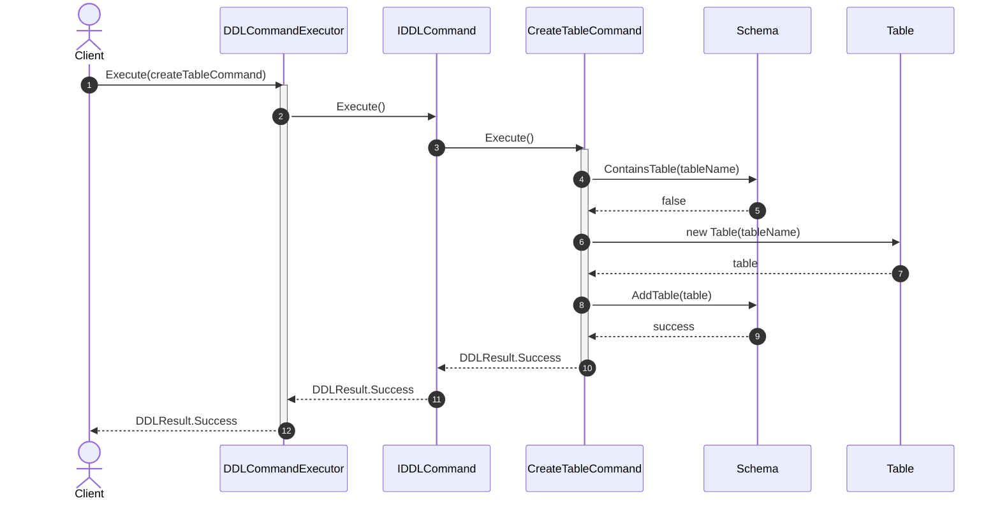
```mermaid
sequenceDiagram
    autonumber

    actor Client
    participant Executor as DDLCommandExecutor
    participant Command as IDDLCommand
    participant Concrete as CreateTableCommand
    participant Schema
    participant Table

    Client->>Executor: Execute(createTableCommand)
    activate Executor

    Executor->>Command: Execute()
    Command->>Concrete: Execute()
    activate Concrete

    Concrete->>Schema: ContainsTable(tableName)
    Schema-->>Concrete: false

    Concrete->>Table: new Table(tableName)
    Table-->>Concrete: table

    Concrete->>Schema: AddTable(table)
    Schema-->>Concrete: success

    Concrete-->>Command: DDLResult.Success
    deactivate Concrete

    Command-->>Executor: DDLResult.Success
    Executor-->>Client: DDLResult.Success

    deactivate Executor
```

### 2.6. Iterator (Schema Object Traversal)

The **Iterator** pattern provides sequential access to schema objects without exposing the internal collection structures

- Encapsulates the traversal logic inside an Iterator.
- Allow client traverse a collection without knowing about how it's stored.

#### Structure Diagram

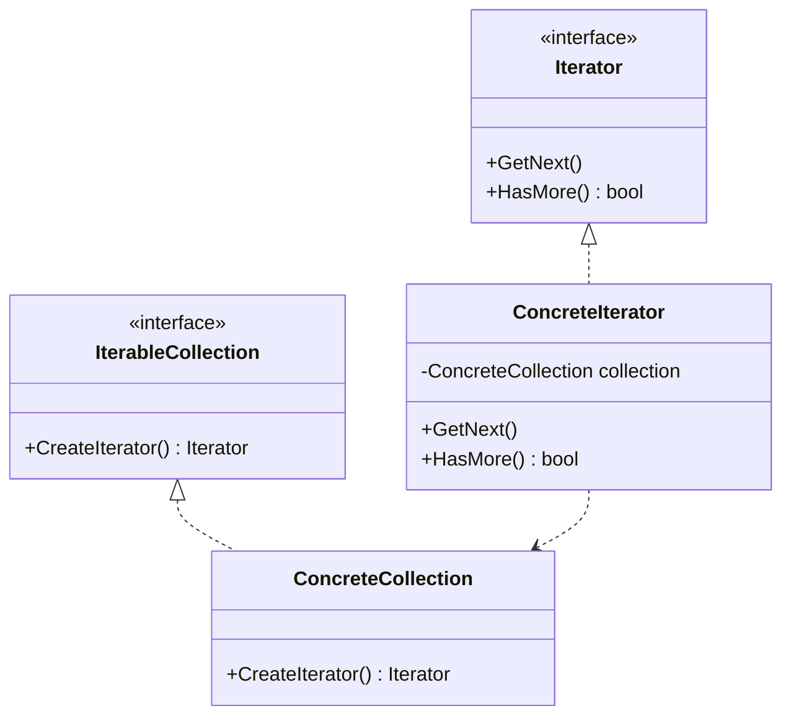
```mermaid
classDiagram
    class Iterator {
        <<interface>>
        +GetNext()
        +HasMore() bool
    }
    class IterableCollection {
        <<interface>>
        +CreateIterator() Iterator
    }
    class ConcreteIterator {
        -ConcreteCollection collection
        +GetNext()
        +HasMore() bool
    }
    class ConcreteCollection {
        +CreateIterator() Iterator
    }
    Iterator <|.. ConcreteIterator
    IterableCollection <|.. ConcreteCollection
    ConcreteIterator ..> ConcreteCollection
```

#### Example code

```csharp

// Iterator
public interface ISchemaObjectIterator
{
    ISchemaObject GetNext();
    bool HasMore();
}

// Concrete Iterator
public class SchemaObjectIterator : ISchemaObjectIterator
{
    private readonly List<ISchemaObject> _collection;
    private int _position;

    public SchemaObjectIterator(List<ISchemaObject> collection, int position)
    {
        _collection = collection;
        _position = position;
    }

    public ISchemaObject GetNext()
    {
        return _collection[_position++];
    }

    public bool HasMore()
    {
        return _collection.Length() < _postion;
    }
}

// Iterable Collection
public interface ISchemaObjectCollection
{
    ISchemaObjectIterator CreateIterator();
}

// Concrete Collection
public class Schema : ISchemaObjectCollection
{
    private readonly List<ISchemaObject> _objects = new();
    public ISchemaObjectIterator CreateIterator()
    {
        return new SchemaObjectIterator(_object);
    }
}


```

#### Class diagram

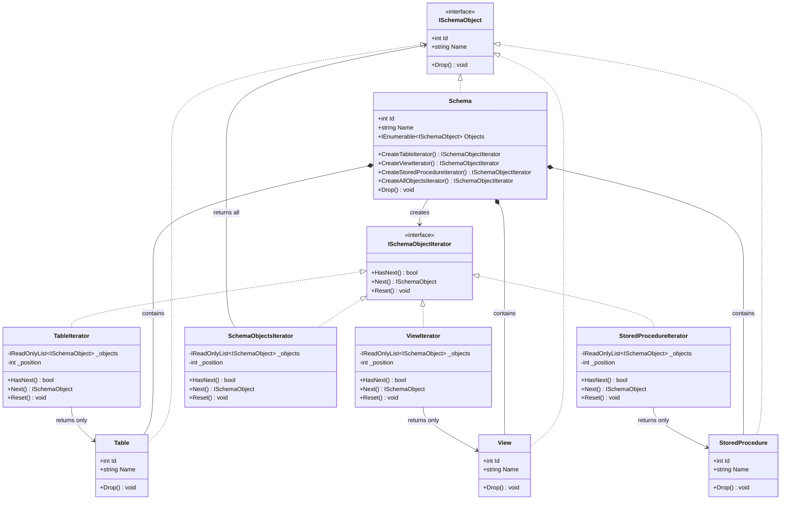
```mermaid
classDiagram
    direction TB

    %% =========================
    %% SCHEMA OBJECTS
    %% =========================

    class ISchemaObject {
        <<interface>>
        +int Id
        +string Name
        +Drop() void
    }

    class Schema {
        +int Id
        +string Name
        +IEnumerable~ISchemaObject~ Objects

        +CreateTableIterator() ISchemaObjectIterator
        +CreateViewIterator() ISchemaObjectIterator
        +CreateStoredProcedureIterator() ISchemaObjectIterator
        +CreateAllObjectsIterator() ISchemaObjectIterator

        +Drop() void
    }

    class Table {
        +int Id
        +string Name
        +Drop() void
    }

    class View {
        +int Id
        +string Name
        +Drop() void
    }

    class StoredProcedure {
        +int Id
        +string Name
        +Drop() void
    }

    ISchemaObject <|.. Schema
    ISchemaObject <|.. Table
    ISchemaObject <|.. View
    ISchemaObject <|.. StoredProcedure

    Schema *-- Table : contains
    Schema *-- View : contains
    Schema *-- StoredProcedure : contains


    %% =========================
    %% ITERATOR
    %% =========================

    class ISchemaObjectIterator {
        <<interface>>
        +HasNext() bool
        +Next() ISchemaObject
        +Reset() void
    }


    %% =========================
    %% CONCRETE ITERATORS
    %% =========================

    class TableIterator {
        -IReadOnlyList~ISchemaObject~ _objects
        -int _position
        +HasNext() bool
        +Next() ISchemaObject
        +Reset() void
    }

    class ViewIterator {
        -IReadOnlyList~ISchemaObject~ _objects
        -int _position
        +HasNext() bool
        +Next() ISchemaObject
        +Reset() void
    }

    class StoredProcedureIterator {
        -IReadOnlyList~ISchemaObject~ _objects
        -int _position
        +HasNext() bool
        +Next() ISchemaObject
        +Reset() void
    }

    class SchemaObjectsIterator {
        -IReadOnlyList~ISchemaObject~ _objects
        -int _position
        +HasNext() bool
        +Next() ISchemaObject
        +Reset() void
    }


    %% =========================
    %% ITERATOR IMPLEMENTATIONS
    %% =========================

    ISchemaObjectIterator <|.. TableIterator
    ISchemaObjectIterator <|.. ViewIterator
    ISchemaObjectIterator <|.. StoredProcedureIterator
    ISchemaObjectIterator <|.. SchemaObjectsIterator


    %% =========================
    %% ITERATOR TARGETS
    %% =========================

    TableIterator --> Table : returns only
    ViewIterator --> View : returns only
    StoredProcedureIterator --> StoredProcedure : returns only

    SchemaObjectsIterator --> ISchemaObject : returns all

    Schema --> ISchemaObjectIterator : creates
```

#### Sequence Diagram: Schema Object Traversal

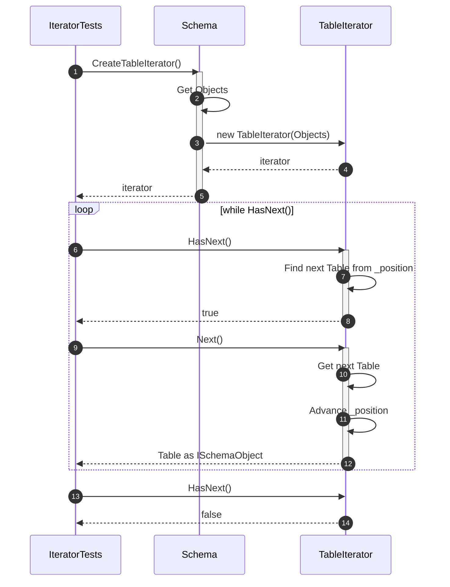
```mermaid
sequenceDiagram
    autonumber

    participant Test as IteratorTests
    participant Schema as Schema
    participant TI as TableIterator

    Test->>Schema: CreateTableIterator()
    activate Schema

    Schema->>Schema: Get Objects
    Schema->>TI: new TableIterator(Objects)
    TI-->>Schema: iterator
    Schema-->>Test: iterator

    deactivate Schema

    loop while HasNext()
        Test->>TI: HasNext()
        activate TI

        TI->>TI: Find next Table from _position
        TI-->>Test: true

        deactivate TI

        Test->>TI: Next()
        activate TI

        TI->>TI: Get next Table
        TI->>TI: Advance _position
        TI-->>Test: Table as ISchemaObject

        deactivate TI
    end

    Test->>TI: HasNext()
    TI-->>Test: false
```

### 2.7. Visitor (Schema Operations)

The **Visitor** pattern is used for schema operations like backup, export, and validation.

- It allows **defining new operations** on schema objects (Table, View, StoredProcedure, Schema) **without modifying their classes**.

#### Structure Diagram

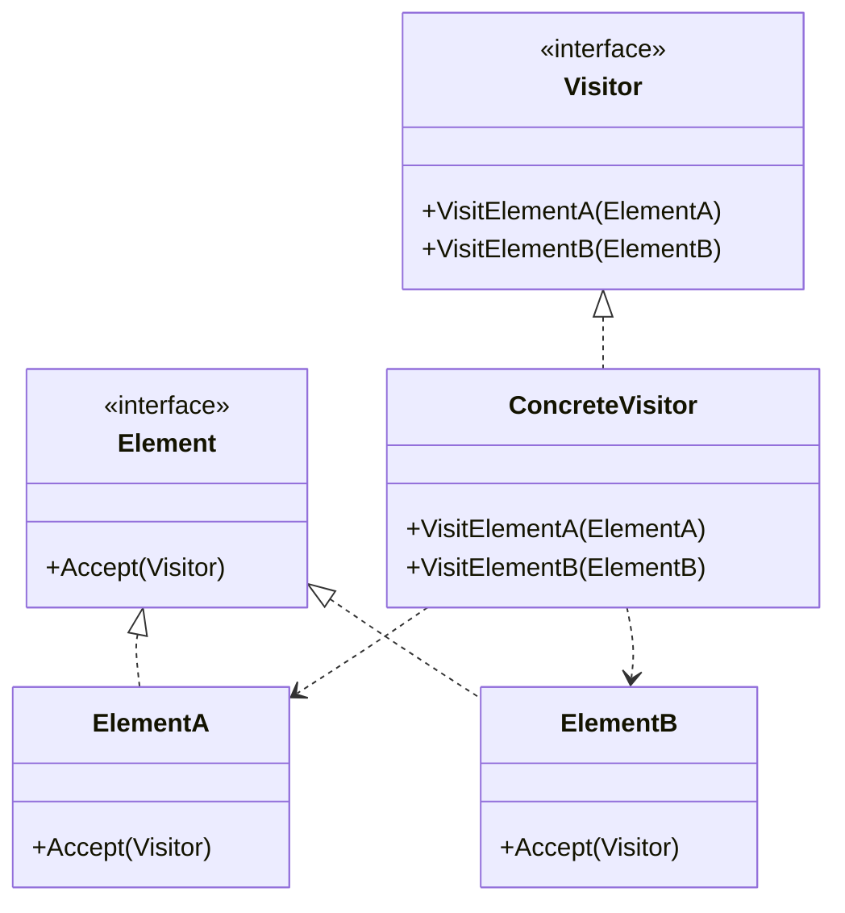
```mermaid
classDiagram
    class Visitor {
        <<interface>>
        +VisitElementA(ElementA)
        +VisitElementB(ElementB)
    }
    class ConcreteVisitor {
        +VisitElementA(ElementA)
        +VisitElementB(ElementB)
    }
    class Element {
        <<interface>>
        +Accept(Visitor)
    }
    class ElementA {
        +Accept(Visitor)
    }
    class ElementB {
        +Accept(Visitor)
    }
    Visitor <|.. ConcreteVisitor
    Element <|.. ElementA
    Element <|.. ElementB
    ConcreteVisitor ..> ElementA
    ConcreteVisitor ..> ElementB
```

#### Example code

```csharp

// Visitor
public interface ISchemaVistor
{
    void Visit(Schema element);
    void Visit(Table element);
}


// Concrete Visitor
public class BackupVisitor : ISchemaVistor
{
    public void Visit(Schema element)
    {
        // Visit Schema
    }

    public void Visit(Table element)
    {
        // Visit Table
    }
}

// Element
public interface ISchemaObject
{
    void Accept(ISchemaVistor visitor);
}

// Concrete Element
public class Table : ISchemaObject
{
    public void Accept(IVisitor visitor)
    {
        vistor.Visit(this);
    }
}

public class Schema : ISchemaObject
{
    public void Accept(IVisitor visitor)
    {
        vistor.Visit(this);
    }
}
```

#### Class diagram

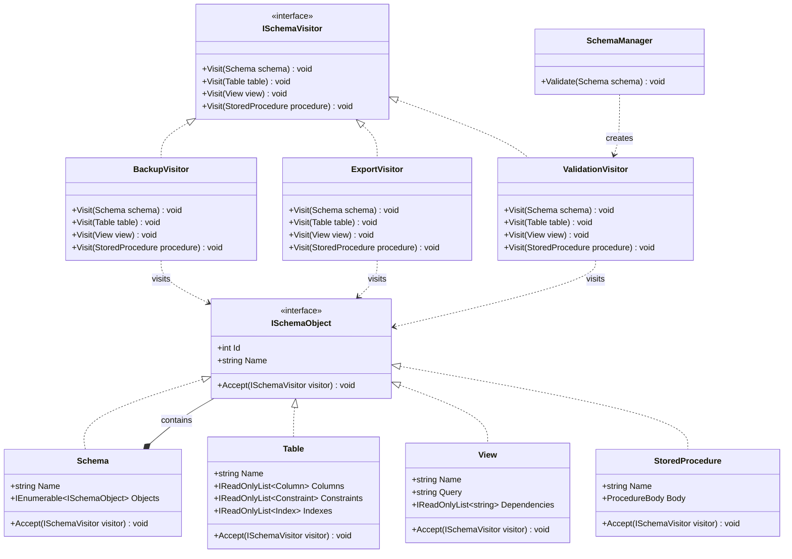
```mermaid
classDiagram
    direction TB

    %% =========================
    %% VISITOR
    %% =========================

    class ISchemaVisitor {
        <<interface>>
        +Visit(Schema schema) void
        +Visit(Table table) void
        +Visit(View view) void
        +Visit(StoredProcedure procedure) void
    }

    class BackupVisitor {
        +Visit(Schema schema) void
        +Visit(Table table) void
        +Visit(View view) void
        +Visit(StoredProcedure procedure) void
    }

    class ExportVisitor {
        +Visit(Schema schema) void
        +Visit(Table table) void
        +Visit(View view) void
        +Visit(StoredProcedure procedure) void
    }

    class ValidationVisitor {
        +Visit(Schema schema) void
        +Visit(Table table) void
        +Visit(View view) void
        +Visit(StoredProcedure procedure) void
    }

    %% =========================
    %% ELEMENT
    %% =========================

    class ISchemaObject {
        <<interface>>
        +int Id
        +string Name
        +Accept(ISchemaVisitor visitor) void
    }

    class Schema {
        +string Name
        +IEnumerable~ISchemaObject~ Objects
        +Accept(ISchemaVisitor visitor) void
    }

    class Table {
        +string Name
        +IReadOnlyList~Column~ Columns
        +IReadOnlyList~Constraint~ Constraints
        +IReadOnlyList~Index~ Indexes
        +Accept(ISchemaVisitor visitor) void
    }

    class View {
        +string Name
        +string Query
        +IReadOnlyList~string~ Dependencies
        +Accept(ISchemaVisitor visitor) void
    }

    class StoredProcedure {
        +string Name
        +ProcedureBody Body
        +Accept(ISchemaVisitor visitor) void
    }

    %% =========================
    %% CLIENT / MANAGERS
    %% =========================

    class SchemaManager {
        +Validate(Schema schema) void
    }

    %% Visitor implementations
    ISchemaVisitor <|.. BackupVisitor
    ISchemaVisitor <|.. ExportVisitor
    ISchemaVisitor <|.. ValidationVisitor

    %% Element implementations
    ISchemaObject <|.. Schema
    ISchemaObject <|.. Table
    ISchemaObject <|.. View
    ISchemaObject <|.. StoredProcedure

    %% Schema contains schema objects
    Schema *-- ISchemaObject : contains

    %% Clients create/use visitors
    SchemaManager ..> ValidationVisitor : creates

    %% Visitors operate on elements
    BackupVisitor ..> ISchemaObject : visits
    ExportVisitor ..> ISchemaObject : visits
    ValidationVisitor ..> ISchemaObject : visits
```

#### Sequence Diagram: Visitor Dispatch Workflow

```mermaid
sequenceDiagram
    actor Client
    participant BV as BackupVisitor
    participant T as Table

    Client->>BV: new BackupVisitor()
    Client->>T: Accept(backupVisitor)

    T->>BV: Visit(this)

    Note over T,BV: this = Table<br/>selects Visit(Table)

    BV->>T: Get Columns
    T-->>BV: Columns

    BV->>T: Get Constraints
    T-->>BV: Constraints

    BV->>T: Get Indexes
    T-->>BV: Indexes

    BV->>BV: Backup table structure and data

    BV-->>T: Completed
    T-->>Client: Completed
```

### 2.8. Builder (Table Definition)

The **Builder** pattern is used to construct complex `Table` objects step by step. This encapsulates the construction logic of columns, constraints, indexes, and partitions, keeping the `Table` constructor clean and preventing partially initialized tables.

#### Structure Diagram

```mermaid
classDiagram
    class Builder {
        <<interface>>
        +BuildPartA()
        +BuildPartB()
        +GetResult() Product
    }
    class ConcreteBuilder {
        -Product product
        +BuildPartA()
        +BuildPartB()
        +GetResult() Product
    }
    class Director {
        -Builder builder
        +Construct()
    }
    class Product {
    }
    Builder <|.. ConcreteBuilder
    ConcreteBuilder ..> Product
    Director o--> Builder
```

#### Example code

```csharp
// Product
public class Table
{
    // Table details
}

// Builder
public interface ITableBuilder
{
    ITableBuilder SetName(string name);
    ITableBuilder SetForeignKey(List<ForeignKey> fk);
    ITableBuilder SetPrimaryKey(List<PrimaryKey> pk);
    Table Build();
}

// Concrete Builder
public class TableBuilder : ITableBuilder
{
    private Table _table = new Table();

    public  ITableBuilder SetName(string name)
    {
        _table.SetName(name);
    }

    public ITableBuilder SetPrimaryKey(List<PrimaryKey> pk)
    {
        _table.SetPrimaryKey(pk);
    }
    public ITableBuilder SetForeignKey(List<ForeignKey> fk)
    {
        _table.SetPForeignKey(fk);
    }

    public Table Build()
    {
        return _table;
    }
}

// Director
public class Director
{
    private readonly ITableBuilder _builder;

    public Director(ITableBuilder builder)
    {
        _builder = builder;
    }

    public void Construct()
    {

    }
}
```

#### Class diagram

```mermaid
classDiagram
    direction LR

    class Client {
        +CreateTable() Table
    }

    class ITableBuilder {
        <<interface>>
        +SetName(string name) ITableBuilder
        +AddColumn(Column column) ITableBuilder
        +AddConstraint(Constraint constraint) ITableBuilder
        +AddIndex(Index index) ITableBuilder
        +AddPartition(Partition partition) ITableBuilder
        +Build() Table
    }

    class TableBuilder {
        +SetName(string name) ITableBuilder
        +AddColumn(Column column) ITableBuilder
        +AddConstraint(Constraint constraint) ITableBuilder
        +AddIndex(Index index) ITableBuilder
        +AddPartition(Partition partition) ITableBuilder
        +Build() Table
    }

    class Table {
        +string Name
        +Columns
        +Constraints
        +Indexes
        +Partitions
    }

    Client --> ITableBuilder : uses
    ITableBuilder <|.. TableBuilder
    TableBuilder ..> Table : builds
```

#### Sequence Diagram: Step-by-Step Table Construction

```mermaid
sequenceDiagram
    autonumber

    actor Client
    participant TB as TableBuilder
    participant T as Table

    Client->>TB: SetName("Users")
    TB-->>Client: ITableBuilder

    loop For each Column
        Client->>TB: AddColumn(col)
        TB-->>Client: ITableBuilder
    end

    loop For each Constraint
        Client->>TB: AddConstraint(const)
        TB-->>Client: ITableBuilder
    end

    loop For each Index
        Client->>TB: AddIndex(idx)
        TB-->>Client: ITableBuilder
    end

    loop For each Partition
        Client->>TB: AddPartition(part)
        TB-->>Client: ITableBuilder
    end

    Client->>TB: Build()
    activate TB

    TB->>T: new Table(...)
    T-->>TB: Table

    TB-->>Client: Table
    deactivate TB
```

### 2.9. Prototype (Schema Object Cloning)

The **Prototype** pattern is used to clone existing schema objects (such as `Table`, `View`, and `Schema`). This is particularly useful for creating temporary objects, schema duplication, or generating migration scripts where a working copy of an object is modified without affecting the original.

- Define a `Clone()` method in the base schema object interface.
- Allow complex objects to duplicate themselves, including all their internal structures (deep copy).

#### Structure Diagram

```mermaid
classDiagram
    class Prototype {
        <<interface>>
        +Clone() Prototype
    }
    class ConcretePrototype1 {
        +Clone() Prototype
    }
    class ConcretePrototype2 {
        +Clone() Prototype
    }
    class Client {
        -Prototype prototype
        +Operation()
    }
    Prototype <|.. ConcretePrototype1
    Prototype <|.. ConcretePrototype2
    Client --> Prototype
```

#### Example code

```csharp
// Prototype
public interface ISchemaObjectPrototype
{
    ISchemaObjectPrototype Clone();
}

// Concrete Prototype
public class Table : ISchemaObjectPrototype
{
    public string Name { get; set; }
    public List<Column> Columns { get; set; }

    public Table(string name, List<Column> columns)
    {
        Name = name;
        Columns = columns;
    }

    public ISchemaObjectPrototype Clone()
    {
        // Deep copy of columns
        var clonedColumns = new List<Column>();
        foreach (var col in Columns)
        {
            clonedColumns.Add(new Column(col.Name, col.Type));
        }
        
        return new Table(Name + "_Clone", clonedColumns);
    }
}
```

#### Class diagram

```mermaid
classDiagram
    direction LR

    class ICloneableSchemaObject {
        <<interface>>
        +Clone() ICloneableSchemaObject
    }

    class ISchemaObject {
        <<interface>>
        +string Name
    }

    class Schema {
        +Clone() ICloneableSchemaObject
    }

    class Table {
        +Clone() ICloneableSchemaObject
    }

    class View {
        +Clone() ICloneableSchemaObject
    }

    ISchemaObject <|-- ICloneableSchemaObject
    ICloneableSchemaObject <|.. Schema
    ICloneableSchemaObject <|.. Table
    ICloneableSchemaObject <|.. View
```

#### Sequence Diagram: Schema Object Cloning

```mermaid
sequenceDiagram
    autonumber

    actor Client
    participant OriginalTable as Table (Original)
    participant ClonedTable as Table (Clone)

    Client->>OriginalTable: Clone()
    activate OriginalTable

    OriginalTable->>OriginalTable: Create shallow copy
    OriginalTable->>ClonedTable: new Table()

    loop For each Column
        OriginalTable->>ClonedTable: Add cloned Column
    end

    loop For each Constraint
        OriginalTable->>ClonedTable: Add cloned Constraint
    end

    OriginalTable-->>Client: ClonedTable
    deactivate OriginalTable
```
