# Query Processor Design Patterns

This document tracks the design patterns used across the Query Processor module and their current implementation status.

| Priority  | Status | Design Pattern              | Feature                     | Reason / Context                                                                                                                                                                                    |
| :-------: | :----: | :-------------------------- | :-------------------------- | :-------------------------------------------------------------------------------------------------------------------------------------------------------------------------------------------------- |
|  🔴 High  | `[x]`  | **Interpreter**             | SQL / AST Evaluation        | Represents SQL grammar as AST expression nodes such as SelectNode, WhereNode, and BinaryExpression, allowing the parsed query structure to be interpreted or translated into a logical plan.        |
|  🔴 High  | `[x]`  | **Visitor**                 | AST Processing              | Allows validation, semantic analysis, logical-plan generation, or expression evaluation to operate on different AST node types without putting every operation inside the AST classes.              |
|  🔴 High  | `[x]`  | **Strategy**                | Query Optimization          | Allows QueryOptimizer to switch between optimization algorithms such as predicate pushdown, join reordering, index selection, or cost-based optimization.                                           |
|  🔴 High  | `[x]`  | **Factory Method**          | Physical Operator Creation  | Creates physical operators such as TableScan, IndexScan, HashJoin, NestedLoopJoin, and Sort from logical-plan nodes selected by the optimizer.                                                                                  
|  🔴 High  | `[x]`  | **Proxy**                   | Lazy Physical Operator      | Defers creation or initialization of physical operators until execution is required.
| 🟡 Medium | `[x]`  | **Composite**               | Query Plan Tree             | Treats leaf operators such as scans and composite operators such as joins, filters, and projections uniformly as plan nodes, naturally representing LogicalPlan and PhysicalPlan as trees.          |
| 🟡 Medium | `[x]`  | **Iterator**                | Query Result Execution      | Lets physical operators expose rows one at a time through a common Next()/MoveNext() interface, enabling pipelined query execution without materializing every intermediate result.                 |
| 🟡 Medium | `[x]`  | **Command**                 | SQL Statement Execution     | Encapsulates parsed statements such as SELECT, INSERT, UPDATE, and DELETE as executable command objects and decouples statement dispatch from QueryExecutor.                                        |
|  🟢 Low   | `[x]`  | **Chain of Responsibility** | Optimization Pipeline       | Passes a query plan through independent optimization rules such as constant folding, predicate pushdown, projection pruning, and join optimization. Each rule transforms or passes the plan onward. |
|  🟢 Low   | `[ ]`  | **Builder**                 | Query Plan Construction     | Builds complex LogicalPlan or PhysicalPlan objects step by step from AST nodes, especially useful when plans contain scans, filters, joins, projections, grouping, sorting, and limits.             |
|  🟢 Low   | `[ ]`  | **Template Method**         | Physical Operator Execution | Defines a common execution lifecycle such as Open() → Next() → Close() while concrete operators implement operator-specific behavior.                                                               |
|  🟢 Low   | `[x]`  | **Decorator**               | Query Execution Logging     | Wraps IQueryExecutor to intercept execution, logging the SQL query and execution time without modifying the underlying executor.                                                                    |

---

# 2. Pattern Implementation Details

## 2.1. Interpreter (SQL / AST Evaluation)

The **Interpreter** pattern is used in the `Expression` class hierarchy to evaluate parsed SQL structures.

- Define a common `Interpret` method for all expression nodes.
- Delegate interpretation to subclass implementations for terminal and non-terminal operations.

#### Structure Diagram

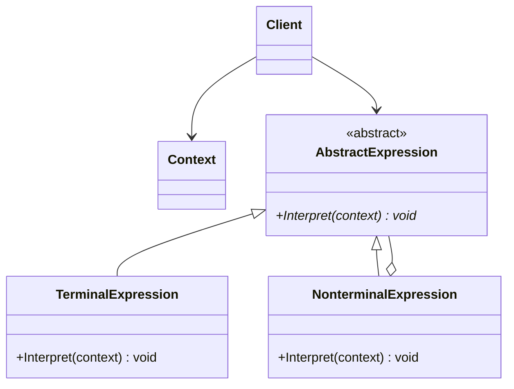
```mermaid
classDiagram
    direction TB

    class Context

    class AbstractExpression {
        <<abstract>>
        +Interpret(context)* void
    }

    class TerminalExpression {
        +Interpret(context) void
    }

    class NonterminalExpression {
        +Interpret(context) void
    }

    Client --> Context
    Client --> AbstractExpression
    AbstractExpression <|-- TerminalExpression
    AbstractExpression <|-- NonterminalExpression
    NonterminalExpression o-- AbstractExpression
```

#### Example code

```csharp
// Abstract class
public abstract class Expression
{
    public abstract LogicalNode Interpret(InterpretationContext context);
}

// Terminal Expression
public class ColumnExpression : TerminalExpression
{
    public string ColumnName { get; set; }

    public override LogicalNode Interpret(InterpretationContext context)
    {
        return context.ResolveColumn(ColumnName);
    }
}

// Non-Terminal Expression
public class BinaryExpression : NonTerminalExpression
{
    public Expression Left { get; set; }
    public string Operator { get; set; }
    public Expression Right { get; set; }

    public override LogicalNode Interpret(InterpretationContext context)
    {
        var leftNode = Left.Interpret(context);
        var rightNode = Right.Interpret(context);

        // Return combined LogicalNode
        return new LogicalNode();
    }
}
```

#### Class diagram

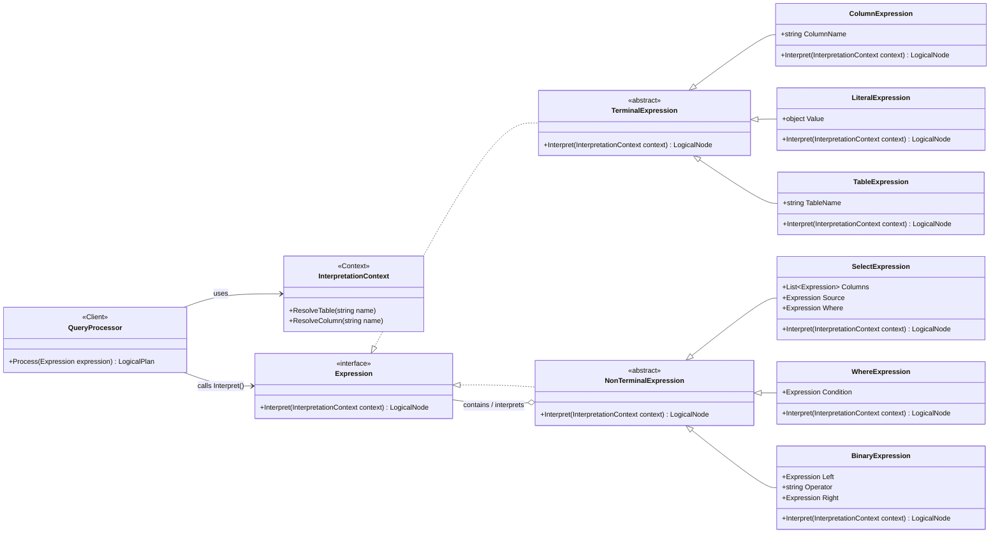
```mermaid
classDiagram
    direction LR

    class QueryProcessor {
        <<Client>>
        +Process(Expression expression) LogicalPlan
    }

    class InterpretationContext {
        <<Context>>
        +ResolveTable(string name)
        +ResolveColumn(string name)
    }

    class Expression {
        <<interface>>
        +Interpret(InterpretationContext context) LogicalNode
    }

    class TerminalExpression {
        <<abstract>>
        +Interpret(InterpretationContext context) LogicalNode
    }

    class ColumnExpression {
        +string ColumnName
        +Interpret(InterpretationContext context) LogicalNode
    }

    class LiteralExpression {
        +object Value
        +Interpret(InterpretationContext context) LogicalNode
    }

    class TableExpression {
        +string TableName
        +Interpret(InterpretationContext context) LogicalNode
    }

    class NonTerminalExpression {
        <<abstract>>
        +Interpret(InterpretationContext context) LogicalNode
    }

    class SelectExpression {
        +List~Expression~ Columns
        +Expression Source
        +Expression Where
        +Interpret(InterpretationContext context) LogicalNode
    }

    class WhereExpression {
        +Expression Condition
        +Interpret(InterpretationContext context) LogicalNode
    }

    class BinaryExpression {
        +Expression Left
        +string Operator
        +Expression Right
        +Interpret(InterpretationContext context) LogicalNode
    }

    QueryProcessor --> InterpretationContext : uses
    QueryProcessor --> Expression : calls Interpret()

    Expression <|.. TerminalExpression
    Expression <|.. NonTerminalExpression

    TerminalExpression <|-- ColumnExpression
    TerminalExpression <|-- LiteralExpression
    TerminalExpression <|-- TableExpression

    NonTerminalExpression <|-- SelectExpression
    NonTerminalExpression <|-- WhereExpression
    NonTerminalExpression <|-- BinaryExpression

    NonTerminalExpression o-- Expression : contains / interprets
```

#### Sequence Diagram: Expression Interpretation Workflow

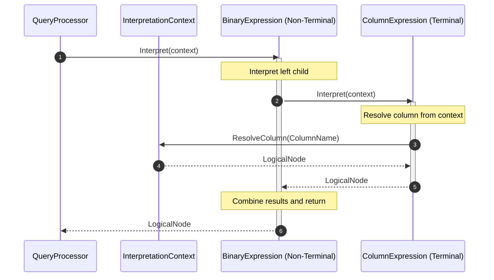
```mermaid
sequenceDiagram
    autonumber

    participant Client as QueryProcessor
    participant Context as InterpretationContext
    participant BinaryExpr as BinaryExpression (Non-Terminal)
    participant ColExpr as ColumnExpression (Terminal)

    Client->>BinaryExpr: Interpret(context)
    activate BinaryExpr

    Note over BinaryExpr: Interpret left child
    BinaryExpr->>ColExpr: Interpret(context)
    activate ColExpr

    Note over ColExpr: Resolve column from context
    ColExpr->>Context: ResolveColumn(ColumnName)
    Context-->>ColExpr: LogicalNode
    ColExpr-->>BinaryExpr: LogicalNode
    deactivate ColExpr

    Note over BinaryExpr: Combine results and return
    BinaryExpr-->>Client: LogicalNode
    deactivate BinaryExpr
```

---

## 2.2. Visitor (AST Processing)

The **Visitor** pattern is used in the `Expression` class hierarchy to decouple operations from the AST nodes they operate on.

- Define an `Accept` method on each expression node that takes an `IExpressionVisitor`.
- Implement specific visitors (like `SemanticAnalysisVisitor` or `LogicalPlanVisitor`) that encapsulate the logic for processing the entire expression tree.

#### Structure Diagram

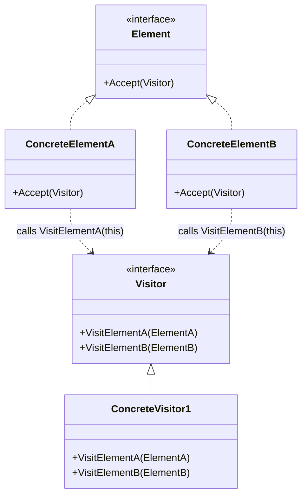
```mermaid
classDiagram
    direction TB

    class Visitor {
        <<interface>>
        +VisitElementA(ElementA)
        +VisitElementB(ElementB)
    }

    class ConcreteVisitor1 {
        +VisitElementA(ElementA)
        +VisitElementB(ElementB)
    }

    class Element {
        <<interface>>
        +Accept(Visitor)
    }

    class ConcreteElementA {
        +Accept(Visitor)
    }

    class ConcreteElementB {
        +Accept(Visitor)
    }

    Visitor <|.. ConcreteVisitor1
    Element <|.. ConcreteElementA
    Element <|.. ConcreteElementB
    ConcreteElementA ..> Visitor : calls VisitElementA(this)
    ConcreteElementB ..> Visitor : calls VisitElementB(this)
```

#### Example code

```csharp
// Abstract Element
public interface Expression
{
    T Accept<T>(IExpressionVisitor<T> visitor);
}

// Concrete Element
public class ColumnExpression : Expression
{
    public string ColumnName { get; set; }

    public T Accept<T>(IExpressionVisitor<T> visitor)
    {
        return visitor.Visit(this);
    }
}

// Visitor Interface
public interface IExpressionVisitor<T>
{
    T Visit(ColumnExpression expression);
    // other visit methods...
}

// Concrete Visitor
public class LogicalPlanVisitor : IExpressionVisitor<LogicalNode>
{
    public LogicalNode Visit(ColumnExpression expression)
    {
        // Generate logical node for column
        return new LogicalNode();
    }
}
```

#### Class diagram

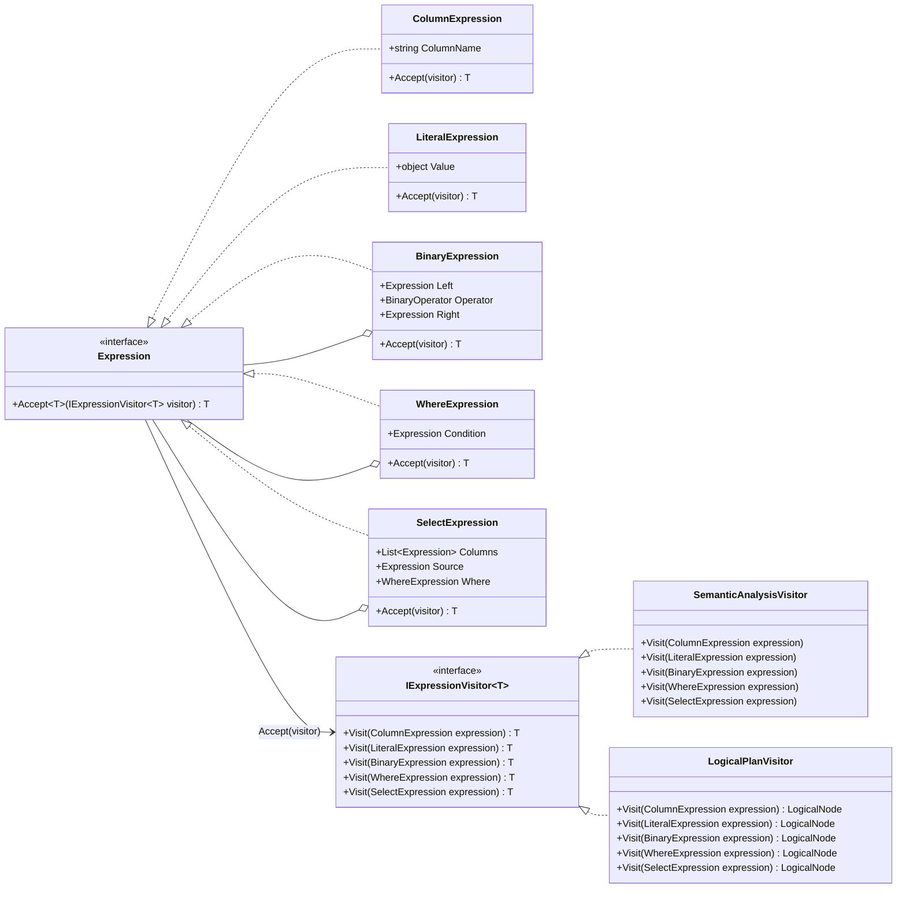
```mermaid
classDiagram
    direction LR

    class Expression {
        <<interface>>
        +Accept~T~(IExpressionVisitor~T~ visitor) T
    }

    class ColumnExpression {
        +string ColumnName
        +Accept(visitor) T
    }

    class LiteralExpression {
        +object Value
        +Accept(visitor) T
    }

    class BinaryExpression {
        +Expression Left
        +BinaryOperator Operator
        +Expression Right
        +Accept(visitor) T
    }

    class WhereExpression {
        +Expression Condition
        +Accept(visitor) T
    }

    class SelectExpression {
        +List~Expression~ Columns
        +Expression Source
        +WhereExpression Where
        +Accept(visitor) T
    }

    class IExpressionVisitor~T~ {
        <<interface>>
        +Visit(ColumnExpression expression) T
        +Visit(LiteralExpression expression) T
        +Visit(BinaryExpression expression) T
        +Visit(WhereExpression expression) T
        +Visit(SelectExpression expression) T
    }

    class SemanticAnalysisVisitor {
        +Visit(ColumnExpression expression)
        +Visit(LiteralExpression expression)
        +Visit(BinaryExpression expression)
        +Visit(WhereExpression expression)
        +Visit(SelectExpression expression)
    }

    class LogicalPlanVisitor {
        +Visit(ColumnExpression expression) LogicalNode
        +Visit(LiteralExpression expression) LogicalNode
        +Visit(BinaryExpression expression) LogicalNode
        +Visit(WhereExpression expression) LogicalNode
        +Visit(SelectExpression expression) LogicalNode
    }

    Expression <|.. ColumnExpression
    Expression <|.. LiteralExpression
    Expression <|.. BinaryExpression
    Expression <|.. WhereExpression
    Expression <|.. SelectExpression

    BinaryExpression o-- Expression
    WhereExpression o-- Expression
    SelectExpression o-- Expression

    IExpressionVisitor~T~ <|.. SemanticAnalysisVisitor
    IExpressionVisitor~T~ <|.. LogicalPlanVisitor

    Expression --> IExpressionVisitor~T~ : Accept(visitor)
```

#### Sequence Diagram: AST Processing Workflow

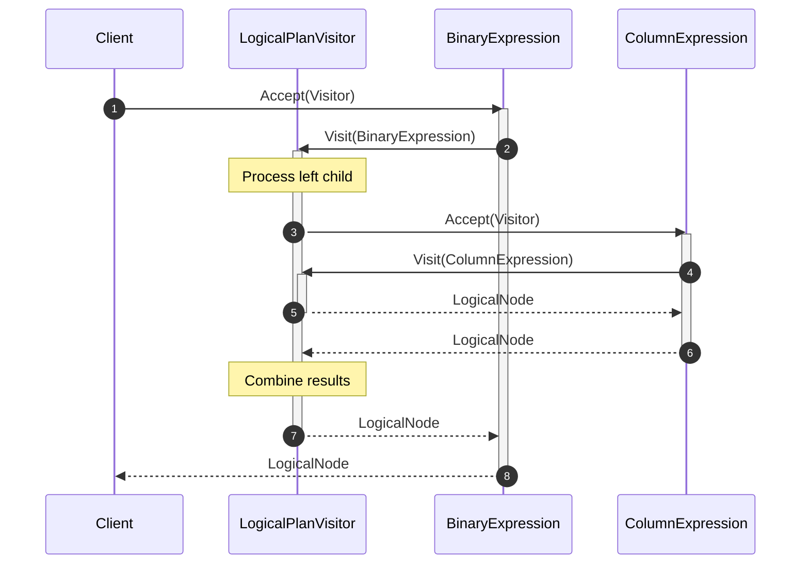
```mermaid
sequenceDiagram
    autonumber

    participant Client
    participant Visitor as LogicalPlanVisitor
    participant Expr as BinaryExpression
    participant ColExpr as ColumnExpression

    Client->>Expr: Accept(Visitor)
    activate Expr

    Expr->>Visitor: Visit(BinaryExpression)
    activate Visitor

    Note over Visitor: Process left child
    Visitor->>ColExpr: Accept(Visitor)
    activate ColExpr
    ColExpr->>Visitor: Visit(ColumnExpression)
    activate Visitor
    Visitor-->>ColExpr: LogicalNode
    deactivate Visitor
    ColExpr-->>Visitor: LogicalNode
    deactivate ColExpr

    Note over Visitor: Combine results
    Visitor-->>Expr: LogicalNode
    deactivate Visitor

    Expr-->>Client: LogicalNode
    deactivate Expr
```

---

## 2.3. Strategy (Query Optimization)

The **Strategy** pattern is used in the `QueryOptimizer` to switch between different optimization algorithms (e.g., rule-based vs. cost-based) dynamically at runtime without modifying the context class.

- Define an `IOptimizationStrategy` interface with an `Optimize` method.
- Implement specific concrete strategies such as `RuleBasedOptimizationStrategy` and `CostBasedOptimizationStrategy`.
- The `QueryOptimizer` (Context) maintains a reference to a strategy object and delegates the optimization execution to it.

#### Structure Diagram

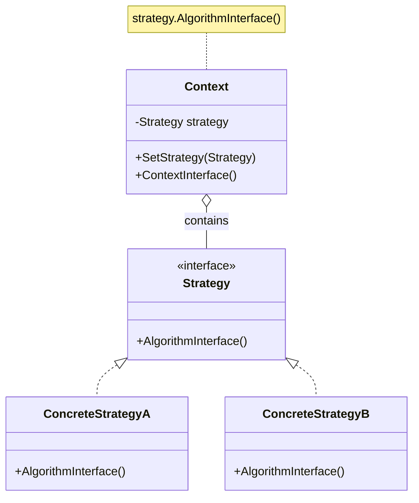
```mermaid
classDiagram
    direction TB

    class Context {
        -Strategy strategy
        +SetStrategy(Strategy)
        +ContextInterface()
    }

    class Strategy {
        <<interface>>
        +AlgorithmInterface()
    }

    class ConcreteStrategyA {
        +AlgorithmInterface()
    }

    class ConcreteStrategyB {
        +AlgorithmInterface()
    }

    Context o-- Strategy : contains
    Strategy <|.. ConcreteStrategyA
    Strategy <|.. ConcreteStrategyB

    note for Context "strategy.AlgorithmInterface()"
```

#### Example code

```csharp
// Strategy
public interface IOptimizationStrategy
{
    PhysicalPlan Optimize(LogicalPlan plan);
}

// Concrete Strategies
public class RuleBasedOptimizationStrategy : IOptimizationStrategy
{
    // Algorithm
    public PhysicalPlan Optimize(LogicalPlan plan)
    {
        plan = ApplyPredicatePushdown(plan);
        plan = ApplyProjectionPruning(plan);
        plan = ApplyConstantFolding(plan);
        return new PhysicalPlan();
    }

    private LogicalPlan ApplyPredicatePushdown(LogicalPlan plan) { throw new NotImplementedException(); }
    private LogicalPlan ApplyProjectionPruning(LogicalPlan plan) { throw new NotImplementedException(); }
    private LogicalPlan ApplyConstantFolding(LogicalPlan plan) { throw new NotImplementedException(); }
}

public class CostBasedOptimizationStrategy : IOptimizationStrategy
{
    // Algorithm
    public PhysicalPlan Optimize(LogicalPlan plan)
    {
        GenerateCandidatePlans(plan);
        EstimateCost(plan);
        return SelectBestPlan();
    }

    private void GenerateCandidatePlans(LogicalPlan plan) { throw new NotImplementedException(); }
    private double EstimateCost(LogicalPlan plan) { throw new NotImplementedException(); }
    private PhysicalPlan SelectBestPlan() { throw new NotImplementedException(); }
}

// Context
public class QueryOptimizer
{
    private IOptimizationStrategy _strategy;

    public QueryOptimizer(IOptimizationStrategy strategy)
    {
        _strategy = strategy;
    }

    public void SetStrategy(IOptimizationStrategy strategy)
    {
        _strategy = strategy;
    }

    public PhysicalPlan Optimize(LogicalPlan plan)
    {
        // Delegate optimization to the Strategy object
        return _strategy.Optimize(plan);
    }
}
```

#### Class diagram

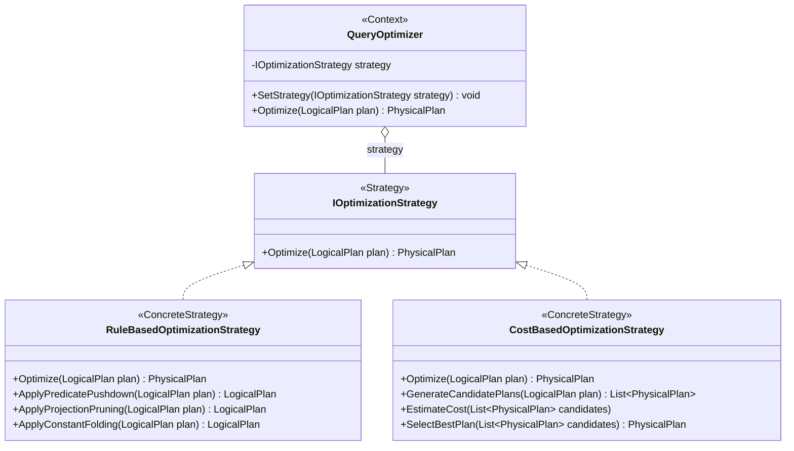
```mermaid
classDiagram
    direction TB

    class QueryOptimizer {
        <<Context>>
        -IOptimizationStrategy strategy
        +SetStrategy(IOptimizationStrategy strategy) void
        +Optimize(LogicalPlan plan) PhysicalPlan
    }

    class IOptimizationStrategy {
        <<Strategy>>
        +Optimize(LogicalPlan plan) PhysicalPlan
    }

    class RuleBasedOptimizationStrategy {
        <<ConcreteStrategy>>
        +Optimize(LogicalPlan plan) PhysicalPlan
        +ApplyPredicatePushdown(LogicalPlan plan) LogicalPlan
        +ApplyProjectionPruning(LogicalPlan plan) LogicalPlan
        +ApplyConstantFolding(LogicalPlan plan) LogicalPlan
    }

    class CostBasedOptimizationStrategy {
        <<ConcreteStrategy>>
        +Optimize(LogicalPlan plan) PhysicalPlan
        +GenerateCandidatePlans(LogicalPlan plan) List~PhysicalPlan~
        +EstimateCost(List~PhysicalPlan~ candidates)
        +SelectBestPlan(List~PhysicalPlan~ candidates) PhysicalPlan
    }

    QueryOptimizer o-- IOptimizationStrategy : strategy

    IOptimizationStrategy <|.. RuleBasedOptimizationStrategy
    IOptimizationStrategy <|.. CostBasedOptimizationStrategy
```

#### Sequence Diagram: Strategy Execution Workflow

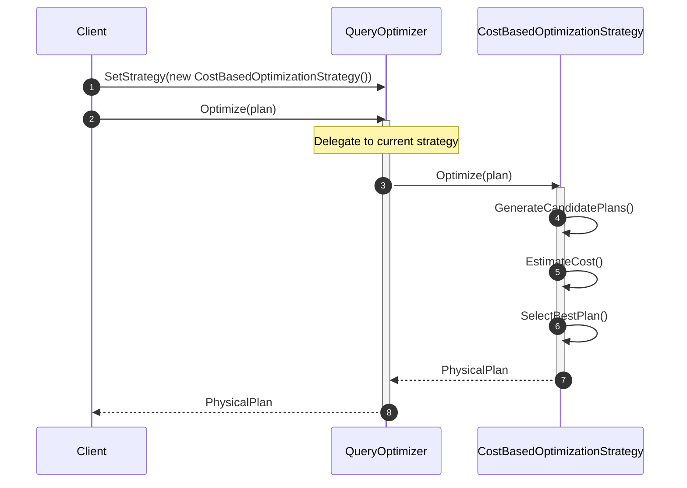
```mermaid
sequenceDiagram
    autonumber

    participant Client
    participant Optimizer as QueryOptimizer
    participant Strategy as CostBasedOptimizationStrategy

    Client->>Optimizer: SetStrategy(new CostBasedOptimizationStrategy())

    Client->>Optimizer: Optimize(plan)
    activate Optimizer

    Note over Optimizer: Delegate to current strategy
    Optimizer->>Strategy: Optimize(plan)
    activate Strategy

    Strategy->>Strategy: GenerateCandidatePlans()
    Strategy->>Strategy: EstimateCost()
    Strategy->>Strategy: SelectBestPlan()

    Strategy-->>Optimizer: PhysicalPlan
    deactivate Strategy

    Optimizer-->>Client: PhysicalPlan
    deactivate Optimizer
```

---

## 2.4. Factory Method (Physical Operator Creation)

The **Factory Method** pattern is used to create physical operators such as `TableScan`, `IndexScan`, `HashJoin`, `NestedLoopJoin`, and `Sort` from logical-plan nodes selected by the optimizer.

- Define an interface or abstract class (`OperatorFactory`) for creating physical operators, but let concrete subclasses decide which objects to instantiate based on logical node types.

#### Structure Diagram

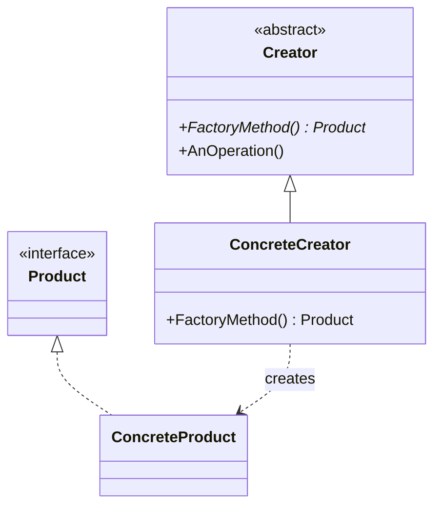
```mermaid
classDiagram
    direction TB

    class Creator {
        <<abstract>>
        +FactoryMethod()* Product
        +AnOperation()
    }

    class ConcreteCreator {
        +FactoryMethod() Product
    }

    class Product {
        <<interface>>
    }

    class ConcreteProduct {
    }

    Creator <|-- ConcreteCreator
    Product <|.. ConcreteProduct
    ConcreteCreator ..> ConcreteProduct : creates
```

#### Example code

```csharp
// Product
public abstract class PhysicalOperator
{
    public abstract void Open();
    public abstract bool Next();
    public abstract void Close();
}

// Concrete Products
public class TableScanOperator : PhysicalOperator
{
    public override void Open() { }
    public override bool Next() { return false; }
    public override void Close() { }
}

public class HashJoinOperator : PhysicalOperator
{
    public override void Open() { }
    public override bool Next() { return false; }
    public override void Close() { }
}

public class IndexScanOperator : PhysicalOperator
{
    public override void Open() { }
    public override bool Next() { return false; }
    public override void Close() { }
}

public class NestedLoopJoinOperator : PhysicalOperator
{
    public override void Open() { }
    public override bool Next() { return false; }
    public override void Close() { }
}

public class SortOperator : PhysicalOperator
{
    public override void Open() { }
    public override bool Next() { return false; }
    public override void Close() { }
}

// Creator
public abstract class OperatorFactory
{
    // Factory Method
    public abstract PhysicalOperator CreateOperator(LogicalNode node);
}

// Concrete Creator
public class PhysicalOperatorFactory : OperatorFactory
{
    public override PhysicalOperator CreateOperator(LogicalNode node)
    {
        return node switch
        {
            LogicalTableScan scan => new TableScanOperator(scan.TableName),
            LogicalIndexScan iscan => new IndexScanOperator(),
            LogicalHashJoin hjoin => new HashJoinOperator(),
            LogicalNestedLoopJoin nljoin => new NestedLoopJoinOperator(),
            LogicalSort sort => new SortOperator(),
            _ => throw new NotSupportedException($"Unsupported logical node: {node.GetType().Name}")
        };
    }
}
```

#### Class diagram

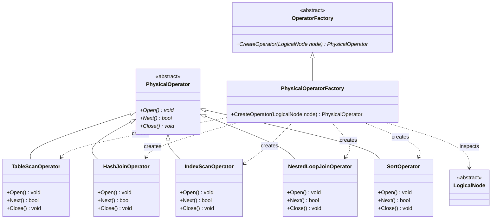
```mermaid
classDiagram
    direction TB

    class OperatorFactory {
        <<abstract>>
        +CreateOperator(LogicalNode node)* PhysicalOperator
    }

    class PhysicalOperatorFactory {
        +CreateOperator(LogicalNode node) PhysicalOperator
    }

    class PhysicalOperator {
        <<abstract>>
        +Open()* void
        +Next()* bool
        +Close()* void
    }

    class TableScanOperator {
        +Open() void
        +Next() bool
        +Close() void
    }

    class HashJoinOperator {
        +Open() void
        +Next() bool
        +Close() void
    }

    class IndexScanOperator {
        +Open() void
        +Next() bool
        +Close() void
    }

    class NestedLoopJoinOperator {
        +Open() void
        +Next() bool
        +Close() void
    }

    class SortOperator {
        +Open() void
        +Next() bool
        +Close() void
    }

    class LogicalNode {
        <<abstract>>
    }

    OperatorFactory <|-- PhysicalOperatorFactory
    PhysicalOperator <|-- TableScanOperator
    PhysicalOperator <|-- HashJoinOperator
    PhysicalOperator <|-- IndexScanOperator
    PhysicalOperator <|-- NestedLoopJoinOperator
    PhysicalOperator <|-- SortOperator

    PhysicalOperatorFactory ..> TableScanOperator : creates
    PhysicalOperatorFactory ..> HashJoinOperator : creates
    PhysicalOperatorFactory ..> IndexScanOperator : creates
    PhysicalOperatorFactory ..> NestedLoopJoinOperator : creates
    PhysicalOperatorFactory ..> SortOperator : creates
    PhysicalOperatorFactory ..> LogicalNode : inspects
```

#### Sequence Diagram: Operator Creation Workflow

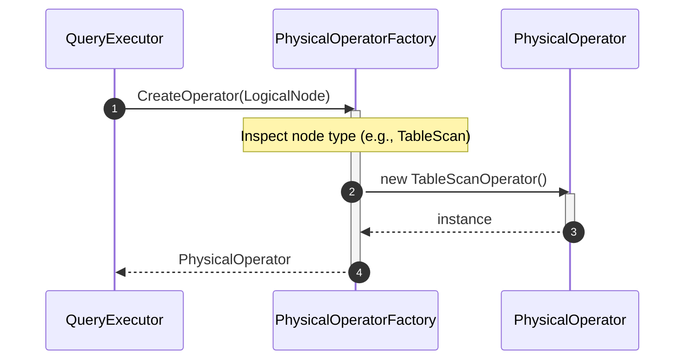
```mermaid
sequenceDiagram
    autonumber

    participant Client as QueryExecutor
    participant Factory as PhysicalOperatorFactory
    participant Op as PhysicalOperator

    Client->>Factory: CreateOperator(LogicalNode)
    activate Factory

    Note over Factory: Inspect node type (e.g., TableScan)
    Factory->>Op: new TableScanOperator()
    activate Op
    Op-->>Factory: instance
    deactivate Op

    Factory-->>Client: PhysicalOperator
    deactivate Factory
```

---

## 2.5. Composite (Query Plan Tree)

The **Composite** pattern is used to represent the hierarchical structure of a query plan. It allows the system to treat both leaf operators (such as scans) and composite operators (such as joins, filters, and projections) uniformly as plan nodes.

- Define an abstract component `PlanNode` (or `LogicalNode` / `PhysicalOperator`) that declares the interface for objects in the composition.
- Implement leaf objects that have no children.
- Implement composite objects that store child components and implement operations by delegating to them.

#### Structure Diagram

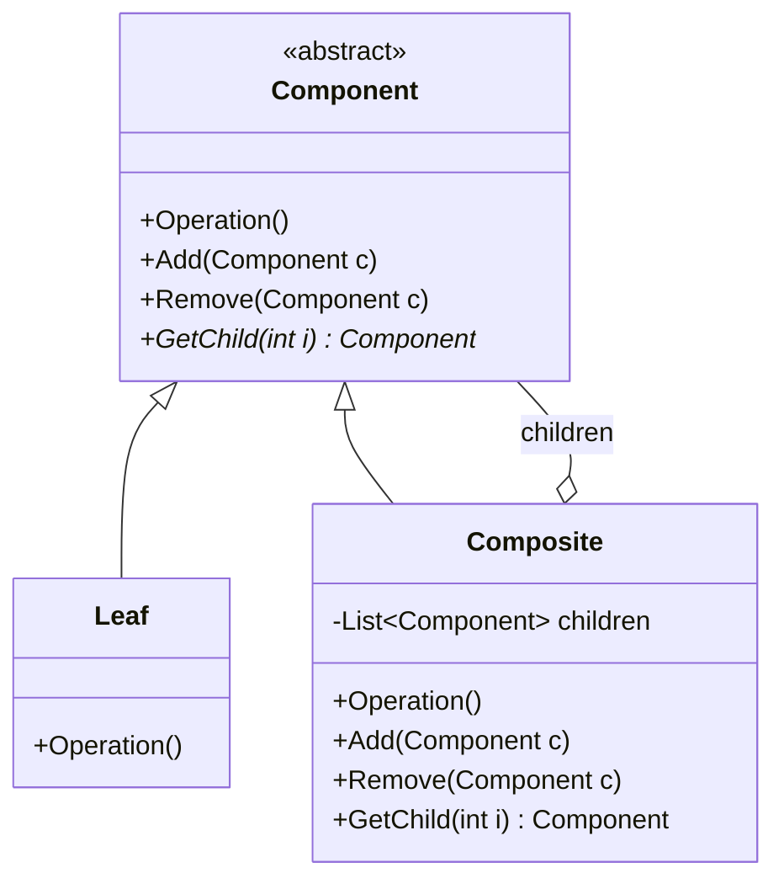
```mermaid
classDiagram
    direction TB

    class Component {
        <<abstract>>
        +Operation()
        +Add(Component c)
        +Remove(Component c)
        +GetChild(int i)* Component
    }

    class Leaf {
        +Operation()
    }

    class Composite {
        -List~Component~ children
        +Operation()
        +Add(Component c)
        +Remove(Component c)
        +GetChild(int i) Component
    }

    Component <|-- Leaf
    Component <|-- Composite
    Composite o-- Component : children
```

#### Example code

```csharp
// Component
public abstract class PhysicalOperator
{
    public abstract void Open();
    public abstract bool Next();
    public abstract void Close();
    
    public virtual void AddChild(PhysicalOperator child)
    {
        throw new NotSupportedException();
    }
    
    public virtual IEnumerable<PhysicalOperator> GetChildren()
    {
        return Enumerable.Empty<PhysicalOperator>();
    }
}

// Leaf
public class TableScanOperator : PhysicalOperator
{
    public string TableName { get; }

    public TableScanOperator(string tableName)
    {
        TableName = tableName;
    }

    public override void Open() {}
    public override bool Next() { return false; }
    public override void Close() {}
}

// Composite
public abstract class UnaryOperator : PhysicalOperator
{
    protected PhysicalOperator _child;

    public override void AddChild(PhysicalOperator child)
    {
        _child = child;
    }

    public override IEnumerable<PhysicalOperator> GetChildren()
    {
        if (_child != null) yield return _child;
    }
}

public class FilterOperator : UnaryOperator
{
    public override void Open()
    {
        _child.Open();
    }

    public override bool Next()
    {
        while (_child.Next())
        {
            if (ConditionPassed()) return true;
        }
        return false;
    }

    public override void Close()
    {
        _child.Close();
    }
}

public abstract class BinaryOperator : PhysicalOperator
{
    protected PhysicalOperator _leftChild;
    protected PhysicalOperator _rightChild;

    public override void AddChild(PhysicalOperator child)
    {
        if (_leftChild == null) _leftChild = child;
        else if (_rightChild == null) _rightChild = child;
        else throw new InvalidOperationException("Binary operator can only have two children");
    }

    public override IEnumerable<PhysicalOperator> GetChildren()
    {
        if (_leftChild != null) yield return _leftChild;
        if (_rightChild != null) yield return _rightChild;
    }
}

public class HashJoinOperator : BinaryOperator
{
    public override void Open()
    {
        _leftChild.Open();
        _rightChild.Open();
    }

    public override bool Next()
    {
        // Perform join logic
        return false;
    }

    public override void Close()
    {
        _leftChild.Close();
        _rightChild.Close();
    }
}
```

#### Class diagram

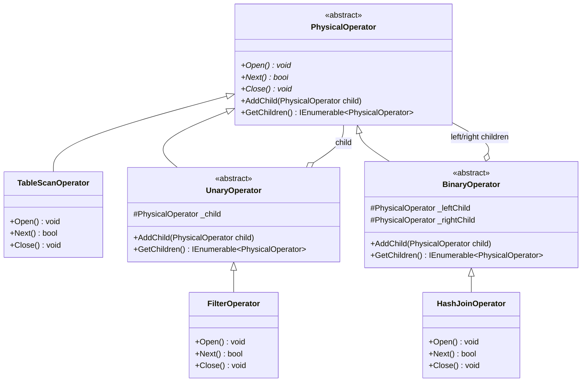
```mermaid
classDiagram
    direction TB

    class PhysicalOperator {
        <<abstract>>
        +Open()* void
        +Next()* bool
        +Close()* void
        +AddChild(PhysicalOperator child)
        +GetChildren() IEnumerable~PhysicalOperator~
    }

    class TableScanOperator {
        +Open() void
        +Next() bool
        +Close() void
    }

    class UnaryOperator {
        <<abstract>>
        #PhysicalOperator _child
        +AddChild(PhysicalOperator child)
        +GetChildren() IEnumerable~PhysicalOperator~
    }

    class FilterOperator {
        +Open() void
        +Next() bool
        +Close() void
    }

    class BinaryOperator {
        <<abstract>>
        #PhysicalOperator _leftChild
        #PhysicalOperator _rightChild
        +AddChild(PhysicalOperator child)
        +GetChildren() IEnumerable~PhysicalOperator~
    }

    class HashJoinOperator {
        +Open() void
        +Next() bool
        +Close() void
    }

    PhysicalOperator <|-- TableScanOperator
    PhysicalOperator <|-- UnaryOperator
    PhysicalOperator <|-- BinaryOperator

    UnaryOperator <|-- FilterOperator
    BinaryOperator <|-- HashJoinOperator

    UnaryOperator o-- PhysicalOperator : child
    BinaryOperator o-- PhysicalOperator : left/right children
```

#### Sequence Diagram: Recursive Operation Execution

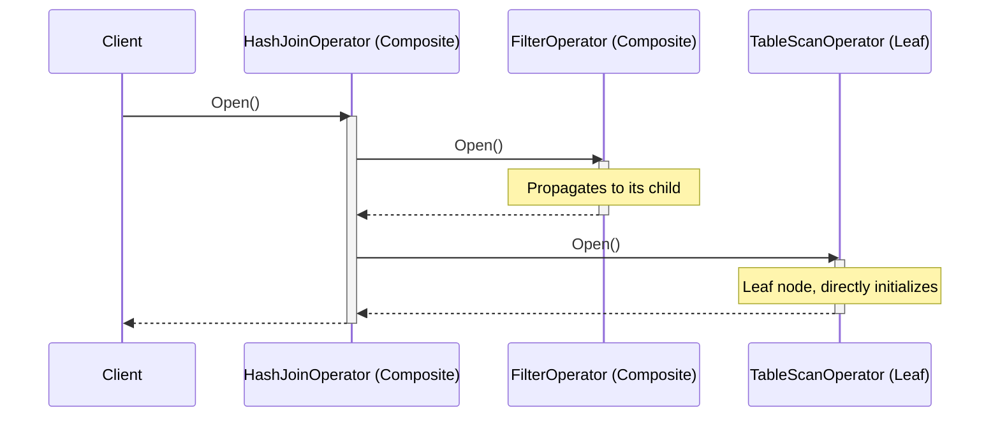
```mermaid
sequenceDiagram
    participant Client
    participant Root as HashJoinOperator (Composite)
    participant Left as FilterOperator (Composite)
    participant Right as TableScanOperator (Leaf)
    
    Client->>Root: Open()
    activate Root
    
    Root->>Left: Open()
    activate Left
    Note over Left: Propagates to its child
    Left-->>Root: 
    deactivate Left
    
    Root->>Right: Open()
    activate Right
    Note over Right: Leaf node, directly initializes
    Right-->>Root: 
    deactivate Right
    
    Root-->>Client: 
    deactivate Root
```

---

## 2.6. Iterator (Query Result Execution)

The **Iterator** pattern (often called the Volcano Execution Model in databases) is used to process query results pipelined. It lets physical operators expose rows one at a time through a common `Next()` or `MoveNext()` interface, enabling query execution without materializing every intermediate result.

- Define a standard interface for operators with `Open()`, `Next()`, and `Close()` methods.
- Each operator encapsulates its own logic for fetching or processing the next row.
- Parent operators repeatedly call `Next()` on their children to pull data up the execution tree.

#### Structure Diagram

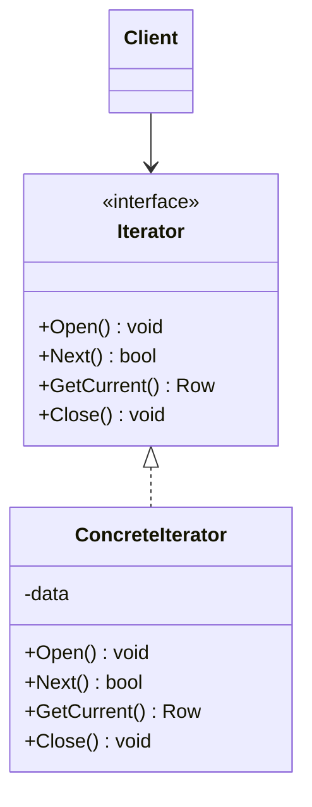
```mermaid
classDiagram
    direction TB

    class Iterator {
        <<interface>>
        +Open() void
        +Next() bool
        +GetCurrent() Row
        +Close() void
    }

    class ConcreteIterator {
        -data
        +Open() void
        +Next() bool
        +GetCurrent() Row
        +Close() void
    }

    Iterator <|.. ConcreteIterator
    Client --> Iterator
```

#### Example code

```csharp
public abstract class PhysicalOperator
{
    public abstract void Open();
    public abstract bool Next();
    public abstract Row GetCurrent();
    public abstract void Close();
}

public class TableScanOperator : PhysicalOperator
{
    private IEnumerator<Row> _enumerator;
    private IEnumerable<Row> _tableRows;

    public TableScanOperator(IEnumerable<Row> tableRows)
    {
        _tableRows = tableRows;
    }

    public override void Open()
    {
        _enumerator = _tableRows.GetEnumerator();
    }

    public override bool Next()
    {
        return _enumerator.MoveNext();
    }

    public override Row GetCurrent()
    {
        return _enumerator.Current;
    }

    public override void Close()
    {
        _enumerator?.Dispose();
    }
}

public class FilterOperator : PhysicalOperator
{
    private PhysicalOperator _child;
    private Func<Row, bool> _predicate;

    public FilterOperator(PhysicalOperator child, Func<Row, bool> predicate)
    {
        _child = child;
        _predicate = predicate;
    }

    public override void Open()
    {
        _child.Open();
    }

    public override bool Next()
    {
        while (_child.Next())
        {
            if (_predicate(_child.GetCurrent()))
            {
                return true;
            }
        }
        return false;
    }

    public override Row GetCurrent()
    {
        return _child.GetCurrent();
    }

    public override void Close()
    {
        _child.Close();
    }
}
```

#### Class diagram

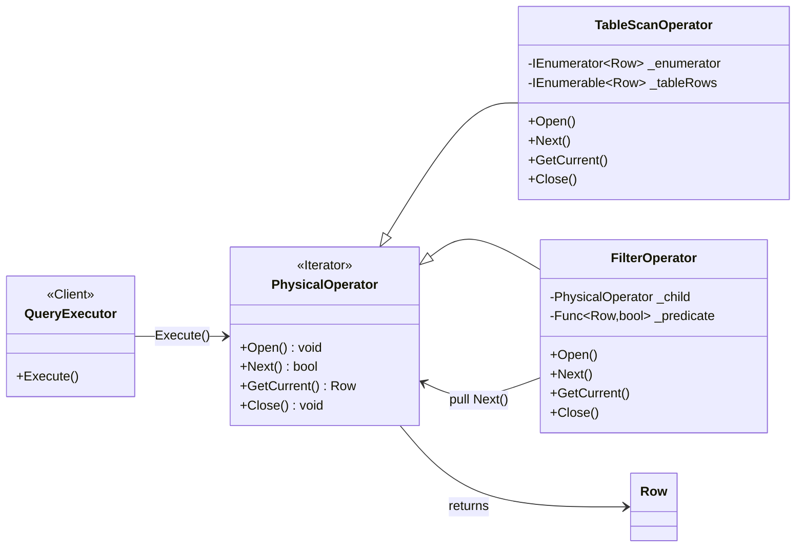
```mermaid
classDiagram
    direction LR

    class QueryExecutor {
        <<Client>>
        +Execute()
    }

    class Row

    class PhysicalOperator {
        <<Iterator>>
        +Open() void
        +Next() bool
        +GetCurrent() Row
        +Close() void
    }

    class TableScanOperator {
        -IEnumerator~Row~ _enumerator
        -IEnumerable~Row~ _tableRows
        +Open()
        +Next()
        +GetCurrent()
        +Close()
    }

    class FilterOperator {
        -PhysicalOperator _child
        -Func~Row,bool~ _predicate
        +Open()
        +Next()
        +GetCurrent()
        +Close()
    }

    QueryExecutor --> PhysicalOperator : Execute()

    PhysicalOperator <|-- TableScanOperator
    PhysicalOperator <|-- FilterOperator

    FilterOperator --> PhysicalOperator : pull Next()

    PhysicalOperator --> Row : returns
```

#### Sequence Diagram: Pipelined Execution

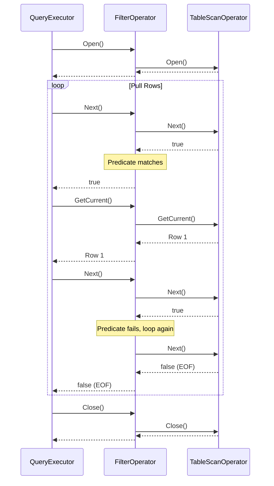
```mermaid
sequenceDiagram
    participant Executor as QueryExecutor
    participant Filter as FilterOperator
    participant Scan as TableScanOperator
    
    Executor->>Filter: Open()
    Filter->>Scan: Open()
    Scan-->>Filter: 
    Filter-->>Executor: 

    loop Pull Rows
        Executor->>Filter: Next()
        Filter->>Scan: Next()
        Scan-->>Filter: true
        Note over Filter: Predicate matches
        Filter-->>Executor: true
        
        Executor->>Filter: GetCurrent()
        Filter->>Scan: GetCurrent()
        Scan-->>Filter: Row 1
        Filter-->>Executor: Row 1
        
        Executor->>Filter: Next()
        Filter->>Scan: Next()
        Scan-->>Filter: true
        Note over Filter: Predicate fails, loop again
        
        Filter->>Scan: Next()
        Scan-->>Filter: false (EOF)
        Filter-->>Executor: false (EOF)
    end

    Executor->>Filter: Close()
    Filter->>Scan: Close()
    Scan-->>Filter: 
    Filter-->>Executor: 
```


## 2.7. Chain of Responsibility (Optimization Pipeline)

The **Chain of Responsibility** pattern is used to construct a flexible optimization pipeline for query plans. Each optimization rule (e.g., constant folding, predicate pushdown) acts as a handler in the chain. The rule applies its specific transformation to the `LogicalPlan` and then passes the transformed plan to the next rule in the chain.

### Structure Diagram

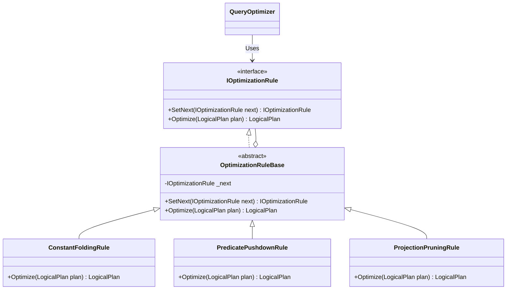
```mermaid
classDiagram
    direction TB

    class IOptimizationRule {
        <<interface>>
        +SetNext(IOptimizationRule next) IOptimizationRule
        +Optimize(LogicalPlan plan) LogicalPlan
    }

    class OptimizationRuleBase {
        <<abstract>>
        -IOptimizationRule _next
        +SetNext(IOptimizationRule next) IOptimizationRule
        +Optimize(LogicalPlan plan) LogicalPlan
    }

    class ConstantFoldingRule {
        +Optimize(LogicalPlan plan) LogicalPlan
    }

    class PredicatePushdownRule {
        +Optimize(LogicalPlan plan) LogicalPlan
    }

    class ProjectionPruningRule {
        +Optimize(LogicalPlan plan) LogicalPlan
    }

    IOptimizationRule <|.. OptimizationRuleBase
    OptimizationRuleBase o-- IOptimizationRule
    OptimizationRuleBase <|-- ConstantFoldingRule
    OptimizationRuleBase <|-- PredicatePushdownRule
    OptimizationRuleBase <|-- ProjectionPruningRule
    
    QueryOptimizer --> IOptimizationRule : Uses
```

####Sequence Diagram: Optimization Pipeline Execution

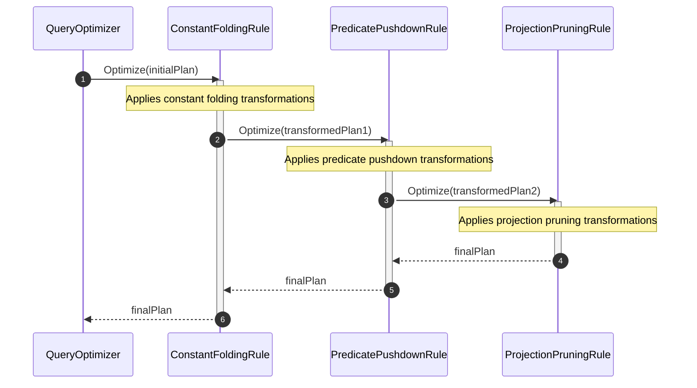
```mermaid
sequenceDiagram
    autonumber
    participant Optimizer as QueryOptimizer
    participant ConstantFold as ConstantFoldingRule
    participant PredicatePush as PredicatePushdownRule
    participant ProjectionPrune as ProjectionPruningRule

    Optimizer->>ConstantFold: Optimize(initialPlan)
    activate ConstantFold
    
    Note over ConstantFold: Applies constant folding transformations
    
    ConstantFold->>PredicatePush: Optimize(transformedPlan1)
    activate PredicatePush
    
    Note over PredicatePush: Applies predicate pushdown transformations
    
    PredicatePush->>ProjectionPrune: Optimize(transformedPlan2)
    activate ProjectionPrune
    
    Note over ProjectionPrune: Applies projection pruning transformations
    
    ProjectionPrune-->>PredicatePush: finalPlan
    deactivate ProjectionPrune
    
    PredicatePush-->>ConstantFold: finalPlan
    deactivate PredicatePush
    
    ConstantFold-->>Optimizer: finalPlan
    deactivate ConstantFold
```

### Example Code

```csharp
public interface IOptimizationRule
{
    IOptimizationRule SetNext(IOptimizationRule next);
    LogicalPlan Optimize(LogicalPlan plan);
}

public abstract class OptimizationRuleBase : IOptimizationRule
{
    private IOptimizationRule _next;

    public IOptimizationRule SetNext(IOptimizationRule next)
    {
        _next = next;
        return next;
    }

    public virtual LogicalPlan Optimize(LogicalPlan plan)
    {
        if (_next != null)
        {
            return _next.Optimize(plan);
        }
        return plan;
    }
}

public class ConstantFoldingRule : OptimizationRuleBase
{
    public override LogicalPlan Optimize(LogicalPlan plan)
    {
        // 1. Apply constant folding logic to the plan
        // ... (transformation logic) ...
        
        // 2. Pass the modified plan to the next rule in the chain
        return base.Optimize(plan);
    }
}

public class PredicatePushdownRule : OptimizationRuleBase
{
    public override LogicalPlan Optimize(LogicalPlan plan)
    {
        // 1. Apply predicate pushdown logic to the plan
        // ... (transformation logic) ...
        
        // 2. Pass the modified plan to the next rule in the chain
        return base.Optimize(plan);
    }
}

// Usage in QueryOptimizer
public class QueryOptimizer
{
    public PhysicalPlan Optimize(LogicalPlan plan)
    {
        // Build the optimization chain
        var pipeline = new ConstantFoldingRule();
        pipeline.SetNext(new PredicatePushdownRule())
                .SetNext(new ProjectionPruningRule());

        // Execute the pipeline
        var optimizedLogicalPlan = pipeline.Optimize(plan);
        
        // ... Convert optimizedLogicalPlan to PhysicalPlan ...
        return new PhysicalPlan();
    }
}
```

## 2.8. Proxy (Lazy Physical Operator)

The **Proxy** pattern is used to defer the creation or initialization of a heavy physical operator until it is actually needed (e.g., when `Open()` is called during query execution). This is particularly useful for optimizing resource usage, such as deferring disk I/O, network connections for remote tables, or memory allocation until the execution phase.

- Define a common `PhysicalOperator` abstract class or interface for both the real operator and the proxy.
- Implement a `TableScanOperator` (Real Subject) that performs heavy initialization (e.g., reading from disk or network).
- Implement a `LazyTableScanOperatorProxy` (Proxy) that holds a reference to the real subject and delays its instantiation until `Open()` is explicitly invoked by the query executor.

#### Structure Diagram

```mermaid
classDiagram
    direction TB

    class Client
    
    class ServiceInterface {
        <<interface>>
        +operation()
    }
    
    class Service {
        +operation()
    }
    
    class Proxy {
        -Service realService
        +Proxy(s: Service)
        +checkAccess()
        +operation()
    }
    
    Client --> ServiceInterface
    ServiceInterface <|.. Service
    ServiceInterface <|.. Proxy
    Proxy o--> Service
```

#### Class diagram

```mermaid
classDiagram
    direction TB
    class PhysicalOperator {
        <<abstract>>
        +Open() void
        +Next() bool
        +GetCurrent() Row
        +Close() void
    }

    class TableScanOperator {
        -Table _table
        +Open() void
        +Next() bool
        +GetCurrent() Row
        +Close() void
    }

    class LazyTableScanOperatorProxy {
        -TableScanOperator _realOperator
        -string _tableName
        -CatalogManager _catalog
        +Open() void
        +Next() bool
        +GetCurrent() Row
        +Close() void
        -InitializeRealOperator() void
    }

    PhysicalOperator <|-- TableScanOperator
    PhysicalOperator <|-- LazyTableScanOperatorProxy
    LazyTableScanOperatorProxy *-- TableScanOperator : controls access to
```

#### Sequence Diagram: Lazy Initialization

```mermaid
sequenceDiagram
    participant Executor as QueryExecutor
    participant Proxy as LazyTableScanOperatorProxy
    participant Catalog as CatalogManager
    participant RealOp as TableScanOperator

    Executor->>Proxy: Open()
    activate Proxy
    Proxy->>Proxy: InitializeRealOperator()
    Proxy->>Catalog: GetTable(tableName)
    Catalog-->>Proxy: Table
    Proxy->>RealOp: new TableScanOperator(Table)
    Proxy->>RealOp: Open()
    RealOp-->>Proxy: success
    Proxy-->>Executor: success
    deactivate Proxy

    Executor->>Proxy: Next()
    activate Proxy
    Proxy->>RealOp: Next()
    RealOp-->>Proxy: true
    Proxy-->>Executor: true
    deactivate Proxy
```

#### Example code

```csharp
public abstract class PhysicalOperator
{
    public abstract void Open();
    public abstract bool Next();
    public abstract Row GetCurrent();
    public abstract void Close();
}

// Real Subject
public class TableScanOperator : PhysicalOperator
{
    private readonly Table _table;
    private IEnumerator<Row>? _enumerator;

    public TableScanOperator(Table table)
    {
        _table = table;
        // Heavy initialization logic might occur here
    }

    public override void Open()
    {
        _enumerator = _table.Rows.GetEnumerator();
    }

    public override bool Next() => _enumerator?.MoveNext() ?? false;
    
    public override Row GetCurrent() => _enumerator?.Current ?? throw new InvalidOperationException();
    
    public override void Close()
    {
        _enumerator?.Dispose();
    }
}

// Proxy
public class LazyTableScanOperatorProxy : PhysicalOperator
{
    private readonly string _tableName;
    private readonly CatalogManager _catalog;
    private TableScanOperator? _realOperator;

    public LazyTableScanOperatorProxy(string tableName, CatalogManager catalog)
    {
        _tableName = tableName;
        _catalog = catalog;
        // The real operator is NOT created yet.
    }

    private void InitializeRealOperator()
    {
        if (_realOperator == null)
        {
            var table = _catalog.Find<Table>(_tableName) 
                ?? throw new InvalidOperationException($"Table {_tableName} not found.");
            _realOperator = new TableScanOperator(table);
        }
    }

    public override void Open()
    {
        InitializeRealOperator();
        _realOperator!.Open();
    }

    public override bool Next()
    {
        if (_realOperator == null)
            throw new InvalidOperationException("Operator not opened.");
        return _realOperator.Next();
    }

    public override Row GetCurrent()
    {
        if (_realOperator == null)
            throw new InvalidOperationException("Operator not opened.");
        return _realOperator.GetCurrent();
    }

    public override void Close()
    {
        _realOperator?.Close();
    }
}
```

## 2.9. Decorator (Query Execution Logging)

The **Decorator** pattern is used to add logging, profiling, or auditing capabilities to query execution dynamically without modifying the underlying `QueryExecutor`. By wrapping the core execution component, decorators can intercept method calls, record start and end times, handle errors, and then delegate the main work to the inner component.

- Define a common `IQueryExecutor` interface that all executors implement.
- Implement the core `QueryExecutor` responsible for executing the physical plan.
- Create a `QueryExecutorDecorator` base class that wraps an `IQueryExecutor`.
- Implement concrete decorators like `QueryExecutionLoggerDecorator` that measure execution time and log queries.

#### Structure Diagram

```mermaid
classDiagram
    direction TB
    
    class Component {
        <<interface>>
        +Operation()
    }
    
    class ConcreteComponent {
        +Operation()
    }
    
    class Decorator {
        <<abstract>>
        -Component component
        +Decorator(Component)
        +Operation()
    }
    
    class ConcreteDecoratorA {
        +Operation()
    }
    
    class ConcreteDecoratorB {
        +Operation()
    }
    
    Component <|.. ConcreteComponent
    Component <|.. Decorator
    Decorator o-- Component : wraps
    Decorator <|-- ConcreteDecoratorA
    Decorator <|-- ConcreteDecoratorB
```

#### Class diagram


```mermaid
classDiagram
    direction TB

    class IQueryExecutor {
        <<interface>>
        +Execute(PhysicalPlan plan) QueryResult
    }

    class QueryExecutor {
        +Execute(PhysicalPlan plan) QueryResult
    }

    class QueryExecutorDecorator {
        <<abstract>>
        #IQueryExecutor _innerExecutor
        +QueryExecutorDecorator(IQueryExecutor innerExecutor)
        +Execute(PhysicalPlan plan) QueryResult
    }

    class QueryExecutionLoggerDecorator {
        -ILogger _logger
        +QueryExecutionLoggerDecorator(IQueryExecutor innerExecutor, ILogger logger)
        +Execute(PhysicalPlan plan) QueryResult
    }

    class ProfilingDecorator {
        +ProfilingDecorator(IQueryExecutor innerExecutor)
        +Execute(PhysicalPlan plan) QueryResult
    }

    class AuditDecorator {
        -IAuditLogger _auditLogger
        +AuditDecorator(IQueryExecutor innerExecutor, IAuditLogger auditLogger)
        +Execute(PhysicalPlan plan) QueryResult
    }

    class ILogger {
        <<interface>>
        +Log(string message)
        +LogError(string message)
    }

    class IAuditLogger {
        <<interface>>
        +Record(string event)
    }

    IQueryExecutor <|.. QueryExecutor
    IQueryExecutor <|.. QueryExecutorDecorator

    QueryExecutorDecorator o-- IQueryExecutor : wraps

    QueryExecutorDecorator <|-- QueryExecutionLoggerDecorator
    QueryExecutorDecorator <|-- ProfilingDecorator
    QueryExecutorDecorator <|-- AuditDecorator

    QueryExecutionLoggerDecorator --> ILogger
    AuditDecorator --> IAuditLogger
```

#### Sequence Diagram: Query Execution Logging

```mermaid
sequenceDiagram
    participant Client
    participant Logger as QueryExecutionLoggerDecorator
    participant Executor as QueryExecutor
    
    Client->>Logger: Execute(plan)
    activate Logger
    
    Note over Logger: Start Stopwatch
    Note over Logger: Log "[Start] Executing query plan..."
    
    Logger->>Executor: Execute(plan)
    activate Executor
    Note over Executor: Traverse and execute physical plan
    Executor-->>Logger: QueryResult
    deactivate Executor
    
    Note over Logger: Stop Stopwatch
    Note over Logger: Log "[Success] Execution finished in X ms"
    
    Logger-->>Client: QueryResult
    deactivate Logger
```

#### Example code

```csharp
// Component 
public interface IQueryExecutor
{
    QueryResult Execute(PhysicalPlan plan);
}

// Concrete Component
public class QueryExecutor : IQueryExecutor
{
    public QueryResult Execute(PhysicalPlan plan)
    {
        // Logic 
        return new QueryResult();
    }
}

// Base Decorator
public abstract class QueryExecutorDecorator : IQueryExecutor
{
    protected readonly IQueryExecutor _innerExecutor;

    protected QueryExecutorDecorator(IQueryExecutor innerExecutor)
    {
        _innerExecutor = innerExecutor ?? throw new ArgumentNullException(nameof(innerExecutor));
    }

    public virtual QueryResult Execute(PhysicalPlan plan)
    {
        return _innerExecutor.Execute(plan);
    }
}

// Concrete Decorator for Logging
public class QueryExecutionLoggerDecorator : QueryExecutorDecorator
{
    private readonly ILogger _logger;

    public QueryExecutionLoggerDecorator(IQueryExecutor innerExecutor, ILogger logger) 
        : base(innerExecutor)
    {
        _logger = logger ?? throw new ArgumentNullException(nameof(logger));
    }

    public override QueryResult Execute(PhysicalPlan plan)
    {
        _logger.Log($"[Start] Executing query plan...");
        var stopwatch = System.Diagnostics.Stopwatch.StartNew();

        // Delegate execution to the wrapped executor
        var result = base.Execute(plan);
        
        stopwatch.Stop();
        _logger.Log($"[Success] Execution finished in {stopwatch.ElapsedMilliseconds} ms.");
        return result;
    }
}

// Concrete Decorator for Profiling
public class ProfilingDecorator : QueryExecutorDecorator
{
    public ProfilingDecorator(IQueryExecutor innerExecutor) 
        : base(innerExecutor)
    {
    }

    public override QueryResult Execute(PhysicalPlan plan)
    {
        // Example profiling logic (e.g., memory usage, CPU time)
        Console.WriteLine("[Profiling] Collecting pre-execution metrics...");
        
        var result = base.Execute(plan);
        
        Console.WriteLine("[Profiling] Collecting post-execution metrics...");
        return result;
    }
}

// Concrete Decorator for Auditing
public class AuditDecorator : QueryExecutorDecorator
{
    private readonly IAuditLogger _auditLogger;

    public AuditDecorator(IQueryExecutor innerExecutor, IAuditLogger auditLogger) 
        : base(innerExecutor)
    {
        _auditLogger = auditLogger ?? throw new ArgumentNullException(nameof(auditLogger));
    }

    public override QueryResult Execute(PhysicalPlan plan)
    {
        _auditLogger.Record($"Query execution requested at {DateTime.UtcNow}");
        
        var result = base.Execute(plan);
        
        _auditLogger.Record($"Query execution completed at {DateTime.UtcNow}");
        return result;
    }
}

public interface ILogger
{
    void Log(string message);
    void LogError(string message);
}

public interface IAuditLogger
{
    void Record(string eventMsg);
}


// Usage Example
public class Program
{
    public static void Main()
    {
        IQueryExecutor executor = new QueryExecutor();
        ILogger logger = new ConsoleLogger(); // Assuming implementation exists
        IAuditLogger auditLogger = new DbAuditLogger(); // Assuming implementation exists
        
        // Stack the decorators around the core executor
        executor = new ProfilingDecorator(executor);
        executor = new QueryExecutionLoggerDecorator(executor, logger);
        executor = new AuditDecorator(executor, auditLogger);
        
        var plan = new PhysicalPlan();
        
        // The execute call will now be audited, logged/timed, and profiled
        var result = executor.Execute(plan);
    }
}
```

---

## 2.10. Command (SQL Statement Execution)

The **Command** pattern encapsulates parsed statements such as `SELECT`, `INSERT`, `UPDATE`, and `DELETE` as executable command objects. This decouples the dispatching of these statements from the core query execution engine.

- Define an `ISqlCommand` interface with an `Execute` method.
- Implement concrete command classes for each type of statement (e.g., `SelectCommand`, `InsertCommand`).
- An invoker class (e.g., `QueryDispatcher`) receives the command and calls its `Execute()` method, providing the necessary execution context.

#### Structure Diagram

```mermaid
classDiagram
    direction TB
    
    class Client
    
    class Invoker {
        +SetCommand(Command)
        +ExecuteCommand()
    }
    
    class Command {
        <<interface>>
        +Execute()
    }
    
    class ConcreteCommandA {
        -Receiver receiver
        +Execute()
    }
    
    class ConcreteCommandB {
        -Receiver receiver
        +Execute()
    }
    
    class Receiver {
        +Action()
    }
    
    Client --> Invoker
    Client --> ConcreteCommandA : creates
    Invoker o--> Command : holds
    Command <|.. ConcreteCommandA
    Command <|.. ConcreteCommandB
    ConcreteCommandA --> Receiver : invokes
```

#### Class diagram

```mermaid
classDiagram
    direction TB
    
    class QueryDispatcher {
        <<Invoker>>
        +Dispatch(ISqlCommand command) QueryResult
    }
    
    class ISqlCommand {
        <<interface>>
        +Execute(ExecutionContext context) QueryResult
    }
    
    class SelectCommand {
        -LogicalPlan _plan
        -IQueryOptimizer _optimizer
        -IQueryExecutor _executor
        +Execute(ExecutionContext context) QueryResult
    }
    
    class InsertCommand {
        -string _tableName
        -IEnumerable~Row~ _rows
        +Execute(ExecutionContext context) QueryResult
    }
    
    class ExecutionContext {
        +CatalogManager Catalog
        +ITransaction Transaction
    }
    
    QueryDispatcher --> ISqlCommand : Dispatches
    ISqlCommand <|.. SelectCommand
    ISqlCommand <|.. InsertCommand
    SelectCommand --> ExecutionContext : Uses
    InsertCommand --> ExecutionContext : Uses
```

#### Sequence Diagram: Statement Dispatch

```mermaid
sequenceDiagram
    participant Client
    participant Dispatcher as QueryDispatcher
    participant Cmd as InsertCommand
    participant Context as ExecutionContext
    
    Client->>Cmd: new InsertCommand(tableName, rows)
    Client->>Dispatcher: Dispatch(Cmd)
    activate Dispatcher
    
    Dispatcher->>Cmd: Execute(Context)
    activate Cmd
    
    Note over Cmd: Modifies catalog/storage using Context
    Cmd->>Context: Catalog.Find(tableName)
    Context-->>Cmd: Table
    
    Cmd-->>Dispatcher: QueryResult
    deactivate Cmd
    
    Dispatcher-->>Client: QueryResult
    deactivate Dispatcher
```

#### Example code

```csharp
// Execution Context
public class ExecutionContext
{
    public CatalogManager Catalog { get; set; }
    public ITransaction Transaction { get; set; }
}

public class QueryResult
{
    public int RowsAffected { get; set; }
    public IEnumerable<Row> Rows { get; set; }
}

// Command Interface
public interface ISqlCommand
{
    QueryResult Execute(ExecutionContext context);
}

// Concrete Commands
public class SelectCommand : ISqlCommand
{
    private readonly LogicalPlan _plan;
    private readonly IQueryOptimizer _optimizer;
    private readonly IQueryExecutor _executor;

    public SelectCommand(LogicalPlan plan, IQueryOptimizer optimizer, IQueryExecutor executor)
    {
        _plan = plan;
        _optimizer = optimizer;
        _executor = executor;
    }

    public QueryResult Execute(ExecutionContext context)
    {
        var physicalPlan = _optimizer.Optimize(_plan);
        return _executor.Execute(physicalPlan);
    }
}

public class InsertCommand : ISqlCommand
{
    private readonly string _tableName;
    private readonly IEnumerable<Row> _rows;

    public InsertCommand(string tableName, IEnumerable<Row> rows)
    {
        _tableName = tableName;
        _rows = rows;
    }

    public QueryResult Execute(ExecutionContext context)
    {
        var table = context.Catalog.Find<Table>(_tableName);
        if (table == null)
            throw new InvalidOperationException($"Table {_tableName} not found.");

        int rowsAffected = 0;
        foreach (var row in _rows)
        {
            table.Insert(row);
            rowsAffected++;
        }

        return new QueryResult { RowsAffected = rowsAffected };
    }
}

// Invoker
public class QueryDispatcher
{
    private readonly ExecutionContext _context;

    public QueryDispatcher(ExecutionContext context)
    {
        _context = context;
    }

    public QueryResult Dispatch(ISqlCommand command)
    {
        // Additional pre-execution logic (e.g., authorization, logging) can go here
        return command.Execute(_context);
    }
}
```