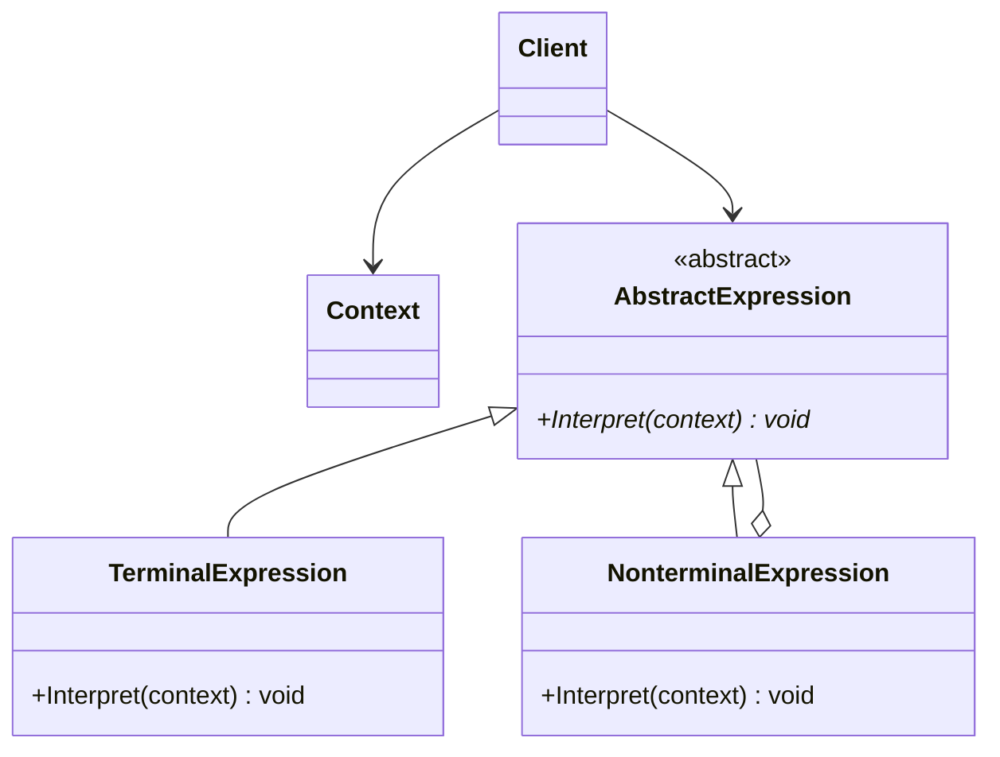
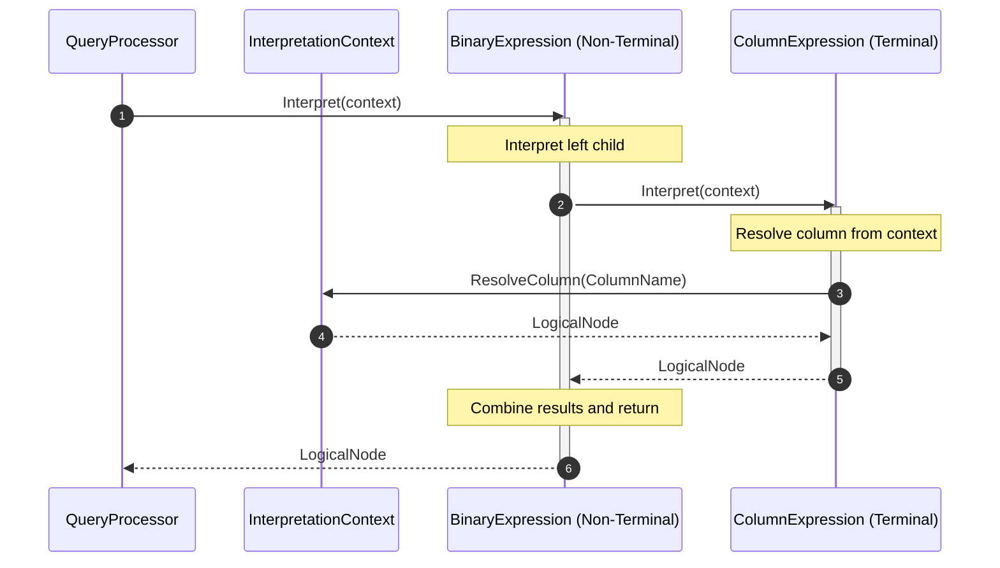
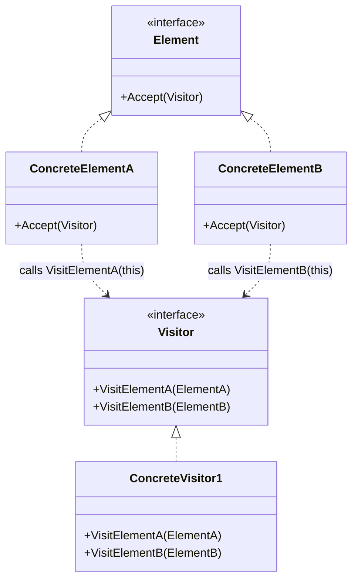
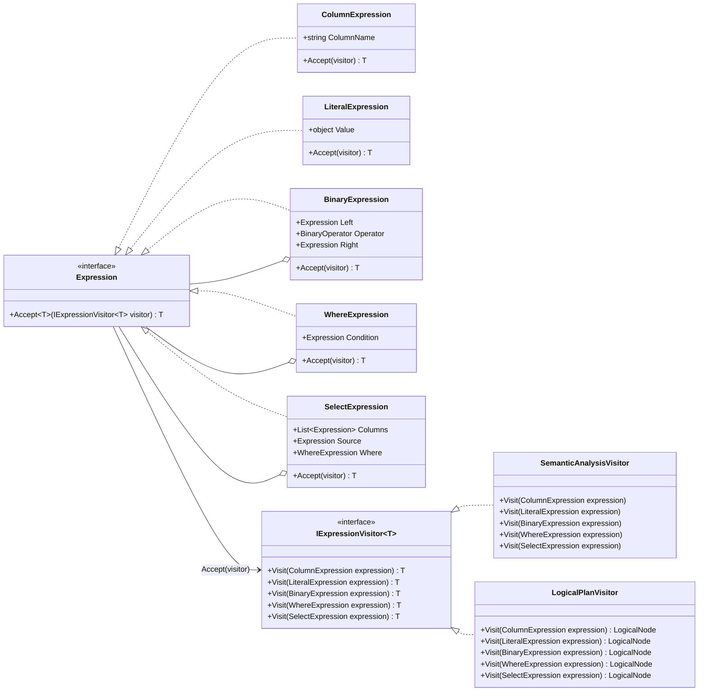
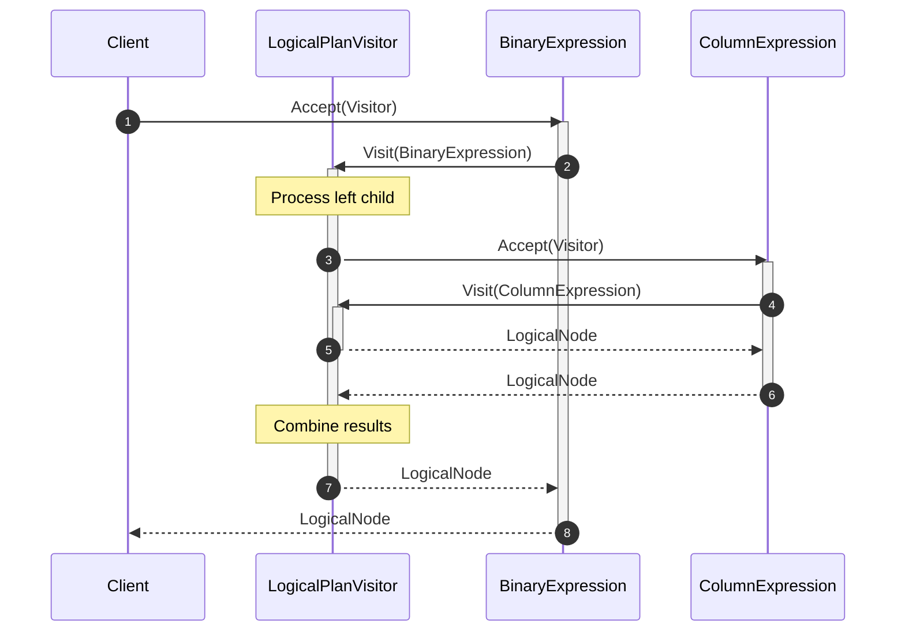

# Query Processor Design Patterns

This document tracks the design patterns used across the Query Processor module and their current implementation status.

| Priority  | Status | Design Pattern              | Feature                     | Reason / Context                                                                                                                                                                             |
| :-------: | :----: | :-------------------------- | :-------------------------- | :------------------------------------------------------------------------------------------------------------------------------------------------------------------------------------------- |
|  🔴 High  | `[x]`  | **Interpreter**             | SQL / AST Evaluation        | Represents SQL grammar as AST expression nodes such as SelectNode, WhereNode, and BinaryExpression, allowing the parsed query structure to be interpreted or translated into a logical plan. |
|  🔴 High  | `[ ]`  | **Visitor**                 | AST Processing              | Allows validation, semantic analysis, logical-plan generation, or expression evaluation to operate on different AST node types without putting every operation inside the AST classes.       |
|  🔴 High  | `[ ]`  | **Strategy**                | Query Optimization          | Allows QueryOptimizer to switch between optimization algorithms such as predicate pushdown, join reordering, index selection, or cost-based optimization.                                    |
|  🔴 High  | `[ ]`  | **Factory Method**          | Physical Operator Creation  | Creates physical operators such as TableScan, IndexScan, HashJoin, NestedLoopJoin, and Sort from logical-plan nodes selected by the optimizer.                                               |
| 🟡 Medium | `[ ]`  | **Composite**               | Query Plan Tree             | Treats leaf operators such as scans and composite operators such as joins, filters, and projections uniformly as plan nodes, naturally representing LogicalPlan and PhysicalPlan as trees.   |
| 🟡 Medium | `[ ]`  | **Iterator**                | Query Result Execution      | Lets physical operators expose rows one at a time through a common Next()/MoveNext() interface, enabling pipelined query execution without materializing every intermediate result.          |
| 🟡 Medium | `[ ]`  | **Command**                 | SQL Statement Execution     | Encapsulates parsed statements such as SELECT, INSERT, UPDATE, and DELETE as executable command objects and decouples statement dispatch from QueryExecutor.                                 |
|  🟢 Low   | `[ ]`  | **Chain of Responsibility** | Optimization Pipeline       | Passes a query plan through independent optimization rules such as constant folding, predicate pushdown, projection pruning, and join optimization. Each rule transforms or passes the plan onward. |
|  🟢 Low   | `[ ]`  | **Builder**                 | Query Plan Construction     | Builds complex LogicalPlan or PhysicalPlan objects step by step from AST nodes, especially useful when plans contain scans, filters, joins, projections, grouping, sorting, and limits.      |
|  🟢 Low   | `[ ]`  | **Template Method**         | Physical Operator Execution | Defines a common execution lifecycle such as Open() → Next() → Close() while concrete operators implement operator-specific behavior.                                                        |

---

## 2. Pattern Implementation Details

### 2.1. Interpreter (SQL / AST Evaluation)

The **Interpreter** pattern is used in the `Expression` class hierarchy to evaluate parsed SQL structures.

- Define a common `Interpret` method for all expression nodes.
- Delegate interpretation to subclass implementations for terminal and non-terminal operations.

#### Structure Diagram



#### Example code

```csharp
// Abstract class
public abstract class Expression
{
    public abstract LogicalNode Interpret(InterpretationContext context);
}

// Terminal Expression
public class ColumnExpression : TerminalExpression
{
    public string ColumnName { get; set; }

    public override LogicalNode Interpret(InterpretationContext context)
    {
        return context.ResolveColumn(ColumnName);
    }
}

// Non-Terminal Expression
public class BinaryExpression : NonTerminalExpression
{
    public Expression Left { get; set; }
    public string Operator { get; set; }
    public Expression Right { get; set; }

    public override LogicalNode Interpret(InterpretationContext context)
    {
        var leftNode = Left.Interpret(context);
        var rightNode = Right.Interpret(context);
        
        // Return combined LogicalNode
        return new LogicalNode();
    }
}
```

#### Class diagram


#### Sequence Diagram: Expression Interpretation Workflow



---

## 2.2. Visitor (AST Processing)

The **Visitor** pattern is used in the `Expression` class hierarchy to decouple operations from the AST nodes they operate on.

- Define an `Accept` method on each expression node that takes an `IExpressionVisitor`.
- Implement specific visitors (like `SemanticAnalysisVisitor` or `LogicalPlanVisitor`) that encapsulate the logic for processing the entire expression tree.

#### Structure Diagram



#### Example code

```csharp
// Abstract Element
public interface Expression
{
    T Accept<T>(IExpressionVisitor<T> visitor);
}

// Concrete Element
public class ColumnExpression : Expression
{
    public string ColumnName { get; set; }

    public T Accept<T>(IExpressionVisitor<T> visitor)
    {
        return visitor.Visit(this);
    }
}

// Visitor Interface
public interface IExpressionVisitor<T>
{
    T Visit(ColumnExpression expression);
    // other visit methods...
}

// Concrete Visitor
public class LogicalPlanVisitor : IExpressionVisitor<LogicalNode>
{
    public LogicalNode Visit(ColumnExpression expression)
    {
        // Generate logical node for column
        return new LogicalNode();
    }
}
```

#### Class diagram



#### Sequence Diagram: AST Processing Workflow


