# Query Processor Design Patterns

This document tracks the design patterns used across the Query Processor module and their current implementation status.

| Priority  | Status | Design Pattern              | Feature                     | Reason / Context                                                                                                                                                                                    |
| :-------: | :----: | :-------------------------- | :-------------------------- | :-------------------------------------------------------------------------------------------------------------------------------------------------------------------------------------------------- |
|  🔴 High  | `[x]`  | **Interpreter**             | SQL / AST Evaluation        | Represents SQL grammar as AST expression nodes such as SelectNode, WhereNode, and BinaryExpression, allowing the parsed query structure to be interpreted or translated into a logical plan.        |
|  🔴 High  | `[x]`  | **Visitor**                 | AST Processing              | Allows validation, semantic analysis, logical-plan generation, or expression evaluation to operate on different AST node types without putting every operation inside the AST classes.              |
|  🔴 High  | `[x]`  | **Strategy**                | Query Optimization          | Allows QueryOptimizer to switch between optimization algorithms such as predicate pushdown, join reordering, index selection, or cost-based optimization.                                           |
|  🔴 High  | `[x]`  | **Factory Method**          | Physical Operator Creation  | Creates physical operators such as TableScan, IndexScan, HashJoin, NestedLoopJoin, and Sort from logical-plan nodes selected by the optimizer.                                                      |
| 🟡 Medium | `[x]`  | **Composite**               | Query Plan Tree             | Treats leaf operators such as scans and composite operators such as joins, filters, and projections uniformly as plan nodes, naturally representing LogicalPlan and PhysicalPlan as trees.          |
| 🟡 Medium | `[x]`  | **Iterator**                | Query Result Execution      | Lets physical operators expose rows one at a time through a common Next()/MoveNext() interface, enabling pipelined query execution without materializing every intermediate result.                 |
| 🟡 Medium | `[ ]`  | **Command**                 | SQL Statement Execution     | Encapsulates parsed statements such as SELECT, INSERT, UPDATE, and DELETE as executable command objects and decouples statement dispatch from QueryExecutor.                                        |
|  🟢 Low   | `[ ]`  | **Chain of Responsibility** | Optimization Pipeline       | Passes a query plan through independent optimization rules such as constant folding, predicate pushdown, projection pruning, and join optimization. Each rule transforms or passes the plan onward. |
|  🟢 Low   | `[ ]`  | **Builder**                 | Query Plan Construction     | Builds complex LogicalPlan or PhysicalPlan objects step by step from AST nodes, especially useful when plans contain scans, filters, joins, projections, grouping, sorting, and limits.             |
|  🟢 Low   | `[ ]`  | **Template Method**         | Physical Operator Execution | Defines a common execution lifecycle such as Open() → Next() → Close() while concrete operators implement operator-specific behavior.                                                               |

---

## 2. Pattern Implementation Details

### 2.1. Interpreter (SQL / AST Evaluation)

The **Interpreter** pattern is used in the `Expression` class hierarchy to evaluate parsed SQL structures.

- Define a common `Interpret` method for all expression nodes.
- Delegate interpretation to subclass implementations for terminal and non-terminal operations.

#### Structure Diagram

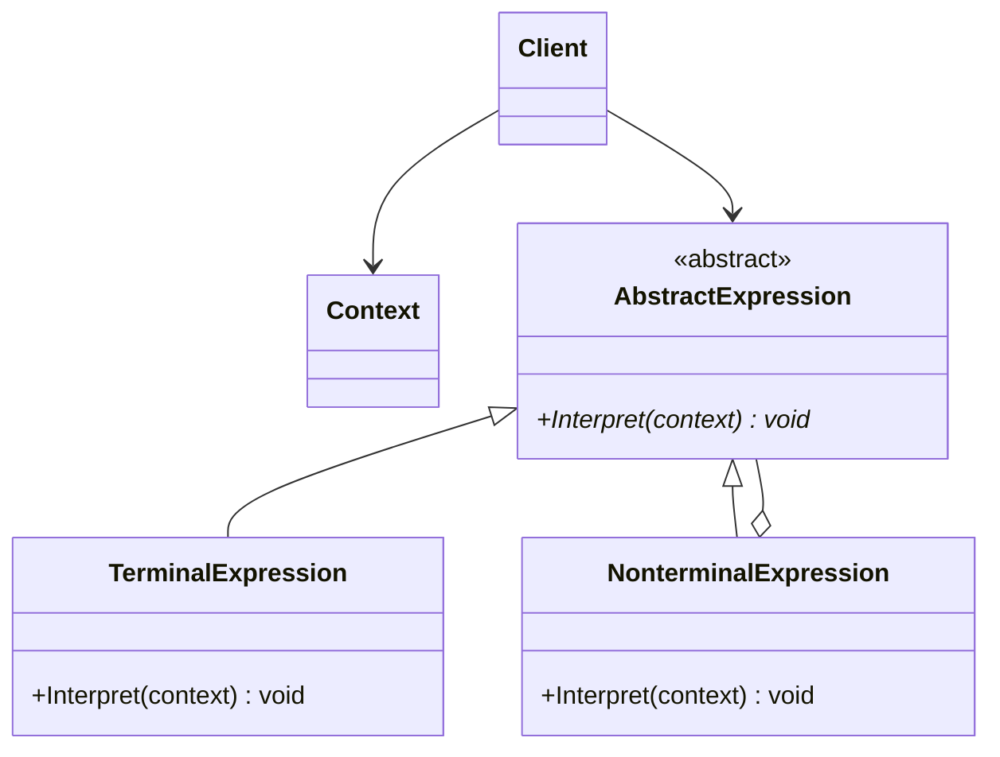
```mermaid
classDiagram
    direction TB

    class Context

    class AbstractExpression {
        <<abstract>>
        +Interpret(context)* void
    }

    class TerminalExpression {
        +Interpret(context) void
    }

    class NonterminalExpression {
        +Interpret(context) void
    }

    Client --> Context
    Client --> AbstractExpression
    AbstractExpression <|-- TerminalExpression
    AbstractExpression <|-- NonterminalExpression
    NonterminalExpression o-- AbstractExpression
```

#### Example code

```csharp
// Abstract class
public abstract class Expression
{
    public abstract LogicalNode Interpret(InterpretationContext context);
}

// Terminal Expression
public class ColumnExpression : TerminalExpression
{
    public string ColumnName { get; set; }

    public override LogicalNode Interpret(InterpretationContext context)
    {
        return context.ResolveColumn(ColumnName);
    }
}

// Non-Terminal Expression
public class BinaryExpression : NonTerminalExpression
{
    public Expression Left { get; set; }
    public string Operator { get; set; }
    public Expression Right { get; set; }

    public override LogicalNode Interpret(InterpretationContext context)
    {
        var leftNode = Left.Interpret(context);
        var rightNode = Right.Interpret(context);

        // Return combined LogicalNode
        return new LogicalNode();
    }
}
```

#### Class diagram


```mermaid
classDiagram
    direction LR

    class QueryProcessor {
        <<Client>>
        +Process(Expression expression) LogicalPlan
    }

    class InterpretationContext {
        <<Context>>
        +ResolveTable(string name)
        +ResolveColumn(string name)
    }

    class Expression {
        <<interface>>
        +Interpret(InterpretationContext context) LogicalNode
    }

    class TerminalExpression {
        <<abstract>>
        +Interpret(InterpretationContext context) LogicalNode
    }

    class ColumnExpression {
        +string ColumnName
        +Interpret(InterpretationContext context) LogicalNode
    }

    class LiteralExpression {
        +object Value
        +Interpret(InterpretationContext context) LogicalNode
    }

    class TableExpression {
        +string TableName
        +Interpret(InterpretationContext context) LogicalNode
    }

    class NonTerminalExpression {
        <<abstract>>
        +Interpret(InterpretationContext context) LogicalNode
    }

    class SelectExpression {
        +List~Expression~ Columns
        +Expression Source
        +Expression Where
        +Interpret(InterpretationContext context) LogicalNode
    }

    class WhereExpression {
        +Expression Condition
        +Interpret(InterpretationContext context) LogicalNode
    }

    class BinaryExpression {
        +Expression Left
        +string Operator
        +Expression Right
        +Interpret(InterpretationContext context) LogicalNode
    }

    QueryProcessor --> InterpretationContext : uses
    QueryProcessor --> Expression : calls Interpret()

    Expression <|.. TerminalExpression
    Expression <|.. NonTerminalExpression

    TerminalExpression <|-- ColumnExpression
    TerminalExpression <|-- LiteralExpression
    TerminalExpression <|-- TableExpression

    NonTerminalExpression <|-- SelectExpression
    NonTerminalExpression <|-- WhereExpression
    NonTerminalExpression <|-- BinaryExpression

    NonTerminalExpression o-- Expression : contains / interprets
```

#### Sequence Diagram: Expression Interpretation Workflow

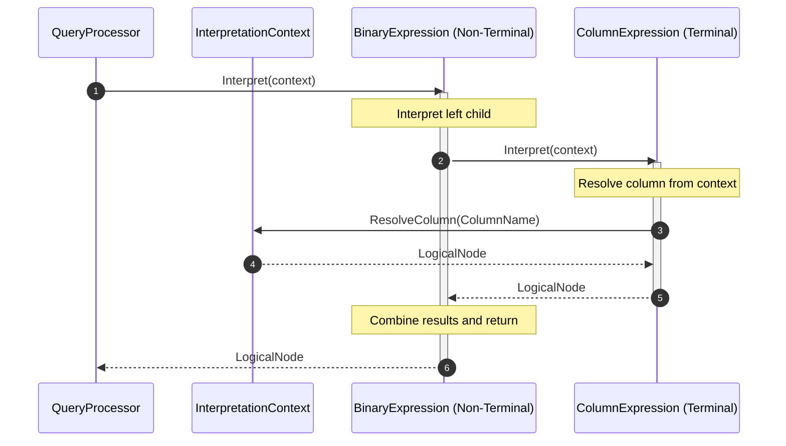
```mermaid
sequenceDiagram
    autonumber

    participant Client as QueryProcessor
    participant Context as InterpretationContext
    participant BinaryExpr as BinaryExpression (Non-Terminal)
    participant ColExpr as ColumnExpression (Terminal)

    Client->>BinaryExpr: Interpret(context)
    activate BinaryExpr

    Note over BinaryExpr: Interpret left child
    BinaryExpr->>ColExpr: Interpret(context)
    activate ColExpr

    Note over ColExpr: Resolve column from context
    ColExpr->>Context: ResolveColumn(ColumnName)
    Context-->>ColExpr: LogicalNode
    ColExpr-->>BinaryExpr: LogicalNode
    deactivate ColExpr

    Note over BinaryExpr: Combine results and return
    BinaryExpr-->>Client: LogicalNode
    deactivate BinaryExpr
```

---

## 2.2. Visitor (AST Processing)

The **Visitor** pattern is used in the `Expression` class hierarchy to decouple operations from the AST nodes they operate on.

- Define an `Accept` method on each expression node that takes an `IExpressionVisitor`.
- Implement specific visitors (like `SemanticAnalysisVisitor` or `LogicalPlanVisitor`) that encapsulate the logic for processing the entire expression tree.

#### Structure Diagram

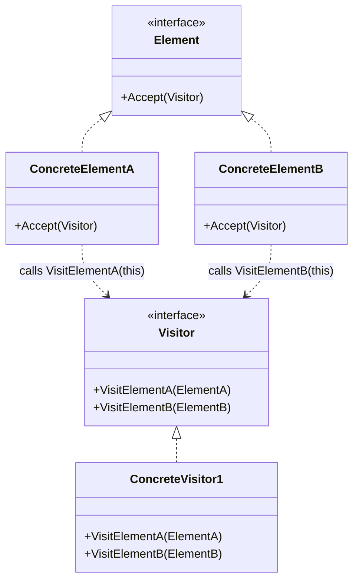
```mermaid
classDiagram
    direction TB

    class Visitor {
        <<interface>>
        +VisitElementA(ElementA)
        +VisitElementB(ElementB)
    }

    class ConcreteVisitor1 {
        +VisitElementA(ElementA)
        +VisitElementB(ElementB)
    }

    class Element {
        <<interface>>
        +Accept(Visitor)
    }

    class ConcreteElementA {
        +Accept(Visitor)
    }

    class ConcreteElementB {
        +Accept(Visitor)
    }

    Visitor <|.. ConcreteVisitor1
    Element <|.. ConcreteElementA
    Element <|.. ConcreteElementB
    ConcreteElementA ..> Visitor : calls VisitElementA(this)
    ConcreteElementB ..> Visitor : calls VisitElementB(this)
```

#### Example code

```csharp
// Abstract Element
public interface Expression
{
    T Accept<T>(IExpressionVisitor<T> visitor);
}

// Concrete Element
public class ColumnExpression : Expression
{
    public string ColumnName { get; set; }

    public T Accept<T>(IExpressionVisitor<T> visitor)
    {
        return visitor.Visit(this);
    }
}

// Visitor Interface
public interface IExpressionVisitor<T>
{
    T Visit(ColumnExpression expression);
    // other visit methods...
}

// Concrete Visitor
public class LogicalPlanVisitor : IExpressionVisitor<LogicalNode>
{
    public LogicalNode Visit(ColumnExpression expression)
    {
        // Generate logical node for column
        return new LogicalNode();
    }
}
```

#### Class diagram

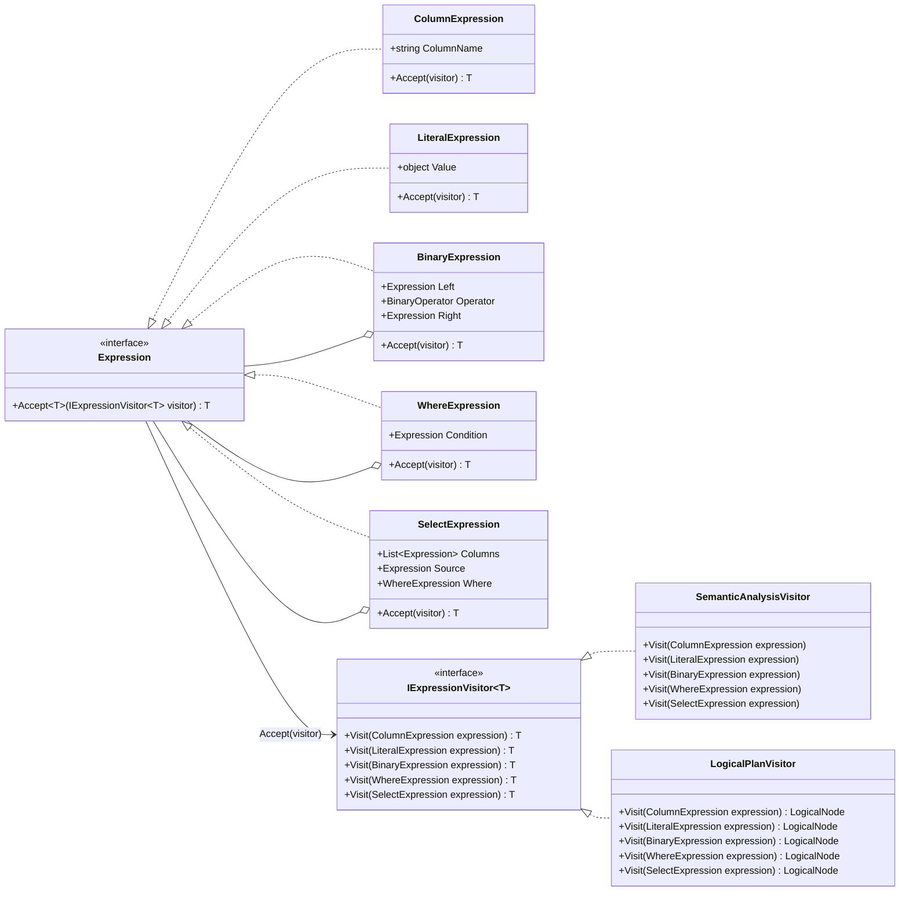
```mermaid
classDiagram
    direction LR

    class Expression {
        <<interface>>
        +Accept~T~(IExpressionVisitor~T~ visitor) T
    }

    class ColumnExpression {
        +string ColumnName
        +Accept(visitor) T
    }

    class LiteralExpression {
        +object Value
        +Accept(visitor) T
    }

    class BinaryExpression {
        +Expression Left
        +BinaryOperator Operator
        +Expression Right
        +Accept(visitor) T
    }

    class WhereExpression {
        +Expression Condition
        +Accept(visitor) T
    }

    class SelectExpression {
        +List~Expression~ Columns
        +Expression Source
        +WhereExpression Where
        +Accept(visitor) T
    }

    class IExpressionVisitor~T~ {
        <<interface>>
        +Visit(ColumnExpression expression) T
        +Visit(LiteralExpression expression) T
        +Visit(BinaryExpression expression) T
        +Visit(WhereExpression expression) T
        +Visit(SelectExpression expression) T
    }

    class SemanticAnalysisVisitor {
        +Visit(ColumnExpression expression)
        +Visit(LiteralExpression expression)
        +Visit(BinaryExpression expression)
        +Visit(WhereExpression expression)
        +Visit(SelectExpression expression)
    }

    class LogicalPlanVisitor {
        +Visit(ColumnExpression expression) LogicalNode
        +Visit(LiteralExpression expression) LogicalNode
        +Visit(BinaryExpression expression) LogicalNode
        +Visit(WhereExpression expression) LogicalNode
        +Visit(SelectExpression expression) LogicalNode
    }

    Expression <|.. ColumnExpression
    Expression <|.. LiteralExpression
    Expression <|.. BinaryExpression
    Expression <|.. WhereExpression
    Expression <|.. SelectExpression

    BinaryExpression o-- Expression
    WhereExpression o-- Expression
    SelectExpression o-- Expression

    IExpressionVisitor~T~ <|.. SemanticAnalysisVisitor
    IExpressionVisitor~T~ <|.. LogicalPlanVisitor

    Expression --> IExpressionVisitor~T~ : Accept(visitor)
```

#### Sequence Diagram: AST Processing Workflow

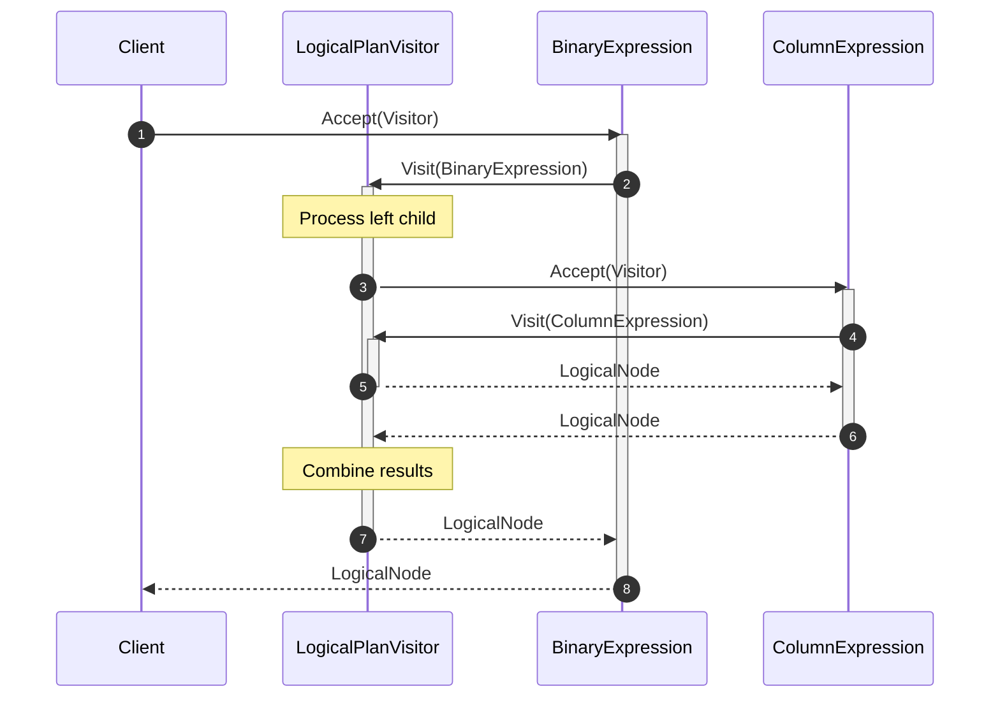
```mermaid
sequenceDiagram
    autonumber

    participant Client
    participant Visitor as LogicalPlanVisitor
    participant Expr as BinaryExpression
    participant ColExpr as ColumnExpression

    Client->>Expr: Accept(Visitor)
    activate Expr

    Expr->>Visitor: Visit(BinaryExpression)
    activate Visitor

    Note over Visitor: Process left child
    Visitor->>ColExpr: Accept(Visitor)
    activate ColExpr
    ColExpr->>Visitor: Visit(ColumnExpression)
    activate Visitor
    Visitor-->>ColExpr: LogicalNode
    deactivate Visitor
    ColExpr-->>Visitor: LogicalNode
    deactivate ColExpr

    Note over Visitor: Combine results
    Visitor-->>Expr: LogicalNode
    deactivate Visitor

    Expr-->>Client: LogicalNode
    deactivate Expr
```

---

## 2.3. Strategy (Query Optimization)

The **Strategy** pattern is used in the `QueryOptimizer` to switch between different optimization algorithms (e.g., rule-based vs. cost-based) dynamically at runtime without modifying the context class.

- Define an `IOptimizationStrategy` interface with an `Optimize` method.
- Implement specific concrete strategies such as `RuleBasedOptimizationStrategy` and `CostBasedOptimizationStrategy`.
- The `QueryOptimizer` (Context) maintains a reference to a strategy object and delegates the optimization execution to it.

#### Structure Diagram

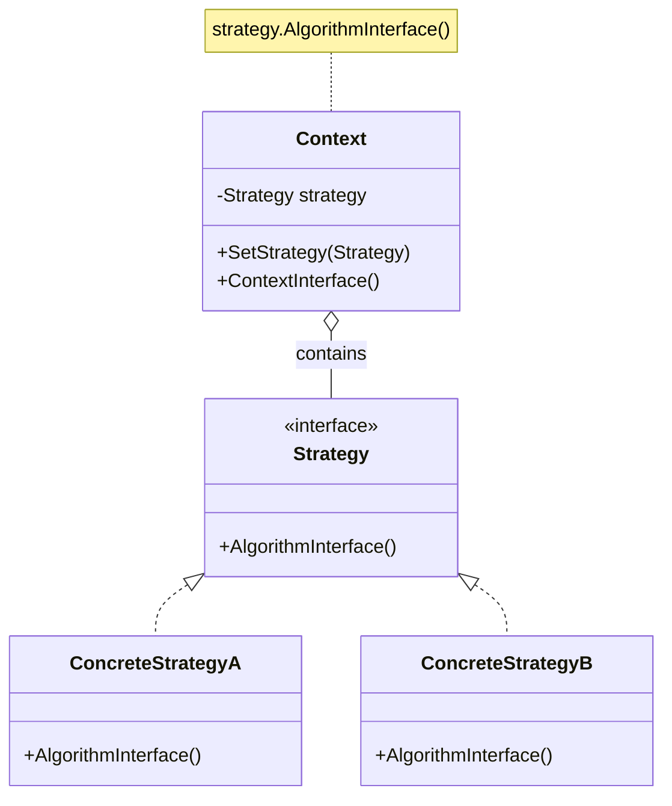
```mermaid
classDiagram
    direction TB

    class Context {
        -Strategy strategy
        +SetStrategy(Strategy)
        +ContextInterface()
    }

    class Strategy {
        <<interface>>
        +AlgorithmInterface()
    }

    class ConcreteStrategyA {
        +AlgorithmInterface()
    }

    class ConcreteStrategyB {
        +AlgorithmInterface()
    }

    Context o-- Strategy : contains
    Strategy <|.. ConcreteStrategyA
    Strategy <|.. ConcreteStrategyB

    note for Context "strategy.AlgorithmInterface()"
```

#### Example code

```csharp
// Strategy
public interface IOptimizationStrategy
{
    PhysicalPlan Optimize(LogicalPlan plan);
}

// Concrete Strategies
public class RuleBasedOptimizationStrategy : IOptimizationStrategy
{
    // Algorithm
    public PhysicalPlan Optimize(LogicalPlan plan)
    {
        plan = ApplyPredicatePushdown(plan);
        plan = ApplyProjectionPruning(plan);
        plan = ApplyConstantFolding(plan);
        return new PhysicalPlan();
    }

    private LogicalPlan ApplyPredicatePushdown(LogicalPlan plan) { throw new NotImplementedException(); }
    private LogicalPlan ApplyProjectionPruning(LogicalPlan plan) { throw new NotImplementedException(); }
    private LogicalPlan ApplyConstantFolding(LogicalPlan plan) { throw new NotImplementedException(); }
}

public class CostBasedOptimizationStrategy : IOptimizationStrategy
{
    // Algorithm
    public PhysicalPlan Optimize(LogicalPlan plan)
    {
        GenerateCandidatePlans(plan);
        EstimateCost(plan);
        return SelectBestPlan();
    }

    private void GenerateCandidatePlans(LogicalPlan plan) { throw new NotImplementedException(); }
    private double EstimateCost(LogicalPlan plan) { throw new NotImplementedException(); }
    private PhysicalPlan SelectBestPlan() { throw new NotImplementedException(); }
}

// Context
public class QueryOptimizer
{
    private IOptimizationStrategy _strategy;

    public QueryOptimizer(IOptimizationStrategy strategy)
    {
        _strategy = strategy;
    }

    public void SetStrategy(IOptimizationStrategy strategy)
    {
        _strategy = strategy;
    }

    public PhysicalPlan Optimize(LogicalPlan plan)
    {
        // Delegate optimization to the Strategy object
        return _strategy.Optimize(plan);
    }
}
```

#### Class diagram

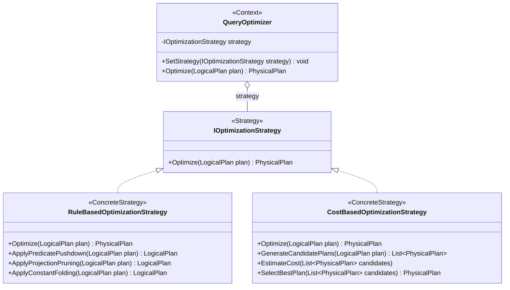
```mermaid
classDiagram
    direction TB

    class QueryOptimizer {
        <<Context>>
        -IOptimizationStrategy strategy
        +SetStrategy(IOptimizationStrategy strategy) void
        +Optimize(LogicalPlan plan) PhysicalPlan
    }

    class IOptimizationStrategy {
        <<Strategy>>
        +Optimize(LogicalPlan plan) PhysicalPlan
    }

    class RuleBasedOptimizationStrategy {
        <<ConcreteStrategy>>
        +Optimize(LogicalPlan plan) PhysicalPlan
        +ApplyPredicatePushdown(LogicalPlan plan) LogicalPlan
        +ApplyProjectionPruning(LogicalPlan plan) LogicalPlan
        +ApplyConstantFolding(LogicalPlan plan) LogicalPlan
    }

    class CostBasedOptimizationStrategy {
        <<ConcreteStrategy>>
        +Optimize(LogicalPlan plan) PhysicalPlan
        +GenerateCandidatePlans(LogicalPlan plan) List~PhysicalPlan~
        +EstimateCost(List~PhysicalPlan~ candidates)
        +SelectBestPlan(List~PhysicalPlan~ candidates) PhysicalPlan
    }

    QueryOptimizer o-- IOptimizationStrategy : strategy

    IOptimizationStrategy <|.. RuleBasedOptimizationStrategy
    IOptimizationStrategy <|.. CostBasedOptimizationStrategy
```

#### Sequence Diagram: Strategy Execution Workflow

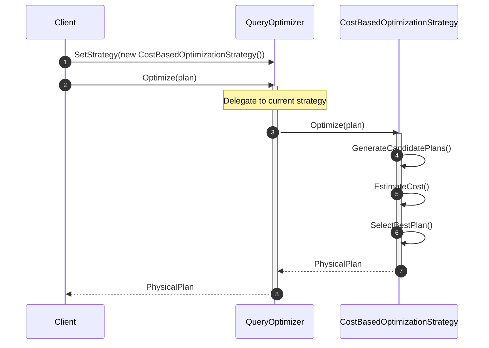
```mermaid
sequenceDiagram
    autonumber

    participant Client
    participant Optimizer as QueryOptimizer
    participant Strategy as CostBasedOptimizationStrategy

    Client->>Optimizer: SetStrategy(new CostBasedOptimizationStrategy())

    Client->>Optimizer: Optimize(plan)
    activate Optimizer

    Note over Optimizer: Delegate to current strategy
    Optimizer->>Strategy: Optimize(plan)
    activate Strategy

    Strategy->>Strategy: GenerateCandidatePlans()
    Strategy->>Strategy: EstimateCost()
    Strategy->>Strategy: SelectBestPlan()

    Strategy-->>Optimizer: PhysicalPlan
    deactivate Strategy

    Optimizer-->>Client: PhysicalPlan
    deactivate Optimizer
```

---

## 2.4. Factory Method (Physical Operator Creation)

The **Factory Method** pattern is used to create physical operators such as `TableScan`, `IndexScan`, `HashJoin`, `NestedLoopJoin`, and `Sort` from logical-plan nodes selected by the optimizer.

- Define an interface or abstract class (`OperatorFactory`) for creating physical operators, but let concrete subclasses decide which objects to instantiate based on logical node types.

#### Structure Diagram

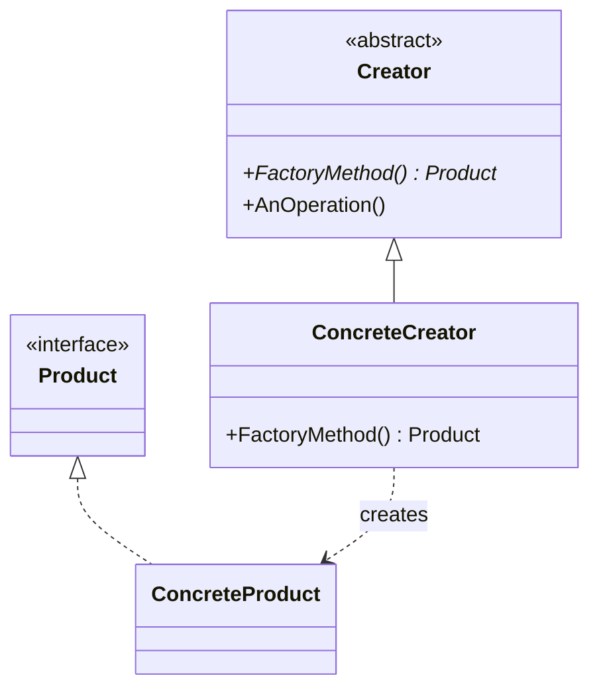
```mermaid
classDiagram
    direction TB

    class Creator {
        <<abstract>>
        +FactoryMethod()* Product
        +AnOperation()
    }

    class ConcreteCreator {
        +FactoryMethod() Product
    }

    class Product {
        <<interface>>
    }

    class ConcreteProduct {
    }

    Creator <|-- ConcreteCreator
    Product <|.. ConcreteProduct
    ConcreteCreator ..> ConcreteProduct : creates
```

#### Example code

```csharp
// Product
public abstract class PhysicalOperator
{
    public abstract void Open();
    public abstract bool Next();
    public abstract void Close();
}

// Concrete Products
public class TableScanOperator : PhysicalOperator
{
    public override void Open() { }
    public override bool Next() { return false; }
    public override void Close() { }
}

public class HashJoinOperator : PhysicalOperator
{
    public override void Open() { }
    public override bool Next() { return false; }
    public override void Close() { }
}

public class IndexScanOperator : PhysicalOperator
{
    public override void Open() { }
    public override bool Next() { return false; }
    public override void Close() { }
}

public class NestedLoopJoinOperator : PhysicalOperator
{
    public override void Open() { }
    public override bool Next() { return false; }
    public override void Close() { }
}

public class SortOperator : PhysicalOperator
{
    public override void Open() { }
    public override bool Next() { return false; }
    public override void Close() { }
}

// Creator
public abstract class OperatorFactory
{
    // Factory Method
    public abstract PhysicalOperator CreateOperator(LogicalNode node);
}

// Concrete Creator
public class PhysicalOperatorFactory : OperatorFactory
{
    public override PhysicalOperator CreateOperator(LogicalNode node)
    {
        return node switch
        {
            LogicalTableScan scan => new TableScanOperator(scan.TableName),
            LogicalIndexScan iscan => new IndexScanOperator(),
            LogicalHashJoin hjoin => new HashJoinOperator(),
            LogicalNestedLoopJoin nljoin => new NestedLoopJoinOperator(),
            LogicalSort sort => new SortOperator(),
            _ => throw new NotSupportedException($"Unsupported logical node: {node.GetType().Name}")
        };
    }
}
```

#### Class diagram

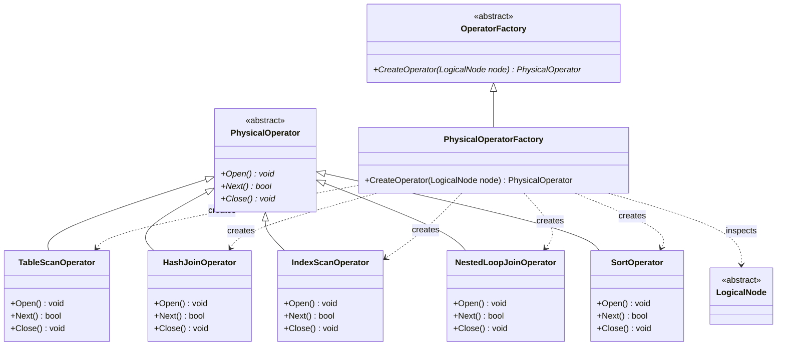
```mermaid
classDiagram
    direction TB

    class OperatorFactory {
        <<abstract>>
        +CreateOperator(LogicalNode node)* PhysicalOperator
    }

    class PhysicalOperatorFactory {
        +CreateOperator(LogicalNode node) PhysicalOperator
    }

    class PhysicalOperator {
        <<abstract>>
        +Open()* void
        +Next()* bool
        +Close()* void
    }

    class TableScanOperator {
        +Open() void
        +Next() bool
        +Close() void
    }

    class HashJoinOperator {
        +Open() void
        +Next() bool
        +Close() void
    }

    class IndexScanOperator {
        +Open() void
        +Next() bool
        +Close() void
    }

    class NestedLoopJoinOperator {
        +Open() void
        +Next() bool
        +Close() void
    }

    class SortOperator {
        +Open() void
        +Next() bool
        +Close() void
    }

    class LogicalNode {
        <<abstract>>
    }

    OperatorFactory <|-- PhysicalOperatorFactory
    PhysicalOperator <|-- TableScanOperator
    PhysicalOperator <|-- HashJoinOperator
    PhysicalOperator <|-- IndexScanOperator
    PhysicalOperator <|-- NestedLoopJoinOperator
    PhysicalOperator <|-- SortOperator

    PhysicalOperatorFactory ..> TableScanOperator : creates
    PhysicalOperatorFactory ..> HashJoinOperator : creates
    PhysicalOperatorFactory ..> IndexScanOperator : creates
    PhysicalOperatorFactory ..> NestedLoopJoinOperator : creates
    PhysicalOperatorFactory ..> SortOperator : creates
    PhysicalOperatorFactory ..> LogicalNode : inspects
```

#### Sequence Diagram: Operator Creation Workflow

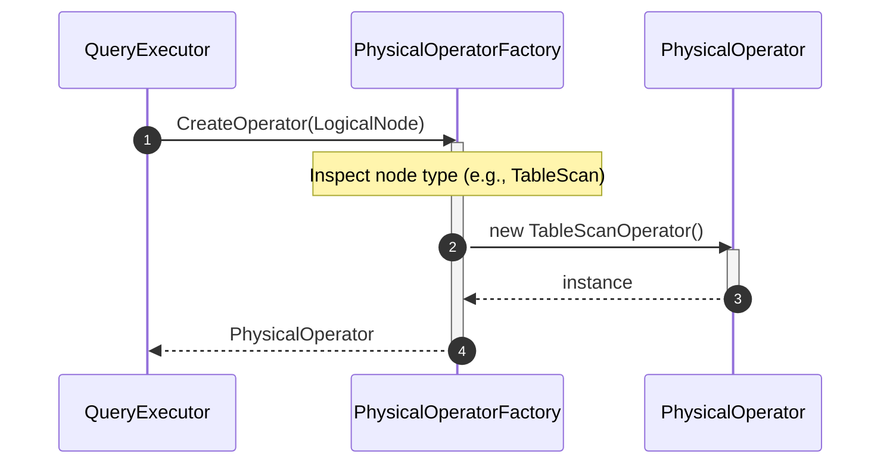
```mermaid
sequenceDiagram
    autonumber

    participant Client as QueryExecutor
    participant Factory as PhysicalOperatorFactory
    participant Op as PhysicalOperator

    Client->>Factory: CreateOperator(LogicalNode)
    activate Factory

    Note over Factory: Inspect node type (e.g., TableScan)
    Factory->>Op: new TableScanOperator()
    activate Op
    Op-->>Factory: instance
    deactivate Op

    Factory-->>Client: PhysicalOperator
    deactivate Factory
```

---

## 2.5. Composite (Query Plan Tree)

The **Composite** pattern is used to represent the hierarchical structure of a query plan. It allows the system to treat both leaf operators (such as scans) and composite operators (such as joins, filters, and projections) uniformly as plan nodes.

- Define an abstract component `PlanNode` (or `LogicalNode` / `PhysicalOperator`) that declares the interface for objects in the composition.
- Implement leaf objects that have no children.
- Implement composite objects that store child components and implement operations by delegating to them.

#### Structure Diagram

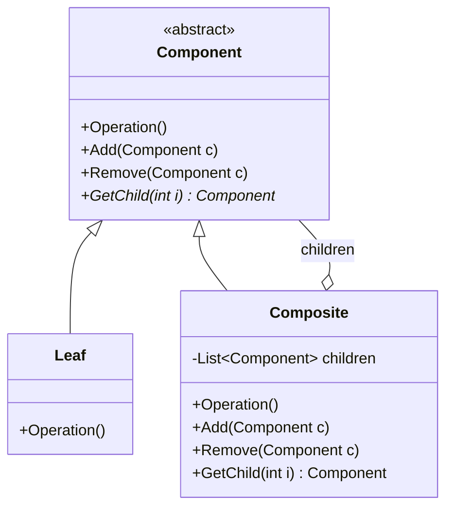
```mermaid
classDiagram
    direction TB

    class Component {
        <<abstract>>
        +Operation()
        +Add(Component c)
        +Remove(Component c)
        +GetChild(int i)* Component
    }

    class Leaf {
        +Operation()
    }

    class Composite {
        -List~Component~ children
        +Operation()
        +Add(Component c)
        +Remove(Component c)
        +GetChild(int i) Component
    }

    Component <|-- Leaf
    Component <|-- Composite
    Composite o-- Component : children
```

#### Example code

```csharp
// Component
public abstract class PhysicalOperator
{
    public abstract void Open();
    public abstract bool Next();
    public abstract void Close();
    
    public virtual void AddChild(PhysicalOperator child)
    {
        throw new NotSupportedException();
    }
    
    public virtual IEnumerable<PhysicalOperator> GetChildren()
    {
        return Enumerable.Empty<PhysicalOperator>();
    }
}

// Leaf
public class TableScanOperator : PhysicalOperator
{
    public string TableName { get; }

    public TableScanOperator(string tableName)
    {
        TableName = tableName;
    }

    public override void Open() {}
    public override bool Next() { return false; }
    public override void Close() {}
}

// Composite
public abstract class UnaryOperator : PhysicalOperator
{
    protected PhysicalOperator _child;

    public override void AddChild(PhysicalOperator child)
    {
        _child = child;
    }

    public override IEnumerable<PhysicalOperator> GetChildren()
    {
        if (_child != null) yield return _child;
    }
}

public class FilterOperator : UnaryOperator
{
    public override void Open()
    {
        _child.Open();
    }

    public override bool Next()
    {
        while (_child.Next())
        {
            if (ConditionPassed()) return true;
        }
        return false;
    }

    public override void Close()
    {
        _child.Close();
    }
}

public abstract class BinaryOperator : PhysicalOperator
{
    protected PhysicalOperator _leftChild;
    protected PhysicalOperator _rightChild;

    public override void AddChild(PhysicalOperator child)
    {
        if (_leftChild == null) _leftChild = child;
        else if (_rightChild == null) _rightChild = child;
        else throw new InvalidOperationException("Binary operator can only have two children");
    }

    public override IEnumerable<PhysicalOperator> GetChildren()
    {
        if (_leftChild != null) yield return _leftChild;
        if (_rightChild != null) yield return _rightChild;
    }
}

public class HashJoinOperator : BinaryOperator
{
    public override void Open()
    {
        _leftChild.Open();
        _rightChild.Open();
    }

    public override bool Next()
    {
        // Perform join logic
        return false;
    }

    public override void Close()
    {
        _leftChild.Close();
        _rightChild.Close();
    }
}
```

#### Class diagram

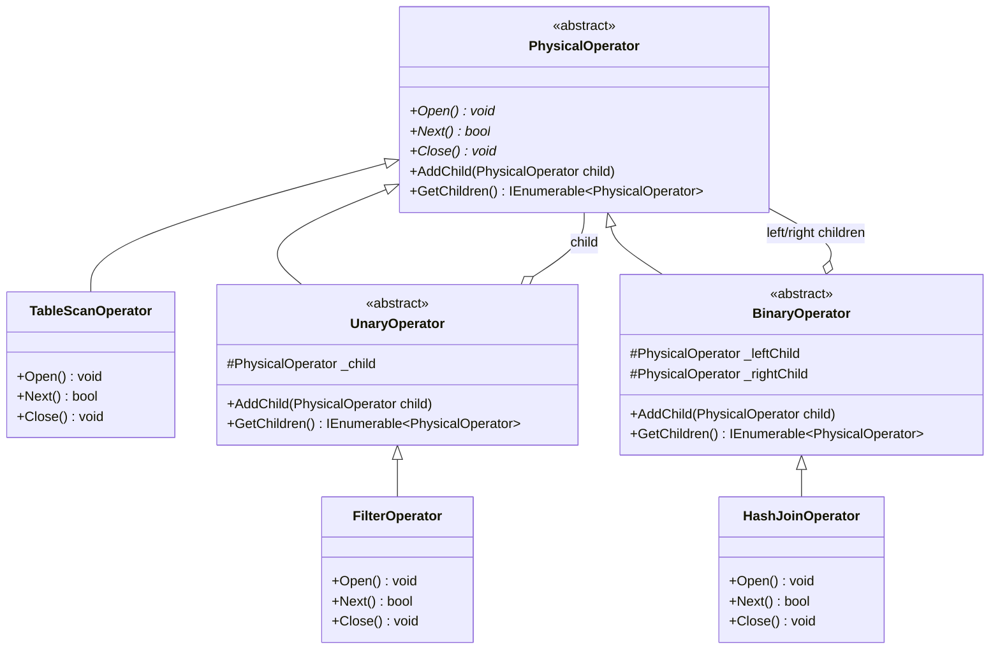
```mermaid
classDiagram
    direction TB

    class PhysicalOperator {
        <<abstract>>
        +Open()* void
        +Next()* bool
        +Close()* void
        +AddChild(PhysicalOperator child)
        +GetChildren() IEnumerable~PhysicalOperator~
    }

    class TableScanOperator {
        +Open() void
        +Next() bool
        +Close() void
    }

    class UnaryOperator {
        <<abstract>>
        #PhysicalOperator _child
        +AddChild(PhysicalOperator child)
        +GetChildren() IEnumerable~PhysicalOperator~
    }

    class FilterOperator {
        +Open() void
        +Next() bool
        +Close() void
    }

    class BinaryOperator {
        <<abstract>>
        #PhysicalOperator _leftChild
        #PhysicalOperator _rightChild
        +AddChild(PhysicalOperator child)
        +GetChildren() IEnumerable~PhysicalOperator~
    }

    class HashJoinOperator {
        +Open() void
        +Next() bool
        +Close() void
    }

    PhysicalOperator <|-- TableScanOperator
    PhysicalOperator <|-- UnaryOperator
    PhysicalOperator <|-- BinaryOperator

    UnaryOperator <|-- FilterOperator
    BinaryOperator <|-- HashJoinOperator

    UnaryOperator o-- PhysicalOperator : child
    BinaryOperator o-- PhysicalOperator : left/right children
```

#### Sequence Diagram: Recursive Operation Execution

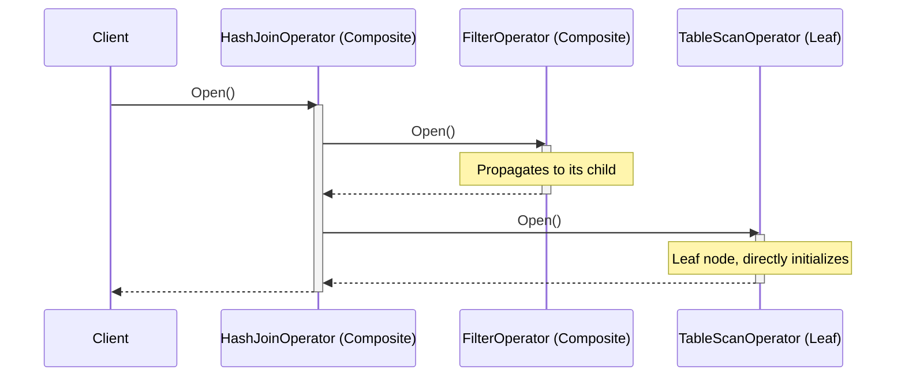
```mermaid
sequenceDiagram
    participant Client
    participant Root as HashJoinOperator (Composite)
    participant Left as FilterOperator (Composite)
    participant Right as TableScanOperator (Leaf)
    
    Client->>Root: Open()
    activate Root
    
    Root->>Left: Open()
    activate Left
    Note over Left: Propagates to its child
    Left-->>Root: 
    deactivate Left
    
    Root->>Right: Open()
    activate Right
    Note over Right: Leaf node, directly initializes
    Right-->>Root: 
    deactivate Right
    
    Root-->>Client: 
    deactivate Root
```

---

## 2.6. Iterator (Query Result Execution)

The **Iterator** pattern (often called the Volcano Execution Model in databases) is used to process query results pipelined. It lets physical operators expose rows one at a time through a common `Next()` or `MoveNext()` interface, enabling query execution without materializing every intermediate result.

- Define a standard interface for operators with `Open()`, `Next()`, and `Close()` methods.
- Each operator encapsulates its own logic for fetching or processing the next row.
- Parent operators repeatedly call `Next()` on their children to pull data up the execution tree.

#### Structure Diagram

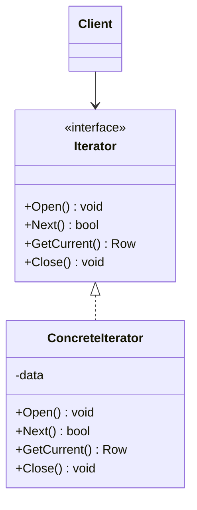
```mermaid
classDiagram
    direction TB

    class Iterator {
        <<interface>>
        +Open() void
        +Next() bool
        +GetCurrent() Row
        +Close() void
    }

    class ConcreteIterator {
        -data
        +Open() void
        +Next() bool
        +GetCurrent() Row
        +Close() void
    }

    Iterator <|.. ConcreteIterator
    Client --> Iterator
```

#### Example code

```csharp
public abstract class PhysicalOperator
{
    public abstract void Open();
    public abstract bool Next();
    public abstract Row GetCurrent();
    public abstract void Close();
}

public class TableScanOperator : PhysicalOperator
{
    private IEnumerator<Row> _enumerator;
    private IEnumerable<Row> _tableRows;

    public TableScanOperator(IEnumerable<Row> tableRows)
    {
        _tableRows = tableRows;
    }

    public override void Open()
    {
        _enumerator = _tableRows.GetEnumerator();
    }

    public override bool Next()
    {
        return _enumerator.MoveNext();
    }

    public override Row GetCurrent()
    {
        return _enumerator.Current;
    }

    public override void Close()
    {
        _enumerator?.Dispose();
    }
}

public class FilterOperator : PhysicalOperator
{
    private PhysicalOperator _child;
    private Func<Row, bool> _predicate;

    public FilterOperator(PhysicalOperator child, Func<Row, bool> predicate)
    {
        _child = child;
        _predicate = predicate;
    }

    public override void Open()
    {
        _child.Open();
    }

    public override bool Next()
    {
        while (_child.Next())
        {
            if (_predicate(_child.GetCurrent()))
            {
                return true;
            }
        }
        return false;
    }

    public override Row GetCurrent()
    {
        return _child.GetCurrent();
    }

    public override void Close()
    {
        _child.Close();
    }
}
```

#### Class diagram

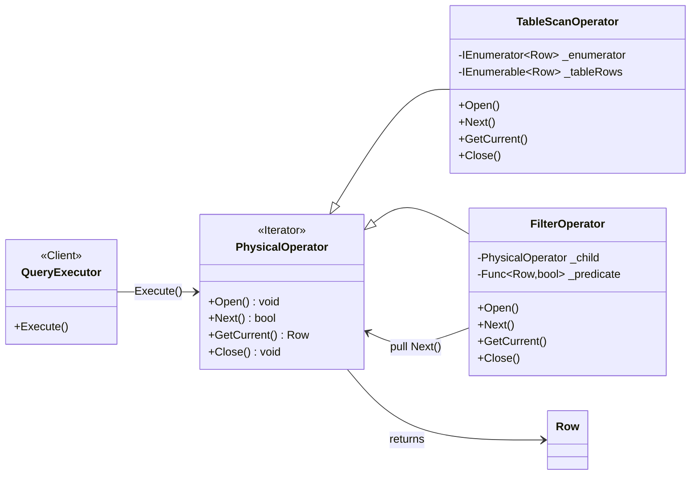
```mermaid
classDiagram
    direction LR

    class QueryExecutor {
        <<Client>>
        +Execute()
    }

    class Row

    class PhysicalOperator {
        <<Iterator>>
        +Open() void
        +Next() bool
        +GetCurrent() Row
        +Close() void
    }

    class TableScanOperator {
        -IEnumerator~Row~ _enumerator
        -IEnumerable~Row~ _tableRows
        +Open()
        +Next()
        +GetCurrent()
        +Close()
    }

    class FilterOperator {
        -PhysicalOperator _child
        -Func~Row,bool~ _predicate
        +Open()
        +Next()
        +GetCurrent()
        +Close()
    }

    QueryExecutor --> PhysicalOperator : Execute()

    PhysicalOperator <|-- TableScanOperator
    PhysicalOperator <|-- FilterOperator

    FilterOperator --> PhysicalOperator : pull Next()

    PhysicalOperator --> Row : returns
```

#### Sequence Diagram: Pipelined Execution

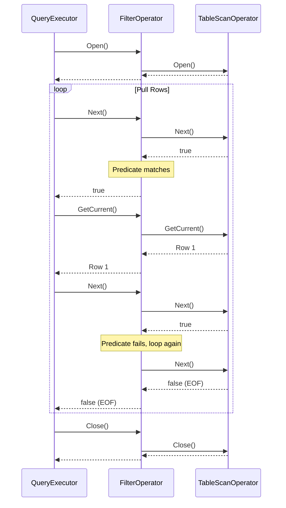
```mermaid
sequenceDiagram
    participant Executor as QueryExecutor
    participant Filter as FilterOperator
    participant Scan as TableScanOperator
    
    Executor->>Filter: Open()
    Filter->>Scan: Open()
    Scan-->>Filter: 
    Filter-->>Executor: 

    loop Pull Rows
        Executor->>Filter: Next()
        Filter->>Scan: Next()
        Scan-->>Filter: true
        Note over Filter: Predicate matches
        Filter-->>Executor: true
        
        Executor->>Filter: GetCurrent()
        Filter->>Scan: GetCurrent()
        Scan-->>Filter: Row 1
        Filter-->>Executor: Row 1
        
        Executor->>Filter: Next()
        Filter->>Scan: Next()
        Scan-->>Filter: true
        Note over Filter: Predicate fails, loop again
        
        Filter->>Scan: Next()
        Scan-->>Filter: false (EOF)
        Filter-->>Executor: false (EOF)
    end

    Executor->>Filter: Close()
    Filter->>Scan: Close()
    Scan-->>Filter: 
    Filter-->>Executor: 
```