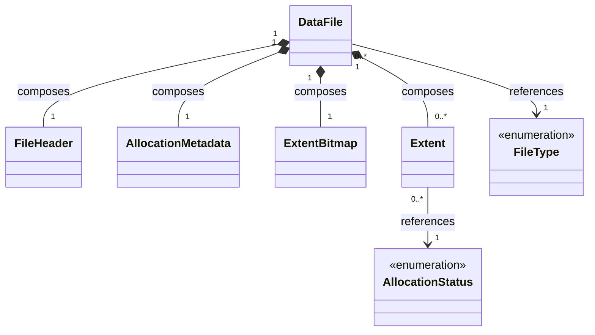

# File Domain Model Diagram - File Management

### Purpose
Illustrates the static structural composition of a physical data file representation.

### Mermaid classDiagram

### Relationship Explanation
- **Composition (`*--`)**:
  - **`DataFile` composes `FileHeader`, `AllocationMetadata`, `ExtentBitmap`, and `Extent`**: The physical header, metadata tracker, extent occupancy bitmap, and individual extents are structural parts of a single `DataFile`. They are created together with the `DataFile` and their lifetimes are bound to the `DataFile`. They cannot exist or be shared outside of it.
