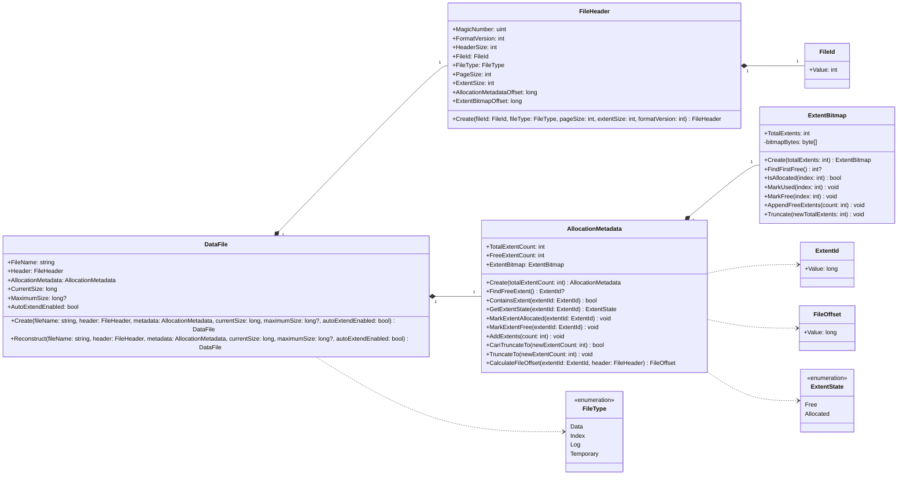

# File Domain Model Diagram - File Management

### Purpose
Illustrates the static structural composition of a physical data file representation.

### Mermaid classDiagram

### Relationship Explanation
- **Composition (`*--`)**:
  - `DataFile` strictly composes the structural `FileHeader` and `AllocationMetadata`.
- **Association (`-->`)**:
  - `AllocationMetadata` holds direct references to enums (`ExtentState`) and structural IDs (`ExtentId`) for allocation lookups.
