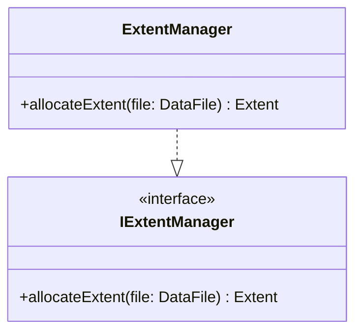

# Extent Management Diagram - File Management

### Purpose
Details the service interface and implementation for allocating space in terms of extents (blocks of pages) for database files.

### Mermaid classDiagram

### Relationship Explanation
- **Interface Realization (`..|>`)**:
  - `ExtentManager` implements `IExtentManager` to isolate space allocation operations from other storage engine components.
