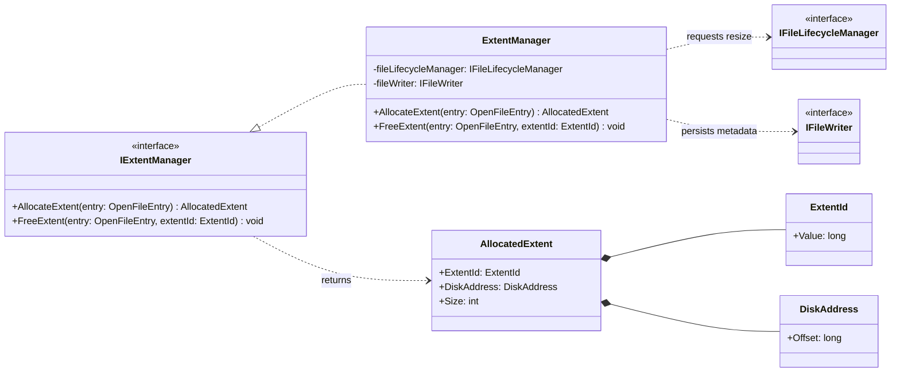

# Extent Management Diagram - File Management

### Purpose
Details the service interface and implementation for allocating space in terms of extents (blocks of pages) for database files.

### Mermaid classDiagram

### Relationship Explanation
- **Interface Realization (`..|>`)**:
  - `ExtentManager` implements `IExtentManager` to isolate space allocation operations.
  - `ExtentUsageTracker` implements `IExtentUsageTracker` to track page allocation statuses independently.
- **Association (`-->`)**:
  - `ExtentManager` references the `IExtentUsageTracker` interface to determine if extents can be safely released.
  - `AllocatedExtent` references `ExtentId` and `DiskAddress` value objects.
