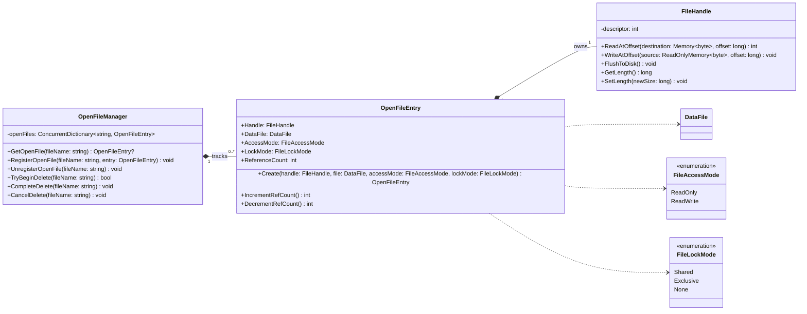

# Runtime File Management Diagram - File Management

### Purpose

Details how active, open files and their OS-level handles are managed at runtime.

### Mermaid Class Diagram

### Relationship Explanation

- **Composition (`*--`)**:
  - `OpenFileEntry` owns and composes the lifetime of its low-level operating-system `FileHandle`.
  - `OpenFileManager` composes and locks its collection of active open entries.
- **Dependency/Association (`..>`)**:
  - `OpenFileEntry` refers to `DataFile` structure, access flags, and file lock options.
