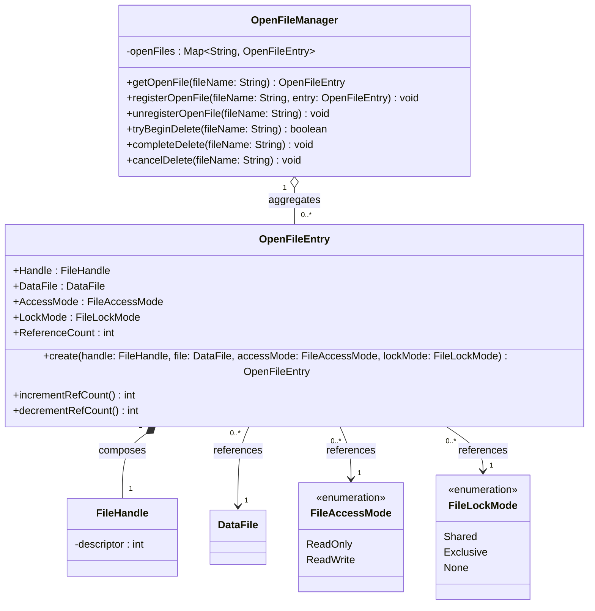

# Runtime File Management Diagram - File Management

### Purpose
Details how active, open files and their OS-level handles are managed at runtime.

### Mermaid classDiagram

### Relationship Explanation
- **Composition (`*--`)**:
  - **`OpenFileEntry` composes `FileHandle`**: An open file entry holds exclusive ownership of the raw OS-level file handle. The file handle's lifetime is bound to the `OpenFileEntry`; when the entry is closed/destroyed, the handle is also closed.
- **Aggregation (`o--`)**:
  - **`OpenFileManager` aggregates `OpenFileEntry`**: The manager tracks active open file entries. It stores them in a collection, but does not own their logical database lifetime. The entry can be open or closed independently of the manager's existence.
