# Service Architecture Diagram - File Management

### Purpose
Shows the service classes, their corresponding interfaces, and how the manager references helper services.

### Mermaid classDiagram

```mermaid
classDiagram
    class IFileLifecycleManager {
        <<interface>>
        +createFile(fileName: String, fileType: FileType, pageSize: int, initialFileSize: long) DataFile
        +openFile(fileName: String, accessMode: FileAccessMode, lockMode: FileLockMode) OpenFileEntry
        +closeFile(fileName: String) void
        +deleteFile(fileName: String) void
    }

    class IFileReader {
        <<interface>>
        +readHeader(handle: FileHandle) FileHeader
        +readAllocationMetadata(handle: FileHandle, header: FileHeader) AllocationMetadata
        +readExtentBitmap(handle: FileHandle, header: FileHeader, metadata: AllocationMetadata) ExtentBitmap
    }

    class IFileWriter {
        <<interface>>
        +writeHeader(handle: FileHandle, header: FileHeader) void
        +writeAllocationMetadata(handle: FileHandle, metadata: AllocationMetadata) void
        +writeExtentBitmap(handle: FileHandle, bitmap: ExtentBitmap) void
    }

    class IFileSynchronizer {
        <<interface>>
        +flush(handle: FileHandle) void
    }

    class IOpenFileManager {
        <<interface>>
        +getOpenFile(fileName: String) OpenFileEntry?
        +registerOpenFile(fileName: String, entry: OpenFileEntry) void
        +unregisterOpenFile(fileName: String) void
        +tryBeginDelete(fileName: String) boolean
        +completeDelete(fileName: String) void
        +cancelDelete(fileName: String) void
    }

    class FileLifecycleManager {
        -fileReader : IFileReader
        -fileWriter : IFileWriter
        -fileSynchronizer : IFileSynchronizer
        -openFileManager : IOpenFileManager

        +createFile(fileName: String, fileType: FileType, pageSize: int, initialFileSize: long) DataFile
        +openFile(fileName: String, accessMode: FileAccessMode, lockMode: FileLockMode) OpenFileEntry
        +closeFile(fileName: String) void
        +deleteFile(fileName: String) void

        -checkFileExists(fileName: String) boolean
        -createPhysicalFile(fileName: String, initialFileSize: long) FileHandle
        -openPhysicalFile(fileName: String, accessMode: FileAccessMode) FileHandle
        -closePhysicalFile(handle: FileHandle) void
        -deletePhysicalFile(fileName: String) void
        -validateHeader(header: FileHeader) void
    }

    class FileReader {
        +readHeader(handle: FileHandle) FileHeader
        +readAllocationMetadata(handle: FileHandle, header: FileHeader) AllocationMetadata
        +readExtentBitmap(handle: FileHandle, header: FileHeader, metadata: AllocationMetadata) ExtentBitmap
    }

    class FileWriter {
        +writeHeader(handle: FileHandle, header: FileHeader) void
        +writeAllocationMetadata(handle: FileHandle, metadata: AllocationMetadata) void
        +writeExtentBitmap(handle: FileHandle, bitmap: ExtentBitmap) void
    }

    class FileSynchronizer {
        +flush(handle: FileHandle) void
    }

    class OpenFileManager {
        -openFiles : Map~String, OpenFileEntry~
        +getOpenFile(fileName: String) OpenFileEntry?
        +registerOpenFile(fileName: String, entry: OpenFileEntry) void
        +unregisterOpenFile(fileName: String) void
        +tryBeginDelete(fileName: String) boolean
        +completeDelete(fileName: String) void
        +cancelDelete(fileName: String) void
    }

    FileLifecycleManager ..|> IFileLifecycleManager
    FileReader ..|> IFileReader
    FileWriter ..|> IFileWriter
    FileSynchronizer ..|> IFileSynchronizer
    OpenFileManager ..|> IOpenFileManager

    FileLifecycleManager "1" --> "1" IFileReader : uses
    FileLifecycleManager "1" --> "1" IFileWriter : uses
    FileLifecycleManager "1" --> "1" IFileSynchronizer : uses
    FileLifecycleManager "1" --> "1" IOpenFileManager : uses
```

### Relationship Explanation
- **Interface Realization (`..|>`)**:
  - Used for all service components (`FileLifecycleManager`, `FileReader`, `FileWriter`, `FileSynchronizer`, `OpenFileManager`) to isolate implementation details from other database subsystems.
- **Association (`-->`)**:
  - **`FileLifecycleManager` uses helper services**: It holds references to `IFileReader`, `IFileWriter`, `IFileSynchronizer`, and `IOpenFileManager` to delegate specific sub-tasks. These helper services are typically injected via dependency injection.
