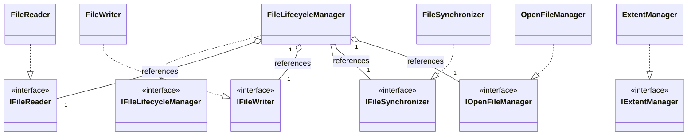

# Service Architecture Diagram - File Management

### Purpose
Shows the service classes, their corresponding interfaces, and how the manager references helper services.

### Mermaid classDiagram

### Relationship Explanation
- **Interface Realization (`..|>`)**:
  - Used for all service components (`FileLifecycleManager`, `FileReader`, `FileWriter`, `FileSynchronizer`, `OpenFileManager`, `ExtentManager`) to isolate implementation details from other database subsystems.
- **Aggregation (`o--`)**:
  - **`FileLifecycleManager` aggregates helper services**: It holds persistent references to `IFileReader`, `IFileWriter`, `IFileSynchronizer`, and `IOpenFileManager` to delegate sub-tasks (e.g. format on creation, close entries on deletion). These helper services can exist independently of the lifecycle manager and are typically injected via dependency injection.
