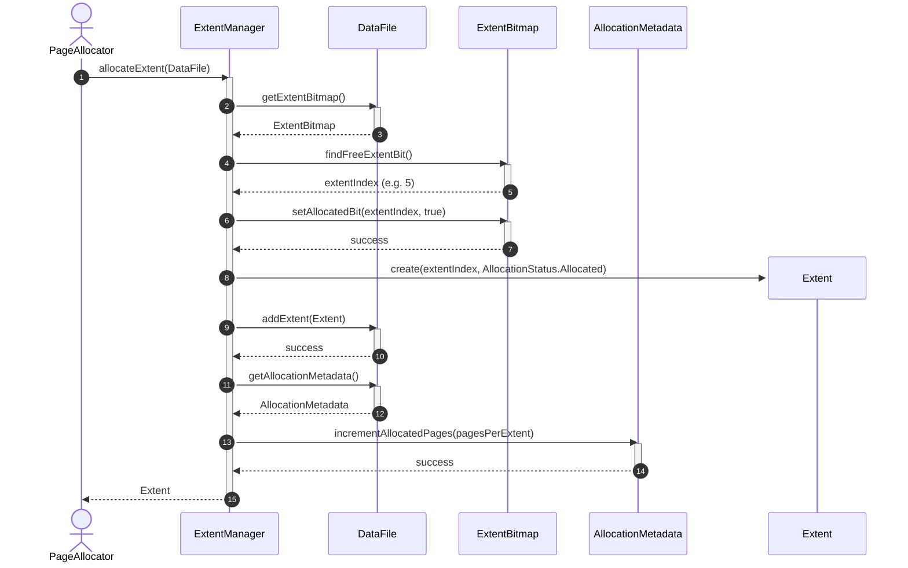
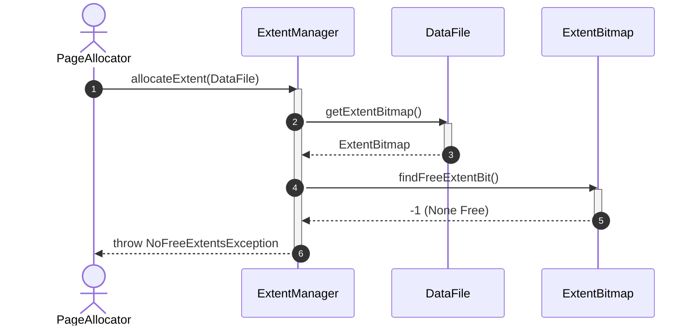

# Sequence Diagram - Allocate Space

## Usecase Overview
**Actor**: `PageAllocator`
**Purpose**: Shows how the system allocates space dynamically in terms of extents (blocks of pages) for a database file, updating the tracking metadata and bitmaps.

---

## 1. Happy Path: Successful Extent Allocation

---

## 2. Failure Path: Out of Space (No Free Extents in Bitmap)

---

## Discovered Candidates

### Method Candidates
- `ExtentManager.allocateExtent(file: DataFile) : Extent`
- `DataFile.getExtentBitmap() : ExtentBitmap`
- `DataFile.getAllocationMetadata() : AllocationMetadata`
- `DataFile.addExtent(extent: Extent) : void`
- `ExtentBitmap.findFreeExtentBit() : int`
- `ExtentBitmap.setAllocatedBit(index: int, allocated: boolean) : void`
- `AllocationMetadata.incrementAllocatedPages(count: int) : void`
- `Extent.create(index: int, status: AllocationStatus)`

### State Candidates
- `AllocationStatus` enum values (Free, Allocated, Reserved)
- Extent size metrics in `AllocationMetadata`.

