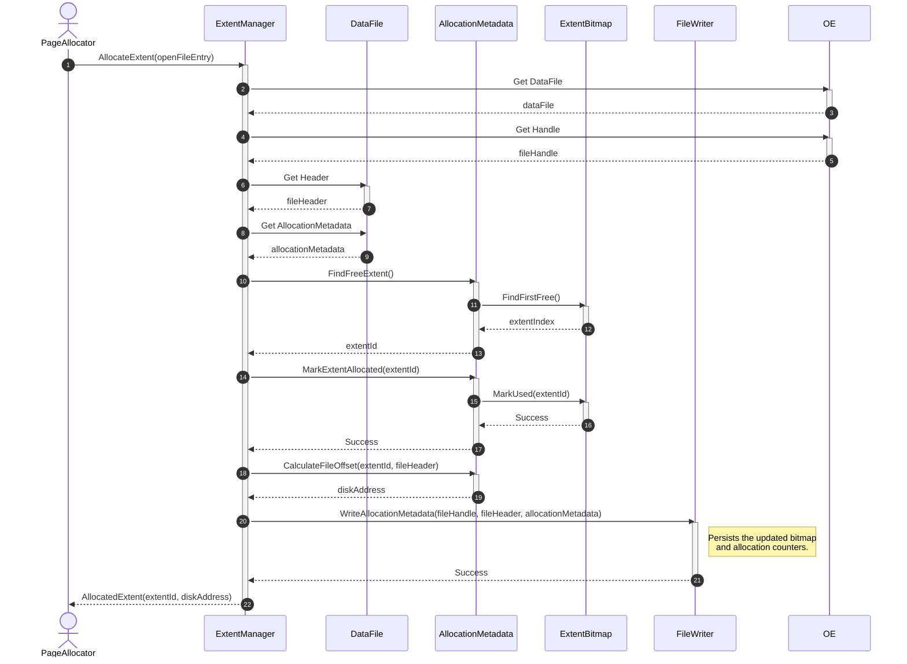
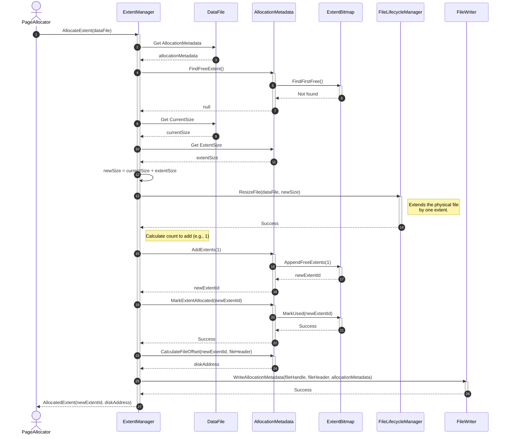
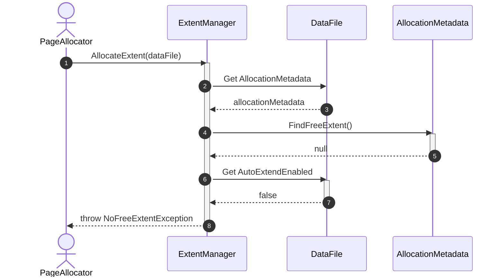
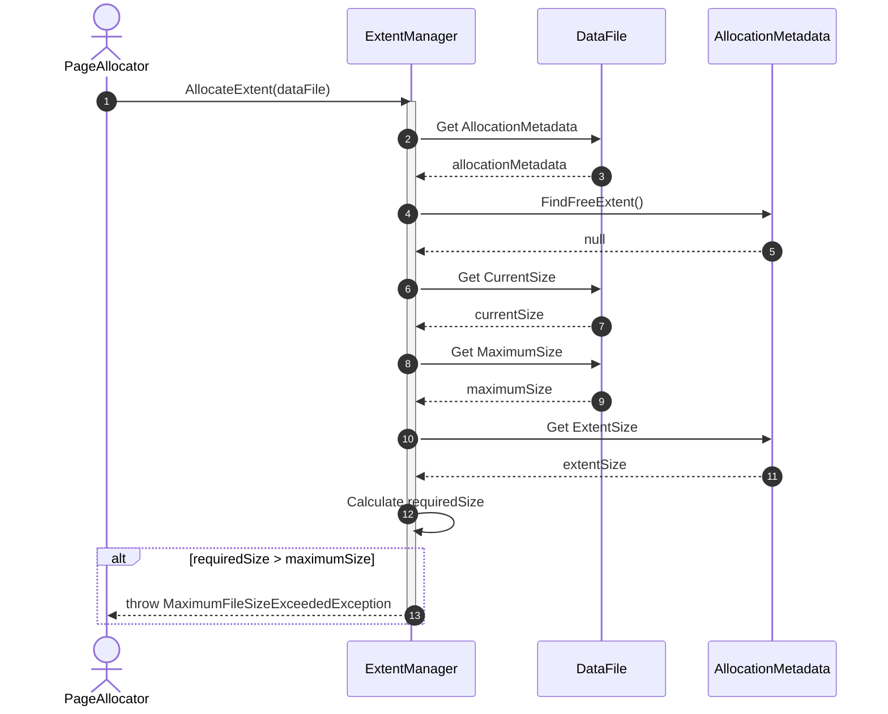
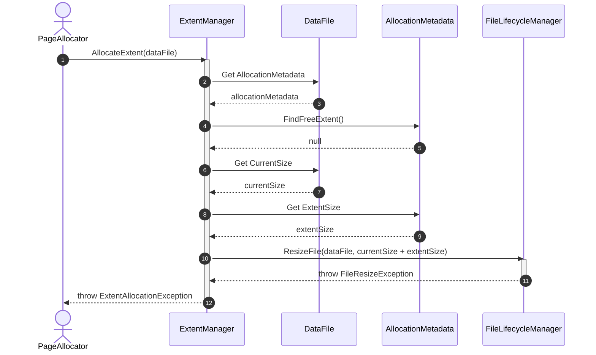
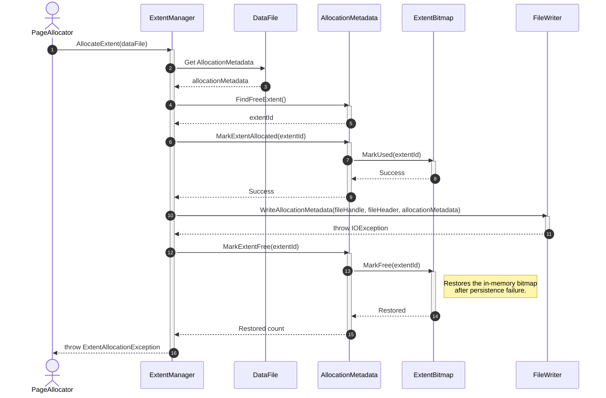

# Sequence Diagram - Allocate Extent

## Use Case Overview

**Actor**: `PageAllocator`, `HeapManager`, `IndexManager`, or another storage component  
**Purpose**: Finds a free extent in a data file, marks it as allocated, and returns its identity and physical location to the caller.

### Preconditions

- The target `DataFile` exists and is open.
- The associated `FileHandle` is valid.
- Allocation metadata has been loaded.
- The requested extent size follows the file's configured extent size.

---

## 1. Happy Path: Allocate Existing Free Extent



---

## 2. Alternative Path: No Free Extent — Extend File



---

## 3. Failure Path: Automatic File Extension Is Disabled



---

## 4. Failure Path: Maximum File Size Reached



---

## 5. Failure Path: Physical File Extension Failed



---

## 6. Failure Path: Allocation Metadata Persistence Failed



---

## Discovered Candidates

### Method Candidates

```text
ExtentManager.AllocateExtent(
    entry: OpenFileEntry
) : AllocatedExtent

AllocationMetadata.FindFreeExtent() : ExtentId?

AllocationMetadata.CalculateFileOffset(
    extentId: ExtentId,
    header: FileHeader
) : FileOffset

AllocationMetadata.AddExtents(
    count: int
) : void

AllocationMetadata.MarkExtentAllocated(
    extentId: ExtentId
) : void

AllocationMetadata.MarkExtentFree(
    extentId: ExtentId
) : void

ExtentBitmap.FindFirstFree() : int?

ExtentBitmap.AppendFreeExtents(
    count: int
) : void

ExtentBitmap.MarkUsed(
    extentId: ExtentId
) : void

ExtentBitmap.MarkFree(
    extentId: ExtentId
) : void

FileLifecycleManager.ResizeFile(
    entry: OpenFileEntry,
    newSize: long
) : void

FileWriter.WriteAllocationMetadata(
    handle: FileHandle,
    header: FileHeader,
    metadata: AllocationMetadata
) : void
```

### Property Candidates

```text
DataFile.AllocationMetadata : AllocationMetadata

DataFile.CurrentSize : long

DataFile.MaximumSize : long?

DataFile.AutoExtendEnabled : bool

AllocationMetadata.ExtentSize : int

AllocationMetadata.TotalExtentCount : int

AllocationMetadata.FreeExtentCount : int

AllocationMetadata.ExtentBitmap : ExtentBitmap
```

### Result Candidates

```text
AllocatedExtent
├── ExtentId : ExtentId
├── DiskAddress : DiskAddress
└── Size : int
```

### Exception Candidates

```text
NoFreeExtentException

MaximumFileSizeExceededException

ExtentAllocationException

FileResizeException

AllocationMetadataWriteException
```

### State Candidates

```text
ExtentBitmap[extentId]

AllocationMetadata.TotalExtentCount

AllocationMetadata.FreeExtentCount

DataFile.CurrentSize
```

---

## Responsibility Assignment

### `ExtentManager`

- Coordinates extent allocation.
- Searches for an available extent.
- Requests file extension when no free extent exists.
- Updates allocation state.
- Returns the allocated extent location.

### `AllocationMetadata`

- Owns extent-related counters.
- Finds free extents through the bitmap.
- Calculates the disk address of an extent.
- Registers new extents after physical file extension.

### `ExtentBitmap`

- Stores the allocation state of every extent.
- Finds a free extent.
- Marks an extent as used or free.
- Does not perform physical file operations.

### `FileLifecycleManager`

- Extends the physical data file.
- Does not select or allocate an extent.
- Does not modify extent allocation state.

### `FileWriter`

- Persists allocation metadata.
- Does not decide which extent should be allocated.
---

## Allocation Flow

```text
AllocateExtent
    → Find free extent
        → Found
            → Mark extent used
            → Update counters
            → Persist metadata
            → Return allocated extent

        → Not found
            → Check auto-extend
            → Check maximum file size
            → Extend physical file
            → Register new extent
            → Mark new extent used
            → Persist metadata
            → Return allocated extent
```

---

## Design Decision

`ExtentManager` should not write user records or pages.

Its responsibility ends after returning the allocated storage range:

```text
ExtentManager.AllocateExtent()
    → returns ExtentId and DiskAddress

PageAllocator
    → initializes pages inside the allocated extent

FileWriter
    → writes page data at the provided offsets
```

`FindFreeExtent()`, `MarkUsed()` and `ExtendFile()` are internal steps of the allocation use case, so they do not require separate sequence-diagram files unless their logic later becomes complex.

---

## Durability Note

Extent allocation metadata does not need to trigger `FlushToDisk()` after every allocation.

A full DBMS normally follows:

```text
Write allocation WAL record
    → update allocation metadata page
    → mark metadata page dirty
    → flush during checkpoint or forced durability boundary
```

For the simplified implementation, `WriteAllocationMetadata()` may write immediately, while `BufferManager` or `CheckpointCoordinator` controls the durable sync operation.
